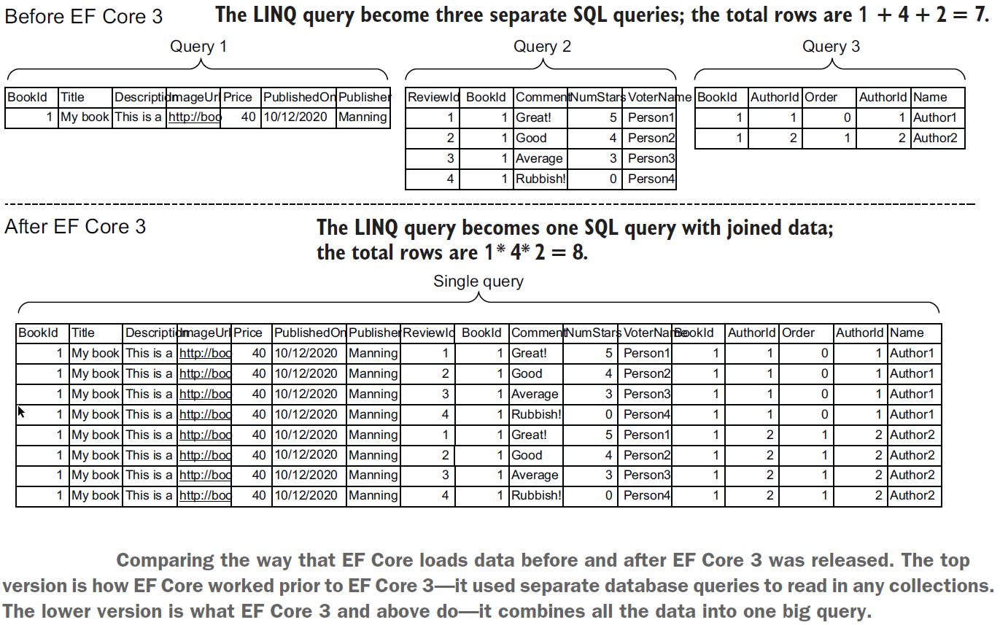
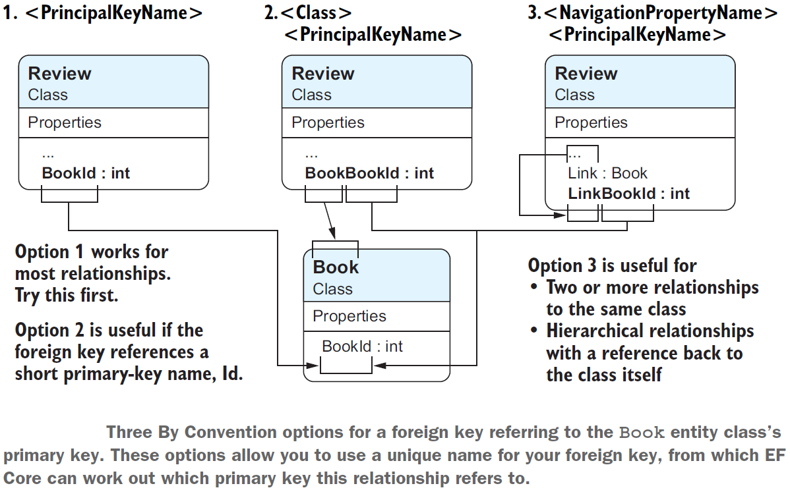
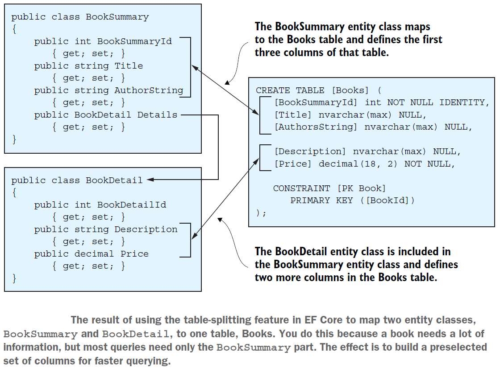

# Notes of Entity Framework Core In Action (2nd Edition)

## 1. Introduction to Entity Framework Core

EF Core is designed as an *object-relational mapper (O/RM)*. O/RMs work by mapping between two worlds: the relational database, with its own API, and the object-oriented software world of classes and software code.


### The Downsides of O/RMs

1. *Object-relational impedance mismatch*. Database servers and object-oriented software use different principles; databases use primary keys to define that a row is unique, whereas .NET class instances are, by default, considered unique by their reference.

2. EF Core "hides" the database so well that you can sometimes forget about the database underneath. This problem can cause you to write code that would work well in C# but doesn’t work for a database.

   ````c#
   public string FullName => $"{FirstName} {LastName}";
   ````

   An expression body property such as the one just shown is the right thing to do in C#, but the same property would throw an exception if you tried to filter or order on that property, because EF Core needs a FullName column in the table so that it can apply an SQL `WHERE` or `ORDER` command at the database level.


### First Ef Core Application


````c#
// EF Core maps .NET classes to database tables.
public class Book
{
    // A class needs a primary key.
    // We are using an EF Core naming convention that tells EF Core that the property BookId is the primary key.
    public int BookId { get; set; }
    
    // these properties are mapped to the table's columns.
    public string Title { get; set; }
    public string Description { get; set; }
    public DateTime PublishedOn { get; set; }
    
    // The AuthorId foreign key is used in the database to link a row in the Books table to a row in the Author table.
    public int AuthorId { get; set; }
    
    // The Author property is an EF Core navigational property. EF Core uses this on a save to see whether the Book has an Author class attached. If so, it sets the foreign key, AuthorId.
    // Upon loading a Book class, the method Include will fill this property with the Author class that's linked to this book class by using the foreign key, AuthorId.
    public Author Author { get; set; }
}

public class Author
{
    // Note that the foreign key in the Book class has the same name.
    public int AuthorId { get; set; }
    public string Name { get; set; }
    public string WebUrl { get; set; }
}
````

````c#
// DbContext class holds the information and configuration for accessing database.
public class AppDbContext : DbContext
{
    private const string ConnectionString = "Server=(localdb)\mssqllocaldb;Database=FirstEfCoreDb;Trusted_Connection=True";
    
    protected override void OnConfiguring(DbContextOptionsBuilder optionsBuilder)
    {
        optionsBuilder.UseSqlServer(connectionString);
    }
    
    // By creating a property called Books of type DbSet<Book>, you tell EF Core that these's a database table named Books, and it has the columns and keys as found in the Book class.
    public DbSet<Book> Books { get; set; }
    
    // Database has a table called Author, but purposely didn't create a property for that table.
    // EF Core finds that table by finding a navigational property of type Author in the Book class.
}
````

Two main parts of the application’s DbContext created for the application. First, the setting of the database options defines what type of database to use and where it can be found. Second, the `DbSet<T>` property (or properties) tell(s) EF Core what classes should be mapped to the database.

EF Core will create a model of the database your classes map to. First, it looks at the classes you have defined via the `DbSet<T>` properties; then it looks down all the references to other classes. Using these classes, EF Core can work out the default model of the database. But then it runs the `OnModelCreating` method in the application’s DbContext, which you can override to add your specific commands to configure the database the way you want it.

The following text provides a more detailed description of the process:

* EF Core looks at the application’s DbContext and finds all the public `DbSet<T>` properties. From this data, it defines the initial name for the one table it finds: Books.
* EF Core looks through all the classes referred to in `DbSet<T>` and looks at its properties to work out the column names, types, and so forth. It also looks for special attributes on the class and/or properties that provide extra modeling information.
* EF Core looks for any classes that the `DbSet<T>` classes refer to. In our case, the `Book` class has a reference to the `Author` class, so EF Core scans that class too. It carries out the same search on the properties of the `Author` class as it did on the `Book` class in step 2. It also takes the class name, `Author`, as the table name.
* For the last input to the modeling process, EF Core runs the virtual method `OnModelCreating` inside the application’s DbContext. In this simple application, you don’t override the `OnModelCreating` method, but if you did, you could provide extra information via a fluent API to do more configuration of the modeling.
* EF Core creates an internal model of the database based on all the information it gathered. This database model is cached so that later accesses will be quicker. Then this model is used for performing all database accesses.


````c#
// The code to read all the books and output them to the console
public static void ListAll()
{
    using(var db = new AppDbContext())
    {
        // Reads all the books. AsNoTracking indicates that this access is read-only.
        // The include causes the author information to be loaded with each book.
        foreach(var book in db.Books.AsNoTracking()
               .Include(book => book.Author))
        {
            var webUrl = book.Author.WebUrl ?? "- no web URL given -";
            Console.WriteLine($"{book.Title} by {book.Author.Name}");
            Console.WriteLine("	" + "Published on " + $"{book.PublishedOn:dd-MMM-yyyy}" + $". {webUrl}");
        }
    }
}
````


````sql
-- SQL command produced to read Books and Author
SELECT [b].[BookId],
[b].[AuthorId],
[b].[Description],
[b].[PublishedOn],
[b].[Title],
[a].[AuthorId],
[a].[Name],
[a].[WebUrl]
FROM [Books] AS [b]
INNER JOIN [Author] AS [a] ON
[b].[AuthorId] = [a].[AuthorId]
````


````c#
// The code to update the author’s WebUrl of the book Quantum Networking
public static void ChangeWubUrl()
{
    Console.WriteLine("New Quantum Networking WebUrl > ");
    var newWebUrl = Console.ReadLine();
    
    using(var db = new AppDbContext())
    {
        var singleBook = db.Books
            .Include(book => book.Author)
            .Single(book => book.Title == "Quantum Networking");
        
        singleBook.Author.WebUrl = newWebUrl;
        db.SaveChanges();
        Console.WriteLine("... SavedChanges called.");
    }
    
    ListAll();
}
````


1. The application uses a LINQ query to find a single book with its author information. EF Core turns the LINQ query into an SQL command to read the rows where the Title is Quantum Networking, returning an instance of both the `Book` and the `Author` classes, and checks that only one row was found.
2. The LINQ query doesn’t include the `.AsNoTracking` method you had in the previous read versions, so the query is considered to be a *tracked query*. Therefore, EF Core creates a tracking snapshot of the data loaded.
3. Then the code changes the `WebUrl` property in the Author class of the book. When `SaveChanges` is called, the Detect Changes stage compares all the classes that were returned from a tracked query with the tracking snapshot. From this, it can detect what has changed—in this case, only the `WebUrl` property of the `Author` class, which has a primary key of 3.
4. As a change is detected, EF Core starts a transaction. Every database update is done as an *atomic unit*: if multiple changes to the database occur, either they all succeed, or they all fail. This fact is important, because a relational database could get into a bad state if only part of an update were applied.
5. The update request is converted by the database provider to an SQL command that does the update. If the SQL command is successful, the transaction is committed, and the `SaveChanges` method returns; otherwise, an exception is raised.


## 2. Querying The Database

* Modeling three main types of database relationships
* Creating and changing a database via migration
* Defining and creating an application DbContext
* Loading related data
* Splitting complex queries into subqueries


### The Book App

* One-to-one relationship - PriceOffer to a Book
* One-to-many relationship - Book with Reviews
* Many-to-many relationship - Books linked to Authors and Books linked to Tags


#### One-to-one Relationship: Priceoffer to a book

A book can have a promotional price applied to it with an optional row in the Price- Offer, which is an example of a one-to-one relationship. (Technically, the relationship is one-to-zero-or-one, but EF Core handles it the same way.)

To calculate the final price of the book, you need to check for a row in the PriceOffer table that’s linked to the Books via a foreign key. If such a row is found, the NewPrice supersedes the price for the original book, and the PromotionalText is shown onscreen, as in this example:

​	*$40 $30 Our summertime price special, for this week only!*


#### One-to-many relationship: Reviews to a book

You want to allow customers to review a book; they can give a book a star rating and optionally leave a comment. Because a book may have no reviews or many (unlimited) reviews, you need to create a table to hold that data. In this example, you’ll call the table Review. The Books table has a one-to-many relationship to the Review table.

In the Summary display, you need to count the number of reviews and work out the average star rating to show a summary. Here’s a typical onscreen display you might produce from this one-to-many relationship:

​	*Votes 4.5 by 2 customers*


#### Many-to-many relationship: Manually configured

Books can be written by one or more authors, and an author may write one or more books. The link between the Books and Authors tables is called a many-to-many relationship, which in this case needs a linking table to achieve this relationship.
In this case, you create your own linking table with an Order value in it because the names of the authors in a book must be displayed in a specific order.

A typical onscreen display from the many-to-many relationship would look like this:

​	*by Dino Esposito, Andrea Saltarello*


#### Many-to-many relationship: Autoconfigured by EF Core

Books can be tagged with different categories - such as Microsoft .NET, Linux, Web, and so on - to help the customer to find a book on the topic they are interested in. A category might be applied to multiple books, and a book might have one or more categories, so a many-to-many linking table is needed. But unlike in the previous `BookAuthor` linking table, the tags don’t have to be ordered, which makes the linking table simpler.

A typical onscreen display from a many-to-many relationship would look like this:

​	*Categories: Microsoft .NET, Web*


#### Other relationship types

* Owned Type class: Useful for adding grouped data, such as an `Address` class, to an entity class. The `Address` class is linked to the main entity, but your code can copy around the `Address` class rather than copying individual `Street`, `City`, `State`, and related properties.
* Table splitting: Maps multiple classes to one table. You could have a summary class with the basic properties in it and a detailed class containing all the data, for example, which would give you a quicker load of the summary data.
* Table per hierarchy (TPH): Useful for groups of data that are similar. If you have a lot of data with only a few differences, such as a list of animals, you can have a base `Animal` class that `Dog`, `Cat`, and `Snake` classes can inherit, with per-type properties such as `LengthOfTail` for `Dog` and `Cat` and a `Venomous` flag for the `Snake`. EF Core maps all the classes to one table, which can be more efficient.
* Table per type (TPT): Useful for groups of data that have dissimilar data. TPT is the opposite of TPH, in which each class has its own table. Following the `Animal` example for TPH, the TPT version would map the `Dog`, `Cat`, and `Snake` classes to three different tables in the database.


#### The classes that EF Core maps to the database

There created five .NET classes to map to the six tables in the database. These classes are called `Book`, `PriceOffer`, `Review`, `Tag`, `Author`, and `BookAuthor` for the many-to-manylinking table, and they are referred to as *entity classes* to show that they’re mapped by EF Core to the database. From the software point of view, there’s nothing special about entity classes. They’re normal .NET classes, sometimes referred to as plain old CLR objects (POCOs). The term entity class identifies the class as one that EF Core has mapped to the database.


````c#
// The Book class, mapped to the Books table in the database
public class Book // The Book class contains the main book information.
{
    public int BookId { get; set; } // We use EF Core’s By Convention configuration to define the primary key of this entity class, so we use <ClassName>Id, and because the property is of type int, EF Core assumes that the database will use the SQL IDENTITY command to create a unique key when a new row is added.
    public string Title { get; set; }
    public string Description { get; set; }
    public DateTime PublishedOn { get; set; }
    public string Publisher { get; set; }
    public decimal Price { get; set; }
    public string ImageUrl { get; set; }
    
    //-----------------------------------------------
    //relationships

    public PriceOffer Promotion { get; set; } // Link to the optional one-toone PriceOffer relationship.
    public ICollection<Review> Reviews { get; set; } // There can be zero to many reviews of the book.
    public ICollection<Tag> Tags { get; set; } // EF's automatic many-to-many relationship to the Tag entity class
    public ICollection<BookAuthor> AuthorsLink { get; set; } // Provides a link to the many-to-many linking table that links to the Authors of this book
}
````


* In the Book App, when we have navigational properties that are collections, we use the type `ICollection<T>`. We do so because the new eager loading sort capability can return a sorted collection, and the default `HashSet` definition says it holds only a collection "whose elements are in no particular order." But there is a performance cost to not using `HashSet` when your navigational properties contain a large collection.


### Creating the application’s DbContext

To access the database, you need to do the following:

1. Define your application’s DbContext, which you do by creating a class and inheriting from EF Core’s `DbContext` class.
2. Create an instance of that class every time you want to access the database.

The key class you need to use EF Core is the application’s `DbContext`. You define this class by inheriting EF Core’s `DbContext` class and adding various properties to allow your software to access the database tables. It also contains methods you can override to access other features in EF Core, such as configuring the database modeling.


````c#
public EfCoreContext : DbContext // Any application DbContext must inherit from the EF Core’s DbContext class.
{
    // These public properties of type DbSet<T> are mapped by EF Core to tables in your database, using the name of the property as the table name. You can query these tables via LINQ methods on a property.
    public DbSet<Book> Books { get; set; }
    public DbSet<Author> Authors { get; set; }
    public DbSet<Tag> Tags { get; set; }
    public DbSet<PriceOffer> PriceOffers { get; set; }
    // The classes, such as Book, Author, Tag and PriceOffer, are entity classes. Their properties are mapped to columns in the appropriate database table.
    
    
    public EfCoreContext(DbContextOptions<EfCoreContext> options) : base(options) // For your ASP.NET Core application, you need a constructor to set up the database options. This allows your application to define what sort of database it is and where it’s located.
    {
    }
    
    protected override void OnModelCreating(DbModelBuilder modelBuilder)
    {
        //... code left out
    }
}

// The application’s DbContext is the key class in accessing the database. This figure shows the main parts of an application’s DbContext, starting with its inheriting EF Core’s DbContext, which brings in lots of code and features. You have to add some properties with the class DbSet<T> that map your classes to a database table with the same name as the property name you use. The other parts are the constructor, which handles setting up the database options, and the OnModelCreating method, which you can override to add your own configuration commands and set up the database the way you want.
````

````c#
// Creating an instance of the application’s DbContext to access the database
const string connection = "Data Source=(localdb)\\mssqllocaldb;Database=EfCoreInActionDb.Chapter02;Integrated Security=True;"; // The connection string, with its format dictated by the sort of database provider and hosting you’re using
var optionsBuilder = new DbContextOptionsBuilder<EfCoreContext>(); // You need an EF Core DbContextOptionsBuilder<> instance to set the options you need.

optionsBuilder.UseSqlServer(connection); // You’re accessing an SQL Server database and using the UseSqlServer method from the Microsoft.EntityFramework- Core.SqlServer library, and this method needs the database connection string.
var options = optionsBuilder.Options;
using (var context = new EfCoreContext(options)) // Creates the all-important EfCoreContext, using the options you’ve set up. You use a using statement because the DbContext is disposable.
{
    var bookCount = context.Books.Count(); // Uses the DbContext to find out the number of books in the database
    //... etc.
}
````


At the end of this listing, you create an instance of `EfCoreContext` inside a using statement because DbContext has an IDisposable interface and therefore should be disposed after you’ve used it.


### Understanding database queries

````c#
context.Books									// Application’s DbContext property access
    .Where(p => p.Title.StartsWith("Quantum")	// A series of LINQ and/or EF Core commands
    .ToList();									// An execute command
// The three parts of an EF Core database query, with example code.
````

Until a final execute command is applied at the end of the sequence of LINQ commands, the LINQ is held as a series of commands in what is called an *expression tree*, which means that it hasn’t been executed on the data yet.

At this point, your LINQ query will be converted to database commands and sent to the database. If you want to build high-performance database queries, you want all your LINQ commands for filtering, sorting, paging, and so on to come before you call an execute command. Therefore, your filter, sort, and other LINQ commands will be run inside the database, which improves the performance of your query.


````c#
context.Books.AsNoTracking()
    .Where(p => p.Title.StartsWith("Quantum")).ToList();
````

This query has the EF Core’s `AsNoTracking` method added to the LINQ query. As well as making the query read-only, the `AsNoTracking` method improves the performance of the query by turning off certain EF Core features.


### Loading related data

You can load data in four ways: eager loading, explicit loading, select loading, and lazy loading. 

You need to be aware that EF Core won’t load any relationships in an entity class unless you ask it to. This default behavior of not loading relationships is correct, because it means that EF Core minimizes the database accesses. If you want to load a relationship, you need to add code to tell EF Core to do that.


#### Eager loading: Loading relationships with the primary entity class

The first approach to loading related data is *eager loading*, which entails telling EF Core to load the relationship in the same query that loads the primary entity class. Eager loading is specified via two fluent methods, `Include` and `ThenInclude`. The next listing shows the loading of the first row of the Books table as an instance of the `Book` entity class and the eager loading of the single relationship, `Reviews`.


````c#
// Eager loading of first book with the corresponding Reviews relationship
var firstBook = context.Books
    .Include(book => book.Reviews) // Gets a collection of Review class instances, which may be an empty collection
    .FirstOrDefault(); // Takes the first book or null if there are no books in the database
````

If you look at the SQL command that this EF Core query creates, shown in the following snippet, you’ll see two SQL commands. The first command loads the first row in the Books table. The second loads the reviews, where the foreign key, `BookId`, has the same value as the first `Books` row primary key:

````sql
SELECT "t"."BookId", "t"."Description", "t"."ImageUrl",
	"t"."Price", "t"."PublishedOn", "t"."Publisher",
	"t"."Title", "r"."ReviewId", "r"."BookId",
	"r"."Comment", "r"."NumStars", "r"."VoterName"
FROM (
    SELECT "b"."BookId", "b"."Description", "b"."ImageUrl",
	    "b"."Price", "b"."PublishedOn", "b"."Publisher", "b"."Title"
    FROM "Books" AS "b"
    LIMIT 1
) AS "t"
LEFT JOIN "Review" AS "r" ON "t"."BookId" = "r"."BookId"
ORDER BY "t"."BookId", "r"."ReviewId"
````


````c#
// Eager loading of the Book class and all the related data
var firstBook = context.Books
    .Include(book => book.AuthorsLink) // The first Include gets a collection of BookAuthor.
    	.ThenInclude(bookAuthor => bookAuthor.Author) // Gets the next link—in this case, the link to the author
    .Include(book => book.Reviews) // Gets a collection of Review class instances, which may be an empty collection
    .Include(book => book.Tags) // Loads and directly accesses the Tags
    .Include(book => book.Promotion) // Loads any optional PriceOffer class, if one is assigned
    .FirstOrDefault(); // Loads any optional PriceOffer class, if one is assigned
````

`Include` followed by `ThenInclude`, is the standard way of accessing relationships that go deeper than a first-level relationship. You can go to any depth with multiple `ThenIncludes`, one after the other.

If you use the direct linking of many-to-many relationships, you don’t need `ThenInclude` to load the second-level relationship because the property directly accesses the other end of the many-to-many relationship via the `Tags` property, which is of type `ICollection<Tag>`. This approach can simplify the use of a many-to-many relationship as long you don’t need some data in the linking table, such as the `Order` property in the `BookAuthor` linking entity class used to order the `Book`’s `Authors` correctly.

If the relationship doesn’t exist (such as the optional `PriceOffer` class pointed to by the Promotion property in the `Book` class), `Include` doesn’t fail; it simply doesn’t load anything, or in the case of collections, it returns an empty collection (a valid collection with zero entries). The same rule applies to `ThenInclude`: if the previous `Include` or `ThenInclude` was empty, subsequent `ThenIncludes` are ignored. If you don’t `Include` a collection, it is null by default.

The advantage of eager loading is that EF Core will load all the data referred to by the `Include` and `ThenInclude` in an efficient manner, using a minimum of database accesses, or *database round-trips*. This type of loading to be useful in relational updates in which I need to update an existing relationship. Also eager loading to be useful in business logic.
The downside is that eager loading loads *all* the data, even when you don’t need part of it. The book list display, for example, doesn’t need the book description, which could be quite large.


You can use the ability to sort or filter the related entities when you use the `Include` or `ThenInclude` methods. This capability is helpful if you want to load only a subset of the related data (such as only `Reviews` with five stars) and/or to order the included entities (such as ordering the `AuthorsLink` collection against the Order property). The only LINQ commands you can use in the `Include` or `ThenInclude` methods are `Where`, `OrderBy`, `OrderByDescending`, `ThenBy`, `ThenByDescending`, `Skip`, and `Take`, but those commands are all you need for sorting and filtering.

````c#
// Sorting and filtering when using Include or ThenInclude
var firstBook = context.Books
    .Include(book => book.AuthorsLink					// Sort example: On the eager loading of the AuthorsLink collection, you sort the
    	.OrderBy(bookAuthor => bookAuthor.Order))		// BookAuthors so that the Authors will be in the correct order to display.
    	.ThenInclude(bookAuthor => bookAuthor.Author)
    .Include(book => book.Reviews						// Filter example. Here, you load only
        .Where(review => review.NumStars == 5))			// the Reviews with a star rating of 5.
    .Include(book => book.Promotion)
    .First();
````


#### Explicit loading: Loading relationships after the primary entity class

The second approach to loading data is *explicit loading*. After you’ve loaded the primary entity class, you can explicitly load any other relationships you want. First, it loads the `Book`; then it uses explicit-loading commands to read all the relationships.

````c#
// Explicit loading of the Book class and related data
var firstBook = context.Books.First(); // Reads in the first book on its own
context.Entry(firstBook)
    .Collection(book => book.AuthorsLink).Load(); // Explicity loads the linking table, BookAuthor
foreach (var authorLink in firstBook.AuthorsLink) // To load all the possible authors, the code has to loop through all the BookAuthor entries...
{
    context.Entry(authorLink) // …and load each linked Author class.
        .Reference(bookAuthor =>
        	bookAuthor.Author).Load();
}

context.Entry(firstBook) // Loads all the reviews
    .Collection(book => book.Tags).Load(); // Loads the Tags
context.Entry(firstBook) // Loads the optional PriceOffer class
    .Reference(book => book.Promotion).Load();
````


Alternatively, explicit loading can be used to apply a query to the relationship instead of loading the relationship. You can use any standard LINQ command after the `Query` method, such as `Where` or `OrderBy`.

````c#
// Explicit loading of the Book class with a refined set of related data
var firstBook = context.Books.First(); // Reads in the first book on its own
var numReviews = context.Entry(firstBook) // Executes a query to count reviews for this book
    .Collection(book => book.Reviews)
    .Query().Count();
var starRatings = context.Entry(firstBook) // Executes a query to get all the star ratings for the book
    .Collection(book => book.Reviews)
    .Query().Select(review => review.NumStars)
    .ToList();
````


The advantage of explicit loading is that you can load a relationship of an entity class later. This technique useful when I’m using a library that loads only the primary entity class, and need one of its relationships. Explicit loading can also be useful when you need that related data in only some circumstances. You might also find explicit loading to be useful in complex business logic because you can leave the job of loading the specific relationships to the parts of the business logic that need it. The downside of explicit loading is more database round trips, which can be inefficient. If you know up front the data you need, eager loading the data is usually more efficient because it takes fewer database round trips to load the relationships.


#### Select loading: Loading specific parts of primary entity class and any relationships

The third approach to loading data is using the LINQ `Select` method to pick out the data you want, which calls *select loading*. The next listing shows the use of the `Select` method to select a few standard properties from the `Book` class and execute specific code inside the query to get the count of customer reviews for this book.


````c#
// Select of the Book class picking specific properties and one calculation
var books = context.Books
    .Select(book => new // Uses the LINQ Select keyword and creates an anonymous type to hold the results
    	{
            book.Title,
            book.Price,
            NumReviews = book.Reviews.Count, // Runs a query that counts the number of reviews
        }
).ToList();
````

The advantage of this approach is that only the data you need is loaded, which can be more efficient if you don’t need all the data. Only one SQL `SELECT` command is required to get all that data, which is also efficient in terms of database round trips. EF Core turns the `p.Reviews.Count` part of the query into an SQL command, so that count is done inside the database, as you can see in the following snippet of the SQL created by EF Core:

````sql
SELECT "b"."Title", "b"."Price", (
    SELECT COUNT(*)
    FROM "Review" AS "r"
    WHERE "b"."BookId" = "r"."BookId") AS "NumReviews"
FROM "Books" AS "b"
````


#### Lazy loading: Loading relationships as required

*Lazy loading* makes writing queries easy, but it has a bad effect on database performance. Lazy loading does require some changes to your DbContext or your entity classes, but after you make those changes, reading is easy; if you access a navigational property that isn’t loaded, EF Core will execute a database query to load that navigational property.

You can set up lazy loading in either of two ways:

* Adding the Microsoft.EntityFrameworkCore.Proxies library when configuring your DbContext
* Injecting a lazy loading method into the entity class via its constructor

The first option is simple but locks you into setting up lazy loading for all the relationships. The second option requires you to write more code but allows you to pick which relationships use lazy loading.

To configure the simple lazy loading approach, you must do two things:

* Add the keyword `virtual` before *every* property that is a relationship.
* Add the method `UseLazyLoadingProxies` when setting up your DbContext.

So the converted Book entity type to the simple lazy loading approach would look like the following code snippet, with the virtual keyword added to the navigational properties:

````c#
public class BookLazy
{
    public int BookLazyId { get; set; }
    //… Other properties left out for clarity

    public virtual PriceOffer Promotion { get; set; }
    public virtual ICollection<Review> Reviews { get; set; }
    public virtual ICollection<BookAuthor> AuthorsLink { get; set; }
}
````

Using the EF Core’s Proxy library has a limitation: you must make every relational property virtual; otherwise, EF Core will throw an exception when you use the DbContext.


The second part is adding the EF Core’s Proxy library to the application that sets up the DbContext and then adding the `UseLazyLoadingProxies` to the configuring of the DbContext.

````c#
var optionsBuilder =
    new DbContextOptionsBuilder<EfCoreContext>();
optionsBuilder
    .UseLazyLoadingProxies()
    .UseSqlServer(connection);
var options = optionsBuilder.Options;

using (var context = new EfCoreContext(options))
````

When you have configured lazy loading in your entity classes and in the way you create the DbContext, reading relationships is simple; you don’t need extra `Include` methods in your query because the data is loaded from the database when your code accesses that relationship property.

````c#
// Lazy loading of BookLazy’s Reviews navigational property
var book = context.BookLazy.Single(); // Gets an instance of the BookLazy entity class that has configured its Reviews property to use lazy loading
var reviews = book.Reviews.ToList(); // When the Reviews property is accessed, EF Core will read in the reviews from the database.
````

Creates two database accesses. The first access loads the `BookLazy` data without any properties, and the second happens when you access `BookLazy`’s `Reviews` property.


Many developers find lazy loading to be useful, but you can want to avoid it because of its performance issues. There is time overhead for every access to the database server, so the best approach is to minimize the number of calls to the database server. But lazy loading (and explicit loading) can create lots of database accesses, making the query slow and causing the database server to work harder.

Even if you have set up a relational property for lazy loading, you can get better performance by adding an `Include` on a virtual relational property. The lazy loading will see that the property has been loaded and not load it again.


### Using client vs. server evaluation: Adapting data at the last stage of a query

EF Core has a feature called *client vs. server evaluation*, which allows you to run code at the last stage of the query (that is, the final `Select` part in your query) that can’t be converted to database commands. EF Core runs these non-server-runnable commands after the data has come back from the database.

The client vs. server evaluation feature gives you the opportunity to adapt/change the data within the last part of the query, which can save you from having to apply an extra step after the query. You use client vs. server evaluation to create a comma-delimited list of the authors of a book. If you didn’t use client vs. server evaluation for that task, you would need to (a) send back a list of all the Author names and (b) add an extra step after the query, using a `foreach` section to apply a `string.Join` to each book’s authors.


If your LINQ queries can’t be converted to database commands, EF Core will throw an `InvalidOperationException`, with a message containing the words `could not be translated`. The trouble is that you get that error only when you try that query - and you don’t want that error to happen in production!


For the list display of the books in the Book App, you need to (a) extract all the authors’ names, in order, from the Authors table and (b) turn them into one string with commas between names. Here’s an example that loads two properties, `BookId` and `Title`, in the normal manner, and a third property, `AuthorsString`, that uses client vs. server evaluation.

````c#
// Select query that includes a non-SQL command, string.Join
var firstBook = context.Books
    .Select(book => new
    {
        book.BookId,
        book.Title,
        AuthorsString = string.Join(", ", // string.Join is executed on the client in software.
        	book.AuthorsLink
            .OrderBy(ba => ba.Order)
            .Select(ba => ba.Author.Name))
    }
).First();
````


Using client vs. server evaluation on a property means that you cannot use that property in any LINQ command that would produce database commands, such as any commands that sort or filter that property. If you do, you will get an `InvalidOperationException`, with a message that contains the words `could not be translated`. If you tried to sort or filter on the `AuthorsString`, you would get the `could not be translated` exception.


### Building complex queries

You’re going to build a query to list all the books in the Book App, with a range of features including sorting, filtering, and paging.
You could build the book display by using eager loading. First, you’d load all the data; then, in the code, you’d combine the authors, calculate the price, calculate the average votes, and so on. The problem with that approach is that (a) you are loading data you don’t need and (b) sorting and filtering have to be done in software. For this chapter’s Book App, which has approximately 50 books, you could eager-load all the books and relationships into memory and then sort or filter them in software, but that approach wouldn’t work for real!

This figure is complicated because the queries needed to get all the data are complicated. With this diagram in mind, let’s look at how to build the book select query. You start with the class you’re going to put the data in. This type of class, which exists only to bring together the exact data you want, is referred to in various ways. In ASP.NET, it is referred to as a ViewModel, but that term also has other connotations and uses; therefore, we refer to this type of class as a *Data Transfer Object (DTO)*. DTOs is "object that is used to encapsulate data, and send it from one subsystem of an application to another".


````c#
// The DTO BookListDto
public class BookListDto
{
    public int BookId { get; set; } // You need the primary key if the customer clicks the entry to buy the book.
    public string Title { get; set; }
    public DateTime PublishedOn { get; set; } // Although the publication date isn’t shown, you’ll want to sort by it, so you have to include it.
    public decimal Price { get; set; } // The normal selling price of the book
    public decimal ActualPrice { get; set; } // Selling price—either the normal price or the promotional.NewPrice if present
    public string PromotionPromotionalText { get; set; } // Promotional text to show whether there’s a new price
    public string AuthorsOrdered { get; set; } // String to hold the comma-delimited list of authors’ names
    public int ReviewsCount { get; set; } // Number of people who reviewed the book
    public double? ReviewsAverageVotes { get; set; } // Average of all the votes, null if no votes
    public string[] TagStrings { get; set; } // The Tag names (that is the categories) for this book
}
````

To work with EF Core’s select loading, the class that’s going to receive the data must have a default constructor (which you can create without providing any properties to the constructor), the class must not be static, and the properties must have public setters.

Next, you’ll build a select query that fills in every property in `BookListDto`. Because you want to use this query with other query parts, such as sort, filter, and paging, you’ll use the `IQueryable<T>` type to create a method called `MapBookToDto` that takes in `IQueryable<Book>` and returns `IQueryable<BookListDto>`.

````c#
// The Select query to fill BookListDto
public static IQueryable<BookListDto> MapBookToDto(this IQueryable<Book> books) // Takes in IQueryable<Book> and returns IQueryable<BookListDto>
{
    return books.Select(book => new BookListDto
    {
        BookId = book.BookId,
        Title = book.Title,
        Price = book.Price,
        PublishedOn = book.PublishedOn,
        ActualPrice = book.Promotion == null // Calculates the selling price, which is the normal price, or the promotion price if that relationship exists
            ? book.Price
            : book.Promotion.NewPrice,
        PromotionPromotionalText = book.Promotion == null // PromotionalText depends on whether a PriceOffer exists for this book
            ? null
            : book.Promotion.PromotionalText,
        AuthorsOrdered = string.Join(", ", // Obtains an array of authors’ names, in the right order. You’re using client vs. server evaluation because you want the author names combined into one string.
        	book.AuthorsLink
            	.OrderBy(ba => ba.Order)
                .Select(ba => ba.Author.Name)),
        ReviewsCount = book.Reviews.Count, // You need to calculate the number of reviews.
        ReviewsAverageVotes = book.Reviews.Select(review => // To get EF Core to turn the LINQ average into the SQL AVG command, you need to cast the NumStars to (double?).
        	(double?) review.NumStars).Average(),
        TagStrings = book.Tags // Array of Tag names (categories) for this book
            .Select(x => x.TagId).ToArray(),
    });
}
````

The `MapBookToDto` method uses the Query Object pattern; the method takes in `IQueryable<T>` and outputs `IQueryable<T>`, which allows you to encapsulate a query, or part of a query, in a method. That way, the query is isolated in one place, which makes it easier to find, debug, and performance-tune. You’ll use the Query Object pattern for the sort, filter, and paging parts of the query too.


Query Objects are useful for building queries such as the book list in this example, but alternative approaches exist, such as the Repository pattern.


The `MapBookToDto` method is also what .NET calls an *extension method*. Extension methods allow you to chain Query Objects together.


A method can become an extension method if (a) it’s declared in a static class, (b) the method is static, and (c) the first parameter has the keyword `this` in front of it.


Query Objects take in a `IQueryable<T1>` input and return `IQueryable<T2>`, so you’re adding LINQ commands to the original `IQueryable<T1>` input. You can add another Query Object to the end, or if you want to execute the query, add an execute command such as ToList to execute the query.


### Adding sorting, filtering, and paging

#### Sorting books by price, publication date, and customer ratings

Sorting in LINQ is done by the methods `OrderBy` and `OrderByDescending`. You create a Query Object called `OrderBooksBy` as an extension method, as shown in the next listing. You’ll see that in addition to the `IQueryable<BookListDto>` parameter, this method takes in an enum parameter that defines the type of sort the user wants.

````c#
// The OrderBooksBy Query Object method
public static IQueryable<BookListDto> OrderBooksBy (this IQueryable<BookListDto> books, OrderByOptions orderByOptions)
{
    switch (orderByOptions)
    {
        case OrderByOptions.SimpleOrder:
            return books.OrderByDescending(x => x.BookId); // Because of paging, you always need to sort. You default-sort on the primary key, which is fast.
        case OrderByOptions.ByVotes:
            return books.OrderByDescending(x => x.ReviewsAverageVotes); // Orders the book by votes. Books without any votes (null return) go at the bottom.
        case OrderByOptions.ByPublicationDate:
            return books.OrderByDescending(x => x.PublishedOn); // Orders by publication date, with the latest books at the top
        case OrderByOptions.ByPriceLowestFirst:					// Orders by actual price,
            return books.OrderBy(x => x.ActualPrice);			// which takes into account
        case OrderByOptions.ByPriceHighestFirst:				// any promotional price—both
            return books.OrderByDescending(x => x.ActualPrice);	// lowest first and highest first
        default:
            throw new ArgumentOutOfRangeException(nameof(orderByOptions), orderByOptions, null);
    }
}
````

Calling the `OrderBooksBy` method returns the original query with the appropriate LINQ sort command added to the end. You pass this query on to the next Query Object, or if you’ve finished, you call a command to execute the code, such as `ToList`.

Even if the user doesn’t select a sort, you’ll still sort because you’ll be using paging, providing only a page at a time rather than all the data, and SQL requires the data to be sorted to handle paging. The most efficient sort is on the primary key, so you sort on that key.


#### Filtering books by publication year, categories, and customer ratings

````c#
// The code to produce a list of the years when books are published
var result = _db.Books
    .Where(x => x.PublishedOn <= DateTime.UtcNow.Date)
    .Select(x => x.PublishedOn.Year)
    .Distinct() // The Distinct method returns a list of each year a book was published.
    .OrderByDescending(x => x.PublishedOn) // Orders the published. years, with newest year at the top
    .Select(x => new DropdownTuple // Use two client/server evaluations to turn the values into strings.
    {
        Value = x.ToString(),
        Text = x.ToString()
    }).ToList();
var comingSoon = _db.Books.
    Any(x => x.PublishedOn > DateTime.Today); // Returns true if a book in the list is not yet published
if (comingSoon) // Adds a "coming soon" filter for all the future books
{
    result.Insert(0, new DropdownTuple
    {
        Value = BookListDtoFilter.AllBooksNotPublishedString,
        Text = BookListDtoFilter.AllBooksNotPublishedString
    });
}

return result;
````

The result of this code is a list of `Value/Text` pairs holding each year that books are published, plus a Coming Soon section for books yet to be published.


````c#
// The FilterBooksBy Query Object method
public static IQueryable<BookListDto> FilterBooksBy(this IQueryable<BookListDto> books, BooksFilterBy filterBy, string filterValue) // The method is given both the type of filter and the user-selected filter value.
{
    if (string.IsNullOrEmpty(filterValue)) // If the filter value isn’t set, returns IQueryable with no change
    {
        return books;
    }
    
    switch (filterBy)
    {
        case BooksFilterBy.NoFilter: // For no filter selected, returns IQueryable with no change
            return books;
        case BooksFilterBy.ByVotes:
            var filterVote = int.Parse(filterValue); // The filter by votes returns only books with an average vote above the filterVote value. If there are no reviews for a book, the ReviewsAverageVotes property will be null, and the test always returns false.
            return books.Where(x => x.ReviewsAverageVotes > filterVote);
        case BooksFilterBy.ByTags: // Selects any books with a Tag category that matches the filterValue
            return books.Where(x => x.TagStrings.Any(y => y == filterValue));
        case BooksFilterBy.ByPublicationYear:
            if (filterValue == AllBooksNotPublishedString) // If Coming Soon was picked, returns only books not yet published
            {
                return books.Where(x => x.PublishedOn > DateTime.UtcNow);
            }
            var filterYear = int.Parse(filterValue); // If we have a specific year, we filter on that. Note that we also remove future books (in case the user chose this year’s date).
            return books.Where(x => x.PublishedOn.Year == filterYear&& x.PublishedOn <= DateTime.UtcNow);
        default:
            throw new ArgumentOutOfRangeException(nameof(filterBy), filterBy, null);
    }
}
````


#### Other filtering options: Searching text for a specific string

We could’ve created loads of other types of filters/searches of books, and searching by title is an obvious one. But you want to make sure that the LINQ commands you use to search a string are executed in the database, because they’ll perform much better than loading all the data and filtering in software. EF Core converts the following C# code in a LINQ query to a database command: `==`, `Equal`, `StartsWith`, `EndsWith`, `Contains`, and `IndexOf`.

| String command | Example                                                      |
| -------------- | ------------------------------------------------------------ |
| StartsWith     | var books = context.Books.Where(p => p.Title.StartsWith("The")).ToList(); |
| EndsWith       | var books = context.Books.Where(p => p.Title.EndsWith("MAT.")).ToList(); |
| Contains       | var books = context.Books.Where(p => p.Title.Contains("cat")) |

The other important thing to know is that the case sensitivity of a string search executed by SQL commands depends on the type of database, and in some databases, the rule is called `collation`. A default SQL Server database default collation uses case-insensitive searches, so searching for `Cat` would find `cat` and `Cat`. Many SQL databases are `case-insensitive` by default, but Sqlite has a mix of `case-sensitive`/`case-insensitive`, and Cosmos DB is by default `case-sensitive`.


Typically, you configure the collation for the database or a specific column, but you can also define the collation in a query by using the `EF.Functions.Collate` method. The following code snippet sets an SQL Server collation, which means that this query will compare the string using the `Latin1_General_CS_AS` (`case-sensitive`) collation for this query:

````c#
context.Books.Where( x =>
	EF.Functions.Collate(x.Title, "Latin1_General_CS_AS") == "HELP" //This does not match "help"
````


Another string command is the SQL command `LIKE`, which you can access through the `EF.Function.Like` method. This command provides a simple pattern-matching approach using _ (underscore) to match any letter and % to match zero-to-many characters. The following code snippet would match "The Cat sat on the mat." and "The dog sat on the step." but not "The rabbit sat on the hutch." because rabbit isn’t three letters long:

````c#
var books = context.Books
    .Where(p => EF.Functions.Like(p.Title, "The ___ sat on the %."))
    .ToList();
````


#### Paging the books in the list

````c#
// A generic Page Query Object method
public static IQueryable<T> Page<T>(this IQueryable<T> query, int pageNumZeroStart, int pageSize)
{
    if (pageSize == 0)
    {
        throw new ArgumentOutOfRangeException(nameof(pageSize), "pageSize cannot be zero.");
    }

    if (pageNumZeroStart != 0)
    {
        query = query.Skip(pageNumZeroStart * pageSize); // Skips the correct number of pages
    }

    return query.Take(pageSize); // Takes the number for this page size
}
````


Paging works only if the data is ordered. Otherwise, SQL Server will throw an exception because relational databases don’t guarantee the order in which data is handed back; there’s no default row order in a relational database.


### Putting it all together: Combining Query Objects

The benefit of building a complex query in separate parts is that this approach makes writing and testing the overall query simpler, because you can test each part on its own.


````c#
// The ListBookService class providing a sorted, filtered, and paged list
public class ListBooksService
{
    private readonly EfCoreContext _context;

    public ListBooksService(EfCoreContext context)
    {
        _context = context;
    }

    public IQueryable<BookListDto> SortFilterPage(SortFilterPageOptions options)
    {
        var booksQuery = _context.Books // Starts by selecting the Books property in the Application’s DbContext
            .AsNoTracking() // Because this query is readonly, you add .AsNoTracking.
            .MapBookToDto() // Uses the Select Query Object, which picks out/calculates the data it needs
            .OrderBooksBy(options.OrderByOptions) // Adds the commands to order the data by using the given options
            .FilterBooksBy(options.FilterBy, options.FilterValue); // Adds the commands to filter the data

        options.SetupRestOfDto(booksQuery); // This stage sets up the number of pages and makes sure that PageNum is in the right range.

        return booksQuery.Page(options.PageNum-1, options.PageSize); // Applies the paging commands
    }
}
````


### Summary

* To access a database in any way via EF Core, you need to define an application DbContext.
* An EF Core query consists of three parts: the application’s DbContext property, a series of LINQ/EF Core commands, and a command to execute the query.
* Using EF Core, you can model three primary database relationships: `one-to-one`, `one-to-many`, and `many-to-many`, and others.
* The classes that EF Core maps to the database are referred to as *entity classes*. We use this term to highlight the fact that the class I’m referring to is mapped by EF Core to the database.
* If you load an entity class, it won’t load any of its relationships by default. Querying the `Book` entity class, for example, won’t load its relationship properties (`Reviews`, `AuthorsLink`, and `Promotion`); it leaves them as `null`.
* You can load related data that’s attached to an entity class in four ways: eager loading, explicit loading, select loading, and lazy loading.
* EF Core’s client vs. server evaluation feature allows the last stage of a query to contain commands, such as `string.Join`, that can’t be converted to SQL commands.
* We use the term *Query Object* to refer to an encapsulated query or a section of a query. These Query Objects are often built as .NET extension methods, which means that they can easily be chained together, similar to the way LINQ is written.
* Selecting, sorting, filtering, and paging are common query uses that can be encapsulated in a Query Object.
* If you write your LINQ queries carefully, you can move the aggregate calculations, such as `Count`, `Sum`, and `Average`, into the relational database, improving performance.


## 3. Changing The Database Content

* Creating a new row in a database table
* Updating existing rows in a database table for two types of applications
* Updating entities with one-to-one, one-to-many, and many-to-many relationships
* Deleting single entities, and entities with relationships, from a database


### EF Core’s entity State

Any entity class instance has a `State`, which can be accessed via the following EF Core command: `context.Entry(someEntityInstance).State`. The State tells EF Core what to do with this instance when `SaveChanges` is called. Here’s a list of the possible states and what happens if `SaveChanges` is called:

* `Added` - The entity needs to be created in the database. `SaveChanges` inserts it.
* `Unchanged` - The entity exists in the database and hasn’t been modified on the client. `SaveChanges` ignores it.
* `Modified` - The entity exists in the database and has been modified on the client. `SaveChanges` updates it.
* `Deleted` - The entity exists in the database but should be deleted. `SaveChanges` deletes it.
* `Detached` - The entity you provided isn’t tracked. `SaveChanges` doesn’t see it.

Normally, you don’t look at or alter the `State` directly. You use the various commands listed in this chapter to add, update, or delete entities. These commands make sure the `State` is set in a *tracked entity*. When `SaveChanges` is called, it looks at all the tracked entities and their `State` to decide what type of database changes it needs to apply to the database.

`Tracked` entities are entity instances that have been read in from the database by using a query that didn’t include the `AsNoTracking` method. Alternatively, after an entity instance has been used as a parameter to EF Core methods (such as `Add`, `Update`, or `Delete`), it becomes tracked.


### Creating new rows in a table

````c#
// An example of creating a single entity
var itemToAdd = new ExampleEntity
{
    MyMessage = "Hello World"
};
context.Add(itemToAdd); // Uses the Add method to add SingleEntity to the application’s DbContext. The DbContext determines the table to add it to, based on its parameter type.
context.SaveChanges(); // Calls the SaveChanges method from the application’s DbContext to update the database
````

Because you add the entity instance `itemToAdd` that wasn’t originally tracked, EF Core starts to track it and sets its `State` to Added. After `SaveChanges` is called, EF Core finds a tracked entity of type `ExampleEntity` with a `State` of `Added`, so it’s added as a new row in the database table associated with the `ExampleEntity` class.

EF Core creates the SQL command to update an SQL Server–based database.

````sql
-- SQL commands created to insert a new row into the SingleEntities table
SET NOCOUNT ON;
-- Inserts (creates) a new row into the ExampleEntities table
INSERT INTO ExampleEntities]
	([MyMessage]) VALUES (@p0);

-- Reads back the primary key in the newly created row
SELECT [ExampleEntityId] 
FROM [ExampleEntities]
WHERE @@ROWCOUNT = 1 AND
	[ExampleEntityId] = scope_identity();
````

The second SQL command produced by EF Core reads back the primary key of the row that was created by the database server. This command ensures that the original `ExampleEntity` instance is updated with the primary key so that the in-memory version of the entity is the same as the version in the database. Reading back the primary key is important, as you might update the entity later, and the update will need the primary key.


````c#
// Adding a Book entity class also adds any linked entity classes
var book = new Book
{
    Title = "Test Book",
    PublishedOn = DateTime.Today,
    Reviews = new List<Review>() // Creates a new collection of reviews
    {
        new Review // Adds one review with its content
        {
            NumStars = 5,
            Comment = "Great test book!",
            VoterName = "Mr U Test"
        }
    }
};

context.Add(book); // Uses the Add method to add the book to the application’s DbContext property, Books
context.SaveChanges(); // Calls the SaveChanges method from the application’s DbContext to update the database. It finds a new Book, which has a collection containing one new Review, and then adds both to the database.
````


**WHAT HAPPENS AFTER THE SAVECHANGES RETURNS SUCCESSFULLY?**
When the `Add` and `SaveChanges` have finished successfully, a few things happen: the entity instances that have been inserted into the database are now tracked by EF Core, and their `State` is set to `Unchanged`. Because we are using a relational database, and because the two entity classes, `Book` and `Review`, have primary keys that are of type `int`, EF Core by default will expect the database to create the primary keys by using the SQL `IDENTITY` keyword. Therefore, the SQL commands created by EF Core read back the primary keys into the appropriate primary keys in the entity class instances to make sure that the entity classes match the database.

EF Core can detect any subsequent changes you make to the primary or foreign keys if you call `SaveChanges` again.


**Why you should call SaveChanges only once at the end of your changes**
You see that the `SaveChanges` method is called at the end of create, and you see the same pattern - the `SaveChanges` method is called at the end in the update and delete examples too. In fact, even for complex database change containing a mixture of creates, updates, and deletes, you should still call the `SaveChanges` method only once at the end. You do that because EF Core will save all your changes (creates, updates and deletes) and apply them to the database together, and if the database rejects any of your changes, all your changes are rejected (by means of a database feature called a transaction).

This pattern is called a `Unit Of Work` and means that your database changes can’t be half-applied to the database. If you created a new `Book` with a `BookAuthor` reference to an `Author` that wasn’t in the database, for example, you wouldn’t want the `Book` instance to be saved. Saving it might break the book display, which expects every `Book` to have at least one `Author`.


**EXAMPLE THAT HAS ONE INSTANCE ALREADY IN THE DATABASE**

````c#
// Adding a Book with an existing Author
var foundAuthor = context.Authors
    .SingleOrDefault(author => author.Name == "Mr. A"); // Reads in the Author with a check that the Author was found
if (foundAuthor == null)
{
    throw new Exception("Author not found");
}

var book = new Book
{
    Title = "Test Book",
    PublishedOn = DateTime.Today
};
book.AuthorsLink = new List<BookAuthor> // Adds an AuthorBook linking entry, but uses the Author that is already in the database
{
    new BookAuthor
    {
        Book = book,
        Author = foundAuthor
    }
};

context.Add(book); // Adds the new Book to the DbContext Books property and calls SaveChanges
context.SaveChanges();
````


The first four lines load an `Author` entity with some checks to make sure that it was found; this `Author` class instance is tracked, so EF Core knows that it is already in the database. You create a new `Book` entity and add a new `BookAuthor` linking entity, but instead of creating a new `Author` entity instance, you use the `Author` entity that you read in from the database. Because EF Core is tracking the `Author` instance and knows that it’s in the database, EF Core won’t try to add it again to the database when `SaveChanges` is called at the end.


### Updating database rows

Updating a database row is achieved in three stages:

1. Read the data (database row), possibly with some relationships.
2. Change one or more properties (database columns).
3. Write the changes back to the database (update the row).


````c#
// Updating Quantum Networking’s publication date
var book = context.Books
    .SingleOrDefault(p => p.Title == "Quantum Networking");
if (book == null)
{
throw new Exception("Book not found");
}

book.PublishedOn = new DateTime(2029, 1, 1);
context.SaveChanges(); // Calls SaveChanges, which includes running a method called DetectChanges. This method spots that the PublishedOn property has been changed.
````

When the `SaveChanges` method is called, it runs a method called `DetectChanges`, which compares the tracking snapshot against the entity class instance that it handed to the application when the query was originally executed. From this example, EF Core decides that only the `PublishedOn` property has been changed, and EF Core builds the SQL to update that property.

````sql
-- SQL generated by EF Core for the query and update
SELECT TOP(2) -- Reads up to two rows from the Books table. You asked for a single item, but this code makes sure that it fails if more than one row fits.
	[p].[BookId],
	[p].[Description],
	[p].[ImageUrl],
	[p].[Price],
	[p].[PublishedOn],
	[p].[Publisher],
	[p].[Title]
FROM [Books] AS [p]
WHERE [p].[Title] = N'Quantum Networking' -- Your LINQ Where method, which picks out the correct row by its title

SET NOCOUNT ON;
UPDATE [Books] -- SQL UPDATE command-in this case, on the Books table
	SET [PublishedOn] = @p0 -- Because EF Core’s DetectChanges method finds that only the PublishedOn property has changed, it can target that column in the table.
WHERE [BookId] = @p1; -- EF Core uses the primary key from the original book to uniquely select the row it wants to update.
SELECT @@ROWCOUNT; -- Sends back the number of rows that were inserted into this transaction. SaveChanges returns this integer, but normally, you can ignore it.
````


#### Handling disconnected updates in a web application

An update is a three-stage process, needing a read, an update, and a `SaveChanges` call to be executed by the same instance of the application’s DbContext. The problem is that for certain applications, such as websites and RESTful APIs, using the same instance of the application’s DbContext isn’t possible because in web applications, each HTTP request typically is a new request, with no data held over from the last HTTP request. In these types of applications, an update consists of two stages:

* The first stage is an initial read, done in one instance of the application’s DbContext.
* The second stage applies the update by using a new instance of the application’s DbContext.

In EF Core, this type of update is called a *disconnected* update because the first stage and the second stage use two different instances of the application’s DbContext. Here are the two main ways of handling disconnected updates:

* *You send only the data you need to update back from the first stage.* If you were updating the published date for a book, you would send back only the `BookId` and the `PublishedOn` properties. In the second stage, you use the primary key to reload the original entity with tracking and update the specific properties you want to change. In this example, the primary key is the `BookId`, and the property to update is the `PublishedOn` property of the `Book` entity. When you call `SaveChanges`, EF Core can work out which properties you’ve changed and update only those columns in the database.
* You send all the data needed to re-create the entity class back from the first stage. In the second stage, you rebuild the entity class, and maybe relationships, by using the data from the first stage and tell EF Core to update the whole entity. When you call `SaveChanges`, EF Core will know, because you told it, that it must update all the columns in the table row(s) affected with the substitute data that the first stage provided.


**DISCONNECTED UPDATE, WITH RELOAD**

For web applications, the approach of returning only a limited amount of data to the web server is a common way of handling EF Core updates. This approach makes the request faster, but a big reason for it is security. You wouldn’t want the `Price` of a `Book` to be returned, for example, as that information would allow hackers to alter the price of the book they want to buy. We prefer, is to use a special class that contains only properties that should be sent/received.


````c#
// ChangePubDateDto sends data to and receives it from the user
public class ChangePubDateDto
{
    public int BookId { get; set; } // Holds the primary key of the row you want to update, which makes finding the right row quick and accurate
    
    public string Title { get; set; } // You send over the title to show the user so that they can be sure they are altering the right book.
    
    [DataType(DataType.Date)] // The property you want to alter. You send out the current publication date and get back the changed publication date.
    public DateTime PublishedOn { get; set; }
}
````

````c#
// The ChangePubDateService class to handle the disconnected update
public class ChangePubDateService : IChangePubDateService
{
    private readonly EfCoreContext _context;
    
    public ChangePubDateService(EfCoreContext context)
    {
        _context = context;
    }

    public ChangePubDateDto GetOriginal(int id)
    {
        return _context.Books
            .Select(p => new ChangePubDateDto
            {
                BookId = p.BookId,
                Title = p.Title,
                PublishedOn = p.PublishedOn
            })
            .Single(k => k.BookId == id);
    }

    public Book UpdateBook(ChangePubDateDto dto)
    {
        var book = _context.Books.SingleOrDefault(
            x => x.BookId == dto.BookId);
        if (book == null)
        {
            throw new ArgumentException("Book not found");
        }

        book.PublishedOn = dto.PublishedOn;
        _context.SaveChanges();
        return book;
    }
}
````

The advantages of this reload-then-update approach is that it’s more secure (in our example, sending/returning the price of the book over HTTP would allow someone to alter it) and faster because of less data. The downside is that you have to write code to copy over the specific properties you want to update.


*The quickest way to read an entity class using its primary key(s)*
Two useful things about the `Find` method:

* The `Find` method checks the current application’s DbContext to see whether the required entity instance has already been loaded, which can save an access to the database. But if the entity isn’t in the application’s DbContext, the load will be slower because of this extra check.
* The `Find` method is simpler and quicker to type because it’s shorter than the `SingleOrDefault` version, such as `context.Find<Book>(key)` versus `context.SingleOrDefault(p => p.Bookid == key)`.

The upside of using the `SingleOrDefault` method is that you can add it to the end of a query with methods such as `Include`, which you can’t do with `Find`. Also `SingleOrDefault` is faster than `Find`.


**DISCONNECTED UPDATE, SENDING ALL THE DATA**

In some cases, all the data may be sent back, so there’s no reason to reload the original data. This can happen for simple entity classes, in some RESTful APIs, or process-to-process communication. A lot depends on how closely the given API format matches the database format and how much you trust the other system.


````c#
// Simulating an update/replace request from an external system
string json;
using (var context = new EfCoreContext(options)) // Simulates an external system returning a modified Author entity class as a JSON string
{
    var author = context.Books
        .Where(p => p.Title == "Quantum Networking")
        .Select(p => p.AuthorsLink.First().Author)
        .Single();
    author.Name = "Future Person 2";
    json = JsonConvert.SerializeObject(author);
}
using (var context = new EfCoreContext(options))
{
    var author = JsonConvert
        .DeserializeObject<Author>(json); // Simulates receiving a JSON string from an external system and decoding it into an Author class
    
    context.Authors.Update(author); // Update command, which replaces all the row data for the given primary key—in this case, AuthorId
    context.SaveChanges(); // Provides a link to the many-tomany linking table that links to the authors of this book
}
````


You call the EF Core Update command with the `Author` entity instance as a parameter, which marks as modified all the properties of the `Author` entity. When the `SaveChanges` command is called, it’ll update all the columns in the row that have the same primary key as the entity class.

The plus side of this approach is that the database update is quicker, because you don’t have the extra read of the original data. You also don’t have to write code to copy over the specific properties you want to update, which you did need to do in the previous approach.

The downsides are that more data can be transferred and that unless the API is carefully designed, it can be difficult to reconcile the data you receive with the data already in the database. Also, you’re trusting the external system to remember all the data correctly, especially the primary keys of your system.


### Handling relationships in updates

````c#
// The Book entity class, showing the relationships to update
public class Book // Book class contains the main book information.
{
    public int BookId { get; set; }
    //… other nonrelational properties removed for clarity
    //-----------------------------------------------
    //relationships

    public PriceOffer Promotion { get; set; } // Links to the optional PriceOffer
    public ICollection<Review> Reviews { get; set; } // Can be zero to many reviews of the book
    public ICollection<Tag> Tags { get; set; } // EF Core's automatic many-to-many relationship to the Tag entity class
    public ICollection<BookAuthor> AuthorsLink { get; set; } // Provides a link to the many-to-many linking table that links to the authors of this book
}
````


#### Principal and dependent relationships

The terms principal and dependent are used in EF to define parts of a relationship:

* *Principal entity* - Contains a primary key that the dependent relationship refer to via a foreign key
* *Dependent entity* - Contains the foreign key that refers to the principal entity’s primary key


**CAN THE DEPENDENT PART OF A RELATIONSHIP EXIST WITHOUT THE PRINCIPAL?**

The other aspect of a dependent relationship is whether it can exist on its own. If the principal relationship is deleted, is there a business case for the dependent relationship to still exist? In many cases, the dependent part of a relationship doesn’t make sense without the principal relationship. A book review has no meaning if the book it links to is deleted from the database, for example.

In a few cases, a dependent relationship should exist even if the principal part is deleted. Suppose that you want to have a log of all the changes that happen to a book in its lifetime. If you delete a book, you wouldn’t want that set of logs to be deleted too.

This task is handled in databases by handling the nullability of the foreign key. If the foreign key in the dependent relationship is non-nullable, the dependent relationship can’t exist without the principal. In the example Book App database, the `PriceOffer`, `Review`, and `BookAuthor` entities are all dependent on the principal, Book entity, so their foreign keys are of type int. If the book is deleted or the link to the book is removed, the dependent entities will be deleted.

But if you define a class for logging - let’s call it `BookLog` - you want this class to exist even if the book is deleted. To make this happen, you’d make its `BookId` foreign key of type `Nullable<int>`. Then, if you delete the book that the `BookLog` entity is linked to, you could configure that the `BookLog`’s `BookId` foreign key would be set to `null`.

What happens to the old relationships we remove depends on the nullability of the foreign key: if the foreign key is non-nullable, the dependent relationships are deleted, and if the foreign key is nullable, it’s set to `null`.


#### Updating one-to-one relationships

In our example Book App database, we have an optional, dependent relationship property called `Promotion` from the `Book` entity class to the `PriceOffer` entity class.

````c#
// PriceOffer entity class, showing the foreign key back to the Book entity
public class PriceOffer // PriceOffer, if present, is designed to override the normal price.
{
    public int PriceOfferId { get; set; }
    public decimal NewPrice { get; set; }
    public string PromotionalText { get; set; }
    
    //-----------------------------------------------
    //Relationships
    
    public int BookId { get; set; } // Foreign key back to the book it should be applied to
}
````


**CONNECTED STATE UPDATE**

The connected state update assumes that you’re using the same context for both the read and the update.


1. Load the `Book` entity with any existing `PriceOffer` relationship.
2. Set the relationship to the new `PriceOffer` entity you want to apply to this book.
3. Call `SaveChanges` to update the database.

````c#
// Adding a new promotional price to an existing book that doesn’t have one
var book = context.Books // Finds a book. In this example, the book doesn’t have an existing promotion, but it would also work if there were an existing promotion.
    .Include(p => p.Promotion) // Although the include isn’t needed because you’re loading something without a Promotion, using the include is good practice, as you should load any relationships if you’re going to change a relationship.
    .First(p => p.Promotion == null);

book.Promotion = new PriceOffer // Adds a new PriceOffer to this book
{
    NewPrice = book.Price / 2,
    PromotionalText = "Half price today!"
};
context.SaveChanges(); // The SaveChanges method calls DetectChanges, which finds that the Promotion property has changed, so it adds that entity to the PriceOffers table.
````

As you can see, the update of the relationship is like the basic update you made to change the book’s published date. In this case, EF Core has to do extra work because of the relationship. EF Core creates a new row in the `PriceOffers` table, which you can see in the SQL snippet that EF Core produces for the code:

````sql
INSERT INTO [PriceOffers]
	([BookId], [NewPrice], [PromotionalText])
	VALUES (@p0, @p1, @p2);
````

Now, what happens if there’s an existing promotion on the book (that is, the `Promotion` property in the `Book` entity class isn’t `null`)? That case is why the `Include(p => p.Promotion)` command in the query that loaded the `Book` entity class is so important. Because of that Include method, EF Core will know that an existing `PriceOffer` is assigned to this book and will delete it before adding the new version.

To be clear, in this case you must use some form of loading of the relationship - *eager*, *explicit*, *select*, or *lazy loading* of the relationship - so that EF Core knows about it before the update. If you don’t, and if there’s an existing relationship, EF Core will throw an exception on a duplicate foreign key `BookId`, which EF Core has placed a unique index on, and another row in the `PriceOffers` table will have the same value.


**DISCONNECTED STATE UPDATE**

In the disconnected state, the information to define which book to update and what to put in the `PriceOffer` entity class would be passed back from stage 1 to stage 2. That situation happened in the update of the book’s publication date, where the `BookId` and the `PublishedOn` values were fed back.

In the case of adding a promotion to a book, you need to pass in the `BookId`, which uniquely defines the book you want, plus the `NewPrice` and the `PromotionalText` values that make up the `PriceOffer` entity class. The next listing shows you the `ChangePriceOfferService` class, which contains the two methods to show the data to the user and update the promotion on the `Book` entity class when the user submits a request.

````c#
// ChangePriceOfferService class with a method to handle each stage
public class ChangePriceOfferService : IChangePriceOfferService
{
    private readonly EfCoreContext _context;

    public Book OrgBook { get; private set; }

    public ChangePriceOfferService(EfCoreContext context)
    {
        _context = context;
    }

    public PriceOffer GetOriginal(int id) // Gets a PriceOffer class to send to the user to update
    {
        OrgBook = _context.Books // Loads the book with any existing Promotion
            .Include(r => r.Promotion)
            .Single(k => k.BookId == id);
        
        return OrgBook?.Promotion // You return either the existing Promotion for editing or create a new one. The important point is to set the BookId, as you need to pass it through to the second stage.
            ?? new PriceOffer
        {
            BookId = id,
            NewPrice = OrgBook.Price
        };
    }

    public Book AddUpdatePriceOffer(PriceOffer promotion) // Handles the second part of the update, performing a selective add/update of the Promotion property of the selected book
    {
        var book = _context.Books // Loads the book with any existing promotion, which is important because otherwise, your new PriceOffer will clash and throw an error
            .Include(r => r.Promotion)
            .Single(k => k.BookId == promotion.BookId);
        
        if (book.Promotion == null) // Checks whether the code should create a new PriceOffer or update the existing PriceOffer
        {
            book.Promotion = promotion; // You need to add a new PriceOffer, so you assign the promotion to the relational link. EF Core will see it and add a new row in the PriceOffer table.
        }
        else
        {
            // You need to do an update, so you copy over only the parts that you want to change. EF Core will see this update and produce code to update only these two columns.
            book.Promotion.NewPrice = promotion.NewPrice;
            book.Promotion.PromotionalText = promotion.PromotionalText;
        }
        _context.SaveChanges(); // SaveChanges uses its DetectChanges method, which sees what changes—either adding a new PriceOffer or updating an existing one.
        return book; // Returns the updated book
    }
}
````

This code either updates an existing `PriceOffer` or adds a new `PriceOffer` if none exists. When `SaveChanges` is called, it can work out, via EF Core’s `DetectChanges` method, what type of update is needed and create the correct SQL to update the database.


**ALTERNATIVE WAY OF UPDATING THE RELATIONSHIP: CREATING A NEW ROW DIRECTLY**

We’ve approached this update as changing a relationship in the `Book` entity class, but you can also approach it as creating/deleting a row in the `PriceOffers` table. This listing finds the first `Book` in the database that doesn’t have a `Promotion` linked to it and then adds a new `PriceOffer` entity to that book.

````c#
// Creating a PriceOffer row to go with an existing book
var book = context.Books
    .First(p => p.Promotion == null); // You find the book that you want to add the new PriceOffer to, which must not be an existing PriceOffer.

context.Add( new PriceOffer
{
    BookId = book.BookId,
    NewPrice = book.Price / 2,
    PromotionalText = "Half price today!"
});
context.SaveChanges(); // SaveChanges adds the PriceOffer to the PriceOffers table.
````

You should note that previously, you didn’t have to set the `BookId` property in the `PriceOffer` entity class, because EF Core did that for you. But when you’re creating a relationship this way, you do need to set the foreign key. Having done so, if you load the `Book` entity class with its `Promotion` relationship after the previous create code, you’ll find that the `Book` has gained a `Promotion` relationship.

The advantage of creating the dependent entity class is that it saves you from needing to reload the principal entity class (in this case, `Book`) in a disconnected state. The downside is that EF Core doesn’t help you with the relationships. In this case, if there were an existing `PriceOffer` on the book and you added another, `SaveChanges` would fail because you’d have two `PriceOffer` rows with the same foreign key.

When EF Core can’t help you with the relationships, you need to use the create/delete approach with care. Sometimes, this approach can make handling a complex relationship easier, so it’s worth keeping in mind, but I prefer updating the principal entity class’s relationship in most one-to-one cases.


#### Updating one-to-many relationships

````c#
// The Review class, showing the foreign key back to the Book entity class
public class Review // Holds customer reviews with their ratings
{
    public int ReviewId { get; set; }
    public string VoterName { get; set; }
    public int NumStars { get; set; }
    public string Comment { get; set; }
    
    //-----------------------------------------
    //Relationships
    
    public int BookId { get; set; } // Foreign key holds the key of the book this review belongs to.
}
````

The one-to-many relationship in the Book App database is represented by `Book`’s `Reviews`; a user of the site can add a review to a book. There can be any number of reviews, from none to a lot. This listing shows the `Review`-dependent entity class, which links to the Books table via the foreign key called `BookId`.


**CONNECTED STATE UPDATE**

````c#
// Adding a review to a book in the connected state
var book = context.Books
    .Include(p => p.Reviews)
    .First(); // Finds the first book and loads it with any reviews it might have

book.Reviews.Add(new Review
{
    VoterName = "Unit Test",
    NumStars = 5,
    Comment = "Great book!"
});
context.SaveChanges(); // SaveChanges calls DetectChanges, which finds that the Reviews property has changed, and from there finds the new Review, which it adds to the Review table.
````

This code follows the same pattern as the one-to-one connected update: load the `Book` entity class and the `Reviews` relationship via the `Include` method. But in this case, you add the `Review` entity to the Book’s Reviews collection. Because you used the `Include` method, the `Reviews` property will be an empty collection if there are no reviews or a collection of the reviews linked to this book. In this example, the database already contains some `Book` entities, and we take the first.


**ALTERING/REPLACING ALL THE ONE-TO-MANY RELATIONSHIPS**

If the books had categories (say, Software Design, Software Languages, and so on), you might allow an admin user to change the categories. One way to implement this change would be to show the current categories in a multiselect list, allow the admin user to change them, and then replace *all* the categories on the book with the new selection.

EF Core makes replacing the whole collection easy. If you assign a new collection to a one-to-many relationship that has been loaded with tracking (such as by using the `Include` method), EF Core will replace the existing collection with the new collection. If the items in the collection can be linked to only the principal class (the dependent class has a non-nullable foreign key), by default, EF Core will delete the items that were in the collection that have been removed.

Next is an example of replacing the whole collection of existing book reviews with a new collection. The effect is to remove the original reviews and replace them with the one new review.

````c#
// Replacing a whole collection of reviews with another collection
var book = context.Books
    .Include(p => p.Reviews) // This include is important; it creates a collection with any existing reviews in it or an empty collection if there are no existing reviews.
    .Single(p => p.BookId == twoReviewBookId); // This book you’re loading has two reviews.

book.Reviews = new List<Review> // You replace the whole collection.
{
    new Review
    {
        VoterName = "Unit Test",
        NumStars = 5,
    }
};
context.SaveChanges(); // SaveChanges, via DetectChanges, knows that the old collection should be deleted and that the new collection should be written to the database.
````

Because you’re using test data in the example, you know that the book with the primary key `twoReviewBookId` has two reviews and that the book is the only one with reviews; hence, there are only two reviews in the whole database. After the `SaveChanges` method is called, the book has only one review, and the two old reviews have been deleted, so now the database has only one review in it.

Removing a single row is as simple as removing the entity from the list. EF Core will see the change and delete the row that’s linked to that entity. Similarly, if you add a new `Review` to the `Book`’s `Reviews` collection property, EF Core will see that change to that collection and add the new `Review` to the database.

The loading of the existing collection is important for these changes: if you don’t load them, EF Core can’t remove, update, or replace them. The old versions will still be in the database after the update because EF Core didn’t know about them at the time of the update. You haven’t replaced the existing two `Reviews` with your single `Review`. In fact, you now have three `Reviews` - the two that were originally in the database and your new one - which is not what you intended to do.


**DISCONNECTED-STATE UPDATE**

In the disconnected state, you create an empty `Review` entity class but fill in its foreign key, `BookId`, with the book the user wants to provide a review for. Then the user votes on the book, and you add that review to the book that they referred to.

````c#
// Adding a new review to a book in the example Book App
public class AddReviewService
{
    private readonly EfCoreContext _context;
    
    public string BookTitle { get; private set; }
    
    public AddReviewService(EfCoreContext context)
    {
        _context = context;
    }

    public Review GetBlankReview(int id) // Forms a review to be filled in by the user
    {
        BookTitle = _context.Books
            .Where(p => p.BookId == id)
            .Select(p => p.Title)
            .Single();
        return new Review
        {
            BookId = id
        };
    }

    public Book AddReviewToBook(Review review) // Updates the book with the new review
    {
        var book = _context.Books
            .Include(r => r.Reviews)
            .Single(k => k.BookId == review.BookId);
        book.Reviews.Add(review); // Adds the new review to the Reviews collection
        _context.SaveChanges(); // SaveChanges uses its DetectChanges method, which sees that the Book Review property has changed, and creates a new row in the Review table.
        return book; // Returns the updated book
    }
}
````

This code has a simpler first part than the previous disconnected-state examples because you’re adding a new review, so you don’t have to load the existing data for the user.


**ALTERNATIVE WAY OF UPDATING THE RELATIONSHIP: CREATING A NEW ROW DIRECTLY**

As with the `PriceOffer`, you can add a one-to-many relationship directly to the database. But again, you take on the role of managing the relationship. If you want to replace the entire reviews collection, for example, you’d have to delete all the rows that the reviews linked to the book in question before adding your new collection.

Adding a row directly to the database has some advantages, because loading all the one-to-many relationships might turn out to be a lot of data if you have lots of items and/or they’re big. Therefore, keep this approach in mind if you have performance issues.


#### Updating a many-to-many relationship

In EF Core, we talk about many-to-many relationships, but a relational database doesn’t directly implement many-to-many relationships. Instead, we’re dealing with two one-to-many relationships.


In EF Core, you have two ways to create many-to-many relationships between two entity classes:

* You link to a linking table in each entity—that is, you have an `ICollection<LeftRight>` property in your `Left` entity class. You need to create an entity class to act as the linking table (such as `LeftRight`), but that entity class lets you add extra data in the linking table so that you can sort/filter the many-to-many relationships.
* You link directly between the two entity classes you want to have a many-to-many relationship—that is, you have an `ICollection<Right>` property in your `Left` entity class. This link is much easier to code because EF Core handles the creation of the linking table, but then you can’t access the linking table in a normal Include method to sort/filter.


**UPDATING A MANY-TO-MANY RELATIONSHIP VIA A LINKING ENTITY CLASS**

In the `Book` entity class, you need a many-to-many link to the `Authors` of the book. But in a book, the order of the authors’ names matters. Therefore, you create a linking table with an `Order` (`byte`) property that allows you to display the `Author`'s `Name` properties in the correct order, which means that you

* Create an entity class called `BookAuthor`, which contains both the primary key of the `Book` entity class (`BookId`) and the primary key of the `Author` entity class (`AuthorId`). You also add an `Order` property, which contains a number setting the order in which the `Authors` should be displayed for this book. The `BookAuthor` linking entity class also contains two one-to-one relationships to the `Author` and the `Book`.
* You add a navigational property called `AuthorsLink` of type `ICollection<BookAuthor>` to your `Book` entity class.
* You also add a navigational property called `BooksLink` of type `ICollection<BookAuthor>` to your `Author` entity class.


The `BookAuthor` entity class has two properties: `BookId` and `AuthorId`. These properties are foreign keys to the Books table and the Authors table, respectively. Together, they also form the primary key (known as a *composite key*, because it has more than one part) for the `BookAuthor` row. The composite key has the effect of ensuring that there’s only one link between the `Book` and the `Author`.

````c#
// Adding a new Author to the book Quantum Networking
var book = context.Books
    .Include(p => p.AuthorsLink)
    .Single(p => p.Title == "Quantum Networking");

var existingAuthor = context.Authors
    .Single(p => p.Name == "Martin Fowler");

book.AuthorsLink.Add(new BookAuthor // You add a new BookAuthor linking entity to the Book’s AuthorsLink collection.
{
    Book = book,
    Author = existingAuthor,
    Order = (byte) book.AuthorsLink.Count // You set the Order to the old count of AuthorsLink—in this case, 1 (because the first author has a value of 0).
});
context.SaveChanges(); // The SaveChanges will create a new row in the BookAuthor table.
````

The thing to understand is that the `BookAuthor` entity class is the *many* side of the relationship. This listing, which adds another author to one of the books, should look familiar because it’s similar to the one-to-many update methods I’ve already explained.

One thing to note is that when you load the Book’s `AuthorsLink`, you don’t need to load the corresponding `BooksLink` in the `Author` entity class. The reason is that when you update the `AuthorsLink` collection, EF Core knows that there is a link to the `Book`, and during the update, EF Core will fill in that link automatically. The next time someone loads the `Author` entity class and its `BooksLink` relationship, they’ll see a link to the *Quantum Networking* book in that collection.

Also be aware that deleting an `AuthorsLink` entry won’t delete the `Book` or `Author` entities they link to because that entry is the *one* end of a *one-to-many* relationship, which isn’t dependent on the `Book` or `Author`. In fact, the `Book` and `Author` entity classes are *principal entities*, with the `BookAuthor` classes being dependent on both of the principal entity classes.


**UPDATING A MANY-TO-MANY RELATIONSHIP WITH DIRECT ACCESS TO THE OTHER ENTITY**

EF Core added the ability to access another entity class directly in a many-to-many relationship. This ability makes it much easier to set up and use the many-to-many relationship, but you won’t be able to access the linking table in an `Include` method.

In the Book App, a book can have zero to many categories, such as Linux, Databases, and Microsoft .NET, to help a customer find the right book. These categories are held in a `Tag` entity (the `TagId` holds the category name) with a direct many-to-many relationship to a `Book`. This allows the `Book` to show its categories in the Book App’s book list display and also allows the Book App to provide a feature to filter the book list display by a category.


This direct-access many-to-many feature makes adding/deleting links between the `Book` entity and the `Tag` entities simple.

````c#
// Adding a Tag to a Book via a direct many-to-many relationship
var book = context.Books
    .Include(p => p.Tags)
    .Single(p => p.Title == "Quantum Networking");

var existingTag = context.Tags
    .Single(p => p.TagId == "Editor's Choice");

book.Tags.Add(existingTag); // You add the Tag to the Books Tags collection.
context.SaveChanges(); // When SaveChanges is called, EF Core creates a new row in the hidden BookTags table.
````

You’ll see that it’s much easier to add a new entry to a direct many-to-many relationship. EF Core takes on the work of creating the necessary row in the `BooksTag` table. And if you removed an entry in the Tags collection, you would delete the corresponding row in the `BooksTag` table.


**ALTERNATIVE WAY OF UPDATING THE RELATIONSHIP: CREATING A NEW ROW DIRECTLY**

We’ll discuss another approach: creating the linking table row directly. The benefit of this approach is better performance when you have lots of entries in the collection. Rather than having to read in the collection, you can create a new entry in the linking table. You could create a `BookAuthor` entity class and fill in the `Book` and `Author` one-to-one relationships in that class, for example. Then you Add that new `BookAuthor` entity instance to the database and call `SaveChanges`. For the `AuthorsLink` collection, which is likely to be small, this technique is most likely not worth the extra effort, but for many-to-many relationships that contain lots of linking entries, it can significantly improve performance.


#### Advanced feature: Updating relationships via foreign keys

When you added a review to a book, for example, you loaded the `Book` entity with all its `Reviews`. That’s fine, but in a disconnected state, you have to load the `Book` and all its `Reviews` from the book’s primary key that came back from the browser/RESTful API. In many situations, you can cut out the loading of the entity classes and set the foreign keys instead.

The code assumes that the `ReviewId` of the `Review` the user wants to change and the new `BookId` that they want to attach the review to are returned in a variable called *dto*.

````c#
// Updating the foreign key to change a relationship
var reviewToChange = context
    .Find<Review>(dto.ReviewId);
reviewToChange.BookId = dto.NewBookId; // Changes the foreign key in the review to point to the book it should be linked to
context.SaveChanges(); // Calls SaveChanges, which finds the foreign key in the review changed, so it updates that column in the database
````

The benefit of this technique is that you don’t have to load the `Book` entity class or use an `Include` command to load all the `Reviews` associated with this book. In our example Book App, these entities aren’t too big, but in a real application, the principal and dependent entities could be quite large. (Some Amazon products have thousands of reviews, for example.) In disconnected systems, in which we often send only the primary keys over the disconnect, this approach can be useful for cutting down on database accesses and, hence, improving performance.


### Deleting entities

The final way to change the data in the database is to delete a row from a table.


#### Soft-delete approach: Using a global query filter to hide entities

One school of thought says that you shouldn’t delete anything from a database but use a status to hide it, known as a soft delete. EF Core provides a feature called global query filter that allows a soft delete to be implemented simply.

The thinking behind a soft delete is that in real-world applications, data doesn’t stop being data; it transforms into another state. In the case of our books example, a book may not still be on sale, but the fact that the book existed isn’t in doubt, so why delete it? Instead, you set a flag to say that the entity is to be hidden in all queries and relationship. To see how this process works, you’ll add the soft-delete feature to the list of `Book` entities. To do so, you need to do two things:

* Add a `boolean` property called `SoftDeleted` to the `Book` entity class. If that property is `true`, the `Book` entity instance is soft-deleted; it shouldn’t be found in a normal query.
* *Add a global query filter via EF Core’s fluent configuration commands.* The effect is to apply an extra `Where` filter to any access to the `Books` table.

````c#
public class Book
{
    //… other properties left out for clarity
    public bool SoftDeleted { get; set; }
}
````


````c#
// Adding a global query filter to the DbSet<Book>Books property
public class EfCoreContext : DbContext
{
    //… Other parts removed for clarity
    
    protected override void OnModelCreating(ModelBuilder modelBuilder)
    {
        //… other configration parts removed for clarity

        modelBuilder.Entity<Book>()
            .HasQueryFilter(p => !p.SoftDeleted); // Adds a filter to all accesses to the Book entities. You can bypass this filter by using the IgnoreQueryFilters operator.
    }
}
````


To soft-delete a `Book` entity, you need to set the `SoftDeleted` property to true and call `SaveChanges`. Then any query on the `Book` entities will exclude the Book entities that have the `SoftDeleted` property set to `true`.

If you want to access all the entities that have a model-level filter, you add the `IgnoreQueryFilters` method to the query, such as `context.Books.IgnoreQueryFilters()`. This method bypasses any query filter on that entity.


#### Deleting a dependent-only entity with no relationships

````c#
// Removing (deleting) an entity from the database
var promotion = context.PriceOffers
    .First();

context.Remove(promotion); // Removes that PriceOffer from the application’s DbContext. The DbContext works out what to remove based on its parameter type.
context.SaveChanges(); // SaveChanges calls DetectChanges, which finds a tracked PriceOffer entity marked as deleted and then deletes it from the database.
````

Calling the `Remove` method sets the `State` of the entity provided as the parameter to `Deleted`. Then, when you call `SaveChanges`, EF Core finds the entity marked as `Deleted` and creates the correct database commands to delete the appropriate row from the table the entity referred to (in this case, a row in the PriceOffers table). The SQL command that EF Core produces for SQL Server is shown in the following snippet:

````sql
SET NOCOUNT ON;
DELETE FROM [PriceOffers]
WHERE [PriceOfferId] = @p0;
SELECT @@ROWCOUNT;
````


#### Deleting a principal entity that has relationships

*Referential integrity* is a relational database concept indicating that table relationships must always be consistent. Any foreign-key field must agree with the primary key referenced by the foreign key.

Relational databases need to keep referential integrity, so if you delete a row in a table that other rows are pointing to via a foreign key, something has to happen to stop referential integrity from being lost.

Following are three ways that you can set a database to keep referential integrity when you delete a principal entity with dependent entities:

* You can tell the database server to delete the dependent entities that rely on the principal entity, known as *cascade deletes*.
* You can tell the database server to set the foreign keys of the dependent entities to null, if the column allows that.
* If neither of those rules is set up, the database server will raise an error if you try to delete a principal entity with dependent entities.


#### Deleting a book with its dependent relationships

We’re going to delete a `Book` entity, which is a principal entity with three dependent relationships: `Promotion`, `Reviews`, and `AuthorsLink`. These three dependent entities can’t exist without the Book entity; a non-nullable foreign key links these dependent entities to a specific `Book` row.

By default, EF Core uses cascade deletes for dependent relationships with nonnullable foreign keys. Cascade deletes make deleting principal entities easier from the developer’s point of view, because the other two rules need extra code to handle deleting the dependent entities. But in many business applications, this approach may not be appropriate. This chapter uses the cascade delete approach because it’s EF Core’s default for non-nullable foreign keys.

With that caveat in mind, let’s see cascade delete in action by using the default cascade-delete setting to delete a Book that has relationships. This listing loads the `Promotion` (`PriceOffer` entity class), `Reviews`, `AuthorsLink`, and `Tags` relationships with the `Book` entity class before deleting that `Book`.

````c#
// Deleting a book that has three dependent entity classes
var book = context.Books
    .Include(p => p.Promotion)
    .Include(p => p.Reviews)
    .Include(p => p.AuthorsLink)
    .Include(p => p.Tags)
    .Single(p => p.Title == "Quantum Networking");

context.Books.Remove(book); // Deletes that book
context.SaveChanges(); // SaveChanges calls DetectChanges, which finds a tracked Book entity marked as deleted, deletes its dependent relationships, and then deletes the book.
````

EF Core deletes the `Book`, the `PriceOffer`, the two `Reviews`, the single `BookAuthor` link, and the single (hidden) `BookTag`.

You put in the four `Includes`, EF Core knew about the dependent entities and performed the delete. If you didn’t incorporate the `Includes` in your code, EF Core wouldn’t know about the dependent entities and couldn’t delete the three dependent entities. In that case, the problem of keeping referential integrity would fall to the database server, and its response would depend on how the DELETE ON part of the foreign-key constraint was set up. Databases created by EF Core for these entity classes would, by default, be set to use cascade deletes.

The `Author` and `Tag` linked to the `Book` aren’t deleted because they are not dependent entities of the `Book`; only the `BookAuthor` and `BookTag` linking entities are deleted. This arrangement makes sense because the `Author` and `Tag` might be used on other `Books`.

Sometimes, it’s useful to stop a principal entity from being deleted if a certain dependent entity is linked to it. In our example Book App, for example, if a customer orders a book, you want to keep that order information even if the book is no longer for sale. In this case, you change the EF Core’s on-delete action to `Restrict` and remove the `ON DELETE CASCADE` from the foreign-key constraint in the database so that an error will be raised if an attempt to delete the book is made.


### Summary

* Entity instances have a `State`, whose values can be `Added`, `Unchanged`, `Modified`, `Deleted`, or `Detached`. This `State` defines what happens to the entity when `SaveChanges` is called.
* If you `Add` an entity, its `State` is set to `Added`. When you call `SaveChanges`, that entity is written out to the database as a new row.
* You can update a property, or properties, in an entity class by loading the entity class as a tracked entity, changing the property/properties, and calling `SaveChanges`.
* Real-world applications use two types of update scenarios - connected and disconnected state - that affect the way you perform the update.
* EF Core has an Update method, which marks the whole of the entity class as updated. You can use this method when you want to update the entity class and have all the data already available to you.
* When you’re updating a relationship, you have two options, with different advantages and disadvantages:
  * You can load the existing relationship with the primary entity and update that relationship in the primary entity. EF Core will sort things out from there. This option is easier to use but can create performance issues when you’re dealing with large collections.
  * You can create, update, or delete the dependent entity. This approach is harder to get right but typically is faster because you don’t need to load any existing relationships.
* To delete an entity from the database, you use the `Remove` method, followed by the `SaveChanges` method.


## 4. Using EF Core in business logic

* Understanding business logic and its use of EF Core
* Looking at three types of business logic, from the easy to the complex
* Reviewing each type of business logic, with pros and cons
* Adding a step that validates the data before it’s written to the database
* Using transactions to daisy-chain code sequences


### Five guidelines for building business logic that uses EF Core

* *The business logic has first call on how the database structure is defined.* Because the problem you’re trying to solve is the heart of the problem, the logic should define the way the whole application is designed. Therefore, you try to make the database structure and the entity classes match your business logic data needs as much as you can.
* *The business logic should have no distractions.* Writing the business logic is difficult enough in itself, so you isolate it from all the other application layers other than the entity classes. When you write the business logic, you must think only about the business problem you’re trying to fix. You leave the task of adapting the data for presentation to the service layer in your application.
* *Business logic should think that it’s working on in-memory data.* You need to have some load and save parts, of course, but for the core of your business logic, treat the data (as much as is practical) as though it’s a normal, in-memory class or collection.
* *Isolate the database access code into a separate project.* This rule came out of writing an e-commerce application with complex pricing and delivery rules. You should use another project, a companion to the business logic, to hold all the database access code.
* *The business logic shouldn’t call EF Core’s `SaveChanges` directly.* You should have a class in the service layer (or a custom library) whose job it is to run the business logic. If there are no errors, this class calls `SaveChanges`. The main reason for this rule is to have control of whether to write out the data, but it has other benefits.


#### Guideline 1: Business logic has first call on defining the database structure

This guideline says that the design of the database should follow the business needs - in this case, represented by six business rules. Only three of these rules are relevant to the database design:

* An order must include at least one book (implying that there can be more).
* The price of the book must be copied to the order, because the price could change later.
* The order must remember the person who ordered the books.

These three rules dictates an `Order` entity class that has a collection of `LineItem` entity classes - a one-to many relationship. The `Order` entity class holds the information about the person placing the order, and each `LineItem` entity class holds a reference to the book order, how many, and at what price.


#### Guideline 2: Business logic should have no distractions

You are at the heart of the business logic code, and the code here will do most of the work. This code is going to be the hardest part of the implementation that you write, but you want to help yourself by cutting off any distractions. That way, you can stay focused on the problem.


**CHECKING FOR ERRORS AND FEEDING THEM BACK TO THE USER: VALIDATION**

You have two main approaches to handling the passing of errors back up to higher levels. One is to throw an exception when an error occurs, and the other is to pass back the errors to the caller via a status interface. Each option has its own advantages and disadvantages. This example uses the second approach: passing the errors back in some form of status class to the higher level to check.

`BizActionErrors` abstract class provides a common error-handling interface for all your business logic. The class contains a C# method called `AddError` that the business logic can call to add an error and an *immutable list* (a list that can’t be changed) called `Errors`, which holds all the validation errors found while running the business logic.

You’ll use a class called `ValidationResult` to store each error because it’s the standard way of returning errors with optional, additional information on the exact property the error was related to.

````c#
// Abstract base class providing error handling for your business logic
public abstract class BizActionErrors // Abstract class that provides error handling for business logic
{
    private readonly List<ValidationResult> _errors = new List<ValidationResult>(); // Holds the list of validation errors privately
    
    public IImmutableList<ValidationResult> Errors => _errors.ToImmutableList(); // Provides a public, immutable list of errors

    public bool HasErrors => _errors.Any(); // Creates a bool HasErrors to make checking for errors easier

    protected void AddError(string errorMessage, params string[] propertyNames) // Allows a simple error message, or an error message with properties linked to it, to be added to the errors list
    {
        _errors.Add( new ValidationResult(errorMessage, propertyNames)); // Validation result has an error message and a possibly empty list of properties it’s linked to
    }
}
````

Using this abstract class means that your business logic is easier to write and all your business logic has a consistent way of handling errors. The other advantage is that you can change the way errors are handled internally without having to change any of your business logic code.
Your business logic for handling an order does a lot of validation, which is typical for an order, because it often involves money. Other business logic may not do any validation, but the base class `BizActionErrors` will automatically return a `HasErrors` of false, which means that all business logic can be dealt with in the same way.


#### Guideline 3: Business logic should think that it’s working on in-memory data

Now you’ll start on the main class: `PlaceOrderAction`, which contains the pure business logic. This class relies on the companion class `PlaceOrderDbAccess` to present the data as an in-memory set (in this case, a dictionary) and to write the created order to the database. Although you’re not trying to hide the database from the pure business logic, you do want it to work as though the data is normal .NET classes.

`PlaceOrderAction` class, which inherits the abstract class `BizActionErrors` to handle returning error messages to the user. It also uses two methods that the companion `PlaceOrderDbAccess` class provides:

* `FindBooksByIdsWithPriceOffers` - Takes the list of `BookIds` and returns a dictionary with the `BookId` as the key and the `Book` entity class as the value and any associated `PriceOffers`
* `Add` - Adds the `Order` entity class with its `LineItem` collection to the database

````c#
// PlaceOrderAction class with build-a-new-order business logic
public class PlaceOrderAction :
	BizActionErrors, // The BizActionErrors class provides error handling for the business logic.
	IBizAction<PlaceOrderInDto,Order> // The IBizAction interface makes the business logic conform to a standard interface.
{
    private readonly IPlaceOrderDbAccess _dbAccess;

    public PlaceOrderAction(IPlaceOrderDbAccess dbAccess) // The PlaceOrderAction uses PlaceOrder-DbAccess class to handle database accesses.
    {
        _dbAccess = dbAccess;
    }

    public Order Action(PlaceOrderInDto dto) // This method is called by the BizRunner to execute this business logic.
    {
        // Some basic validation
        if (!dto.AcceptTAndCs)
        {
            AddError("You must accept the T&Cs to place an order.");
            return null;
        }

        if (!dto.LineItems.Any())
        {
            AddError("No items in your basket.");
            return null;
        }
        
        var booksDict = _dbAccess.FindBooksByIdsWithPriceOffers(dto.LineItems.Select(x => x.BookId)); // The PlaceOrderDbAccess class finds all the bought books, with optional PriceOffers.
        var order = new Order // Creates the Order, using FormLineItemsWithError Checking to create the LineItems
        {
            CustomerId = dto.UserId,
            LineItems = FormLineItemsWithErrorChecking(dto.LineItems, booksDict)
        };

        if (!HasErrors) // Adds the order to the database only if there are no errors
        {
            _dbAccess.Add(order);
        }

        return HasErrors ? null : order; // If there are errors, returns null; otherwise, returns the order
    }

    private List<LineItem> FormLineItemsWithErrorChecking(IEnumerable<OrderLineItem> lineItems, IDictionary<int,Book> booksDict) // This private method handles the creation of each LineItem for each book ordered.
    {
        var result = new List<LineItem>();
        var i = 1;

        foreach (var lineItem in lineItems) // Goes through each book type that the person ordered
        {
            if (!booksDict.ContainsKey(lineItem.BookId)) // Treats a missing book as a system error and throws an exception
            {
                throw new InvalidOperationException("An order failed because book, " + $"id = {lineItem.BookId} was missing.");
            }
            
            var book = booksDict[lineItem.BookId];
            var bookPrice = book.Promotion?.NewPrice ?? book.Price; // Calculates the price at the time of the order

            if (bookPrice <= 0) // More validation that checks whether the book can be sold
            {
                AddError($"Sorry, the book '{book.Title}' is not for sale.");
            }
            else
            {
                //Valid, so add to the order
                result.Add(new LineItem // Everything is OK, so create the LineItem entity class with the details.
                           {
                               BookPrice = bookPrice,
                               ChosenBook = book,
                               LineNum = (byte)(i++),
                               NumBooks = lineItem.NumBooks
                           });
            }
        }
        
        return result; // Returns all the LineItems for this order
    }
}
````

You’ll notice that you add another validation check to ensure that the book the user selected is still in the database. This check wasn’t in the business rules, but it could occur, especially if malicious inputs were provided. In this case, you make a distinction between errors that the user can correct, which are returned by the `Errors` property, and system errors (in this case, a missing book), for which you throw an exception that the system should log.

You may have seen at the top of the class that you apply an interface in the form of `IBizAction<PlaceOrderInDto,Order>`. This interface ensures that this business logic class conforms to a standard interface that you use across all your business logic.


#### Guideline 4: Isolate the database access code into a separate project

Put all the database access code that the business logic needs in a separate, companion class. This technique ensures that all the database accesses are in one place, making testing, refactoring, and performance tuning much easier.

You make sure that your pure business logic, class `PlaceOrderAction`, and business database access class `PlaceOrderDbAccess` are in separate projects. That approach allows you to exclude any EF Core libraries from the pure business logic project, ensuring that all database access is done via the companion class, `PlaceOrderDb-Access`.

`PlaceOrderDbAccess` class, which implements two methods to provide the database accesses that the pure business logic needs:

* The `FindBooksByIdsWithPriceOffers` method, which finds and loads each `Book` entity class, with any optional `PriceOffer`.
* The `Add` method, which adds the finished `Order` entity class to the application’s DbContext property, `Orders`, so that it can be saved to the database after EF Core’s `SaveChanges` method is called.

````c#
// PlaceOrderDbAccess, which handles all the database accesses
public class PlaceOrderDbAccess : IPlaceOrderDbAccess
{
    private readonly EfCoreContext _context;

    public PlaceOrderDbAccess(EfCoreContext context) // All the BizDbAccess need the application’s DbContext to access the database.
    {
        _context = context;
    }

    public IDictionary<int, Book> FindBooksByIdsWithPriceOffers // This method finds all the books that the user wants to buy.
        (IEnumerable<int> bookIds) // The BizLogic hands a collection of BookIds, which the checkout has provided.
    {
        return _context.Books
            .Where(x => bookIds.Contains(x.BookId)) // Finds a book for each Id, using the LINQ Contains method to find all the keys
            .Include(r => r.Promotion) // Includes any optional promotion, which the BizLogic needs for working out the price
            .ToDictionary(key => key.BookId); // Returns the result as a dictionary to make it easier for the BizLogic to look them up
    }

    public void Add(Order newOrder) // This method adds the new order to the DbContext’s Orders DbSet collection.
    {
        _context.Add(newOrder);
    }
}
````

The `PlaceOrderDbAccess` class implements an interface called `IPlaceOrderDbAccess`, which is how the `PlaceOrderAction` class accesses this class.


#### Guideline 5: Business logic shouldn’t call EF Core’s SaveChanges

The final rule says that the business logic doesn’t call EF Core’s `SaveChanges`, which would update the database directly. There are a few reasons for this rule:

* You consider the service layer to be the main orchestrator of database accesses: it’s in command of what gets written to the database.
* The service layer calls `SaveChanges` only if the business logic returns no errors.

Each `BizRunner` works by defining a generic interface that the business logic must implement. Your class in the `BizLogic` project runs an action that expects a single input parameter of type `PlaceOrderInDto` and returns an object of type `Order`. Therefore, the `PlaceOrderAction` class implements the interface as shown in the following listing, but with its input and output types (`IBizAction<PlaceOrderInDto,Order>`).

````c#
// The interface that allows the BizRunner to execute business logic
public interface IBizAction<in TIn, out TOut> // The BizAction uses the TIn and a TOut to define the input and output of the Action method.
{
    // Returns the error information from the business logic
    IImmutableList<ValidationResult> Errors { get; }
    bool HasErrors { get; }
    TOut Action(TIn dto); // The action that the BizRunner will call
}
````

When you have the business logic class implement this interface, the `BizRunner` knows how to run that code. This `BizRunner` variant is designed to work with business logic that has an input, provides an output, and writes to the database.

````c#
// The BizRunner that runs the business logic and returns a result or errors
public class RunnerWriteDb<TIn, TOut>
{
    private readonly IBizAction<TIn, TOut> _actionClass;
    private readonly EfCoreContext _context;

    // Error information from the business logic is passed back to the user of the BizRunner.
    public IImmutableList<ValidationResult> Errors => _actionClass.Errors;
    public bool HasErrors => _actionClass.HasErrors;

    // Handles business logic that conforms to the IBizAction<TIn, TOut> interface
    public RunnerWriteDb(
        IBizAction<TIn, TOut> actionClass,
        EfCoreContext context)
    {
        _context = context;
        _actionClass = actionClass;
    }

    public TOut RunAction(TIn dataIn) // Calls RunAction in your service layer or in your presentation layer if the data comes back in the right form
    {
        var result = _actionClass.Action(dataIn); // Runs the business logic you gave it
        if (!HasErrors) // If there are no errors, calls SaveChanges to execute any add, update, or delete methods
        {
            _context.SaveChanges();
        }
        return result; // Returns the result that the business logic returned
    }
}
````

The `BizRunner` pattern hides the business logic and presents a common interface/API that other classes can use. The caller of the `BizRunner` doesn’t need to worry about EF Core, because all the calls to EF Core are in the `BizDbAccess` code or in the BizRunner. That fact in itself is reason enough to use the `BizRunner` pattern, but as you’ll see later, this pattern allows you to create other forms of `BizRunner` that add extra features.


#### Putting it all together: Calling the order-processing business logic

If the business logic is successful, the code clears the basket cookie and returns the `Order` entity class key so that a confirmation page can be shown to the user. If the order fails, it doesn’t clear the basket cookie, and the checkout page is shown again, with the error messages, so that the user can correct any problems and retry.

````c#
// The PlaceOrderService class that calls the business logic
public class PlaceOrderService
{
    private readonly BasketCookie _basketCookie; // This class handles the basket cookie, which contains the user-selected books.

    private readonly RunnerWriteDb<PlaceOrderInDto, Order> _runner; // Defines the input, PlaceOrderInDto, and output, Order, of this business logic
    public IImmutableList<ValidationResult> Errors => _runner.Errors; // Holds any errors sent back from the business logic

    public PlaceOrderService(
        IRequestCookieCollection cookiesIn,
        IResponseCookies cookiesOut,
        EfCoreContext context) // The constructor takes in the cookie in/out data, plus the application’s DbContext.
    {
        _basketCookie = new BasketCookie(cookiesIn, cookiesOut); // Creates a BasketCookie using the cookie in/out data from ASP.NET Core
        _runner = new RunnerWriteDb<PlaceOrderInDto, Order>(new PlaceOrderAction(new PlaceOrderDbAccess(context)), context); // Creates the BizRunner, with the business logic, that is to be run
    }
    
    public int PlaceOrder(bool acceptTAndCs) // This method is the one to call when the user clicks the Purchase button.
    {
        var checkoutService = new CheckoutCookieService(_basketCookie.GetValue()); // Checkout- CookieService is a class that encodes/decodes the basket data.

        var order = _runner.RunAction(new PlaceOrderInDto(acceptTAndCs, checkoutService.UserId, checkoutService.LineItems)); // Runs the business logic with the data it needs from the basket cookie

        if (_runner.HasErrors) // If the business logic has errors, it returns immediately. The basket cookie is not cleared.
        {
            return 0;
        }
        
        // The order was placed successfully, so it clears the basket cookie.
        checkoutService.ClearAllLineItems();
        _basketCookie.AddOrUpdateCookie(checkoutService.EncodeForCookie());

        return order.OrderId; // Returns the OrderId, which allows ASP.NET to confirm the order details to the user
    }
}
````

In addition to running the business logic, this class acts as an Adapter pattern; it transforms the data from the basket cookie into a form that the business logic accepts, and on a successful completion, it extracts the `Order` entity class's primary key, `OrderId`, to send back to the ASP.NET Core presentation layer.

This Adapter-pattern role is typical of the code that calls the business logic because a mismatch often occurs between the presentation layer format and the business logic format. This mismatch can be small, as in this example, but you’re likely to need to do some form of adaptation in all but the simplest calls to your business logic. That situation is why my more-sophisticated EfCore.GenericBizRunner library has a built-in Adapter pattern feature.


From the click of the Purchase button, the ASP.NET Core action, `Place-Order`, in the `CheckoutController` is executed. This action creates a class called `PlaceOrderService` in the service layer, which holds most of the Adapter pattern logic. The caller provides that class with read/write access to the cookies, as the checkout data is held in an HTTP cookie on the user’s device.

`PlaceOrder` method extracts the checkout data from the HTTP cookie and creates a DTO in the form that the business logic needs. Then it calls the generic `BizRunner` to run the business logic that it needs to execute. When the `BizRunner` has returned from the business logic, two routes are possible:

* *The order was successfully placed (no errors).* In this case, the `PlaceOrder` method cleared the basket cookie and returned the `OrderId` of the placed order, so the ASP.NET Core code could show a confirmation page with a summary of the order.
* *The order was unsuccessful (errors present).* In this case, the `PlaceOrder` method returned immediately to the ASP.NET Core code, which detected errors, redisplayed the checkout page, and added the error messages so that the user could rectify the errors and try again.


#### The pros and cons of the complex business logic pattern

**ADVANTAGES OF THIS PATTERN**

This pattern follows the DDD approach, which is well respected and widely used. It keeps the business logic "pure" in that it doesn’t know about the database, which has been hidden via the `BizDbAccess` methods that provide a per-business logic repository. Also, the `BizDbAccess` class allows you to test your business logic without using a database, as your unit tests can provide a replacement class (known as a stub or mock) that can provide test data as required.


**DISADVANTAGES OF THIS PATTERN**

The key disadvantage is you have to write more code to separate the business logic from the database accesses, which takes more time and effort. If the business logic is simple, or if most of the code works on the database, the effort of creating a separate class to handle database accesses isn’t worthwhile.


### Simple business logic example: ChangePriceOfferService

For simple business logic, you are going to build business logic to handle the addition or removal of a price promotion for a book. This example has business rules, but as you will see, those rules are bound up with a lot of database accesses. The rules are

* If the `Book` has a `PriceOffer`, the code should delete the current `PriceOffer` (remove the price promotion).
* If the Book doesn’t have a `PriceOffer`, we add a new price promotion.
* If the code is adding a price promotion, the `PromotionalText` must not be null or empty.


The `ChangePriceOfferService` class contains two methods: a `GetOriginal` method, which is a simple CRUD command to load the `PriceOffer`, and an `AddRemovePriceOffer` method that handles the creation or removal of the `PriceOffer` class for a `Book`. The second method contains business logic.

````c#
// AddRemovePriceOffer method in ChangePriceOfferService
public ValidationResult AddRemovePriceOffer(PriceOffer promotion) // This method deletes a PriceOffer if present; otherwise, it adds a new PriceOffer.
{
    var book = _context.Books
        .Include(r => r.Promotion)
        .Single(k => k.BookId == promotion.BookId);

    if (book.Promotion != null) // If the book has an existing Promotion, removes that promotion
    {
        _context.Remove(book.promotion);
        _context.SaveChanges();
        return null; // Returns null, which means that the method finished successfully
    }

    if (string.IsNullOrEmpty(promotion.PromotionalText)) // Validation the check. The PromotionalText must contain some text.
    {
        return new ValidationResult(
            "This field cannot be empty",
            new []{ nameof(PriceOffer.PromotionalText)}); // Returns an error message, with the property name that was incorrect
    }

    book.Promotion = promotion; // Assigns the new PriceOffer to the selected book
    _context.SaveChanges(); // The SaveChanges method updates the database.
    return null; // The addition of a new price promotion was successful, so the method returns null.
}
````


#### The pros and cons of this business logic pattern

**ADVANTAGES OF THIS PATTERN**

This pattern has little or no set structure, so you can write the code in the simplest way to archive the required business goal. Normally, the code will be shorter than the complex business pattern, which has extra classes to isolate the business logic from the database.

The business logic is also self-contained, with all the code in one place. Unlike the complex business logic example, this business logic handles everything. It doesn’t need a `BizRunner` to execute it, for example, because the code calls `SaveChanges` itself, making it easier to alter, move, and test because it doesn’t rely on anything else.

Also, by putting the business logic classes in the service layer, we can group these simple business logic services in the same folder as the CRUD services related to this business feature. As a result, we can find all the basic code for a feature quickly, because the complex business code is in another project.


**DISADVANTAGES OF THIS PATTERN**

You don’t have the DDD-inspired approach of the complex business logic pattern to guide you, so the onus is on you to design the business logic in a sound way. Your experience will aid you in picking the best pattern to use and writing the correct code. Simplicity is the key here. If the code is easy to follow, you got it right; otherwise, the code is too complex and needs to follow the complex business logic pattern.


### Validation business logic example: Adding review to a book, with checks

* The `NumStars` property must be between 0 and 5.
* The `Comment` property should have some text in it.

````c#
// The improved CRUD code with business validation checks added
public IStatusGeneric AddReviewWithChecks(Review review) // This method adds a review to a book, with validation checks on the data.
{
    var status = new StatusGenericHandler(); // Creates a status class to hold any errors (The IStatusGeneric interface and StatusGenericHandler class come from a NuGet package called GenericServices.StatusGeneric.
    if (review.NumStars < 0 || review.NumStars > 5) // Adds an error to the status if the star rating is in the correct range
    {
        status.AddError("This must be between 0 and 5.", nameof(Review.NumStars));
    }

    if (string.IsNullOrWhiteSpace(review.Comment)) // This second check ensures that the user provided some sort of comment.
    {
        status.AddError("Please provide a comment with your review.", nameof(Review.Comment));
    }

    if (!status.IsValid) // If there are any errors, the method returns immediately with those errors.
    {
        return status;
    }

    var book = _context.Books
        .Include(r => r.Reviews)
        .Single(k => k.BookId == review.BookId);
    book.Reviews.Add(review);
    _context.SaveChanges();
    return status; // Returns the status, which will be valid if no errors were found
}
````

This method is a CRUD method with business validation added, which is typical of this type of business logic. In this case, you used `if-then` code to check the property, but you could use `DataAnnotations` instead. This type of validation is typically done in the frontend, but duplicating the validation of sensitive data in the backend code can make the application more robust.


#### The pros and cons of this business logic pattern

**ADVANTAGES OF THIS PATTERN**

These validation business logic classes to be the same as CRUD services with some extra checks in them.


**DISADVANTAGES OF THIS PATTERN**

The only disadvantage is that you need to do something with the status that the pattern returns, such as redisplaying the input form with an error message. But that’s the downside of providing extra validation rather than the validation business logic design.


### Adding extra features to your business logic handling

This pattern for handling business logic makes it easier to add extra features to your business logic handling. In this section, you’ll add two features:

* Entity class validation to `SaveChanges`
* Transactions that daisy-chain a series of business logic code

These features use EF Core commands that aren’t limited to business logic. Both features could be used in other areas, so you might want to keep them in mind when you’re working on your application.


#### Validating the data that you write to the database

The business logic contains lots of validation code, and it’s often useful to move this code into the entity classes as a validation check, especially if the error is related to a specific property in the entity class. This example is another case of breaking a complex set of rules into several parts.


The `LineItem` entity class has two types of validation added. The first type is a `[Range(min,max)]` attribute, known as Data Annotations, which is added to the `LineNum` property. The second validation method to apply is the `IValidatableObject` interface. This interface requires you to add a method called `IValidatableObject.Validate`, in which you can write your own validation rules and return errors if those rules are violated.

````c#
// Validation rules applied to the LineNum entity class
public class LineItem : IValidatableObject // The IValidatableObject interface adds a IValidatableObject.Validate method.
{
    public int LineItemId { get; set; }
    
    [Range(1,5, ErrorMessage = "This order is over the limit of 5 books.")] // Adds an error message if the LineNum property is not in range
    public byte LineNum { get; set; }

    public short NumBooks { get; set; }

    public decimal BookPrice { get; set; }

    // relationships

    public int OrderId { get; set; }
    public int BookId { get; set; }

    public Book ChosenBook { get; set; }

    IEnumerable<ValidationResult> IValidatableObject.Validate(ValidationContext validationContext) // The IValidatableObject interface requires this method to be created.
    {
        var currContext = validationContext.GetService(typeof(DbContext)); // Allows access to the current DbContext if necessary to get more information
        
        if (ChosenBook.Price < 0) // Moves the Price check out of the business logic into this validation
        {
            yield return new ValidationResult($"Sorry, the book '{ChosenBook.Title}' is not for sale.");
        }

        if (NumBooks > 100) // Extra validation rule: an order for more than 100 books needs to phone in an order.
        {
            yield return new ValidationResult("If you want to order a 100 or more books please phone us on 01234-5678-90", new[] { nameof(NumBooks) }); // Returns the name of the property with the error to provide a better error message
        }
    }
}
````

After adding the validation rule code to your `LineItem` entity class, you need to add a validation stage to EF Core’s `SaveChanges` method, called `SaveChangesWithValidation`. Although the obvious place to put this stage is inside the application’s `DbContext`, you’ll create an extension method instead. This method will allow `SaveChangesWithValidation` to be used on any `DbContext`, which means that you can copy this class and use it in your application.

````c#
// SaveChangesWithValidation added to the application’s DbContext
public static ImmutableList<ValidationResult> // SaveChangesWithValidation returns a list of ValidationResults.
    SaveChangesWithValidation(this DbContext context) // SaveChangesWithValidation is an extension method that takes the DbContext as its input.
{
    var result = context.ExecuteValidation(); // The ExecuteValidation is used in SaveChangesWithChecking/SaveChangesWithCheckingAsync.

    if (result.Any()) // If there are errors, return them immediately and don’t call SaveChanges.
    {
        return result;
    }

    context.SaveChanges(); // There aren’t any errors, so I am going to call SaveChanges.

    return result; // Returns the empty set of errors to signify that there are no errors
}
````

````c#
// SaveChangesWithValidation calls ExecuteValidation method
private static ImmutableList<ValidationResult> ExecuteValidation(this DbContext context)
{
    var result = new List<ValidationResult>();
    foreach (var entry in context.ChangeTracker.Entries() // Uses EF Core’s ChangeTracker to get access to all the entity classes it is tracking
             .Where(e => (e.State == EntityState.Added) || (e.State == EntityState.Modified))) // Filters the entities that will be added or updated in the database
    {
        var entity = entry.Entity;
        var valProvider = new ValidationDbContextServiceProvider(context); // Implements the IServiceProvider interface and passes the DbContext to the Validate method
        var valContext = new ValidationContext(entity, valProvider, null);
        var entityErrors = new List<ValidationResult>();
        if (!Validator.TryValidateObject(entity, valContext, entityErrors, true)) // The Validator.TryValidateObject is the method that validates each class.
        {
            result.AddRange(entityErrors); // Any errors are added to the list.
        }
    }
    return result.ToImmutableList(); // Returns the list of all the errors found (empty if there are no errors)
}
````

The main code is in the `ExecuteValidation` method, because you need to use it in sync and async versions of `SaveChangesWithValidation`. The call to `context.ChangeTracker.Entries` calls the DbContext’s `DetectChanges` to ensure that all the changes you’ve made are found before the validation is run. Then the code looks at all the entities that have been added or modified (updated) and validates them all.

The `ValidationDbContextServiceProvider` class is, which implements the `IServiceProvider` interface. This class is used when you create `ValidationContext`, so it is available in any entity classes that have the `IValidatableObject` interface, allowing the `Validate` method to access the current application’s DbContext if necessary. Having access to the current DbContext allows you to create better error messages by obtaining extra information from the database.

You design the `SaveChangesWithValidation` method to return the errors rather than throw an exception. You do this to fit in with the business logic, which returns errors as a list, not an exception. You can create a new `BizRunner` variant, `RunnerWriteDbWithValidation`, that uses `SaveChangesWithValidation` instead of the normal `SaveChanges` and returns errors from the business logic or any validation errors found when writing to the database.

````c#
// BizRunner variant RunnerWriteDbWithValidation
public class RunnerWriteDbWithValidation<TIn, TOut>
{
    private readonly IBizAction<TIn, TOut> _actionClass;
    private readonly EfCoreContext _context;

    public IImmutableList<ValidationResult> Errors { get; private set; }
    public bool HasErrors => Errors.Any(); // This version needs its own Errors/HasErrors properties, as errors come from two sources.

    public RunnerWriteDbWithValidation(IBizAction<TIn, TOut> actionClass, EfCoreContext context) // Handles business logic that conforms to the IBizAction<TIn, TOut> interface
    {
        _context = context;
        _actionClass = actionClass;
    }

    public TOut RunAction(TIn dataIn) // This method is called to execute the business logic and handle any errors.
    {
        var result = _actionClass.Action(dataIn); // Runs the business logic
        Errors = _actionClass.Errors; // Any errors from the business logic are assigned calls to the local errors list.
        if (!HasErrors) // If no errors, calls SaveChangesWithChecking
        {
            Errors = _context.SaveChangesWithValidation().ToImmutableList(); // Any validation errors are assigned to the Errors list.
        }
        return result; // Returns the result that the business logic returned
    }
}
````

The nice thing about this new variant of the `BizRunner` pattern is that it has exactly the same interface as the original, nonvalidating `BizRunner`. You can substitute `RunnerWriteDbWithValidation<TIn, TOut>` for the original `BizRunner` without needing to change the business logic or the way that the calling method executes the `BizRunner`.


#### Using transactions to daisy-chain a sequence of business logic code

Business logic can get complex. When it comes to designing and implementing a large or complex piece of business logic, you have three options:

* Option 1 - Write one big method that does everything.
* Option 2 - Write a few smaller methods, with one overarching method to run them in sequence.
* Option 3 - Write a few smaller methods, each of which updates the database, but combine them into one Unit Of Work.

Option 1 normally isn’t a good idea because the method will be so hard to understand and refactor. It also has problems if parts of the business logic are used elsewhere, because you could break the DRY (don’t repeat yourself) software principle.

Option 2 can work but can have problems if later stages rely on database items written by earlier stages, which could break the atomic unit rule: when there are multiple changes to the database, they all succeed, or they all fail.

This leaves option 3, which is possible because of a feature of EF Core (and most relational databases) called transactions. "Why you should call `SaveChanges` only once at the end of your changes" introduced the Unit Of Work and showed how `SaveChanges` saves all the changes inside a transaction to make sure that all the changes were saved or, if the database rejected any part of the change, that no changes were saved to the database.

In this case, you want to spread the Unit Of Work over several smaller methods; let’s call them `Biz1`, `Biz2`, and `Biz3`. You don’t have to change `Biz` methods; they still think that they are working on their own and will expect `SaveChanges` to be called when each `Biz` method finishes. But when you create an overarching transaction, all three `Biz` methods, with their `SaveChanges` call, will work as one Unit Of Work. As a result, a database rejection/error in `Biz3` will reject any database changes made by `Biz1`, `Biz2`, and `Biz3`.

This database rejection works because when you use EF Core to create an explicit relational database transaction, it has two effects:

* Any writes to the database are hidden from other database users until you call the transaction’s `Commit` method.
* If you decide that you don’t want the database writes (say, because the business logic has an error), you can discard all database writes done in the transaction by calling the transaction `RollBack` command.


````c#
// RunnerTransact2WriteDb running two business logic stages in series
public class RunnerTransact2WriteDb<TIn, TPass, TOut> // The three types are input, class passed from Part1 to Part2, and output.
    where TOut : class // The BizRunner can return null if there are errors, so it has to be a class.
{
    // Defines the generic BizAction for the two business logic parts
    private readonly IBizAction<TIn, TPass> _actionPart1;
    private readonly IBizAction<TPass, TOut> _actionPart2;
    private readonly EfCoreContext _context;
    
    // Holds any error information returned by the business logic
    public IImmutableList<ValidationResult> Errors { get; private set; }
    public bool HasErrors => Errors.Any();

    public RunnerTransact2WriteDb(
        EfCoreContext context,
        IBizAction<TIn, TPass> actionPart1,
        IBizAction<TPass, TOut> actionPart2) // The constructor takes both business classes and the application DbContext.
    {
        _context = context;
        _actionPart1 = actionPart1;
        _actionPart2 = actionPart2;
    }

    public TOut RunAction(TIn dataIn)
    {
        using (var transaction = _context.Database.BeginTransaction()) // Starts the transaction within a using statement
        {
            var passResult = RunPart(_actionPart1, dataIn); // The private method, RunPart, runs the first business part.
            if (HasErrors) // If there are errors, returns null. (The rollback is handled by the dispose.)
            {
                return null;
            }
            var result = RunPart(_actionPart2, passResult); // If the first part of the business logic was successful, runs the second business logic

            if (!HasErrors) // If there are no errors, commits the transaction to the database
            {
                transaction.Commit();
            }
            return result; // Returns the result from the last business logic
        } // If commit is not called before the using end, RollBack undoes all the changes.
    }

    private TPartOut RunPart<TPartIn, TPartOut>(IBizAction<TPartIn, TPartOut> bizPart, TPartIn dataIn)
        where TPartOut : class // This private method handles running each part of the business logic.
    {
        // Runs the business logic and copies the business logic’s Errors
        var result = bizPart.Action(dataIn);
        Errors = bizPart.Errors;
        if (!HasErrors) // If the business logic was successful, calls SaveChanges
        {
            _context.SaveChanges();
        }
        return result; // Returns the result from the business logic it ran
    }
}
````

In `RunnerTransact2WriteDb` class, you execute each part of the business logic in turn, and at the end of each execution, you do one of the following:

* *No errors* - You call `SaveChanges` to save to the transaction any changes that business logic has run. That save is within a local transaction, so other methods accessing the database won’t see those changes yet. Then you call the next part of the business logic, if there is one.
* *Has errors* - You copy the errors found by the business logic that just finished to the BizRunner error list and exit the `BizRunner`. At that point, the code steps outside the using clause that holds the transaction, which causes disposal of the transaction. Because no transaction `Commit` has been called, the disposal will cause the transaction to execute its `RollBack` method, which discards the database writes to the transaction. Those writes are never written to the database.

If you’ve run all the business logic with no errors, you call the `Commit` command on the transaction. This command does an atomic update of the database to reflect all the changes to the database that are contained in the local transaction.


#### Using the RunnerTransact2WriteDb class

To test the `RunnerTransact2WriteDb` class, you’ll split the order-processing code you used earlier into two parts:

* *PlaceOrderPart1* - Creates the Order entity, with no `LineItems`
* *PlaceOrderPart2* - Adds the `LineItems` for each book bought to the `Order` entity that was created by the `PlaceOrderPart1` class

`PlaceOrderPart1` and `PlaceOrderPart2` are based on the `PlaceOrderAction` code you’ve already seen, so we don’t repeat the business code here. The code changes that are required for `PlaceOrderService` to change over to use the `RunnerTransact2WriteDb BizRunner`. The listing focuses on the part that creates and runs the two stages, `Part1` and `Part2`, with the unchanged parts of the code left out so you can see the changes easily.

````c#
// The PlaceOrderServiceTransact class showing the changed parts
public class PlaceOrderServiceTransact // This version of PlaceOrderService uses transactions to execute two business logic classes: PlaceOrderPart1 and PlaceOrderPart2.
{
    //… code removed as the same as in listing 4.5

    public PlaceOrderServiceTransact(
        IRequestCookieCollection cookiesIn,
        IResponseCookies cookiesOut,
        EfCoreContext context)
    {
        _checkoutCookie = new CheckoutCookie(cookiesIn, cookiesOut);
        _runner = new RunnerTransact2WriteDb // This BizRunner handles multiple business logic inside a transaction.
            <PlaceOrderInDto, Part1ToPart2Dto, Order>( // The BizRunner needs the input, the class passed from Part1 to Part2, and the output.
            context, // The BizRunner needs the application’s DbContext.
            new PlaceOrderPart1(new PlaceOrderDbAccess(context)), // Provides an instance of the first part of the business logic
            new PlaceOrderPart2(new PlaceOrderDbAccess(context))); // Provides an instance of the second part of the business logic
    }

    public int PlaceOrder(bool tsAndCsAccepted)
    {
        //… code removed as the same as in listing 4.6
    }
}
````

The important thing to note is that the business logic has no idea whether it’s running in a transaction. You can use a piece of business logic on its own or as part of a transaction. Only the caller of transaction-based business logic, which I call the `BizRunner`, needs to change. Using a transaction makes it easy to combine multiple business logic classes under one transaction without needing to change any of your business logic code.

The advantage of using transactions like this one is that you can split and/or reuse parts of your business logic while making these multiple business logic calls look to your application, especially its database, like one call. We’ve used this approach when we needed to create and then immediately update a complex, multipart entity. Because we needed the Update business logic for other cases, we used a transaction to call the Create business logic followed by the Update business logic, which saved me development effort and kept my code DRY.

The disadvantage of this approach is that it adds complexity to the database access, which can make debugging a little more difficult, or the use of database transactions could cause a performance issue. Also, be aware that if you use the `EnableRetryOnFailure` option to retry database accessed on errors, you need to handle possible multiple calls to your business logic.


### Summary

* The term *business logic* describes code written to implement real-world business rules. The business logic code can range from the simple to the complex.
* Depending on the complexity of your business logic, you need to choose an approach that balances how easy it is to solve the business problem against the time it takes you to develop and test your solution.
* Isolating the database access part of your business logic into another class/project can make the pure business logic simpler to write but take longer to develop.
* Putting all the business logic for a feature in one class is quick and easy but can make the code harder to understand and test.
* Creating a standardized interface for your business logic makes calling and running the business logic much simpler for the frontend.
* Sometimes, it’s easier to move some of the validation logic into the entity classes and run the checks when that data is being written to the database.
* For business logic that’s complex or being reused, it might be simpler to use a database transaction to allow a sequence of business logic parts to be run in sequence but, from the database point of view, look like one atomic unit.


## 5. Using EF Core in ASP.NET Core web applications

* Using EF Core in ASP.NET Core
* Using dependency injection in ASP.NET Core
* Accessing the database in ASP.NET Core MVC actions
* Using EF Core migrations to update a database
* Using async/await to improve scalability


### Understanding the architecture of the Book App


### Understanding dependency injection

*Dependency injection* is a way to link together your application dynamically.

Using DI has lots of benefits, and here are the main ones:

* DI allows your application to link itself dynamically. The DI provider will work out what classes you need and create them in the right order. If one of your classes needs the application’s DbContext, for example, the DI can provide it.
* Using interfaces and DI together means that your application is more loosely coupled; you can replace a class with another class that matches the same interface. This technique is especially useful in unit testing: you can provide a replacement version of the service with another, simpler class that implements the interface (called *stubbing* or *mocking* in unit tests).
* Other, more advanced features exist, such as using DI to select which class to return based on certain settings. If you’re building an e-commerce application, in development mode, you might want to use a dummy credit card handler instead of the normal credit card system.


````c#
const string connection = "Data Source=(localdb)\\mssqllocaldb;Database=EfCoreInActionDb.Chapter02;Integrated Security=True;";
var optionsBuilder = new DbContextOptionsBuilder<EfCoreContext>();

optionsBuilder.UseSqlServer(connection);
var options = optionsBuilder.Options;

using (var context = new EfCoreContext(options))
{…
````

That code works but has a few problems. First, you’re going to have to repeat this code for each database access you make. Second, this code uses a fixed database access string, referred to as a *connection string*, which isn’t going to work when you want to deploy your site to a host, because the database location for the hosted database will be different from the database you use for development.


#### The lifetime of a service created by DI


### Making the application’s DbContext available via DI

#### Providing information on the database’s location

The location and various database configuration settings are typically stored as a *connection string*.

* appsetting.json - Holds the settings that are common to development and production
* appsettings.Development.json - Holds the settings for the development build
* appsettings.Production.json - Holds the settings for the production build (when the web application is deployed to a host for users to access it)

````json
{
    "ConnectionStrings": {
        "DefaultConnection": "Server=(localdb)\\mssqllocaldb;Database=EfCoreInActionDb;Trusted_Connection=True"
    },
    … other parts removed as not relevant to database access
}
````


#### Registering your application’s DbContext with the DI provider

The application’s DbContext for ASP.NET Core has a constructor that takes a `DbContextOptions<T>` parameter defining the database options. That way, the database connection string can change when you deploy your web application.

````c#
public class EfCoreContext : DbContext
{
    //… properties removed for clarity

    public EfCoreContext(
        DbContextOptions<EfCoreContext> options)
        : base(options) {}
    
    //… other code removed for clarity
}
````


````c#
// Registering your DbContext in ASP.NET Core’s Startup class
public void ConfigureServices(IServiceCollection services) // This method in the Startup class sets up services.
{
    services.AddControllersWithViews(); // Sets up a series of services to use with controllers and Views

    var connection = Configuration.GetConnectionString("DefaultConnection"); // You get the connection string from the appsettings.json file, which can be changed when you deploy.
    
    services.AddDbContext<EfCoreContext>(options => options.UseSqlServer(connection)); // Configures the application’s DbContext to use SQL Server and provide the connection

    //… other service registrations removed
}
````

When you use the type `EfCoreContext` in places where DI intercepts, the DI provider will create an instance of the application’s `DbContext`, using the `DbContextOptions<EfCoreContext>` options. Or if you ask for multiple instances in the same HTTP request, the DI provider will return the same instances.


#### Registering a DbContext Factory with the DI provider

Typically, you use the `AddDbContextFactory` method only with Blazor in the frontend or in applications where you cannot control the parallel access to the same application’s DbContext, which breaks the thread-safe rule. Many other applications, such as ASP.NET Core, manage parallel accesses for you, so you can obtain an instance of the application’s DbContext via DI.

````c#
// Registering a DbContext factory in ASP.NET Core’s Startup class
public void ConfigureServices(IServiceCollection services) // This method in the Startup class sets up services.
{
    services.AddControllersWithViews(); // Sets up a series of services to use with controllers and Views

    var connection = Configuration.GetConnectionString("DefaultConnection"); // You get the connection string from the appsettings.json file, which can be changed when you deploy.

    services.AddDbContextFactory<EfCoreContext>(options => options.UseSqlServer(connection)); // Configures the DbContext factory to use SQL Server and provide the connection

    //… other service registrations removed
}
````


### Calling your database access code from ASP.NET Core


````c#
// The Index action in the HomeController displays the list of books
public class HomeController : Controller
{
    private readonly EfCoreContext _context;

    public HomeController(EfCoreContext context) // The application’s DbContext is provided by ASP.NET Core via DI.
    {
        _context = context;
    }

    public IActionResult Index // ASP.NET action, called when the home page is called up by the user
        (SortFilterPageOptions options) // The options parameter is filled with sort, filter, and page options via the URL.
    {
        var listService = new ListBooksService(_context); // ListBooksService is created by using the application’s DbContext from the private field _context.

        var bookList = listService
            .SortFilterPage(options) // The SortFilterPage method is called with the sort, filter, and page options provided.
            .ToList(); // The ToList() method executes the LINQ commands, causing EF Core to translate the LINQ into the appropriate SQL to access the database and return the result as a list.

        return View(new BookListCombinedDto(options, bookList)); // Sends the options (to fill in the controls at the top of the page) and the list of BookListDtos to display as an HTML table
    }
}
````


#### Improving registering your database access classes as services

The `NetCore.AutoRegisterDi` library scans one or more assembles; looks for standard public, nongeneric classes that have public interfaces; and registers them with NET Core’s DI provider. It has some simple filtering and some lifetime-setting capabilities, but not much more. But this simple piece of code gives you two benefits over manually registering your classes/interfaces with the DI provider:

* It saves you time because you don’t have to register every interface/class manually.
* More important, it automatically registers your interfaces/classes so that you don’t forget.

````c#
// Using NetCore.AutoRegisterDi to register classes as DI services
// You can get references to the assemblies by providing a class that is in that assembly.
var assembly1ToScan = Assembly.GetAssembly(typeof(ass1Class));
var assembly2ToScan = Assembly.GetAssembly(typeof(ass2Class));

service.RegisterAssemblyPublicNonGenericClasses(assembly1ToScan, assembly2ToScan) // This method takes zero to many assemblies to scan. If no assembly is provided, it will scan the calling assembly.
    .Where(c => c.Name.EndsWith("Service")) // This optional filter system allows you to filter the classes that you want to register.
    .AsPublicImplementedInterfaces(); // Registers all the classes that have public interfaces. By default, the services are registered as transient, but you can change that registration by adding a ServiceLifetime parameter or attributes.
````

````c#
// Extension method in ServiceLayer that handles all the DI service registering
public static class NetCoreDiSetupExtensions
{
    public static void RegisterServiceLayerDi // This class is in the ServiceLayer.
        (this IServiceCollection services) // The NetCore.AutoRegisterDi library understands NET Core DI, so you can access the IServiceCollection interface.
    {
        services.RegisterAssemblyPublicNonGenericClasses() // Calling the RegisterAssemblyPublicNonGenericClasses method without a parameter means that it scans the calling assembly.
            .AsPublicImplementedInterfaces(); // This method will register all the public classes with interfaces with a Transient lifetime.
    }
}
````

````c#
// Calling all your registration methods in the projects that need them
public void ConfigureServices(IServiceCollection services) // This method in the Startup class sets up services for ASP.NET Core.
{
    //… other registrations left out

    services.RegisterBizDbAccessDi();
    services.RegisterBizLogicDi();
    services.RegisterServiceLayerDi();
}
````


### Using EF Core’s migration feature to change the database’s structure

````c#
// ASP.NET Core Program class, including a method to migrate the database
public class Program
{
    public static async Task Main(string[] args)
    {
        var host = CreateHostBuilder(args).Build(); // This call runs the Startup.Configure method, which sets up the DI services you need to setup/migrate your database.
        await host.MigrateDatabaseAsync(); // Calls your extension method to migrate your database
        await host.RunAsync(); // At the end, you start the ASP.NET Core application.
    }
    //… other code not shown
}
````

````c#
// The MigrateDatabaseAsync extension method to migrate the database
public static async Task MigrateDatabaseAsync(this IHost webHost) // Creates an extension method that takes in IHost
{
    using (var scope = webHost.Services.CreateScope()) // Creates a scoped service provider. After the using block is left, all the services will be unavailable. This approach is the recommended way to obtain services outside an HTTP request.
    {
        // Creates an instance of the application’s DbContext that has a lifetime of only the outer using statement
        var services = scope.ServiceProvider;
        using (var context = services.GetRequiredService<EfCoreContext>())
        {
            try
            {
                await context.Database.MigrateAsync(); // Calls EF Core’s MigrateAsync command to apply any outstanding migrations at startup
                // You can add a method here to handle complex seeding of the database if required.
                //Put any complex database seeding here
            }
            catch (Exception ex) // If an exception occurs, you log the information so that you can diagnose it.
            {
                var logger = services.GetRequiredService<ILogger<Program>>();
                logger.LogError(ex, "An error occurred while migrating the database.");
                throw; // Rethrows the exception because you don’t want the application to carry on if a problem with migrating the database occurs
            }
        }
    }
}
````


In addition to migrating the database, you may want to add default data to the database at the same time, especially if it’s empty. This process, called seeding the database, covers adding initial data to the database or maybe updating data in an existing database.

The other option is to run some code when the migration has finished. This option is useful if you have dynamic data or complex updates that the migration seeding can’t handle.

````c#
// Example MigrateAndSeed extension method
public static async Task SeedDatabaseAsync(this EfCoreContext context) // Extension method that takes in the application’s DbContext
{
    if (context.Books.Any()) return; // If there are existing books, you return, as you don’t need to add any.
    
    context.Books.AddRange(EfTestData.CreateFourBooks()); // Database has no books, so you seed it; in this case, you add the default books.
    await context.SaveChangesAsync(); // SaveChangesAsync is called to update the database.
}
````


### Using async/await for better scalability


````c#
// The async Index action method from the HomeController
public async Task<IActionResult> Index(SortFilterPageOptions options) // You make the Index action method async by using the async keyword, and the returned type has to be wrapped in a generic task.
{
    var listService = new ListBooksService(_context);
    
    public async Task<IActionResult> Index(SortFilterPageOptions options)
    {
        var listService = new ListBooksService(_context);
        
        var bookList = await listService // You must await the result of the ToListAsync method, which is an async command.
            .SortFilterPage(options)
            .ToListAsync(); // You can change SortFilterPage to async by replacing .ToList() with .ToListAsync().
        
        return View(new BookListCombinedDto(options, bookList));
    }
}
````


### Running parallel tasks: How to provide the DbContext

Parallel tasks are useful in various scenarios. Say you’re accessing multiple, external sources that you need to wait for before they return a result. By using multiple tasks running in parallel, you gain performance improvements. In another scenario, you might have a long-running task, such as processing order fulfillment in the background. You use parallel tasks to avoid blocking the normal flow and making your website look slow and unresponsive.


If you want to run any code that uses EF Core in parallel, you can’t use the normal approach of getting the application’s DbContext because EF Core’s DbContext isn’t thread-safe; you can’t use the same instance in multiple tasks. EF Core will throw an exception if it finds that the same DbContext instance is used in two tasks.

In ASP.NET Core, the correct way to get a DbContext to run in the background is by using a DI scoped service. This scoped service allows you to create, via DI, a DbContext that’s unique to the task that you’re running. To do this, you need to do three things:

* Get an instance of the `IServiceScopeFactory` via constructor injection.
* Use the `IServiceScopeFactory` to a *scoped DI service*.
* Use the scoped DI service to obtain an instance of the application’s DbContext that is unique to this scope.

The following listing shows the method in your background task that uses the `IServiceScopeFactory` to obtain a unique instance of your application’s DbContext. This method counts the number of `Reviews` in the database and logs that number.


````c#
// The method inside the background service that accesses the database
private async Task DoWorkAsync(CancellationToken stoppingToken) // The IHostedService will call this method when the set period has elapsed.
{
    using (var scope = _scopeFactory.CreateScope()) // Uses the ScopeProviderFactory to create a new DI scoped provider
    {
        var context = scope.ServiceProvider.GetRequiredService<EfCoreContext>(); // Because of the scoped DI provider, the DbContext instance created will be different from all the other instances of the DbContext.
        var numReviews = await context.Set<Review>()
            .CountAsync(stoppingToken);
        _logger.LogInformation("Number of reviews: {numReviews}", numReviews);
    }
}
````

The important point of the code is that you provide `ServiceScopeFactory` to each task so that it can use DI to get a unique instance of the DbContext (and any other scoped services). In addition to solving the DbContext thread-safe issue, if you are running the method repeatedly, it’s best to have a new instance of the application’s DbContext so that data from the last run doesn’t affect your next run.


#### Running a background service in ASP.NET Core

````c#
// An ASP.NET Core background service that calls DoWorkAsync every hour
public class BackgroundServiceCountReviews : BackgroundService // Inheriting the BackgroundService class means that this class can run continuously in the background.
{
    private static TimeSpan _period = new TimeSpan(0,1,0,0); // Holds the delay between each call to the code to log the number of reviews

    // The IServiceScopeFactory injects the DI service that you use to create a new DI scope.
    private readonly IServiceScopeFactory _scopeFactory;
    private readonly ILogger<BackgroundServiceCountReviews> _logger;

    public BackgroundServiceCountReviews(
        IServiceScopeFactory scopeFactory,
        ILogger<BackgroundServiceCountReviews> logger)
    {
        _scopeFactory = scopeFactory;
        _logger = logger;
    }

    protected override async Task ExecuteAsync(CancellationToken stoppingToken) // The BackgroundService class has a ExecuteAsync method that you override to add your own code.
    {
        while (!stoppingToken.IsCancellationRequested) // This loop repeatably calls the DoWorkAsync method, with a delay until the next call is made.
        {
            await DoWorkAsync(stoppingToken);
            await Task.Delay(_period, stoppingToken);
        }
    }

    private async Task DoWorkAsync…
    //see listing 5.16
}
````

You need to register your background class with the NET DI provider, using the `AddHostedService` method. When the Book App starts, your background task will be run first, but when your background task gets to a place where it calls an async method and uses the `await` statement, control goes back to the ASP.NET Core code, which starts up the web application.


#### Other ways of obtaining a new instance of the application’s DbContext

Although DI is the recommended method to get the application’s DbContext, in some cases, such as a console application, DI may not be configured or available. In these cases, you have two other options that allow you to obtain an instance of the application’s DbContext:

* Move your configuration of the application’s DbContext by overriding the `OnConfiguring` method in the DbContext and placing the code to set up the DbContext there.
* Use the same constructor used for ASP.NET Core and manually inject the database options and connection string, as you do in unit tests.

The downside of the first option is it uses a fixed connection string, so it always accesses the same database, which could make deployment to another system difficult if the database name or options change. The second option - providing the database options manually - allows you to read in a connection string from the appsettings.json or a file inside your code.

Another issue to be aware of is that each call will give you a new instance of the application’s DbContext. At times you might want to have the same instance of the application’s DbContext to ensure that tracking changes works. You can work around this issue by designing your application so that one instance of the application’s DbContext is passed between all the code that needs to collaborate on database updates.


### Summary

* ASP.NET Core uses dependency injection (DI) to provide the application’s DbContext. With DI, you can dynamically link parts of your application by letting DI create class instances as required.
* The `ConfigureServices` method in ASP.NET Core’s `Startup` class is the place to configure and register your version of the application’s DbContext by using a connection string that you place in an ASP.NET Core application setting file.
* To get an instance of the application’s DbContext to use with your code via DI, you can use constructor injection. DI will look at the type of each of the constructor’s parameters and attempt to find a service for which it can provide an instance.
* Your database access code can be built as a service and registered with the DI. Then you can inject your services into the ASP.NET Core action methods via parameter injection: the DI will find a service that finds the type of an ASP.NET Core action method’s parameter that’s marked with the attribute `[FromServices]`.
* Deploying an ASP.NET Core application that uses a database requires you to define a database connection string that has the location and name of the database on the host.
* EF Core’s migration feature provides one way to change your database if your entity classes and/or the EF Core configuration change. The `Migrate` method has some limitations when used on cloud hosting sites that run multiple instances of your web application.
* Async/await tasking methods on database access code can make your website handle more simultaneous users, but performance could suffer, especially on simple database accesses.
* If you want to use parallel tasks, you need to provide a unique instance of the application’s DbContext by creating a new scoped DI provider.


## 6. Tips and techniques for reading and writing with EF Core

* Selecting the right approach to read data from the database
* Writing queries that perform well on the database side
* Avoiding problems when you use Query Filters and special LINQ commands
* Using AutoMapper to write Select queries more quickly
* Writing code to quickly copy and delete entities in the database


### Reading from the database

#### Understanding what AsNoTracking and its variant do

* `AsNoTracking` produces a quicker query time but doesn’t always represent the exact database relationships.
* `AsNoTrackingWithIdentityResolution` typically is quicker than a normal query but slower than the same query with `AsNoTracking`. The improvement is that the database relationships are represented correctly, with a entity class instance for each row in the database.

The `AsNoTracking` method doesn’t execute the feature called identity resolution that ensures that there is only one instance of an entity per row in the database. Not applying the identity resolution feature to the query means that you might get an extra instances of entity classes.


If you are using the relationships, such as to create a report of books which linked to other books by the same author, the `AsNoTracking` method might cause a problem. In a case like that one, you should use the `AsNoTrackingWithIdentityResolution` method.


#### Reading in hierarchical data efficiently


You could use `.Include(x => x.WorksForMe).ThenInclude(x => x.WorksForMe)` and so on, but a single `.Include(x => x.WorksForMe)` is enough, as the relational fixup can work out the rest. The next listing provides an example in which you want a list of all the employees working in development, with their relationships. The LINQ in this query is translated into one SQL query.


````c#
// Loading all the employees working in development, with their relationships
var devDept = context.Employees // The database holds all the Employees.
    .Include(x => x.WorksForMe) // One Include is all you need; relational fixup will work out what is linked to what.
    .Where(x => x.WhatTheyDo.HasFlag(Roles.Development)) // Filters the employees down to ones who work in development
    .ToList();
````


#### Understanding how the Include method works

The simplest way to load an entity class with its relationships is to use the `Include` method, which is easy to use and normally produces an efficient database access. But it is worth knowing how the `Include` method works and what to watch out for. The `Include` method has a negative effect on performance for some complex queries.


````c#
var query = context.Books
    .Include(x => x.Reviews)
    .Include(x => x.AuthorsLink)
	    .ThenInclude(x => x.Author);
````




Performance problems occur if you have multiple collection relationships that you want to include in the query, and some of those relationships have a large number of entries in the collection. This figure shows that the number of rows read in via EF Core versions before 3.0 is calculated by adding the rows. But in EF Core 3.0 and later, the number of rows read is calculated by multiplying the rows. Suppose that you are loading 3 relationships, each of which has 100 rows. The 3.0 version of EF Core would read in 100+100+100 = 300 rows, but EF Core 3.0 and later would use 100 * 100 * 100 = 1 million rows.
Fortunately, EF Core 5 provides a method called `AsSplitQuery` that tells EF Core to read each `Include` separately, as in the following listing.

````c#
// Reading relationships separately and letting relational fixup join them up
var result = context.ManyTops
    .AsSplitQuery() // Causes each Include to be loaded separately, thus stopping the multiplication problem
    .Include(x => x.Collection1)
    .Include(x => x.Collection2)
    .Include(x => x.Collection3)
    .Single(x => x.Id == id)
````


If you find that a query that uses multiple `Includes` is slow, it could be because two or more included collections contain a lot of entries. In this case, add the `AsSplitQuery` method before your `Includes` to swap to the separate load of every included collection.


#### Making loading navigational collections fail-safe

For any navigational property that uses a collection, developers assign an empty collection to a collection navigational property, either in the constructor or via an assignment to the property:

````c#
// A entity class with navigational collections set to an empty collection
public class BookNotSafe
{
    public int Id { get; set; }
    public ICollection<ReviewNotSafe> Reviews { get; set; } // This navigational property called Reviews has many entries—that is, a one-to-many relationship.

    public BookNotSafe()
    {
        Reviews = new List<ReviewNotSafe>(); // The navigational property called Reviews is preloaded with an empty collection, making it easier to add ReviewNotSave to the navigational property when the primary entity, BookNotSafe, is created.
    }
}
````

Developers do this to make it easier to add entries to a navigational collection on a newly created instance of an entity class. The downside is that if you forget the Include to load a navigational property collection, you get an empty collection when the database might have data that should fill that collection.

You have another problem if you want to replace the whole collection. If you don’t have the Include, the old entries in the database aren’t removed, so you get a combination of new and old entities, which is the wrong answer. In the following code snippet, instead of replacing the two existing Reviews, the database ends up with three Reviews:

````c#
var book = context.Books
    //missing .Include(x => x.Reviews)
    .Single(p => p.BookId == twoReviewBookId);

book.Reviews = new List<Review>{ new Review{ NumStars = 1}};
context.SaveChanges();
````


Another good reason not to assign an empty collection to a collection is performance. If you need to use explicit loading of a collection, for example, and you know that it’s already loaded because it’s not null, you can skip doing the (redundant) explicit loading.

So we won’t preload any navigational properties with a collection. Instead of failing silently when we leave out the `Include` method, we get a `NullReferenceException` when the code accesses the navigational collection property. That result is much better than getting the wrong data.


#### Using Global Query Filters in real-world situations

**SOFT DELETE IN REAL-WORLD APPLICATIONS**

If you soft-delete a `Book`, for example, the `PriceOffer`, `Reviews`, and `AuthorLinks` are still there, which can cause problems if you don’t think things through. You built a background process that logged the number of `Reviews` in the database on every hour. If you soft-deleted a `Book` that had ten `Reviews`, you might expect the number of `Reviews` to go down, it wouldn’t. You need a way to handle this problem.

A pattern in Domain-Driven Design (DDD) called Root and Aggregates helps you in this situation. In this pattern, the `Book` entity class is the Root, and the `PriceOffer`, `Reviews`, and `AuthorLinks` are Aggregates. This pattern goes on to say you should access Aggregates only via the Root. This process works well with soft deletes because if the `Book` (Root) is soft-deleted, you can’t access its Aggregates. So the correct code for counting all the `Reviews`, taking the soft delete into account, is

````c#
var numReviews = context.Books.SelectMany(x => x.Reviews).Count();
````


Another way to solve the Root/Aggregate problem with soft deletes is to mimic the cascade delete behavior when setting soft deletes, which is quite complex to do.


The second thing to consider is that you shouldn’t apply soft deletes to a one-to-one relationship. You will have problems if you try to add a new one-to-one entity when an existing but soft-deleted entity is already there. If you had a soft-deleted `PriceOffer`, which has a one-to-one relationship with the Book, and tried to add another `PriceOffer` to the `Book`, you would get a database exception. A one-to-one relationship has a unique index on the foreign key `BookId`, and a (soft-deleted) `PriceOffer` was taking that slot.

The soft-delete feature is useful because users can mistakenly delete the wrong data. But being aware of the issues allows you to plan how to handle them in your applications. You can use the Root/Aggregate approach and don’t allow soft deletes of one-to-one dependent entities.


**USING QUERY FILTERS TO CREATE MULTITENANT SYSTEMS**

A multitenant system is one in which different users or groups of users have data that should be accessed only by certain users. Each tenant has a unique DataKey. A tenant might be an individual user or, more likely, a group of users. Software as a Service (SaaS) application that provides stock control for lots of retail companies.

When a user selects a book to buy in the Book App, a basket cookie is created to hold each book in the user’s basket, plus a `UserId`. This basket cookie is used if the user clicks the My Orders menu item to show only the Orders from this user. The following code takes the `UserId` from the basket cookie and uses a Query Filter to return only the Orders that the user created. Two main parts make this code work:

* A `UserIdService` gets the `UserId` from the basket cookie.
* The `IUserIdService` is injected via the application’s DbContext constructor and used to access the current user.


The following listing shows the `UserIdService` code, which relies on the `IHttpContextAccessor` to access the current HTTP request.

````c#
// UserIdService that extracts the UserId from the basket cookie
public class UserIdService : IUserIdService
{
    // The IHttpContextAccessor is a way to access the current HTTP context. To use it, you need to register it in the Startup class, using the command services.AddHttpContextAccessor().
    private readonly IHttpContextAccessor _httpAccessor;

    public UserIdService(IHttpContextAccessor httpAccessor)
    {
        _httpAccessor = httpAccessor;
    }

    public Guid GetUserId()
    {
        // In some cases, the HTTPContext could be null, such as a background task. In such a case, you provide an empty GUID.
        var httpContext = _httpAccessor.HttpContext;
        if (httpContext == null)
        {
            return Guid.Empty;
        }

        // Uses existing services to look for the basket cookie. If there is no cookie, the code returns an empty GUID.
        var cookie = new BasketCookie(httpContext.Request.Cookies);
        if (!cookie.Exists())
        {
            return Guid.Empty;
        }

        // If there is a basket cookie, creates the CheckoutCookieService, which extracts the UserId and returns it
        var service = new CheckoutCookieService(cookie.GetValue());
        return service.UserId;
    }
}
````

When you have a value to act as a DataKey, you need to provide it to the application’s DbContext. The typical way is via DI constructor injection; the injected service provides a way to get the DataKey. For our example, we are using the `UserId`, taken from the basket cookie, to serve as a DataKey. Then you use that UserId in a Query Filter applied to the `CustomerId` property in the `Order` entity class, which contains the `UserId` of the person who created the `Order`. Any query for `Order` entities will return only `Orders` created by the current user. The following listing shows how to inject the `UserIdService` service into the application’s DbContext and then use that `UserId` in a Query Filter.

````c#
// Book App’s DbContext with injection of UserId and Query Filter
public class EfCoreContext : DbContext
{
    private readonly Guid _userId; // This property holds the UserId used in the Query Filter on the Order entity class.

    public EfCoreContext(DbContextOptions<EfCoreContext> options, // Normal options for setting up the application’s DbContext
                         IUserIdService userIdService = null) // Sets the UserIdService. Note that this parameter is optional, which makes it much easier to use in unit tests that don’t use the Query Filter.
        : base(options)
    {
        _userId = userIdService?.GetUserId()
            ?? new ReplacementUserIdService().GetUserId(); // Sets the UserId. If the UserId is null, a simple replacement version provides the default Guid.Empty value.
    }

    public DbSet<Book> Books { get; set; }
    //… rest of DbSet<T> left out

    protected override void OnModelCreating(ModelBuilder modelBuilder) // The method where you configure EF Core and put your Query Filters
    {
        //… other configuration left out for clarity
        
        modelBuilder.Entity<Book>()
            .HasQueryFilter(p => !p.SoftDeleted); // Soft-delete Query Filter
        modelBuilder.Entity<Order>()
            .HasQueryFilter(x => x.CustomerName == _userId); // Order query filter, which matches the current UserId obtained from the cookie basket with the CustomerId in the Order entity class
    }
}
````

Every instance of the application’s DbContext gets the `UserId` of the current user, or an empty GUID if they never "bought" a book. Whereas the DbContext’s configuration is set up on first use and cached, the lambda Query Filter is linked to a live field called _userId. The query filter is fixed, but the _userId is dynamic and can change on every instance of the DbContext.

But it’s important that the Query Filter not be put in a separate configuration class, because the _userId would become fixed to the `UserId` provided on first use. You must put the lambda query somewhere that it can get the dynamic _userId variable. In this case, we place it in the `OnModelCreating` method inside the application’s DbContext, which is fine.

If you have an ASP.NET Core application that users log in to, you can use `IHttpContextAccessor` to access the current `ClaimPrincipal`. The `ClaimPrincipal` contains a list of `Claims` for the logged-in user, including their `UserId`, which is stored in a claim with the name defined by the system constant `ClaimTypes.NameIdentifier`. Or you could add a new `Claim` to the user on login to provide a DataKey that is used in the Query Filter.


#### Considering LINQ commands that need special attention

EF Core does a great job of mapping LINQ methods to SQL, the language of most relational databases. But three types of LINQ methods need special handling:

* Some LINQ commands need extra code to make them fit the way that the database works, such as the LINQ `Average`, `Sum`, `Max`, and other aggregate commands needed to handle a return of `null`. Just about the only aggregate that won’t return `null` is `Count`.
* Some LINQ commands can work with a database, but only within rigid boundaries because the database doesn’t support all the possibilities of the command. An example is the `GroupBy` LINQ command; the database can have only a simple key, and there are significant limitations on the `IGrouping` part.
* Some LINQ commands have a good match to a database feature, but with some limitations on what the database can return. Examples are `Join` and `GroupJoin`.

The problem is that if you get your LINQ slightly wrong, you will get the *could not be translated* exception. The message might not be too helpful in diagnosing the problem.


**AGGREGATES NEED A NULL (APART FROM COUNT)**

You are likely to use the LINQ aggregates `Max`, `Min`, `Sum`, `Average`, `Count`, and `CountLong`, so here are some pointers:

* The `Count` and `CountLong` methods work fine if you count something sensible in the database, such as a row or relational links such as the number of `Reviews` for a `Book`.
* The LINQ aggregates `Max`, `Min`, `Sum`, and `Average` need a nullable result, such as `context.Books.Max(x => (decimal?)x.Price)`. If the source (`Price` in this example) isn’t nullable, you must have cast to the nullable version of the source. Also, if you are using Sqlite for unit testing, remember that it doesn’t support decimal, so you would get an error even if you used the nullable version.
* You can’t use the LINQ Aggregate method directly on the database because it does a per-row calculation.


**GROUPBY LINQ COMMAND**

When `GroupBy` is used on an SQL database, the `Key` part needs to be a scalar value (or values) because that’s what the SQL `GROUP BY` supports. The `IGrouping` part can be a selection of data, including some LINQ commands. You need to follow a `GroupBy` command with an execute command such as `ToList`. Anything else seems to cause the could not be translated exception.


````c#
var something = await _context.SomeComplexEntity
    .GroupBy(x => new { x.ItemID, x.Item.Name })
    .Select(x => new
    {
        Id = x.Key.ItemID,
        Name = x.Key.Name,
        MaxPrice = x.Max(o => (decimal?)o.Price)
    })
    .ToListAsync();
````


#### Using AutoMapper to automate building Select queries

AutoMapper’s By Convention configuration, where it maps properties in the source—Book class, in this case—to the DTO properties by matching them by the type and name of each property. AutoMapper can automatically map some relationships.


````c#
// Handcoded version
var dto = context.Books
    .Select(p => new ChangePubDateDto
    {
        BookId = p.BookId,
        Title = p.Title,
        PublishedOn = p.PublishedOn
    })
    .Single(k => k.BookId == lastBook.BookId);

// AutoMapper version
var dto = context.Books
    .ProjectTo<ChangePubDateDtoAm>(config)
    .Single(x => x.BookId == lastBook.BookId);
````


Four by-convention configurations of using AutoMapper:

* *Same type and same name mapping* - Properties are mapped from the entity class to DTO properties by having the same type and same name.
* *Trimming properties* - By leaving out properties that are in the entity class from the DTO, the `Select` query won’t load those columns.
* *Flattening relationships* - The name in the DTO is a combination of the navigational property name and the property in the navigational property type. The `Book` entity reference of `Promotion.NewPrice`, for example, is mapped to the DTO's `PromotionNewPrice` property.
* *Nested DTOs* - This configuration allows you to map collections from the entity class to a DTO class, so you can copy specific properties from the entity class in a navigational collection property.


**FOR SIMPLE MAPPINGS, USE THE [AUTOMAP] ATTRIBUTE**

Using AutoMapper’s `ProjectTo` method is straightforward, but it relies on the configuration of AutoMapper, which is more complex. The `AutoMap` attribute, which allows by convention configuration of simple mappings.


````c#
[AutoMap(typeof(Book))]
public class ChangePubDateDtoAm
{
    public int BookId { get; set; }
    public string Title { get; set; }
    public DateTime PublishedOn { get; set; }
}
````


Classes mapped via `AutoMap` attribute use AutoMapper’s By Convention configuration, with a few parameters and attributes to allow some tweaking. By convention can do quite a lot, but certainly not all that you might need. For that, you need AutoMapper’s `Profile` class.


**COMPLEX MAPPINGS NEED A PROFILE CLASS**

When AutoMapper’s By Convention approach isn’t enough, you need to build an AutoMapper `Profile` class, which allows you to define the mapping for properties that aren’t covered by the By Convention approach. You have to create a `MappingConfiguration`. You have a few ways to do this, but typically, you use AutoMapper’s `Profile` class, which is easy to find and register. The following listing shows a class that inherits the `Profile` class and sets up the mappings that are too complex for AutoMapper to deduce.


````c#
// AutoMapper Profile class configuring special mappings for some properties
public class BookListDtoProfile : Profile // Your class must inherit the AutoMapper Profile class. You can have multiple classes that inherit Profile.
{
    public BookListDtoProfile()
    {
        CreateMap<Book, BookListDto>() // Sets up the mapping from the Book entity class to the BookListDto
            .ForMember(p => p.ActualPrice,
                       m => m.MapFrom(s => s.Promotion == null ? s.Price : s.Promotion.NewPrice)) // The Actual price depends on whether the Promotion has a PriceOffer.
            .ForMember(p => p.AuthorsOrdered,
                       m => m.MapFrom(s => string.Join(", ", s.AuthorsLink.Select(x => x.Author.Name)))) // Gets the list of Author names as a comma-delimited string
            .ForMember(p => p.ReviewsAverageVotes,
                       m => m.MapFrom(s => s.Reviews.Select(y => (double?)y.NumStars).Average())); // Contains the special code needed to make the Average method run in the database
    }
}
````

This code sets up three of the nine properties, with the other six properties using AutoMapper’s By Convention approach, which is why some of the names of the properties in the `ListBookDto` class are long. The DTO property called `PromotionPromotionalText`, for example, has that name because it maps by convention to the navigational property `Promotion` and then to the `PromotionalText` property in the `PriceOffer` entity class.

You can add lots of `CreateMap` calls in one `Profile`, or you can have multiple `Profiles`. `Profiles` can get complex, and managing them is the main pain point involved in using AutoMapper.


**REGISTER AUTOMAPPER CONFIGURATIONS**

The last stage is registering all the mapping with dependency injection. Fortunately, AutoMapper has a NuGet package called `AutoMapper.Extensions.Microsoft.DependencyInjection` containing the method `AddAutoMapper`, which scans the assemblies you provide and registers an `IMapper` interface as a service. You use the `IMapper` interface to inject the configuration for all your classes that have the `[AutoMap]` attribute and all the classes that inherit AutoMapper’s `Profile` class. In an ASP.NET Core application, the following code snippet would be added to the Configure method of the `Startup` class:

````c#
public void ConfigureServices(IServiceCollection services)
{
    services.AddControllersWithViews();
    // … other code removed for clarity
    
    services.AddAutoMapper( MyAssemblyToScan1, MyAssemblyToScan2…);
}
````


#### Evaluating how EF Core creates an entity class when reading data in

Sometimes, it’s useful to have a constructor with parameters, because it makes it easier to create an instance or because you want to make sure that the class is created in the correct way.


````c#
// An entity class with a constructor that works with EF Core
public class ReviewGood
{
    // You can set your properties to have a private setter. EF Core can still set them.
    public int Id { get; private set; }
    public string VoterName { get; private set; }
    public int NumStars { get; set; }

    public ReviewGood // The constructor doesn’t need parameters for all the properties in the class. Also, the constructor can be any type of accessibility: public, private, and so on.
        (string voterName) // EF Core will look for a parameter with the same type and a name that matches the property (with matching of Pascal/camel case versions of the name).
    {
        VoterName = voterName; // The assignment should not include any changing of the data; otherwise, you won’t get the exact data that was in the database.
        NumStars = 2; // Any assignment to a property that doesn’t have a parameter is fine. EF Core will set that property after the constructor to the data read back from the database.
    }
}
````


**CONSTRUCTORS THAT CAN CAUSE YOU PROBLEMS WITH EF CORE**

The first type of constructor that EF Core can’t use is one with a parameter whose type or name doesn’t match. The following listing shows an example with a parameter called `starRating`, which assigns to the property called `NumStars`. If this constructor is the only one, EF Core will throw an exception the first time you use the application’s DbContext.

````c#
// Class with constructor that EF Core can’t use, causing an exception
public class ReviewBadCtor
{
    public int Id { get; set; }
    public string VoterName { get; set; }
    public int NumStars { get; set; }
    
    public ReviewBadCtor( // The only constructor in this class
        string voterName,
        int starRating) // This parameter’s name doesn’t match the name of any property in this class, so EF Core can’t use it to create an instance of the class when it is reading in data.
    {
        VoterName = voterName;
        NumStars = starRating;
    }
}
````


If your constructor doesn’t match EF Core’s By Convention pattern, you need to provide a constructor that EF Core can use. The standard solution is to add a private parameterless constructor, which EF Core can use to create the class instance and use its normal parameter/field setting.


**EF CORE CAN INJECT CERTAIN SERVICES VIA THE ENTITY CONSTRUCTOR**

EF Core can inject three types of services, the most useful of which injects a method to allow lazy loading of relationships. The other two uses are advanced features.

`Microsoft.EntityFrameworkCore.Proxies` NuGet package is the simplest way to configure lazy loading, but it has the drawback that all the navigational properties must be set up to use lazy loading - that is, every navigational property must have the keyword `virtual` added to its property definition.

If you want to limit what relationships use lazy loading, you can obtain a lazy loading service via an entity class’s constructor. Then you change the navigational properties to use this service in the property’s getter method. The following listing shows a `BookLazy` entity class that has two relationships: a `PriceOffer` relationship that doesn’t use lazy loading and a `Reviews` relationship that does.

````c#
// Showing how lazy loading works via an injected lazy loader method
public class BookLazy
{
    public BookLazy() { } // You need a public constructor so that you can create this book in your code.

    // This private constructor is used by EF Core to inject the LazyLoader.
    private BookLazy(ILazyLoader lazyLoader)
    {
        _lazyLoader = lazyLoader;
    }

    private readonly ILazyLoader _lazyLoader;

    public int Id { get; set; }

    public PriceOffer Promotion { get; set; } // A normal relational link that isn’t loaded via lazy loading

    private ICollection<LazyReview> _reviews; // The actual reviews are held in a backing field.
    public ICollection<LazyReview> Reviews // The list that you will access
    {
        get => _lazyLoader.Load(this, ref _reviews); // A read of the property will trigger a lazy loading of the data (if not already loaded).
        set => _reviews = value; // The set simply updates the backing field.
    }
}
````


Injecting the service via the `ILazyLoader` interface requires the NuGet package `Microsoft.EntityFrameworkCore.Abstractions` to be added to the project. If you are enforcing an architecture that doesn’t allow any external packages in it, you can add a parameter by using the type `Action<object, string>` in the entity’s constructor. EF Core will fill the parameter of type `Action<object, string>` with an action that takes the entity instance as its first parameter and the name of the field as the second parameter. When this action is invoked, it loads the relationship data into the named field in the given entity class instance.

The other two ways of injecting a service into the entity class via a constructor are as follows:

* Injecting the DbContext instance that the entity class is linked to is useful if you want to run database accesses inside your entity class. You shouldn’t use this technique unless you have a serious performance or business logic problem that can’t be solved any other way.
* The `IEntityType` for this entity class instance gives you access to the configuration, `State`, EF Core information about this entity, and so on associated with this entity type.


### Writing to the database with EF Core

#### Evaluating how EF Core writes entities/relationships to the database

````c#
// Adding a new Book entity with a new Review
var book = new Book //Creates a new Book
{
    Title = "Test",
    Reviews = new List<Review>()
};
book.Reviews.Add(new Review { NumStars = 1 }); // Adds a new Review to the Book’s Reviews navigational property
context.Add(book); // The Add method says that the entity instance should be added to the appropriate row, with any relationships added or updated.
context.SaveChanges(); // SaveChanges carries out the database update.
````


To add these two linked entities to the database, EF Core has to do the following:

* *Work out the order in which it should create these new rows* - In this case, it has to create a row in the Books table so that it has the primary key of the Book.
* *Copy any primary keys into the foreign key of any relationships* - In this case, it copies the Books row’s primary key, `BookId`, into the foreign key in the new Review row.
* *Copy back any new data created in the database so that the entity classes properly represent the database* - In this case, it must copy back the `BookId` and update the `BookId` property in both the `Book` and `Review` entity classes and the `ReviewId` for the `Review` entity class.


````sql
// The SQL commands to create the two rows, with return of primary keys
-- first database access
SET NOCOUNT ON;
INSERT INTO [Books] ([Description], [Title], ...)
VALUES (@p0, @p1, @p2, @p3, @p4, @p5, @p6);

SELECT [BookId] FROM [Books]
WHERE @@ROWCOUNT = 1 AND [BookId] = scope_identity();

-- second database access
SET NOCOUNT ON;
INSERT INTO [Review] ([BookId], [Comment], ...)
VALUES (@p7, @p8, @p9, @p10);

SELECT [ReviewId] FROM [Review]
WHERE @@ROWCOUNT = 1 AND [ReviewId] = scope_identity();
````


You don’t need to do multiple calls to the `SaveChanges` method if you have navigational properties that link the different entities. So if you think that you need to call `SaveChanges` twice, normally you haven’t set up the right navigational properties to handle that case. Calling `SaveChanges` multiple times to create an entity with relationships isn’t recommended because if the second `SaveChanges` fails for some reason, you have an incomplete set of data in your database, which could cause problems.


#### Evaluating how DbContext handles writing out entities/relationships

````c#
// Creating a new Book with a new many-to-many link to an existing Author
//STAGE1
var author = context.Authors.First();
var bookAuthor = new BookAuthor { Author = author }; // Creates a new BookAuthor linking row, ready to link to Book to the Author
var book = new Book // Creates a Book and fills in the AuthorsLink navigational property with a single entry, linking it to the existing Author
{
    Title = "Test Book",
    AuthorsLink = new List<BookAuthor> { bookAuthor }
};

//STAGE2
context.Add(book); // Calls the Add method, which tells EF Core that the Book needs to be added to the database

//STAGE3
context.SaveChanges(); // SaveChanges looks at all the tracked entities and works out how to update the database to achieve what you have asked it to do.
````

Each of the three figures shows the following data at the end of its stage:

* The State of each entity instance at each stage of the process (shown above each entity class)
* The primary and foreign keys with the current value in brackets. If a key is (0), it hasn’t been set yet.
* The navigational links are shown as connections from the navigational property to the appropriate entity class that it is linked to.
* Changes between each stage, shown by bold text or thicker lines for the navigational links.


The situation after Stage 1 has finished. This initial code sets up a new `Book` entity class (left) with a new `BookAuthor` entity class (middle) that links the Book to an existing `Author` entity class (right).


Here are the things that happen when the `Add` method is called in Stage 2.


The `Add` method sets the `State` of the entity provided as a parameter to Added - in this example, the `Book` entity. Then it looks at all entities linked to the entity provided as a parameter, either by navigational properties or by foreign-key values. For each linked entity, it does the following:

* If the entity is not tracked - that is, its current `State` is `Detached` - it sets its `State` to `Added`. In this example, that entity is `BookAuthor`. The `Author`’s `State` isn’t updated because that entity is tracked.
* It fills in any foreign keys for the correct primary keys. If the linked primary key isn’t yet available, it puts a unique negative number in the `CurrentValue` properties of the tracking data for the primary key and the foreign key.
* It fills in any navigational properties that aren’t currently set up by running a version of the relational fixup.


The final stage, Stage 3, is what happens when the `SaveChanges` method is called.


Any columns set or changed by the database are copied back into the entity class so that the entity matches the database. In this example, the `Book`’s `BookId` and the `BookAuthor`’s `BookId` were updated to have the key value created in the database. Also, now that all the entities involved in this database write match the database, their `States` are set to `Unchanged`.

When something doesn’t work correctly, or when you want to do something complex, such as logging entity class changes, this information is useful.


#### A quick way to copy data with relationships

Sometimes, you want to copy an entity class with all its relationships. One solution would be to clone each entity class and its relationships, but that’s hard work.

As an example, you are going to use your knowledge of EF Core to copy a user’s Book App `Order`, which has a collection of `LineItems`, which in turn links to `Books`. You want to copy the `Order` only with the `LineItems`, but you do not want to copy the `Books` that the `LineItems` links to; two copies of a `Book` would cause all sorts of problems.


````c#
// Creating an Order with two LineItems ready to be copied
var books = context.SeedDatabaseFourBooks(); // For this test, add four books to use as test data.
var order = new Order // Creates an Order with two LineItems to copy
{
    CustomerId = Guid.Empty, // Sets CustomerId to the default value so that the query filter reads the order back
    LineItems = new List<LineItem>
    {
        // Adds the first LineNum linked to the first book
        new LineItem
        {
            LineNum = 1, ChosenBook = books[0], NumBooks = 1
        },
        // Adds the second LineNum linked to the second book
        new LineItem
        {
            LineNum = 2, ChosenBook = books[1], NumBooks = 2
        },
    }
};
context.Add(order);
context.SaveChanges();
````

To copy that Order properly, you need to know three things:

* If you Add an entity that has linked entities that are not tracked - that is, with a `State` of `Detached` - they will be set to the `State` `Added`.
* EF Core can find linked entities via the navigational links.
* If you try to `Add` an entity class to the database, and the primary key is already in the database, you will get a database exception because the primary key must be unique.

When you know those three things, you can get EF Core to copy the `Order` with its `LineItems`, but not the `Books` that the `LineItems` link to. Here is the code that copies the `Order` and its `LineItems` but doesn’t copy the `Book` linked to the `LineItems`.

````c#
// Copying an Order with its LineItems
var order = context.Orders // This code is going to query the Orders table.
    .AsNoTracking() // AsNoTracking means that the entities are read-only; their State will be Detached.
    .Include(x => x.LineItems) // Include the LineItems, as you want to copy them too.
    // You do not add .ThenInclude(x => x.ChosenBook) to the query. If you did, the query would copy the Book entities, which is not what you want.
    .Single(x => x.OrderId == id); // Takes the Order that you want to copy

// Resets the primary keys (Order and LineItem) to their default value, telling the database to generate new primary keys
order.OrderId = default;
order.LineItems.First().LineItemId = default;
order.LineItems.Last().LineItemId = default;
context.Add(order);
context.SaveChanges();
````

Note that you haven’t reset the foreign keys because you are relying on the fact that the navigational properties override any foreign key values.


#### A quick way to delete an entity

````c#
// Deleting an entity from the database by setting its primary key
var book = new Book // Creates the entity class that you want to delete (in this case, a Book)
{
    BookId = bookId // Sets the primary key of the entity instance
};
context.Remove(book); // The call to Remove tells EF Core that you want this entity/row to be deleted.
context.SaveChanges();
````

In a disconnected situation, such as some form of web application, the command to delete returns only the type and primary key value(s), making the delete code simpler and quicker. Some minor things are different from the read/remove approach to relationships:

* If there is no row for the primary key you gave, EF Core throws a `DbUpdateConcurrencyException`, saying that nothing was deleted.
* The database is in command of which other linked entities are deleted; EF Core has no say in that.


### Summary

* When reading in entity classes as tracked entities, EF Core uses a process called relational fixup that sets up all the navigational properties to any other tracked entities.
* The normal tracking query uses identity resolution, producing the best representation of the database structure with one entity class instance for each unique primary key.
* The `AsNoTracking` query is quicker than a normal tracking query because it doesn’t use identity resolution, but it can create duplicate entity classes with the same data.
* If your query loads multiple collections of relationships by using the Include method, it creates one big database query, which can be slow in some circumstances.
* If your query is missing an `Include` method, you will get the wrong result, but there is a way to set up your navigational collections so that your code will fail instead of returning incorrect data.
* Using Global Query Filters to implement a soft-delete feature works well, but watch how you handle relationships that rely on the soft-deleted entity.
* Select queries are efficient from the database side but can take more lines of code to write. The AutoMapper library can automate the building of Select queries.
* EF Core creates an entity class when reading in data. It does this via the default parameterless constructor or any other constructors you write if you follow the normal pattern.
* When EF Core creates an entity in the database, it reads back any data generated by the database, such as a primary key provided by the database, so that it can update the entity class instance to match the database.


## 7. Configuring nonrelational properties

### Three ways of configuring EF Core


This list summarizes the three approaches to configuring EF Core:

* *By Convention* - When you follow simple rules on property types and names, EF Core will autoconfigure many of the software and database features. The By Convention approach is quick and easy, but it can’t handle every eventuality.
* *Data Annotations* - A range of .NET attributes known as *Data Annotations* can be added to entity classes and/or properties to provide extra configuration information.
* *Fluent API* - EF Core has a method called `OnModelCreating` that’s run when the EF context is first used. You can override this method and add commands, known as the *Fluent API*, to provide extra information to EF Core in its modeling stage. The Fluent API is the most comprehensive form of configuration information, and some features are available only via that API.


### A worked example of configuring EF Core

For anything beyond a Hello World version of using EF Core, you’re likely to need some form of Data Annotations or Fluent API configuration.


Here are a few EF Core configurations:

* `[Required]` *attribute* - This attribute tells EF Core that the `Title` column can’t be SQL NULL, which means that the database will return an error if you try to insert/update a book with a `null` `Title` property.
* `[MaxLength(256)]` *attribute* - This attribute tells EF Core that the number of characters stored in the database should 256 rather than defaulting to the database’s maximum size (2 GB in SQL Server). Having fixed-length strings of the right type, 2-byte Unicode or 1-byte ASCII, makes the database access slightly more efficient and allows an SQL index to be applied to these fixed-size columns.
* `HasColumnType("date")` *Fluent API* - By making the `PublishedOn` column hold only the date (which is all you need) rather than the default `datetime2`, you reduce the column size from 8 bytes to 3 bytes, which makes searching and sorting on the `PublishedOn` column faster.
* `IsUnicode(false)` *Fluent API* - The `ImageUrl` property contains only 8-bit ASCII characters, so you tell EF Core so, which means that the string will be stored that way. So if the `ImageUrl` property has a `[MaxLength(512)]` attribute, the `IsUnicode(false)method` would reduce the size of the `ImageUrl` column from 1024 bytes (Unicode takes 2 bytes per character) to 512 bytes (ASCII takes 1 byte per character).


````c#
// The Book entity class with added Data Annotations
public class Book
{
    public int BookId { get; set; }

    [Required]
    [MaxLength(256)]
    public string Title { get; set; }
    public string Description { get; set; }
    public DateTime PublishedOn { get; set; }
    [MaxLength(64)]
    public string Publisher { get; set; }
    public decimal Price { get; set; }

    [MaxLength(512)]
    public string ImageUrl { get; set; }
    public bool SoftDeleted { get; set; }

    //-----------------------------------------------
    //relationships
    
    public PriceOffer Promotion { get; set; }
    public IList<Review> Reviews { get; set; }
    public IList<BookAuthor> AuthorsLink { get; set; }
}
````


### Configuring by convention

*By Convention* is the default configuration, which can be overridden by the other two approaches, Data Annotations and the Fluent API. The By Convention approach relies on the developer to use the By Convention naming standards and type mappings, which allow EF Core to find and configure entity classes and their relationships, as well as define much of the database model.


#### Conventions for entity classes

Classes that EF Core maps to the database are called *entity classes*. Entity classes are normal .NET classes, sometimes referred to as POCOs (plain old CLR objects). EF Core requires entity classes to have the following features:

* The class must be of public access: the keyword `public` should be before the class.
* The class can’t be a `static` class, as EF Core must be able to create a new instance of the class.
* The class must have a constructor that EF Core can use. The default, parameterless constructor works, and other constructors with parameters can work.


#### Conventions for parameters in an entity class

By convention, EF Core will look for `public` properties in an entity class that have a `public` getter and a setter of any access mode (`public`, `internal`, `protected`, or `private`). The typical, all-public property is


````c#
public int MyProp { get; set; }
````


Although the all-public property is the norm, in some places having a property with a more localized access setting (such as `public int MyProp { get; private set; }`) gives you more control of how it’s set. One example would be a method in the entity class that also does some checks before setting the property.

EF Core can handle read-only properties - properties with only a getter, such as `public int MyProp { get; }`. But in that case, the By Convention approach won’t work; you need to use Fluent API to tell EF Core that those properties are mapped to the database.


#### Conventions for name, type, and size

Here are the rules for the name, type, and size of a relational column:

* The name of the property is used as the name of the column in the table.
* The .NET type is translated by the database provider to the corresponding SQL type. Many basic .NET types have a one-to-one mapping to a corresponding database type. These basic .NET types are mostly .NET *primitive* types (`int`, `bool`, and so on), with some special cases (such as `string`, `DateTime`, and `Guid`).
* The size is defined by the .NET type; for instance, the 32-bit `int` type is stored in the corresponding SQL’s 32-bit INT type. `String` and `byte[]` types take on a size of max, which will be different for each database type.


#### By convention, the nullability of a property is based on .NET type

In relational databases, `NULL` represents missing or unknown data. Whether a column can be `NULL` is defined by the .NET type:

* If the type is `string`, the column can be `NULL`, because a string can be null.
* Primitive types (such as `int`) or struct types (such as `DateTime`) are non-null by default.
* Primitive or struct types can be made nullable by using either the `?` suffix (such as `int?`) or the generic `Nullable<T>` (such as `Nullable<int>`). In these cases, the column can be `NULL`.


#### An EF Core naming convention identifies primary keys

The other rule is about defining the database table’s primary key. The EF Core conventions for designating a primary key are as follows:

* EF Core expects one primary-key property. (The By Convention approach doesn’t handle keys made up of multiple properties/columns, called *composite keys*.)
* The property is called `Id` or `<class name>id` (such as `BookId`).
* The type of the property defines what assigns a unique value to the key.


Although you have the option of using the short name, `Id`, for a primary key, recommend that you use the longer name: `<class name>` followed by `Id` (`BookId`, for example).


### Configuring via Data Annotations

*Data Annotations* are a specific type of .NET attribute used for validation and database features. These attributes can be applied to an entity class or property and provide configuration information to EF Core. The Data Annotation attributes that are relevant to EF Core configuration come from two namespaces.


#### Using annotations from System.ComponentModel.DataAnnotations

The attributes in the `System.ComponentModel.DataAnnotations` namespace are used mainly for data validation at the frontend, such as ASP.NET, but EF Core uses some of them for creating the mapping model. Attributes such as `[Required]` and `[MaxLength]` are the main ones, with many of the other Data Annotations having no effect on EF Core.


#### Using annotations from System.ComponentModel.DataAnnotations.Schema

The attributes in the `System.ComponentModel.DataAnnotations.Schema` namespace are more specific to database configuration. This namespace was added in NET Framework 4.5, well before EF Core was written, but EF Core uses its attributes, such as `[Table]`, `[Column]`, and so on, to set the table name and column name/type, as described.


### Configuring via the Fluent API

The third approach to configuring EF Core, called the *Fluent API*, is a set of methods that works on the `ModelBuilder` class that’s available in the `OnModelCreating` method inside your application’s DbContext. The Fluent API works by extension methods that can be chained together, as LINQ commands are chained together, to set a configuration setting. The Fluent API provides the most comprehensive list of configuration commands, with many configurations available only via that API.

As your application grows, putting all Fluent API commands in the `OnModelCreating` method makes finding a specific Fluent API hard work. The solution is to move the Fluent API for an entity class into a separate configuration class that’s then called from the `OnModelCreating` method.

EF Core provides a method to facilitate this process in the shape of the `IEntityTypeConfiguration<T>` interface. Your new application DbContext, `EfCoreContext`, where you move the Fluent API setup of the various classes into separate configuration classes. The benefit of this approach is that the Fluent API for an entity class is all in one place, not mixed with Fluent API commands for other entity classes.


````c#
// Application’s DbContext for database with relationships
public class EfCoreContext : DbContext // UserId of the user who has bought some books
{
    public EfCoreContext(DbContextOptions<EfCoreContext> options)
        : base(options) // Creates the DbContext, using the options set up when you registered the DbContext
    { }

    // The entity classes that your code will access
    public DbSet<Book> Books { get; set; }
    public DbSet<Author> Authors { get; set; }
    public DbSet<PriceOffer> PriceOffers { get; set; }
    public DbSet<Order> Orders { get; set; }

    protected override void OnModelCreating(ModelBuilder modelBuilder) // The method in which your Fluent API commands run
    {
        // Run each of the separate configurations for each entity class that needs configuration.
        modelBuilder.ApplyConfiguration(new BookConfig());
        modelBuilder.ApplyConfiguration(new BookAuthorConfig());
        modelBuilder.ApplyConfiguration(new PriceOfferConfig());
        modelBuilder.ApplyConfiguration(new LineItemConfig());
    }
}
````

````c#
// BookConfig extension class configures Book entity class
internal class BookConfig : IEntityTypeConfiguration<Book>
{
    public void Configure(EntityTypeBuilder<Book> entity)
    {
        entity.Property(p => p.PublishedOn)
            .HasColumnType("date"); // Convention-based mapping for .NET DateTime is SQL datetime2. This command changes the SQL column type to date, which holds only the date, not the time.

        entity.Property(p => p.Price)
            .HasPrecision(9,2); // The precision of (9,2) sets a max price of 9,999,999.99 (9 digits, 2 after decimal point), which takes up the smallest size in the database.

        entity.Property(x => x.ImageUrl)
            .IsUnicode(false); // The conventionbased mapping for .NET string is SQL nvarchar (16 bit Unicode). This command changes the SQL column type to varchar (8-bit ASCII).

        entity.HasIndex(x => x.PublishedOn); // Adds an index to the PublishedOn property because you sort and filter on this property
    }
}
````


`OnModelCreating` is called when the application first accesses the application’s DbContext. At that stage, EF Core configures itself by using all three approaches: By Convention, Data Annotations, and any Fluent API you’ve added in the `OnModelCreating` method.


### Excluding properties and classes from the database

At times, you’ll want to exclude data in your entity classes from being in the database. You might want to have local data for a calculation used during the lifetime of the class instance, for example, but you don’t want it saved to the database. You can exclude a class or a property in two ways: via Data Annotations or via the Fluent API.


#### Excluding a class or property via Data Annotations

EF Core will exclude a property or a class that has a `[NotMapped]` data attribute applied to it.


````c#
// Excluding three properties, two by using [NotMapped]
public class MyEntityClass
{
    public int MyEntityClassId { get; set; }

    public string NormalProp{ get; set; } // Included: A normal public property, with public getter and setter

    [NotMapped] // Excluded: Placing a [NotMapped] attribute tells EF Core to not map this property to a column in the database.
    public string LocalString { get; set; }
    
    public ExcludeClass LocalClass { get; set; } // Excluded: This class won’t be included in the database because the class definition has a [NotMapped] attribute on it.
}

[NotMapped] // Excluded: This class will be excluded because the class definition has a [NotMapped] attribute on it.
public class ExcludeClass
{
    public int LocalInt { get; set; }
}
````


#### Excluding a class or property via the Fluent API

In addition, you can exclude properties and classes by using the Fluent API configuration command Ignore.


````c#
// Excluding a property and a class by using the Fluent API
public class ExcludeDbContext : DbContext
{
    public DbSet<MyEntityClass> MyEntities { get; set; }

    protected override void OnModelCreating(ModelBuilder modelBuilder)
    {
        modelBuilder.Entity<MyEntityClass>()
            .Ignore(b => b.LocalString); // The Ignore method is used to exclude the LocalString property in the entity class, MyEntityClass, from being added to the database.

        modelBuilder.Ignore<ExcludeClass>(); // A different Ignore method can exclude a class such that if you have a property in an entity class of the Ignored type, that property isn’t added to the database.
    }
}
````


EF Core will ignore read-only properties - that is, a property with only a getter (such as `public int MyProp { get; }`).


### Setting database column type, size, and nullability

The convention-based modeling uses default values for the SQL type, size/precision, and nullability based on the .NET type. A common requirement is to set one or more of these attributes manually, either because you’re using an existing database or because you have performance or business reasons to do so.


Set not null (Default is nullable.)

​	Data Annotations

* ````c#
  [Required]
  public string MyProp { get; set; }
  ````

​	Fluent API

* ````c#
  modelBuilder.Entity<MyClass>()
      .Property(p => p.MyProp)
      .IsRequired();
  ````

Set size (string) (Default is MAX length.)

​	Data Annotations

* ````c#
  [MaxLength(123)]
  public string MyProp { get; set; }

​	Fluent API

* ````c#
  modelBuilder.Entity<MyClass>()
      .Property(p => p.MyProp)
      .HasMaxLength(123);
  ````

Set SQL type/size (Each type has a default precision and size.)

​	Data Annotations

* ````c#
  [Column(TypeName = "date")]
  public DateTime PublishedOn { get; set; }
  ````

  Fluent API

* ````c#
  modelBuilder.Entity<MyClass>(
      .Property(p => p.PublishedOn)
      .HasColumnType("date");


Some specific SQL types have their own Fluent API commands, which are shown in the following list.

* `IsUnicode(false)` - Sets the SQL type to `varchar(nnn)` (1-byte character, known as ASCII) rather than the default of `nvarchar(nnn)` (2-byte character, known as Unicode).
* `HasPrecision(precision, scale)` - Sets the number of digits (`precision` parameter) and how many of the digits are after the decimal point (`scale` parameter). This Fluent command is new in EF Core 5. The default setting of the SQL `decimal` is (18,2).
* `HasCollation("collation name")` - Another EF Core 5 feature that allows you to define the collation on a property - that is, the sorting rules, case, and accent sensitivity properties of `char` and `string` types.

Recommend using the `IsUnicode(false)` method to tell EF Core that a string property contains only single-byte ASCII-format characters, because using the `IsUnicode` method allows you to set the string size separately.


### Value conversions: Changing data to/from the database

EF Core’s value conversions feature allows you to change data when reading and writing a property to the database. Typical uses are

* Saving `Enum` type properties as a string (instead of a number) so that it’s easier to understand when you’re looking at the data in the database

* Fixing the problem of `DateTime` losing its UTC (Coordinated Universal Time) setting when read back from the database
* (Advanced) Encrypting a property written to the database and decrypting on reading back

The value conversions have two parts:

* Code that transforms the data as it is written out to the database
* Code that transforms the database column back to the original type when read back


The first example of value conversions deals with a limitation of the SQL database in storing `DateTime` types, in that it doesn’t save the `DateTimeKind` part of the `DateTime` struct that tells us whether the `DateTime` is local time or UTC. This situation can cause problems. If you send that `DateTime` to your frontend using JSON, for example, the `DateTime` won’t contain the Z suffix character that tells JavaScript that the time is UTC, so your frontend code may display the wrong time. The following listing shows how to configure a property to have a value conversion that sets the `DateTimeKind` on the return from the database.

````c#
// Configuring a DateTime property to replace the lost DateTimeKind setting
protected override void OnModelCreating(ModelBuilder modelBuilder)
{
    var utcConverter = new ValueConverter<DateTime, DateTime>( // Creates a ValueConverter from DateTime to DateTime
        toDb => toDb, // Saves the DateTime to the database in the normal way (such as no conversion)
        fromDb => DateTime.SpecifyKind(fromDb, DateTimeKind.Utc)); // On reading from the database, you add the UTC setting to the DateTime.

    modelBuilder.Entity<ValueConversionExample>()
        .Property(e => e.DateTimeUtcUtcOnReturn) // Selects the property you want to configure
        .HasConversion(utcConverter); // Adds the utcConverter to that property

    //… other configurations left out
}
````

In this case, you had to create your own value converter, but about 20 built-in value converters are available. In fact, one value converter is so popular that it has a predefined Fluent API method or an attribute - a conversion to store an `Enum` as a string in the database.

`Enum`s are normally stored in the database as numbers, which is an efficient format, but it does make things harder if you need to delve into the database to work out what happened. So some developers like to save `Enum`s in the database as a string. You can configure a conversion of an `Enum` type to a string by using the `HasConversion<string>()` command, as in the following code snippet:

````c#
modelBuilder.Entity<ValueConversionExample>()
    .Property(e => e.Stage)
    .HasConversion<string>();
````


Following are some rules and limitations on using value conversions:

* A `null` value will never be passed to a value converter. You need to write a value converter to handle only the non-null value, as your converter will be called only if the value isn’t a `null`.
* Watch out for queries that contain sorting on a converted value. If you converted your `Enum`s to a string, for example, the sorting will sort by the `Enum` name, not by the `Enum` value.
* The converter can only map a single property to a single column in the database.
* You can create some complex value converters, such as serializing a list of `int`s to a JSON string. At this point, EF Core cannot compare the `List<int>` property with the JSON in the database, so it won’t update the database. To solve this problem, you need to add what is called a *value comparer*.


### The different ways of configuring the primary key

You need to configure the primary key explicitly in two situations:

* When the key name doesn’t fit the By Convention naming rules
* When the primary key is made up of more than one property/column, called a *composite key*

A many-to-many relationship-linking table is an example of where the By Convention approach doesn’t work. You can use two alternative approaches to define primary keys.


#### Configuring a primary key via Data Annotations

The `[Key]` attribute allows you to designate one property as the primary key in a class. Use this annotation when you don’t use the By Convention primary key name. This code is simple and clearly marks the primary key.


````c#
// Defining a property as the primary key bu using the [Key] annotation
private class SomeEntity
{
    [Key] // [Key] attribute tells EF Core that the property is a primary key.
    public int NonStandardKeyName { get; set; }

    public string MyString { get; set; }
}
````


Note that the `[Key]` attribute can’t be used for composite keys. In earlier versions of EF Core, you could define composite keys by using `[Key]` and `[Column]` attributes, but that feature has been removed.


#### Configuring a primary key via the Fluent API

You can also configure a primary key via the Fluent API, which is useful for primary keys that don’t fit the By Convention patterns. The first primary key is a single primary key with a nonstandard name in the `SomeEntity` entity class, and the second is a composite primary key, consisting of two columns, in the BookAuthor linking table.


````c#
// Using the Fluent API to configure primary keys on two entity classes
protected override void OnModelCreating(ModelBuilder modelBuilder)
{
    modelBuilder.Entity<SomeEntity>()
        .HasKey(x => x.NonStandardKeyName); // Defines a normal, single-column primary key. Use HasKey when your key name doesn’t match the By Convention defaults.

    modelBuilder.Entity<BookAuthor>()
        .HasKey(x => new {x.BookId, x.AuthorId}); // Uses an anonymous object to define two (or more) properties to form a composite key. The order in which the properties appear in the anonymous object defines their order.

    //… other configuration settings removed
}
````


There is no By Convention version for composite keys, so you must use the Fluent API’s `HasKey` method.


#### Configuring an entity as read-only

In some advanced situations, your entity class might not have a primary key. Here are three examples:

* *You want to define an entity class as read-only.* If an entity class hasn’t got a primary key, then EF Core will treat it as read-only.
* *You want to map an entity class to a read-only SQL View.* SQL Views are SQL queries that work like SQL tables.
* *You want to map an entity class to an SQL query by using the ToSqlQuery Fluent API command.* The `ToSqlQuery` method allows you to define an SQL command string that will be executed when you read in that entity class.

To set an entity class explicitly as read-only, you can use the fluent API `HasNoKey()` command or apply the attribute `[Keyless]` to the entity class. And if your entity class doesn’t have a primary key, you must mark it as read-only, using either of the two approaches. Any attempt to change the database via an entity class with no primary key will fail with an exception. EF Core does this because it can’t execute the update without a key, which is one way you can define an entity class as read-only. The other way to mark an entity as read-only is to map an entity to an SQL View by using the fluent API method `ToView("ViewNameString")` command, as shown in the following code snippet:

````c#
modelBuilder.Entity<MyEntityClass>()
    .ToView("MyView");
````

EF Core will throw an exception if you try to change the database via an entity class that is mapped to a View. If you want to map an entity class to an updatable view - an SQL View that can be updated - you should use the `ToTable` command instead.


### Adding indexes to database columns

Relational databases have a feature called an *index*, which provides quicker searching and sorting of rows based on the column, or columns, in the index. In addition, an index may have a constraint, which ensures that each entry in the index is unique. A primary key is given a unique index, for example, to ensure that the primary key is different for each row in the table.

An index will speed quick searching and sorting, and if you add the unique constraint, the database will ensure that the column value in each row will be different.


Add index, Fluent

````c#
modelBuilder.Entity<MyClass>()
    .HasIndex(p => p.MyProp);
````

Add index, Attribute

````c#
[Index(nameof(MyProp))]
public class MyClass …
````

Add index, multiple columns

````c#
modelBuilder.Entity<Person>()
    .HasIndex(p => new {p.First, p.Surname});
````

Add index, multiple columns, Attribute

````c#
[Index(nameof(First), nameof(Surname)]
public class MyClass …
````

Add unique index, Fluent

````c#
modelBuilder.Entity<MyClass>()
    .HasIndex(p => p.BookISBN)
    .IsUnique();
````

Add unique index, Attribute

````c#
[Index(nameof(MyProp), IsUnique = true)]
public class MyClass …
````

Add named index, Fluent

````c#
modelBuilder.Entity<MyClass>()
    .HasIndex(p => p.MyProp)
    .HasDatabaseName("Index_MyProp");
````


Some databases allow you to specify a filtered or partial index to ignore certain situations by using a `WHERE` clause. You could set a unique filtered index that ignored any soft-deleted items, for example. To set up a filtered index, you use the `HasFilter` Fluent API method containing an SQL expression to define whether the index should be updated with the value. The following code snippet gives an example of enforcing that the property MyProp will contain a unique value unless the SoftDeleted column of the table is `true`:

````c#
modelBuilder.Entity<MyClass>()
    .HasIndex(p => p.MyProp)
    .IsUnique()
    .HasFilter(“NOT SoftDeleted");
````


When you’re using the SQL Server provider, EF adds an `IS NOT NULL` filter for all nullable columns that are part of a unique index. You can override this convention by providing `null` to the `HasFilter` parameter - that is `HasFilter(null)`.


### Configuring the naming on the database side

#### Configuring table names

By convention, the name of a table is set by the name of the `DbSet<T>` property in the application’s DbContext, or if no `DbSet<T>` property is defined, the table uses the class name. In the application’s DbContext of our Book App, for example, you defined a `DbSet<Book>` Books property, so the database table name is set to Books. Conversely, you haven’t defined a `DbSet<T>` property for the `Review` entity class in the application’s DbContext, so its table name used the class name and is, therefore, Review.

If your database has specific table names that don’t fit the By Convention naming rules - for example, if the table name can’t be converted to a valid .NET variable name because it has a space in it - you can use either Data Annotations or the Fluent API to set the table name specifically.


Data Annotations

````c#
[Table("XXX")]
public class Book … etc.
````

Fluent API

````c#
modelBuilder.Entity<Book>()
    .ToTable("XXX");
````


#### Configuring the schema name and schema groupings

Some databases, such as SQL Server, allow you to group your tables by using what is called a schema name. You could have two tables with the same name but different schema names: a table called Books with a schema name Display, for example, would be different from a table called Books with a schema name Order.

By convention, the schema name is set by the database provider because some databases, such as SQLite and MySQL, don’t support schemas. In the case of SQL Server, which does support schemas, the default schema name is *dbo*, which is the SQL Server default name. You can change the default schema name only via the Fluent API, using the following snippet in the `OnModelCreating` method of your application’s DbContext:

````c#
modelBuilder.HasDefaultSchema("NewSchemaName");
````


You use this approach if your database is split into logical groups such as sales, production, accounts, and so on, and a table needs to be specifically assigned to a schema.

Data Annotations

````c#
[Table("SpecialOrder", Schema = "sales")]
class MyClass … etc.
````

Fluent API

````c#
modelBuilder.Entity<MyClass>()
    .ToTable("SpecialOrder", schema: "sales");
````


#### Configuring the database column names in a table

By convention, the column in a table has the same name as the property name. If your database has a name that can’t be represented as a valid .NET variable name or doesn’t fit the software use, you can set the column names by using Data Annotations or the Fluent API.

Data Annotations

````c#
[Column("SpecialCol")]
public int BookId { get; set; }
````

Fluent API

````c#
modelBuilder.Entity<MyClass>()
    .Property(b => b.BookId)
    .HasColumnName("SpecialCol");
````


### Configuring Global Query Filters

Many applications, such as ASP.NET Core, have security features that control what views and controls the user can access. EF Core has a similar security feature called *Global Query Filters* (shortened to *Query Filters*). You can use Query Filters to build a multitenant application. This type of application holds data for different users in one database, but each user can see only the data they are allowed to access. Another use is to implement a soft-delete feature; instead of deleting data in the database, you might use a Query Filter to make the soft-deleted row disappear, but the data will still be there if you need to undelete it later.


### Applying Fluent API commands based on the database provider type

The EF Core database providers provide a way to detect what database provider is being used when an instance of an application DbContext is created. This approach is useful for situations such as using, say, an SQLite database for your unit tests, but the production database is on an SQL Server, and you want to change some things to make your unit tests work.

SQLite, for example, doesn’t fully support a few NET types, such as decimal, so if you try to sort on a decimal property in an SQLite database, you’ll get an exception saying that you won’t get the right result from an SQLite database. One way to get around this issue is to convert the decimal type to a double type when using SQLite; it won’t be accurate, but it might be OK for a controlled set of unit tests.

Each database provider provides an extension method to return `true` if the database matches that provider. The SQL Server database provider, for example, has a method called `IsSqlServer();` the SQLite database provider has a method called `IsSqlite();` and so on. Another approach is to use the `ActiveProvider` property in the `ModelBuilder` class, which returns a string that is the NuGet package name of the database provider, such as "`Microsoft.EntityFrameworkCore.SqlServer`".


````c#
// Using database-provider commands to set a column name
protected override void OnModelCreating(ModelBuilder modelBuilder)
{
    //… put your normal configration here
    if (Database.IsSqlite()) // The IsSqlite will return true if the database provided in the options is SQLite.
    {
        // You set the two decimal values to double so that a unit test that sorts on these values doesn’t throw an exception.
        modelBuilder.Entity<Book>()
            .Property(e => e.Price)
            .HasConversion<double>();
        modelBuilder.Entity<PriceOffer>()
            .Property(e => e.NewPrice)
            .HasConversion<double>();
    }
}
````


### Shadow properties: Hiding column data inside EF Core

*Shadow properties* allow you to access database columns without having them appear in the entity class as a property. Shadow properties allow you to "hide" data that you consider not to be part of the normal use of the entity class. This is all about good software practice: you let upper layers access only the data they need, and you hide anything that those layers don’t need to know about. Let me give you two examples that show when you might use shadow properties:

* A common need is to track by whom and when data was changed, maybe for auditing purposes or to understand customer behavior. The tracking data you receive is separate from the primary use of the class, so you may decide to implement that data by using shadow properties, which can be picked up outside the entity class.
* When you’re setting up relationships in which you don’t define the foreign-key properties in your entity class, EF Core must add those properties to make the relationship work, and it does this via shadow properties.


#### Configuring shadow properties

There’s a By Convention approach to configuring shadow properties, but because it relates only to relationships. The other method is to use the Fluent API. You can introduce a new property by using the Fluent API method `Property<T>`. Because you’re setting up a shadow property, there won’t be a property of that name in the entity class, so you need to use the Fluent API’s `Property<T>` method, which takes a .NET Type and the name of the shadow property. The following listing shows the setup of a shadow property called `UpdatedOn` that’s of type `DateTime`.

````c#
// Creating the UpdatedOn shadow property by using the Fluent API
public class Chapter06DbContext : DbContext
{
    …

    protected override void OnModelCreating(ModelBuilder modelBuilder)
    {
        modelBuilder.Entity<MyEntityClass>()
            .Property<DateTime>("UpdatedOn"); // Uses the Property<T> method to define the shadow property type
        …
    }
}
````


Under By Convention, the name of the table column the shadow property is mapped to is the same as the name of the shadow property. You can override this setting by adding the `HasColumnName` method on to the end of the `property` method.

If a property of that name already exists in the entity class, the configuration will use that property instead of creating a shadow property.


#### Accessing shadow properties

Because the shadow properties don’t map to a class property, you need to access them directly via EF Core. For this purpose, you have to use the EF Core command `Entry(myEntity).Property("MyPropertyName").CurrentValue`, which is a read/write property.

````c#
// Using Entry(inst).Property(name) to set the shadow property
var entity = new SomeEntityClass(); // Creates an entity class ...
context.Add(entity); // ... and adds it to the context, so it’s now tracked
context.Entry(entity) // Gets the EntityEntry from the tracked entity data
    .Property("UpdatedOn").CurrentValue // Uses the Property method to get the shadow property with read/write access
    	= DateTime.Now; // Sets that property to the value you want
context.SaveChanges(); // Calls SaveChanges to save the MyEntityClass instance, with its normal and shadow property values, to the database
````


If you want to read a shadow property in an entity that has been loaded, use the `context.Entry(entityInstance).Property("PropertyName").CurrentValue` command. But you must read the entity as a tracked entity; you should read the entity without the `AsNoTracking` method being used in the query. The `Entry(<entityInstance>).Property` method uses the tracked entity data inside EF Core to hold the value, as it’s not held in the entity class instance.

In LINQ queries, you use another technique to access a shadow property: the `EF.Property` command. You could sort by the `UpdatedOn` shadow property, for example, by using the following query snippet, with the `EF.Property` method in bold:

````c#
context.MyEntities
    .OrderBy(b => EF.Property<DateTime>(b, "UpdatedOn"))
    .ToList();
````


### Backing fields: Controlling access to data in an entity class

Columns in a database table are normally mapped to an entity class property with normal getters and setters - `public int MyProp { get ; set; }`. But you can also map a private field to your database. This feature is called a *backing field*, and it gives you more control of the way that database data is read or set by the software.

Like shadow properties, backing fields hide data, but they do the hiding in another way. For shadow properties, the data is hidden inside EF Core’s data, but backing fields hide the data inside the entity class, so it’s easier for the entity class to access the backing field inside the class. Here are some examples of situations in which you might use backing fields:

* *Hiding sensitive data* - Hiding a person’s date of birth in a private field and making their age in years available to the rest of the software.
* *Catching changes* - Detecting an update of a property by storing the data in a private field and adding code in the setter to detect the update of a property.
* *Creating Domain-Driven Design (DDD) entity classes* - Creating DDD entity classes in which all the entity classes’ properties need to be read-only. Backing fields allow you to lock down navigational collection properties.


#### Creating a simple backing field accessed by a read/write property

The following code snippet shows you a string property called `MyProperty`, in which the string data is stored in a private field. This form of backing field doesn’t do anything particularly different from using a normal property, but this example shows the concept of a property linked to a private field:

````c#
public class MyClass
{
    private string _myProperty;
    public string MyProperty
    {
        get { return _myProperty; }
        set { _myProperty = value; }
    }
}
````

EF Core’s By Convention configuration will find the type of backing field and configure it as a backing field, and by default, EF Core will read/write the database data to this private field.


#### Creating a read-only column

Creating a read-only column is the most obvious use, although it can also be implemented via a private setting property. If you have a column in the database that you need to read but don’t want the software to write, a backing field is a great solution. In this case, you can create a private field and use a public property, with a getter only, to retrieve the value.


````c#
public class MyClass
{
    private string _readOnlyCol;
    public string ReadOnlyCol => _readOnlyCol;
}
````


Something must set the column property, such as setting a default value in the database column or through some sort of internal database method.


#### Concealing a person’s date of birth: Hiding data inside a class

Hiding a person’s date of birth is a possible use of backing fields. In this case, you deem for security reasons that a person’s date of birth can be set, but only their age can be read from the entity class. The following listing shows how to do this in the `Person` class by using a private `_dateOfBirth` field and then providing a method to set it and a property to calculate the person’s age.

````c#
// Using a backing field to hide sensitive data from normal access
public class Person
{
    private DateTime _dateOfBirth; // The private backing field, which can’t be accessed directly via normal .NET software

    public void SetDateOfBirth(DateTime dateOfBirth) // Allows the backing field to be set
    {
        _dateOfBirth = dateOfBirth;
    }

    public int AgeYears => Years(_dateOfBirth, DateTime.Today); // You can access the person’s age but not their exact date of birth.

    private static int Years(DateTime start, DateTime end)
    {
        return (end.Year - start.Year - 1) +
            (((end.Month > start.Month) ||
              ((end.Month == start.Month)
               && (end.Day >= start.Day)))
             ? 1 : 0);
    }
}
````


From the class point of view, the `_dateOfBirth` field is hidden, but you can still access the table column via various EF Core commands in the same way that you accessed the shadow properties: by using the `EF.Property<DateTime>(entity, "_dateOfBirth")` method.

The backing field, `_dateOfBirth`, isn’t totally secure from the developer, but that’s not the aim. The idea is to remove the date-of-birth data from the normal properties so that it doesn’t get displayed unintentionally in any user-visible view.


#### Configuring backing fields

Having seen backing fields in action, you can configure them By Convention, via Fluent API, and now in EF Core 5 via Data Annotations. The By Convention approach works well but relies on the class to have a property that matches a field by type and a naming convention. If a field doesn’t match the property name/type or doesn’t have a matching property, you need to configure your backing fields with Data Annotations or by using the Fluent API.


**CONFIGURING BACKING FIELDS BY CONVENTION**

If your backing field is linked to a valid property, the field can be configured by convention. The rules for By Convention configuration state that the private field must have one of the following names that match a property in the same class:

* `_<property name>` (for example, `_MyProperty`)
* `_<camel-cased property name >` (for example, `_myProperty`)
* `m_<property name>` (for example, `m_MyProperty`)
* `m_<camel-cased property name>` (for example, `m_myProperty`)


**CONFIGURING BACKING FIELDS VIA DATA ANNOTATIONS**

New in EF Core 5 is the `BackingField` attribute, which allows you to link a property to a private field in the entity class. This attribute is useful if you aren’t using the By Convention backing field naming style, as in this example:

````c#
private string _fieldName;
[BackingField(nameof(_fieldName))]
public string PropertyName
{
    get { return _fieldName; }
}

public void SetPropertyNameValue(string someString)
{
    _fieldName = someString;
}
````


**CONFIGURING BACKING FIELDS VIA THE FLUENT API**

You have several ways of configuring backing fields via the Fluent API. We’ll start with the simplest and work up to the more complex. Each example shows you the `OnModelCreating` method inside the application’s DbContext, with only the field part being configured:

* *Setting the name of the backing field* - If your backing field name doesn’t follow EF Core’s conventions, you need to specify the field name via the Fluent API. Here’s an example:

````c#
protected override void OnModelCreating(ModelBuilder modelBuilder)
{
    modelBuilder.Entity<Person>()
        .Property(b => b.MyProperty)
        .HasField("_differentName");
    …
}
````

* *Supplying only the field name* - In this case, if there’s a property with the correct name, by convention EF Core will refer to the property, and the property name will be used for the database column. Here’s an example:

````c#
protected override void OnModelCreating(ModelBuilder modelBuilder)
{
    modelBuilder.Entity<Person>()
        .Property("_dateOfBirth")
        .HasColumnName("DateOfBirth");
    …
}
````

If no property getter or setter is found, the field will still be mapped to the column, using its name, which in this example is `_dateOfBirth`, but that’s most likely not the name you want for the column. So you add the `HasColumnName` Fluent API method to get a better column name. The downside is that you’d still need to refer to the data in a query by its field name (in this case, `_dateOfBirth`), which isn’t too friendly or obvious.


**ADVANCED: CONFIGURING HOW DATA IS READ/WRITTEN TO THE BACKING FIELD**

The default database access mode for backing fields is for EF Core to read and write to the field. This mode works in nearly all cases, but if you want to change the database access mode, you can do so via the Fluent API `UsePropertyAccessMode` method. The following code snippet tells EF Core to try to use the property for read/write, but if the property is missing a setter, EF Core will fill in the field on a database read:

````c#
protected override void OnModelCreating(ModelBuilder modelBuilder)
{
    modelBuilder.Entity<Person>()
        .Property(b => b.MyProperty)
        .HasField("_differentName")
        .UsePropertyAccessMode(PropertyAccessMode.PreferProperty);
    …
}
````


### Recommendations for using EF Core’s configuration

Here are suggested approaches to use for each part of EF Core configuration:

* Start by using the By Convention approach wherever possible, because it’s quick and easy.
* Use the validation attributes - `MaxLength`, `Required`, and so on - from the Data Annotations approach, as they’re useful for validation.
* For everything else, use the Fluent API approach, because it has the most comprehensive set of commands. But consider writing code to automate common settings, such as applying the `DateTime` "UTC fix" to all `DateTime` properties whose `Name` ends with "`Utc`".


#### Use By Convention configuration first

Always start with that approach. The By Convention approach is quick and easy. You’ll see in chapter 8 that most relationships can be set up purely by using the By Convention naming rules, which can save you a lot of time. Learning what By Convention can configure will dramatically reduce the amount of configuration code you need to write.


#### Use validation Data Annotations wherever possible

Although you can do things such as limit the size of a string property with either Data Annotations or the Fluent API, recommend using Data Annotations for the following reasons:

* *Frontend validation can use them.* Although EF Core doesn’t validate the entity class before saving it to the database, other parts of the system may use Data Annotations for validation. ASP.NET Core uses Data Annotations to validate input, for example, so if you input directly into an entity class, the validation attributes will be useful. Or if you use separate ASP.NET ViewModel or DTO classes, you can cut and paste the properties with their validation attributes.
* *You may want to add validation to EF Core’s `SaveChanges`.* Using data validation to move checks out of your business logic can make your business logic simpler.
* *Data Annotations make great comments.* Attributes, which include Data Annotations, are compile-time constants; they’re easy to see and easy to understand.


#### Use the Fluent API for anything else

The Fluent API practice is more a preference than a rule, though, so make your own decision.


#### Automate adding Fluent API commands by class/property signatures

One useful feature of the Fluent API commands allows you to write code to find and configure certain configurations based on the class/property type, name, and so on.

Automating finding/adding configurations relies on a type called `IMutableModel`, which you can access in the `OnModelCreating` method. This type gives you access to all the classes mapped by EF Core to the database, and each `IMutableEntityType` allows you to access the properties. Most configuration options can be applied via methods in these two interfaces, but a few, such as Query Filters, need a bit more work. To start, you will build the code that will iterate through each entity class and its properties, and add one configuration. This iteration approach defines the way to automate configurations, and in later examples, you will add extra commands to do more configurations.

The following example adds a value converter to a `DateTime` that applies the UTC fix. But in the following listing, the UTC fix value converter is applied to every property that is a `DateTime` with a `Name` that ends with "`Utc`".

````c#
// Applying value converter to any DateTime property ending in "Utc"
protected override void OnModelCreating(ModelBuilder modelBuilder) // The Fluent API commands are applied in the OnModelCreating method.
{
    var utcConverter = new ValueConverter<DateTime, DateTime>(
        toDb => toDb,
        fromDb => DateTime.SpecifyKind(fromDb, DateTimeKind.Utc)); // Defines a value converter to set the UTC setting to the returned DateTime

    foreach (var entityType in modelBuilder.Model.GetEntityTypes()) // Loops through all the classes that EF Core has currently found mapped to the database
    {
        foreach (var entityProperty in entityType.GetProperties()) // Loops through all the properties in an entity class that are mapped to the database
        {
            // Adds the UTC value converter to properties of type DateTime and Name ending in "Utc"
            if (entityProperty.ClrType == typeof(DateTime)
                && entityProperty.Name.EndsWith("Utc"))
            {
                entityProperty.SetValueConverter(utcConverter);
            }
            //… other examples left out for clarity
        }
    }
    //… rest of configration code left out
}
````


Above code showed the setup of only one `Type/Named` property, but normally, you would have lots of Fluent API settings. In this example, you are going to do the following:

1. Add the UTC fix value converter to properties of type `DateTime` whose `Name`s end with "`Utc`".
2. Set the decimal precision/scale where the property’s Name contains "`Price`".
3. Set any string properties whose `Name` ends in "`Url`" to be stored as ASCII - that is, `varchar(nnn)`.

The following code snippet shows the code inside the `OnModelCreating` method in the Book App DbContext to add these three configuration settings:

````c#
foreach (var entityType in modelBuilder.Model.GetEntityTypes())
{
    foreach (var entityProperty in entityType.GetProperties())
    {
        if (entityProperty.ClrType == typeof(DateTime)
            && entityProperty.Name.EndsWith("Utc"))
        {
            entityProperty.SetValueConverter(utcConverter);
        }

        if (entityProperty.ClrType == typeof(decimal)
            && entityProperty.Name.Contains("Price"))
        {
            entityProperty.SetPrecision(9);
            entityProperty.SetScale(2);
        }

        if (entityProperty.ClrType == typeof(string)
            && entityProperty.Name.EndsWith("Url"))
        {
            entityProperty.SetIsUnicode(false);
        }
    }
}
````


A few Fluent APIs configurations need class-specific code, however. The Query Filters, for example, need a query that accesses entity classes. For this case, you need to add an interface to the entity class you want to add a Query Filter to and create the correct filter query dynamically.

The following listing shows the extension class, called `SoftDeleteQueryExtensions`, with its `MyQueryFilterTypes` `enum`.

````c#
// The enum/class to use to set up Query Filters on every compatible class
public enum MyQueryFilterTypes { SoftDelete, UserId } // Defines the different type of LINQ query to put in the Query Filter

public static class SoftDeleteQueryExtensions
{
    public static void AddSoftDeleteQueryFilter( // Call this method to set up the query filter.
        this IMutableEntityType entityData, // First parameter comes from EF Core and allows you to add a query filter
        MyQueryFilterTypes queryFilterType, // Second parameter allows you to pick which type of query filter to add
        IUserId userIdProvider = null) // Third optional property holds a copy of the current DbContext instance so that the UserId will be the current one
    {
        // Creates the correctly typed method to create the Where LINQ expression to use in the Query Filter
        var methodName = $"Get{queryFilterType}Filter";
        var methodToCall = typeof(SoftDeleteQueryExtensions)
            .GetMethod(methodName,
                       BindingFlags.NonPublic | BindingFlags.Static)
            .MakeGenericMethod(entityData.ClrType);
        var filter = methodToCall
            .Invoke(null, new object[] { userIdProvider });
        entityData.SetQueryFilter((LambdaExpression)filter); // Uses the filter returned by the created type method in the SetQueryFilter method
        if (queryFilterType == MyQueryFilterTypes.SoftDelete) // Adds an index on the SoftDeleted property for better performance
            entityData.AddIndex(entityData.FindProperty(
                nameof(ISoftDelete.SoftDeleted)));
        if (queryFilterType == MyQueryFilterTypes.UserId) // Adds an index on the UserId property for better performance
            entityData.AddIndex(entityData.FindProperty(
                nameof(IUserId.UserId)));
    }

    // Creates a query that is true only if the _userId matches the UserID in the entity class
    private static LambdaExpression GetUserIdFilter<TEntity>(IUserId userIdProvider) where TEntity : class, IUserId
    {
        Expression<Func<TEntity, bool>> filter =
            x => x.UserId == userIdProvider.UserId;
        return filter;
    }

    // Creates a query that is true only if the SoftDeleted property is false
    private static LambdaExpression GetSoftDeleteFilter<TEntity>(IUserId userIdProvider) where TEntity : class, ISoftDelete
    {
        Expression<Func<TEntity, bool>> filter =
            x => !x.SoftDeleted;
        return filter;
    }
}
````

Because every query of an entity that has a Query Filter will contain a filter on that property, the code automatically adds an index on every property that is used in a Query Filter. That technique improves performance on that entity.

````c#
// Adding code to the DbContext to automate setting up Query Filters
public class EfCoreContext : DbContext, IUserId // Adding the IUserId to the DbContext means that we can pass the DbContext to the UserId query filter.
{
    public Guid UserId { get; private set; } // Holds the UserId, which is used in the Query Filter that uses the IUserId interface

    // Sets up the UserId. If the userIdService is null, or if it returns null for the UserId, we set a replacement UserId.
    public EfCoreContext(DbContextOptions<EfCoreContext> options, IUserIdService userIdService = null) : base(options)
    {
        UserId = userIdService?.GetUserId()
            ?? new ReplacementUserIdService().GetUserId();
    }

    //DbSets removed for clarity

    protected override void OnModelCreating(ModelBuilder modelBuilder) // The automate code goes in the OnModelCreating method.
    {
        //other configration code removed for clarity

        foreach (var entityType in modelBuilder.Model.GetEntityTypes()) // Loops through all the classes that EF Core has currently found mapped to the database
        {
            //other property code removed for clarity

            if (typeof(ISoftDelete).IsAssignableFrom(entityType.ClrType)) // If the class inherits the ISoftDelete interface, it needs the SoftDelete Query Filter.
            {
                entityType.AddSoftDeleteQueryFilter(MyQueryFilterTypes.SoftDelete); // Adds a Query Filter to this class, with a query suitable for SoftDelete
            }
                     
            if (typeof(IUserId).IsAssignableFrom(entityType.ClrType)) // If the class inherits the IUserId interface, it needs the IUserId Query Filter.
            {
                entityType.AddSoftDeleteQueryFilter(MyQueryFilterTypes.UserId, this); // Adds the UserId Query Filter to this class. Passing ‘this’ allows access to the current UserId.
            }
        }
    }
}
````

Here are some recommendations and limitations that you should know about if you are going to use this approach:

* If you run the automatic Fluent API code before your handcoded configurations, your handcoded configurations will override any of the automatic Fluent API settings. But be aware that if there is an entity class that is registered only via manually written Fluent API, that entity class won’t be seen by the automatic Fluent API code.
* The configuration commands must apply the same configurations every time because the EF Core configures the application’s DbContext only once - on first use - and then works from a cache version.


### Summary

* The first time you create the application’s DbContext, EF Core configures itself by using a combination of three approaches: By Convention, Data Annotations, and the Fluent API.
* Value converters allow you to transform the software type/value when writing and reading back from the database.
* Two EF Core features, shadow properties and backing fields, allow you to hide data from higher levels of your code and/or control access to data in an entity class. Use the By Convention approach to set up as much as you can, because it’s simple and quick to code.
* When the By Convention approach doesn’t fit your needs, Data Annotations and/or EF Core’s Fluent API can provide extra commands to configure both the way EF Core maps the entity classes to the database and the way EF Core will handle that data.
* In addition to writing configuration code manually, you can also add code to configure entity classes and/or properties automatically based on the class/ properties signature.


## 8. Configuring relationships

* Configuring relationships with By Convention
* Configuring relationships with Data Annotations
* Configuring relationships with the Fluent API
* Mapping entities to database tables in five other ways


### Defining some relationship terms


* *Principal key* - A new term, taken from EF Core’s documentation, that refers to either the primary key, or the new alternate key, which has a unique value per row and isn’t the primary key
* *Principal entity* - The entity that contains the principal-key properties, which the dependent relationship refer to via a foreign key(s)
* *Dependent entity* - The entity that contains the foreign-key properties that refer to the principal entity
* *Principal key* - The entity has a principal key, also known as the primary key, which is unique for each entity stored in the database
* *Navigational property* - A term taken from EF Core’s documentation that refers to the property containing a single entity class, or a collection of entity classes, that EF Core uses to link entity classes
* *Foreign key* - Holds the principal key value(s) of the database row it’s linked to (or could be null)
* *Required relationship* - A relationship in which the foreign key is non-nullable (and principal entity must exist)
* *Optional relationship* - A relationship in which the foreign key is nullable (and principal entity can be missing)
* *Composite keys* - A principal key and a foreign key can consist of more than one property/column.


### What navigational properties do you need?

The configuring of relationships between entity classes should be guided by the business needs of your project. You could add navigational properties at both ends of a relationship, but that suggests that every navigational property is useful, and some navigational properties aren’t. It is good practice to provide only navigational properties that make sense from the business or software design point of view.

In our Book App, for example, the `Book` entity class has many `Review` entity classes, and each `Review` class is linked, via a foreign key, to one `Book`. Therefore, you could have a navigational property of type `ICollection<Review>` in the `Book` class and a navigational property of type `Book` in the `Review` class. In that case, you’d have a fully defined relationship: a relationship with navigational properties at both ends.

But do you need a fully defined relationship?

* Does the `Book` entity class need to know about the `Review` entity classes? Yes, because we want to calculate the average review score.
* Does the `Review` entity class need to know about the `Book` entity class? No, because in this example application, we don’t do anything with that relationship.

Our solution, therefore, is to have only the `ICollection<Review>` navigational property in the `Book` class.
You should add a navigational property only when it makes sense from a business point of view or when you need a navigational property to create (EF Core’s Add) an entity class with a relationship. Minimizing navigational properties will help make the entity classes easier to understand.


### Configuring relationships

EF Core has three ways to configure relationships. Here are the three approaches for configuring properties, but focused on relationships:

* *By Convention* - EF Core finds and configures relationships by looking for references to classes that have a primary key in them.
* *Data Annotations* - These annotations can be used to mark foreign keys and relationship references.
* *Fluent API* - This API provides the richest set of commands to configure any relationship fully.

The By Convention approach can autoconfigure many relationships for you if you follow its naming standards. The Fluent API allows you to define every part of a relationship manually, which can be useful if you have a relationship that falls outside the By Convention approach.


### Configuring relationships By Convention

The By Convention approach is a real time-saver when it comes to configuring relationships.

The rules are straightforward, but the ways that the property name, type, and nullability work together to define a relationship take a bit of time to absorb.


#### What makes a class an entity class?

1. EF Core scans the application’s DbContext, looking for any public `DbSet<T>` properties. It assumes that the classes, `T`, in the `DbSet<T>` properties are entity classes.
2. EF Core also looks at every public property in the classes found in step 1 and looks at properties that could be navigational properties. The properties whose type contains a class that isn’t defined as being scalar properties (`string` is a class, but it’s defined as a scalar property) are assumed to be navigational properties. These properties may appear as a single link (such as `public PriceOffer Promotion( get; set; }`) or a type that implements the `IEnumerable<T>` interface(such as `public ICollection<Review> Reviews { get; set; }`).
3. EF Core checks whether each of these entity classes has a primary key. If the class doesn’t have a primary key and hasn’t been configured as not having a key, or if the class isn’t excluded, EF Core will throw an exception.


#### An example of an entity class with navigational properties

````c#
// The Book entity class, with the relationships at the bottom
public class Book
{
    public int BookId { get; set; }
    //other scalar properties removed as not relevant…

    public PriceOffer Promotion { get; set; } // Links to a PriceOffer, which is one-to-zeroor- one relationship

    public ICollection<Tag> Tags { get; set; } // Links directly to a list of Tag entities, using EF Core 5’s automatic many-to-many relationship

    public ICollection<BookAuthor> AuthorsLink { get; set; } // Links to one side of the many-to-many relationship of authors via a linking table

    public ICollection<Review> Reviews { get; set; } // Links to any reviews for this book: one-to-many relationship
}
````


If two navigational properties exist between the two entity classes, the relationship is known as fully defined, and EF Core can work out By Convention whether it’s a one-to-one or a one-to-many relationship. If only one navigational property exists, EF Core can’t be sure, so it assumes a one-to-many relationship.

Certain one-to-one relationships may need configuration via the Fluent API if you have only one navigational property or if you want to change the default By Convention setting, such as when you’re deleting an entity class with a relationship.


#### How EF Core finds foreign keys By Convention

A foreign key must match the principal key in type and in name, but to handle a few scenarios, foreign-key name matching has three options. The figure shows all three options for a foreign-key name using the entity class `Review` that references the primary key, `BookId`, in the entity class `Book`.





````c#
// A hierarchical relationship with an option-3 foreign key
public class Employee
{
    public int EmployeeId { get; set; }

    public string Name { get; set; }

    //------------------------------
    //Relationships

    public int? ManagerEmployeeId { get; set; } // Foreign key uses the <NavigationalPropertyName><PrimaryKeyName> pattern
    public Employee Manager { get; set; }
}
````

The entity class called `Employee` has a navigational property called `Manager` that links to the employee’s manager, who is an employee as well. You can’t use a foreign key of `EmployeeId` (option 1), because it’s already used for the primary key. Therefore, you use option 3 and call the foreign key `ManagerEmployeeId` by using the navigational property name at the start.


#### Nullability of foreign keys: Required or optional dependent relationships

The nullability of the foreign key defines whether the relationship is required (nonnullable foreign key) or optional (nullable foreign key). A *required relationship* ensures that relationships exist by ensuring that the foreign key is linked to a valid principal key.

An *optional* relationship allows there to be no link between the principal entity and the dependent entity by having the foreign-key value(s) set to `null`. The `Manager` navigational property in the `Employee` entity class, is an example of an optional relationship, as someone at the top of the business hierarchy won’t have a boss.

The required or optional status of the relationship also affects what happens to dependent entities when the principal entity is deleted. The default setting of the `OnDelete` action for each relationship type is as follows:

* For a *required relationship*, EF Core sets the `OnDelete` action to `Cascade`. If the principal entity is deleted, the dependent entity will be deleted too.
* For a *optional relationship*, EF Core sets the `OnDelete` action to `ClientSetNull`. If the dependent entity is being tracked, the foreign key will be set to `null` when the principal entity is deleted. But if the dependent entity isn’t being tracked, the database constraint delete setting takes over, and the `ClientSetNull` setting sets the database rules as though the `Restrict` setting were in place. The result is that the delete fails at the database level, and an exception is thrown.


#### Foreign keys: What happens if you leave them out?

If EF Core finds a relationship via a navigational property or through a relationship you configured via the Fluent API, it needs a foreign key to set up the relationship in the relational database. Including foreign keys in your entity classes is good practice, giving you better control of the nullability of the foreign key. Also, access to foreign keys can be useful when you’re handling relationships in a disconnected update.

But if you do leave out a foreign key (on purpose or by accident), EF Core configuration will add a foreign key as a shadow property. *Shadow properties* are hidden properties that can be accessed only via specific EF Core commands. Having foreign keys added automatically as shadow properties can be useful. One of my clients, for example, had a general `Note` entity class that was added to a `Notes` collection in many entities.

A one-to-many relationship in which the `Note` entity class is used in a collection navigational property in two entity classes: `Customer` and `Job`. Note that the primary-key names of the `Customer` and `Job` entity classes use different By Convention naming approaches to show how the shadow properties are named.


If the entity class that gains a shadow property foreign key has a navigational link to the other end of the relationship, the name of that shadow property would be `<navigation property name><principal key property name>`. If the `Note` entity has a navigational link back to the `Customer` entity called `LinkBack`, the shadow property foreign key’s name would be `LinkBackId`.

If you want to add a foreign key as a shadow property, you can do that via the Fluent API `HasForeignKey`, but with the name of the shadow property name provided via a string. Be careful not to use the name of an existing property, as that will not add a shadow property but will use the existing property.


#### When does By Convention configuration not work?

If you’re going to use the By Convention configuration approach, you need to know when it’s not going to work so that you can use other means to configure your relationship. Here’s my list of scenarios that won’t work, with the most common listed first:

* You have composite foreign keys.
* You want to create a one-to-one relationship without navigational links going both ways.
* You want to override the default delete-behavior setting.
* You have two navigational properties going to the same class.
* You want to define a specific database constraint.


### Configuring relationships by using Data Annotations

Only two Data Annotations relate to relationships, as most of the navigational configuration is done via the Fluent API: the `ForeignKey` and `InverseProperty` annotations.


#### The ForeignKey Data Annotation

````c#
// Using the ForeignKey data annotation to set the foreign-key name
public class Employee
{
    public int EmployeeId { get; set; }
    public string Name { get; set; }

    public int? ManagerId { get; set; }
    [ForeignKey(nameof(ManagerId))] // Defines which property is the foreign key for the Manager navigational property
    public Employee Manager { get; set; }
}
````

The `ForeignKey` data annotation takes one parameter, which is a string. This string should hold the name of the foreign-key property. If the foreign key is a composite key (has more than one property), it should be comma-delimited - as in `[ForeignKey("Property1, Property2")]`.


#### The InverseProperty Data Annotation

The `InverseProperty` Data Annotation is a rather specialized Data Annotation for use when you have two navigational properties going to the same class. At that point, EF Core can’t work out which foreign keys relate to which navigational property. This situation is best shown in code. The following listing shows an example `Person` entity class with two lists: one for books owned by the librarian and one for `Books` out on loan to a specific person.

````c#
// LibraryBook entity class with two relationships to Person class
public class LibraryBook
{
    public int LibraryBookId { get; set; }
    public string Title { get; set; }

    public int LibrarianPersonId { get; set; }
    public Person Librarian { get; set; }

    public int? OnLoanToPersonId { get; set; }
    public Person OnLoanTo { get; set; }
}
````

The `Librarian` and the borrower of the book (`OnLoanTo` navigational property) are both represented by the `Person` entity class. The `Librarian` navigational property and the `OnLoanTo` navigational property both link to the same class, and EF Core can’t set up the navigational linking without help. The `InverseProperty` Data Annotation shown in the following listing provides the information to EF Core when it’s configuring the navigational links.

````c#
// The Person entity class, which uses the InverseProperty annotation
public class Person
{
    public int PersonId { get; set; }
    public string Name { get; set; }

    [InverseProperty("Librarian")] // Links LibrarianBooks to the Librarian navigational property in the LibraryBook class
    public ICollection<LibraryBook> LibrarianBooks { get; set; }

    [InverseProperty("OnLoanTo")] // Links the BooksBorrowedByMe list to the OnLoanTo navigational property in the LibraryBook class
    public ICollection<LibraryBook> BooksBorrowedByMe { get; set; }
}
````

This code is one of those configuration options that you rarely use, but if you have this situation, you must either use it or define the relationship with the Fluent API. Otherwise, EF Core will throw an exception when it starts, as it can’t work out how to configure the relationships.


### Fluent API relationship configuration commands

All Fluent API relationship configuration commands follow this pattern.


#### Creating a one-to-one relationship

One-to-one relationships can get a little complicated because there are three ways to build them in a relational database.


Option 1 is the standard approach to building one-to-one relationships, because it allows you to define that the one-to-one dependent entity is required (must be present). In our example, an exception will be thrown if you try to save an `Attendee` entity instance without a unique `Ticket` attached to it.

With the option-1 one-to-one arrangement, you can make the dependent entity optional by making the foreign key nullable. `WithOne` method has a parameter that picks out the `Attendee` navigational property in the `Ticket` entity class that links back to the `Attendee` entity class. Because the `Attendee` class is the dependent part of the relationship, if you delete the `Attendee` entity, the linked `Ticket` won’t be deleted, because the `Ticket` is the principal entity in the relationship. The downside of option 1 in this example is that it allows one `Ticket` to be used for multiple `Attendees`, which doesn’t match the business rules I stated at the start. Finally, this option allows you to replace `Ticket` with another `Ticket` instance by assigning a new `Ticket` to the Attendee’s `Ticket` navigational property.


Options 2 and 3 turn the principal/dependent relationship around, with the Attendee becoming the principal entity in the relationship. This situation swaps the required/optional nature of the relationship. Now the Attendee can exist without the Ticket, but the Ticket can’t exist without the Attendee. Options 2 and 3 do enforce the assignment of a Ticket to only one Attendee, but replacing Ticket with another Ticket instance requires you to delete the old ticket first.


Option 2 and 3 are useful because they form optional one-to-one relationships, often referred to as *one-to-zero-or-one* relationships. Option 3 is a more efficient way to define option 2, with the primary key and the foreign key combined. Another, even better version uses an `Owned` type because it is automatically loaded from the same table, which is safer and more efficient.


#### Creating a one-to-many relationship

One-to-many relationships are simpler, because there’s one format: the many entities contain the foreign-key value. You can define most one-to-many relationships with the By Convention approach simply by giving the foreign key in the many entities a name that follows the By Convention approach.


You can use any generic type for a collection that implements the `IEnumerable<T>` interface, such as `IList<T>`, `Collection<T>`, `HashSet<T>`, `List<T>`, and so on. `IEnumerable<T>` on its own is a special case, as you can’t add to that collection.

For performance reasons, you should use `HashSet<T>` for navigational collections, because it improves certain parts of EF Core’s query and update processes. But `HashSet` doesn’t guarantee the order of entries, which could cause problems if you add sorting to your Includes. If you might sort your Include methods, as `ICollection` preserves the order in which entries are added. You don’t use sort in `Include`s so that you can use `HashSet<T>` for better performance.

Second, although you typically define a collection navigational property with a getter and a setter (such as `public ICollection<Review> Reviews { get; set; }`), doing so isn’t necessary. You can provide a getter only if you initialize the backing field with an empty collection. The following is also valid:

````c#
public ICollection<Review> Reviews { get; } = new List<Review>();
````


Although initializing the collection might make things easier in this case, we don’t recommend initializing a navigational collection property.


#### Creating a many-to-many relationship

* *Your linking table contains information that you want to access when reading in the data on the other side of the many-to-many relationship.* An example is the `Book` to `Author` many-to-many relationship, in which the linking table contains the order in which the `Author` `Name`s should be shown.
* *You directly access the other side of the many-to-many relationship.* An example is the `Book` to `Tag` many-to-many relationship, in which you can directly access the `Tags` collection in the `Book` entity class without ever needing to access the linking table.


**CONFIGURING A MANY-TO-MANY RELATIONSHIP USING A LINKING ENTITY CLASS**

You start with the many-to-many relationship in which you access the other end of the relationship via the linking table. This relationship takes more work but allows you to add extra data to the linking table, which you can sort/filter on.


In the `Book`/`Author` example, the By Convention configuration can find and link all the scalar and navigational properties so that the only configuration required is setting up the primary key.


````c#
// Configuring a many-to-many relationship via two one-to-many relationships
public static void Configure(this EntityTypeBuilder<BookAuthor> entity)
{
    entity.HasKey(p => new { p.BookId, p.AuthorId }); // Uses the names of the Book and Author primary keys to form its own composite key

    //-----------------------------
    //Relationships

    entity.HasOne(p => p.Book)
        .WithMany(p => p.AuthorsLink)
        .HasForeignKey(p => p.BookId); // Configures the one-to-many relationship from the Book to BookAuthor entity class

    entity.HasOne(p => p.Author)
        .WithMany(p => p.BooksLink)
        .HasForeignKey(p => p.AuthorId); // Configures the one-to-many relationship from the Author to the BookAuthor entity class
}
````


**CONFIGURING A MANY-TO-MANY RELATIONSHIP WITH DIRECT ACCESS TO THE OTHER ENTITY**

The By Convention configuration works well for a direct many-to-many relationship. If the entity classes at the two ends are valid, the By Convention configuration will set up the relationships and keys for you. By Convention will also create the linking entity for you by using a property bag.


But if you want to add your own linking table and configuration, you can do that via Fluent API configuration. The entity class for the linking table is similar to the `BookAuthor` linked entity class. The difference is that the `Author` key/relationship is replaced by the `Tag` key/relationship. The following listing shows the `Book` configuration class setting up the `BookTag` entity class to link the two parts.

````c#
// Configuring direct many-to-many relationships using Fluent API
public void Configure(EntityTypeBuilder<Book> entity)
{
    //… other configrations left out for clarity

    entity.HasMany(x => x.Tags)
        .WithMany(x => x.Books) // The HasMany/WithMany sets up a direct many-to-many relationship.
        .UsingEntity<BookTag>( // The UsingEntity<T> method allows you to define an entity class for the linking table.
        bookTag => bookTag.HasOne(x => x.Tag)
        	.WithMany().HasForeignKey(x => x.TagId), // Defined Tag side of the many-to-many relationship
        bookTag => bookTag.HasOne(x => x.Book)
        	.WithMany().HasForeignKey(x => x.BookId)); // Defined Book side of the many-to-many relationship
}
````


### Controlling updates to collection navigational properties

Sometimes, you need to control access to collection navigational properties. Although you can control access to a one-to-one navigational by making the setter private, that approach doesn’t work for a collection, as most collection types allow you to add or remove entries.

Storing the collection of linked entities classes in a field allows you to intercept any attempt to update a collection. Here are some business/software design reasons why this feature is useful:

* Triggering some business logic on a change, such as calling a method if a collection contains more than ten entries.
* Building a local cached value for performance reasons, such as holding a cached `ReviewsAverageVotes` property whenever a `Review` is added to or removed from your `Book` entity class.
* Applying a DDD to your entity classes. Any change to data should be done via a method.

For the example of controlling collection navigational properties, you are going to add a cached `ReviewsAverageVotes` property to the `Book` class. This property will hold the average of the votes in all the `Reviews` linked to this `Book`. To do so, you need to

* Add a backing field called `_reviews` to hold the `Reviews` collection and change the property to return a read-only copy of the collection held in the `_reviews` backing field.
* Add a read-only property called `ReviewsAverageVotes` to hold the cached average votes from the `Reviews` linked to this `Book`.
* Add methods to Add `Reviews` to and `Remove Reviews` from the `_reviews` backing field. Each method recalculates the average votes, using the current list of `Reviews`.

The following listing shows the updated `Book` class showing the code related to the `Reviews` and the cached `ReviewsAverageVotes` property.

````c#
// Book class with a read-only Reviews collection navigational property
public class Book
{
    private readonly ICollection<Review> _reviews = new List<Review>(); // You add a backing field, which is a list. By default, EF Core will read and write to this field.

    public int BookId { get; set; }
    public string Title { get; set; }
    //… other properties/relationships left out

    public double? ReviewsAverageVotes { get; private set; } // Holds a precalculated average of the reviews and is read-only

    // A read-only collection so that no one can change the collection
    public IReadOnlyCollection<Review> Reviews => _reviews.ToList(); // Returns a copy of the reviews in the _reviews backing field

    public void AddReview(Review review) // Adds a method to allow a new Review to be added to the _reviews collection
    {
        _reviews.Add(review); // Adds the new review to the backing field _reviews and updates the database on the call to SaveChanges
        ReviewsAverageVotes = _reviews.Average(x => x.NumStars); // Recalculates the average votes for the book
    }

    public void RemoveReview(Review review) // Adds a method to remove a review from the _reviews collection
    {
        _reviews.Remove(review); // Removes the review from the list and updates the database on the call to SaveChanges
        ReviewsAverageVotes = _reviews.Any()
            ? _reviews.Average(x => x.NumStars) // If there are any reviews, recalculates the average votes for the book
            : (double?)null; // If there are no reviews, sets the value to null
    }
}
````


You didn’t have to configure the backing field because you were using By Convention naming, and by default, EF Core reads and writes data to the `_reviews` field.

This example shows how to make your collection navigational properties read-only, but it’s not perfect because concurrent updates could make the `ReviewsAverageVotes` cache property out of date.


### Additional methods available in Fluent API relationships

* `OnDelete` - Changes the delete action of a dependent entity
* `IsRequired` - Defines the nullability of the foreign key
* `HasPrincipalKey` - Uses an alternate unique key
* `HasConstraintName` - Sets the foreign-key constraint name and `MetaData` access to the relationship data


#### OnDelete: Changing the delete action of a dependent entity

The `OnDelete` Fluent API method allows you to alter what EF Core does when a deletion that affects a dependent entity occurs.

You can add the `OnDelete` method to the end of a Fluent API relationship configuration. The code added to stop a `Book` entity from being deleted if it was referred to in a customer order, via the `LineItem` entity class.

````c#
// Changing the default OnDelete action on a dependent entity
public static void Configure(this EntityTypeBuilder<LineItem> entity)
{
    entity.HasOne(p => p.ChosenBook)
        .WithMany()
        .OnDelete(DeleteBehavior.Restrict);
}
````

This code causes an exception to be thrown if someone tries to delete a `Book` entity that a `LineItem`’s foreign key links to that `Book`. You do this because you want a customer’s order to not be changed.


The table explains the possible `DeleteBehavior` settings:

| Name          | Effect of the delete behavior on the dependent entity        | Default for            |
| ------------- | ------------------------------------------------------------ | ---------------------- |
| Restrict      | The delete operation isn’t applied to dependent entities. The dependent entities remain unchanged, which may cause the delete to fail, either in EF Core or in the relational database. |                        |
| SetNull       | The dependent entity isn’t deleted, but its foreign-key property is set to null. If any of the dependent entity foreign-key properties isn’t nullable, an exception is thrown when SaveChanges is called. |                        |
| ClientSetNull | If EF Core is tracking the dependent entity, its foreign key is set to null, and the dependent entity isn’t deleted. But if EF Core isn’t tracking the dependent entity, the database rules apply. In a database created by EF Core, this DeleteBehavior will set the SQL DELETE constraint to NO ACTION, which causes the delete to fail with an exception. | Optional relationships |
| Cascade       | The dependent entity is deleted.                             | Required relationships |
| ClientCascade | For entities being tracked by the DbContext, dependent entities will be deleted when the related principal is deleted. But if EF Core isn’t tracking the dependent entity, the database rules apply. In a database created by EF Core, this will be set to Restrict, which causes the delete to fail with an exception. |                        |

Two delete behaviors whose names start with `Client` are `ClientSetNull` and `ClientCascade`. These two delete behaviors move some of the handling of deletion actions from the database to the client - that is, the EF Core code. These two settings have been added to prevent the problems you can get in some databases, such as SQL Server, when your entities have navigational links that loop back to themselves. In these cases, you would get an error from the database server when you try to create your database, which can be hard to diagnose and fix.

In both cases, these commands execute code inside EF Core that does the same job that the database would do with the `SetNull` and `Cascade` delete behaviors, respectively. But EF Core can apply these changes only if you have loaded all the relevant dependent entities linked to the principal entity that you are going to delete. If you don’t, the database applies its delete rules, which normally will throw an exception.

The `ClientSetNull` delete setting is the default for optional relationships, and EF Core will set the foreign key of the loaded dependent entity class to `null`. If you use EF Core to create/migrate the database, EF Core sets the database delete rules to `ON DELETE NO ACTION` (SQL Server). The database server won’t throw an exception if your entities have a circular loop (referred to as possible cyclic delete paths by SQL Server). The `SetNull` delete setting would set the database delete rules to `ON DELETE SET NULL` (SQL Server), which would cause the database server to throw a `possible cyclic delete paths` exception.

The `ClientCascade` delete setting does the same thing for the database’s cascade-delete feature, in that it will delete any loaded dependent entity class(es). Again, if you use EF Core to create/migrate the database, EF Core sets the database delete rules to `ON DELETE NO ACTION` (SQL Server). The `Cascade` delete setting would set the database delete rules to `ON DELETE CASCADE` (SQL Server), which would cause the database server to throw a `possible cyclic delete paths` exception.

The entity in this listing is loaded with an optional dependent entity, which (by default) has the default delete behavior of `ClientSetNull`. But the same code would work for the `ClientCascade` as long as you load the correct dependent entity or entities.

````c#
// Deleting a principal entity with an optional dependent entity
var entity = context.DeletePrincipals // Reads in the principal entity
    .Include(p => p.DependentDefault) // Includes the dependent entity that has the default delete behavior of ClientSetNull
    .Single(p => p.DeletePrincipalId == 1);

context.Remove(entity); // Sets the principal entity for deletion
context.SaveChanges(); // Calls SaveChanges, which sets its foreign key to null
````

Note that if you don’t include the `Include` method or another way of loading the optional dependent entity, `SaveChanges` will throw a `DbUpdateException` because the database server will have reported a foreign-key constraint violation. One way to align EF Core’s approach to an optional relationship with the database server’s approach is to set the delete behavior to `SetNull` instead of the default `ClientSetNull`, making the foreign-key constraint in the database `ON DELETE SET NULL` (SQL Server) and putting the database in charge of setting the foreign key to `null`. Whether or not you load the optional dependent entity, the outcome of the called `SaveChanges` will be the same: the foreign key on the optional dependent entity will be set to `null`.

But be aware that some database servers may return an error on database creation if you have a delete-behavior setting of `SetNull` or `Cascade` and the servers detect a possible circular relationship, such as hierarchical data. That’s why EF Core has the `ClientSetNull` and `ClientCascade` delete behaviors.

If you’re managing the database creation/migration outside EF Core, it’s important to ensure that the relational database foreign-key constraint is in line with EF Core’s `OnDelete` setting. Otherwise, you’ll get inconsistent behavior, depending on whether the dependent entity is being tracked.


#### IsRequired: Defining the nullability of the foreign key

In a relationship, the same command sets the nullability of the foreign key, defines whether the relationship is required or optional.

The `IsRequired` method is most useful in shadow properties because EF Core makes shadow properties nullable by default, and the `IsRequired` method can change them to non-nullable.


````c#
// The Attendee entity class showing all its relationships
public class Attendee
{
    public int AttendeeId { get; set; }
    public string Name { get; set; }

    public int TicketId { get; set; } // Foreign key for the one-to-one relationship, Ticket
    public Ticket Ticket { get; set; } // One-to-one navigational property that accesses the Ticket entity

    public MyOptionalTrack Optional { get; set; } // One-to-one navigational property using a shadow property for the foreign key. By default, the foreign key is nullable, so the relationship is optional.
    public MyRequiredTrack Required { get; set; } // One-to-one navigational property using a shadow property for the foreign key. You use Fluent API commands to say that the foreign key isn’t nullable, so the relationship is required.
}
````

The `Optional` navigational property, which uses a shadow property for its foreign key, is configured by convention, which means that the shadow property is left as a nullable value. Therefore, it’s optional, and if the `Attendee` entity is deleted, the `MyOptionalTrack` entity isn’t deleted.


You use the `IsRequired` method to make the `Required` one-to-one navigational property as required. Each `Attendee` entity must have a `MyRequiredTrack` entity assigned to the `Required` property.

````c#
// The Fluent API configuration of the Attendee entity class
public void Configure(EntityTypeBuilder<Attendee> entity)
{
    entity.HasOne(attendee => attendee.Ticket) // Sets up the one-to-one navigational relationship, Ticket, which has a foreign key defined in the Attendee class
        .WithOne(attendee => attendee.Attendee)
        .HasForeignKey<Attendee>(attendee => attendee.TicketId) // Specifies the property that’s the foreign key. You need to provide the class type, as the foreign key could be in the principal or dependent entity class.
        .IsRequired();

    entity.HasOne(attendee => attendee.Required) // Sets up the one-to-one navigational relationship, Required, which doesn’t have a foreign key defined
        .WithOne(attendee => attendee.Attend)
        .HasForeignKey<Attendee>("MyShadowFk") // Uses the HasForeignKey<T> method, which takes a string because it’s a shadow property and can be referred to only via a name. Note that you use your own name.
        .IsRequired(); // Uses IsRequired to say the foreign key should not be nullable
}
````

You could’ve left out the configuration of the `Ticket` navigational property, as it would be configured correctly under the By Convention rules, but you leave it in so that you can compare it with the configuration of the `Required` navigational property, which uses a shadow property for its foreign key. The configuration of the `Required` navigational property is necessary because the `IsRequired` method changes the shadow foreign-key property from nullable to non-nullable, which in turn makes the relationship required.


**TYPE AND NAMING CONVENTIONS FOR SHADOW PROPERTY FOREIGN KEYS**

The `<T>` class tells EF Core where to place the shadow foreign-key property, which can be either end of the relationship for one-to-one relationships or the many entity class of a one-to-many relationship.

The string parameter of the `HasForeignKey<T>(string)` method allows you to define the shadow foreign-key property name. You can use any name; you don’t need to stick with the By Convention name. But you need to be careful not to use a name of any existing property in the entity class you’re targeting, because that approach can lead to strange behaviors. (There’s no warning if you do select an existing property, as you might be trying to define a nonshadow foreign key.)


#### HasPrincipalKey: Using an alternate unique key

The following listing creates a `Person` entity class, which uses a normal `int` primary key, but you’ll use the `UserId` as an alternate key when linking to the person’s contact information.

````c#
// Person class, with Name taken from ASP.NET authorization
public class Person
{
    public int PersonId { get; set; }

    public string Name { get; set; }

    public Guid UserId { get; set; } // Holds the person’s unique Id

    public ContactInfo ContactInfo { get; set; } // Navigational property linking to the ContactInfo
}
````

````c#
// ContactInfo class with EmailAddress as a foreign key
public class ContactInfo
{
    public int ContactInfoId { get; set; }

    public string MobileNumber { get; set; }
    public string LandlineNumber { get; set; }

    public Guid UserIdentifier { get; set; } // The UserIdentifier is used as a foreign key for the Person entity to link to this contact info.
}
````

The Fluent API configuration commands, which use the alternate key in the `Person` entity class as a foreign key in the `ContactInfo` entity class.

Here are a few notes on alternate keys:

* You can have composite alternate keys, which are made up of two or more properties. You handle them in the same way that you do composite keys: by using an anonymous Type, such as `HasPrincipalKey<MyClass>(c => new {c.Part1, c.Part2}`).
* Unique keys and alternate keys are different, and you should choose the correct one for your business case. Here are some of the differences:
  * Unique keys ensure that each entry is unique; they can’t be used in a foreign key.
  * Unique keys can be null, but alternate keys can’t.
  * Unique key values can be updated, but alternate keys can’t.
* You can define a property as a standalone alternate key by using the Fluent API command `modelBuilder.Entity<Car>().HasAlternateKey(c => c.LicensePlate)`, but you don’t need to do that, because using the `HasPrincipalKey` method to set up a relationship automatically registers the property as an alternate key.


#### Less-used options in Fluent API relationships

**HASCONSTRAINTNAME: SETTING THE FOREIGN-KEY CONSTRAINT NAME**

The method `HasConstraintName` allows you to set the name of the foreign-key constraint, which can be useful if you want to catch the exception on foreign-key errors and use the constraint name to form a more user-friendly error message.


**METADATA: ACCESS TO THE RELATIONSHIP INFORMATION**

The `MetaData` property provides access to the relationship data, some of which is read/write. Much of what the `MetaData` property exposes can be accessed via specific commands, such as `IsRequired`, but if you need something out of the ordinary, look through the various methods/properties supported by the `MetaData` property.


### Alternative ways of mapping entities to database tables

Sometimes, it’s useful to not have a one-to-one mapping from an entity class to a database table. Instead of having a relationship between two classes, you might want to combine both classes into one table. This approach allows you to load only part of the table when you use one of the entities, which will improve the query’s performance.

Five alternative ways to map classes to the database, each with advantages in certain situations:

* *Owned types* - Allows a class to be merged into the entity class’s table and is useful for using normal classes to group data.
* *Table per hierarchy (TPH)* - Allows a set of inherited classes to be saved in one table, such as classes called `Dog`, `Cat`, and `Rabbit` that inherit from the `Animal` class.
* *Table per type (TPT)* - Maps each class to a different table. This approach works like TPH except that each class is mapped to a separate table.
* *Table splitting* - Allows multiple entity classes to be mapped to the same table and is useful when some columns in a table are read more often than all the table columns.
* *Property bags* - Allows you to create an entity class via a `Dictionary`, which gives you the option to create the mapping on startup. Property bags also use two other features: mapping the same type to multiple tables and using an indexer in your entity classes.


#### Owned types: Adding a normal class into an entity class

EF Core has *owned types*, which allow you to define a class that holds a common grouping of data, such as an address or audit data, that you want to use in multiple places in your database. The owned type class doesn’t have its own primary key, so it doesn’t have an identity of its own; it relies on the entity class that "owns" it for its identity. In DDD terms, owned types are known as *value objects*.

Here are two ways of using owned types:

* The owned type data is held in the same table that the entity class is mapped to.
* The owned type data is held in a separate table from the entity class.


**OWNED TYPE DATA IS HELD IN THE SAME TABLE AS THE ENTITY CLASS**

As an example of an owned type, you’ll create an entity class called `OrderInfo` that needs two addresses: `BillingAddress` and `DeliveryAddress`. These addresses are provided by the `Address` class, shown in the following listing. You can mark an `Address` class as an owned type by adding the attribute `[Owned]` to the class. An owned type has no primary key, as shown at the bottom of the listing.

````c#
// The Address owned type, followed by the OrderInfo entity class
public class OrderInfo // The entity class OrderInfo, with a primary key and two addresses
{
    public int OrderInfoId { get; set; }
    public string OrderNumber { get; set; }

    // Two distinct Address classes. The data for each Address class will be included in the table that the OrderInfo is mapped to.
    public Address BillingAddress { get; set; }
    public Address DeliveryAddress { get; set; }
}

[Owned] // The attribute [Owned] tells EF Core that it is an owned type.
public class Address // An owned type has no primary key.
{
    public string NumberAndStreet { get; set; }
    public string City { get; set; }
    public string ZipPostCode { get; set; }
    [Required]
    [MaxLength(2)]
    public string CountryCodeIso2 { get; set; }
}
````

Because you added the attribute `[Owned]` to the `Address` class, and because you are using the owned type within the same table, you don’t need use the Fluent API to configure the owned type. This approach saves you time, especially if your owned type is used in many places, because you don’t have to write the Fluent API configuration. But if you don’t want to use the `[Owned]` attribute, the next listing shows you the Fluent API to tell EF Core that the `BillingAddress` and the `DeliveryAddress` properties in the `OrderInfo` entity class are owned types, not relationships.

````c#
// The Fluent API to configure the owned types within OrderInfo
public class SplitOwnDbContext: DbContext
{
    public DbSet<OrderInfo> Orders { get; set; }
    //… other code removed for clarity

    protected override void OnModelCreating(ModelBuilder modelBuilder)
    {
        modelBulder.Entity<OrderInfo>() // Selects the owner of the owned type
            .OwnsOne(p => p.BillingAddress); // Uses the OwnsOne method to tell EF Core that property BillingAddress is an owned type and that the data should be added to the columns in the table that the OrderInfo maps to
        modelBulder.Entity<OrderInfo>()
            .OwnsOne(p => p.DeliveryAddress); // Repeats the process for the second property, DeliveryAddress
    }
}
````

The result is a table containing the two scalar properties in the `OrderInfo` entity class, followed by two sets of Address class properties, one prefixed by `BillingAddress_` and another prefixed by `DeliveryAddress_`. Because an owned type property can be `null`, all the properties are held in the database as nullable columns. The `CountryCodeIso2` property, for example, is marked as `[Required]`, so it should be nonnullable, but to allow for a `null` property value for the `BillingAddress` or `DeliveryAddress`, it is stored in a nullable column. EF Core does this to tell whether an instance of the owned type should be created when the entity containing an owned type is read in.

The fact that the owned type property can be `null` means that owned types within an entity class are a good fit for what DDD calls a *value object*. A value object has no key, and two value objects with the same properties are considered to be equal. The fact that they can be `null` allows for an "empty" value object.


````sql
-- The SQL CREATE TABLE command showing the column names
CREATE TABLE [Orders] (
    [OrderInfoId] int NOT NULL IDENTITY,
    [OrderNumber] nvarchar(max) NULL,
    [BillingAddress_City] nvarchar(max) NULL,
    [BillingAddress_NumberAndStreet] nvarchar(max) NULL,
    [BillingAddress_ZipPostCode] nvarchar(max) NULL,
    [BillingAddress_CountryCodeIso2] [nvarchar](2) NULL
    [DeliveryAddress_City] nvarchar(max) NULL,
    [DeliveryAddress_NumberAndStreet] nvarchar(max) NULL,
    [DeliveryAddress_ZipPostCode] nvarchar(max) NULL,
    [DeliveryAddress_CountryCodeIso2] [nvarchar](2) NULL, -- Property has a [Required] attribute but is stored as a nullable value to handle the billing/delivery address being null.
    CONSTRAINT [PK_Orders] PRIMARY KEY ([OrderInfoId])
);
````

By default, every property or field in an owned type is stored in a nullable column, even if they are non-nullable. EF Core does this to allow you to not assign an instance to an owned type, at which point all the columns that the owned type uses are set to NULL. And if an entity with an owned type is read in, and all the columns for an owned type are NULL, the owned type property is set to `null`.

But EF Core allow you to say that an owned type is required - that is, must always be present. To do so, you add the Fluent API `IsRequired` method to the `OrderInfo`’s `DeliveryAddress` navigational property mapped to the owned type (see the next listing). In addition, this feature allows the individual nullability of columns to follow normal rules.

````c#
// The Fluent API to configure the owned types within OrderInfo
protected override void OnModelCreating(ModelBuilder modelBuilder)
{
    modelBulder.Entity<OrderInfo>()
        .OwnsOne(p => p.BillingAddress);
    modelBulder.Entity<OrderInfo>()
        .OwnsOne(p => p.DeliveryAddress);

    modelBulder.Entity<OrderInfo>() // Selects the DeliveryAddress navigational property
        .Navigation(p => p.DeliveryAddress)
        .IsRequired(); // Applying the IsRequired method means that the DeliveryAddress must not be null.
}
````

Using owned types can help you organize your database by turning common groups of data into owned types, making it easier to handle common data groups, such as Address and so on, in your code. Here are some final points on owned types held in an entity class:

* The owned type navigation properties, such as `BillingAddress`, are automatically created and filled with data when you read the entity. There’s no need for an `Include` method or any other form of relationship loading.
* Owned types have better performance and are automatically loaded, which means that they would be better implementations of the zero-or-one `PriceOffer` used in the Book App.
* Owned types can be nested. You could create a `CustomerContact` owned type, which in turn contains an `Address` owned type, for example. If you used the `CustomerContact` owned type in another entity class - let’s call it `SuperOrder` - all the `CustomerContact` properties and the `Address` properties would be added to the `SuperOrder`’s table.


**OWNED TYPE DATA IS HELD IN A SEPARATE TABLE FROM THE ENTITY CLASS**

The other way that EF Core can save the data inside an owned type is in a separate table rather than the entity class. In this example, you’ll create a `User` entity class that has a property called `HomeAddress` of type `Address`. In this case, you add a `ToTable` method after the `OwnsOne` method in your configuration code.


````c#
// Configuring the owned table data to be stored in a separate table
public class SplitOwnDbContext: DbContext
{
    public DbSet<OrderInfo> Orders { get; set; }
    //… other code removed for clarity

    protected override void OnModelCreating(ModelBuilder modelBuilder)
    {
        modelBulder.Entity<User>()
            .OwnsOne(p => p.HomeAddress)
            .ToTable("Addresses"); // Adding ToTable to OwnsOne tells EF Core to store the owned type, Address, in a separate table, with a primary key equal to the primary key of the User entity that was saved to the database.
    }
}
````

EF Core sets up a one-to-one relationship in which the primary key is also the foreign key, and the `OnDelete` state is set to `Cascade` so that the owned type entry of the primary entity, `User`, is deleted. Therefore, the database has two tables: Users and Addresses.

````sql
-- The Users and Addresses tables in the database
CREATE TABLE [Users] (
    [UserId] int NOT NULL IDENTITY,
    [Name] nvarchar(max) NULL,
    CONSTRAINT [PK_Orders] PRIMARY KEY ([UserId])
);
CREATE TABLE [Addresses] (
    [UserId] int NOT NULL IDENTITY,
    [City] nvarchar(max) NULL,
    [CountryCodeIso2] nvarchar(2) NOT NULL, -- Notice that non-nullable properties, or nullable properties with the Required setting, are now stored in non-nullable columns.
    [NumberAndStreet] nvarchar(max) NULL,
    [ZipPostCode] nvarchar(max) NULL,
    CONSTRAINT [PK_Orders] PRIMARY KEY ([UserId]),
    CONSTRAINT "FK_Addresses_Users_UserId" FOREIGN KEY ("UserId")
    	REFERENCES "Users" ("UserId") ON DELETE CASCADE
);
````

This use of owned types differs from the first use, in which the data is stored in the entity class table, because you can save a `User` entity instance without an address. But the same rules apply on querying: the `HomeAddress` property will be read in on a query of the `User` entity without the need for an `Include` method.

The Addresses table used to hold the `HomeAddress` data is hidden; you can’t access it via EF Core. This situation could be a good thing or a bad thing, depending on your business needs. But if you want to access the `Address` part, you can implement the same feature by using two entity classes with a one-to-many relationship between them.


#### Table per hierarchy (TPH): Placing inherited classes into one table

Table per hierarchy (TPH) stores all the classes that inherit from one another in a single database table. If you want to save a payment in a shop, for example, that payment could be cash (`PaymentCash`) or credit card (`PaymentCard`). Each option contains the amount (say, $10), but the credit card option has extra information, such as an online-transaction receipt. In this case, TPH uses a single table to store all the versions of the inherited classes and return the correct entity type, `PaymentCash` or `PaymentCard`, depending on what was saved.

TPH can be configured By Convention, which will combine all the versions of the inherited classes into one table. This approach has the benefit of keeping common data in one table, but accessing that data is a little cumbersome because each inherited type has its own `DbSet<T>` property. But when you add the Fluent API, all the inherited classes can be accessed via one `DbSet<T>` property, which in our example makes the `PaymentCash / PaymentCard` example much more useful.

The first example uses multiple `DbSet<T>`s, one for each class, and is configured By Convention. The second example uses one `DbSet<T>` mapped to the base class and shows the TPH Fluent API commands.


**CONFIGURING TPH BY CONVENTION**

````c#
// The two classes: PaymentCash and PaymentCard
public class PaymentCash
{
    [Key]
    public int PaymentId { get; set; }
    public decimal Amount { get; set; }
}

//PaymentCredit – inherits from PaymentCash
public class PaymentCard : PaymentCash
{
    public string ReceiptCode { get; set; }
}
````

````c#
// The updated application’s DbContext with the two DbSet<T> properties
public class Chapter08DbContext : DbContext
{
    //… other DbSet<T> properties removed
    //Table-per-hierarchy
    public DbSet<PaymentCash> CashPayments { get; set; }
    public DbSet<PaymentCard> CreditPayments { get; set; }

    public Chapter08DbContext(DbContextOptions<Chapter08DbContext> options)
        : base(options) { }

    protected override void OnModelCreating(ModelBuilder modelBuilder)
    {
        //no configuration needed for PaymentCash or PaymentCard
    }
}
````

````sql
-- The SQL produced by EF Core to build the CashPayment table
CREATE TABLE [CashPayments] (
    [PaymentId] int NOT NULL IDENTITY,
    [Amount] decimal(18, 2) NOT NULL,
    [Discriminator] nvarchar(max) NOT NULL, -- The Discriminator column holds the name of the class, which EF Core uses to define what sort of data is saved. When set by convention, this column holds the name of the class as a string.
    [ReceiptCode] nvarchar(max), -- The ReceiptCode column is used only if it’s a PaymentCredit.
    CONSTRAINT [PK_CashPayments]
    	PRIMARY KEY ([PaymentId])
);
````

EF Core has added a Discriminator column, which it uses when returning data to create the correct type of class: `PaymentCash` or `PaymentCard`, based on what was saved. Also, the `ReceiptCode` column is filled/read only if the class type is `PaymentCard`.
Any scalar properties not in the TPH base class are mapped to nullable columns because those properties are used by only one version of the TPH’s classes. If you have lots of classes in your TPH classes, it’s worth seeing whether you can combine similar typed properties to the same column. In the `Product` TPH classes, for example, you might have a `Product` type "`Sealant`" that needs a double `MaxTemp` and another `Product` type, "`Ballast`", that needs a double `WeightKgs`. You could map both properties to the same column by using this code snippet:

````c#
public class Chapter08DbContext : DbContext
{
    //… other part left out
    Protected override void OnModelCreating(ModelBuilder modelBuilder)
    {
        modelBuilder.Entity<Sealant>()
            .Property(b => b.MaxTemp)
            .HasColumnName("DoubleValueCol");

        modelBuilder.Entity<Ballast>()
            .Property(b => b.WeightKgs)
            .HasColumnName("DoubleValueCol");
    }
}
````


**USING THE FLUENT API TO IMPROVE OUR TPH EXAMPLE**

Although the By Convention approach reduces the number of tables in the database, you have two separate `DbSet<T>` properties, and you need to use the right one to find the payment that was used. Also, you don’t have a common `Payment` class that you can use in any other entity classes. But by doing a bit of rearranging and adding some Fluent API configuration, you can make this solution much more useful.
You create a common base class by having an abstract class called `Payment` that the `PaymentCash` and `PaymentCard` inherit from. This approach allows you to use the `Payment` class in another entity class called `SoldIt`.


This approach is much more useful because now you can place a Payment abstract class in the `SoldIt` entity class and get the amount and type of payment, whether it’s cash or a card. The `PType` property tells you the type (the `PType` property is of type `PTypes`, which is an enum with values `Cash` or `Card`), and if you need the `Receipt` property in the `PaymentCard`, you can cast the `Payment` class to the type `PaymentCard`.

In addition to creating the entity classes you need to change the application’s DbContext and add some Fluent API configuration to tell EF Core about your TPH classes, as they no longer fit the By Convention approach.


````c#
// Changed application’s DbContext with Fluent API configuration added
public class Chapter08DbContext : DbContext
{
    //… other DbSet<T> properties removed
    public DbSet<Payment> Payments { get; set; } // Defines the property through which you can access all the payments, both PaymentCash and PaymentCard

    public DbSet<SoldIt> SoldThings { get; set; } // List of sold items, with a required link to Payment

    public Chapter08DbContext(DbContextOptions<Chapter08DbContext> options)
        : base(options) { }

    protected override void OnModelCreating(ModelBuilder modelBuilder)
    {
        //… other configurations removed
        modelBuilder.Entity<Payment>()
            .HasDiscriminator(b => b.PType) // The HasDiscriminator method identifies the entity as a TPH and then selects the property PType as the discriminator for the different types. In this case, it’s an enum, which you set to be bytes in size.
            .HasValue<PaymentCash>(PTypes.Cash) // Sets the discriminator value for the PaymentCash type
            .HasValue<PaymentCard>(PTypes.Card); // Sets the discriminator value for the PaymentCard type
    }
}
````


**ACCESSING TPH ENTITIES**

The creation of TPH entities is straightforward. You create an instance of the specific type you need.


````c#
var sold = new SoldIt()
{
    WhatSold = "A hat",
    Payment = new PaymentCash {Amount = 12}
};
context.Add(sold);
context.SaveChanges();
````

EF Core saves the correct version of data for that type and sets the discriminator so that it knows the TPH class type of the instance. When you read back the `SoldIt` entity you just saved, with an `Include` to load the `Payment` navigational property, the type of the loaded `Payment` instance will be the correct type (`PaymentCash` or `PaymentCard`), depending on what was used when you wrote it to the database. Also, in this example the `Payment`’s property `PType`, which you set as the discriminator, tells you the type of payment: `Cash` or `Card`.

When you query TPH data, the EF Core `OfType<T>` method allows you to filter the data to find a specific class. The query `context.Payments.OfType<PaymentCard>()` would return only the payments that used a card, for example. You can also filter TPH classes in `Include`s.


#### Table per Type (TPT): Each class has its own table

The EF Core release added the table per type (TPT) option, which allows each entity class inherited from a base class to have its own table. TPT is the opposite of the table per hierarchy (TPH) approach. TPT is a good solution if each class in the inherited hierarchy has lots of different information; TPH is better when each inherited class has a large common part and only a small amount of per-class data.
As an example, you will build a TPT solution for two types of containers: shipping containers used on bulk carrier ships and plastic containers such as bottles, jars, and boxes. Both types of containers have an overall height, length, and depth, but otherwise, they are different. The following listing shows the three entity classes, with the base Container abstract class and then the `ShippingContainer` and `PlasticContainer`.

````c#
// The three classes used in the TPT example
public abstract class Container // The Container class is marked as abstract because it won’t be created.
{
    [Key]
    public int ContainerId { get; set; } // Becomes the primary key for each TPT table

    // Common part of each container is the overall height, width, and depth
    public int HeightMm { get; set; }
    public int WidthMm { get; set; }
    public int DepthMm { get; set; }
}

// The class inherits the Container class.
public class ShippingContainer : Container
{
    // These properties are unique to a shipping container.
    public int ThicknessMm { get; set; }
    public string DoorType { get; set; }
    public int StackingMax { get; set; }
    public bool Refrigerated { get; set; }
}

// The class inherits the Container class.
public class PlasticContainer : Container
{
    // These properties are unique to a plastic container.
    public int CapacityMl { get; set; }
    public Shapes Shape { get; set; }
    public string ColorARGB { get; set; }
}
````

Next, you need to configure your application’s DbContext, which has two parts: (a) adding a `DbSet<Container>` property, which you will use to access all the containers, and (b) setting the other container types, `ShippingContainer` and `PlasticContainer`, to map to their own tables. The following listing shows these two parts.

````c#
// The updates to the application’s DbContext to set up the TPT containers
public class Chapter08DbContext : DbContext
{
    public Chapter08DbContext(DbContextOptions<Chapter08DbContext> options)
        : base(options) { }

    //… other DbSet<T> removed for clarity
    public DbSet<Container> Containers { get; set; } // This single DbSet is used to access all the different containers.

    protected override void OnModelCreating(ModelBuilder modelBuilder)
    {
        //… other configrations removed for clarity

        // These Fluent API methods map each container to a different table.
        modelBuilder.Entity<ShippingContainer>()
            .ToTable(nameof(ShippingContainer));
        modelBuilder.Entity<PlasticContainer>()
            .ToTable(nameof(PlasticContainer));
    }
}
````

The result of the update to the application’s DbContext is three tables:

* A `Containers` table, via the DbSet, that contains the common data for each entry
* A `ShippingContainer` table containing the `Container` and `ShippingContainer` properties
* A `PlasticContainer` table containing the `Container` and `PlasticContainer` properties

You add a `ShippingContainer` and `PlasticContainer` in the normal way: by using the `context.Add` method. But the magic comes when you query the `DbSet<Container> Containers` in the application’s DbContext, because it returns all the containers using the correct class type, `ShippingContainer` or `PlasticContainer`, for each entity returned.

You have a few options for loading one type of the TPT classes. Here are three approaches, with the most efficient at the end:

* *Read all query* - `context.Containers.ToList()`
  This option reads in all the TPT types, and each entry in the list will be of the correct type (`ShippingContainer` or `PlasticContainer`) for the type it returns.
  This option is useful only if you want to list a summary of all the containers.
* `OfType` query - `context.Containers.OfType<ShippingContainer>().ToList()`
  This option reads in only the entries that are of the type `ShippingContainer`.
* `Set` query - `context.Set<ShippingContainer>().ToList()`
  This option returns only the `ShippingContainer` type (just like the `OfType` query), but the SQL is slightly more efficient than the `OfType` query.


#### Table splitting: Mapping multiple entity classes to the same table

The next feature, called table splitting, allows you to map multiple entities to the same table. This feature is useful if you have a large amount of data to store for one entity, but your normal queries to this entity need only a few columns. Table splitting is like building a `Select` query into an entity class; the query will be quicker because you’re loading only a subsection of the whole entity’s data. It can also make updates quicker by splitting the table across two or more classes.





````c#
// Configuring a table split between BookSummary and BookDetail
public class SplitOwnDbContext : DbContext
{
    //… other code removed

    protected override void OnModelCreating(ModelBuilder modelBuilder)
    {
        // Defines the two books as having a relationship in the same way that you’d set up a one-to-one relationship
        modelBuilder.Entity<BookSummary>()
            .HasOne(e => e.Details)
            .WithOne()
            .HasForeignKey<BookDetail>(e => e.BookDetailId); // In this case, the HasForeignKey method must reference the primary key in the BookDetail entity.

        // You must map both entity classes to the Books table to trigger the table splitting.
        modelBuilder.Entity<BookSummary>()
            .ToTable("Books");
        modelBuilder.Entity<BookDetail>()
            .ToTable("Books");
    }
}
````

After you’ve configured the two entities as a table split, you can query the `BookSummary` entity on its own and get the summary parts. To get the `BookDetail`s part, you can either query the `BookSummary` entity and load the `Details` relationship property at the same time (say, with an `Include` method) or read only the `BookDetails` part straight from the database.

- You can update an individual entity class in a table split individually; you don’t have to load all the entities involved in a table split to do an update.
- You’ve seen a table split to two entity classes, but you can table-split any number of entity classes.
- If you have concurrency tokens, they must be in all the entity classes mapped to the same table to make sure that the concurrent token values are not out of data when only one of the entity classes mapped to the table is updated.


#### Property bag: Using a dictionary as an entity class

EF Core added a feature called a *property bag* that uses a `Dictionary<string, object>` type to map to the database. A property bag is used to implement the direct many-to-many relationship feature, where the linking table had to be created at configuration time. It is useful only in specific areas, such as creating a property-bag entity in a table whose structure is defined by external data.

A property bag uses two features. The first feature is *shared entity types*, where the same type can be mapped to multiple tables. The second feature uses a C# indexer property in an entity class to access data, such as `public object this[string key] …`.

As an example, you map a property bag to a table whose name and columns are defined by external data rather than by the structure of a class. For this example, the table is defined in a `TableSpec` class, which is assumed to have been read in on startup, maybe from an appsettings.json file. The following listing shows the application’s DbContext with the necessary code to configure and access a table via a property-bag entity.

````c#
// Using a property-bag Dictionary to define a table on startup
public class PropertyBagsDbContext : DbContext
{
    // You pass in a class containing the specification of the table and properties.
    private readonly TableSpec _tableSpec;

    public PropertyBagsDbContext(
        DbContextOptions<PropertyBagsDbContext> options,
        TableSpec tableSpec)
        : base(options)
    {
        _tableSpec = tableSpec;
}

    public DbSet<Dictionary<string, object>> MyTable
        => Set<Dictionary<string, object>>(_tableSpec.Name); // The DbSet called MyTable links to the SharedType entity built in OnModelCreating.

    protected override void OnModelCreating(ModelBuilder modelBuilder)
    {
        // Defines a SharedType entity type, which allows the same type to be mapped to multiple tables
        modelBuilder.SharedTypeEntity
            <Dictionary<string, object>>(
            	_tableSpec.Name, b => // You give this shared entity type a name so that you can refer to it.
		{
                foreach (var prop in _tableSpec.Properties) // Adds each property in turn from the tableSpec
                {
                    var propConfig = b.IndexerProperty(prop.PropType, prop.Name); // Adds an index property to find the primary key based on its name
                    if (prop.AddRequired) // Sets the property to not being null (needed only on nullable types such as string)
                    {
                        propConfig.IsRequired();
                    }
                }
        }).Model.AddAnnotation("Table", _tableSpec.Name); // Now you map to the table you want to access.
    }
}
````

The data in the `TableSpec` class must be the same every time because EF Core caches the configuration. The property-bag entity’s configuration is fixed for the whole time the application is running. To access the property-bag entity, you use the `MyTable` property shown in the next listing. This listing shows adding a new entry via a dictionary and then reading it back, including accessing the property bag’s properties in a LINQ query.

````c#
// Adding and querying a property bag
var propBag = new Dictionary<string, object> // The property bag is of type Dictionary<string, object>.
{
    ["Title"] = "My book",
    ["Price"] = 123.0
};
context.MyTable.Add(propBag); // For a shared type, such as a property bag, you must provide the DbSet to Add to.
context.SaveChanges(); // The property-bag entry is saved in the normal way.

var readInPropBag = context.MyTable // To read back, you use the DbSet mapped to the property-bag entity.
    .Single(x => (int)x["Id"] == 1); // To refer to a property/column, you need to use an indexer. You may need to cast the object to the right type.

var title = readInPropBag["Title"]; // You access the result by using normal dictionary access methods.
````

This is a specific example in which a property bag is a good solution, but you can configure a property bag manually.

Here is some more information on the property bag:

* A property bag’s property names follow By Convention naming. The primary key is "`Id`", for example. But you can override this setting with Fluent API commands as usual.
* You can have multiple property bags. The `SharedTypeEntity` Fluent API method allows you to map the same type to different tables.
* A property bag can have relationships to other classes or property bags. You use the `HasOne`/`HasMany` Fluent API methods, but you can’t define navigational properties in a property bag.
* You don’t have to set every property in the dictionary when you add a property-bag entity. Any properties/columns not set will be set to the type’s default value.


### Summary

* If you follow the By Convention naming rules for foreign keys, EF Core can find and configure most normal relationships.
* Two Data Annotations provide a solution to a couple of specific issues related to foreign keys with names that don’t fit the By Convention naming rules.
* The Fluent API is the most comprehensive way to configure relationships. Some features, such as setting the action on deletion of the dependent entity, are available only via the Fluent API.
* You can automate some of the configuration of your entity classes by adding code that is run in the DbContext’s `OnModelCreating` method.
* EF Core enables you to control updates to navigational properties, including stopping, adding, or removing entries in collection navigational properties.
* EF Core provides many ways to map entity classes to a database table. The main ones are owned types, table per hierarchy, table per type, table splitting, and property bags.


## 9. Handling database migrations

* Different ways to create commands to update a database’s structure
* Three starting points from which you create database structure changes
* How to detect and fix database structure changes that would lose data
* How the characteristics of your application affect the way you apply a database change


The structure of the database is called the database schema; it consists of the tables, columns, constraints, and so on that make up a database. Creating and updating a database schema can seem to be simple but The problem is that EF Core’s Migrate method hides a whole series of database migration issues that aren’t immediately obvious.

Renaming a property in an entity class, for example, by default causes that property’s database column to be deleted, along with any data it had!


### Understanding the complexities of changing your application’s database

#### A view of what databases need updating


### Part 1: Introducing the three approaches to creating a migration


### Creating a migration by using EF Core’s add migration command


A summary of the good, the bad, and the limitations of a standard migration created by the add migration command:

* Good parts
  * Builds a correct migration automatically
  * Handles seeding of the database
  * Doesn’t require knowledge of SQL
  * Includes a remove migration feature
* Bad parts
  * Only works if your code is the source of truth
* Limitations
  * Standard EF Core migrations cannot handle breaking changes.
  * Standard EF Core migrations are database-specific
* Tips
  * Watch out for error messages when you run the add migration command. If EF Core detects a change that could lose data, it outputs an error message but still creates the migration files. You must alter the migration script; otherwise, you will lose data.
* Verdict
  * This approach is an easy way to handle migrations, and it works well in many cases. Consider this approach first if your application code is driving the database design.


#### Requirements before running any EF Core migration command

There are two versions of the EF Core migration tools: the `dotnet-ef` command-line interface (CLI) tools and Visual Studio’s Package Manager Console (PMC) version.

The following command will install the `dotnet-ef` tools globally so that you can use them in any directory:

````powershell
dotnet tool install --global dotnet-ef
````


To use Visual Studio’s PMC feature, you must include the NuGet package `Microsoft.EntityFrameworkCore.Tools` in your main application, and the correct EF Core database provider NuGet package, such as `Microsoft.EntityFrameworkCore.SqlServer`, in the project that holds the application’s DbContext you want to migrate.

These tools must be able to create an instance of the DbContext you want to migrate. If your startup project is an ASP.NET Core web host or .NET Core generic host, the tools can use it to get an instance of a DbContext set up in the startup class.

If you aren’t using ASP.NET Core, you can add a class that implements the `IDesignTimeDbContextFactory<TContext>` interface. This class must be in the same project as the DbContext you want to migrate.

````c#
// A class that provides an instance of the DbContext to the migration tools
public class DesignTimeContextFactory // EF Core tools use this class to obtain an instance of the DbContext.
    : IDesignTimeDbContextFactory<EfCoreContext> // This interface defines a way that the EF Core tools find and create this class.
{
    private const string connectionString = "Server=(localdb)\\mssqllocaldb;Database=...";

    public EfCoreContext CreateDbContext(string[] args) // The interface requires this method, which returns a valid instance of the DbContext.
    {
        var optionsBuilder = new DbContextOptionsBuilder<EfCoreContext>();
        optionsBuilder.UseSqlServer(connectionString);

        return new EfCoreContext(optionsBuilder.Options); // Returns the DbContext for the EF Core tools to use
    }
}
````


#### Seeding your database via an EF Core migration

You add seed data via Fluent API configuration, using the HasData method.

````c#
// An example of setting up seed data via the HasData Fluent API method
protected override void OnModelCreating(ModelBuilder modelBuilder) // Seeding is configured via the Fluent API.
{
    // Adds two default projects. Note that you must provide the primary key.
    modelBuilder.Entity<Project>().HasData(
        new { ProjectId = 1, ProjectName = "Project1"},
        new { ProjectId = 2, ProjectName = "Project2"});

    // Each Project and a ProjectManager. Note that you set the foreign key of the project they are on.
    modelBuilder.Entity<User>().HasData(
        new { UserId = 1, Name = "Jill", ProjectId = 1 },
        new { UserId = 2, Name = "Jack", ProjectId = 2 });

    modelBuilder.Entity<User>()
        .OwnsOne(x => x.Address).HasData( // // The User class has an owned type that holds the User’s address.
        	new {UserId = 1, Street = "Street1", City = "city1"},
        	new {UserId = 2, Street = "Street2", City = "city2"}); // Provide the user’s addresses. Note that you use the UserId to define which user you are adding data to.
}
````


#### Handling EF Core migrations with multiple developers

You will know if you have a migration merge conflict because your source control system will show a conflict in the migration snapshot file, which has the name `<DbContextClassName>ModelSnapShot`. If this conflict happens, here’s the recommended way to fix it:

1. Abort the source control merge that contained a migration change that conflicted with your migration.

2. Remove the migration you created by using either of the following commands
   (Note: Keep the entity classes and configuration changes; you will need them later):

   a. CLI - `dotnet ef migrations remove`
   b. PMC - `Remove-Migration`

3. Merge the incoming migration you abandoned in step 1. A merge conflict should no longer appear in the migration snapshot file.

4. Use the `add migration` command to re-create your migration.

That migration conflict resolution process works in most cases, but it can get complex. Recommendation for projects in which migration conflicts can happen are

* Merge the main/production branch into your local version before you create a migration.
* Have only one migration in a source control merge into your main/production branch, because undoing two migrations is hard work.
* Tell your development team members if you think that your migration might affect their work.


#### Using a custom migration table to allow multiple DbContexts to one database

EF Core creates a table called `__EFMigrationsHistory`, if you apply an EF Core migration to a database. You can change the name via an option method called `MigrationsHistoryTable`.

There aren’t many reasons for changing the migration history table, but sharing a database across multiple EF Core DbContexts is one of them.

* Saving money by combining databases - You are building an application with individual user accounts that needs an accounts database. Your application’s DbContext also needs a database. By using a custom migration table on your application’s DbContext would allow both contexts to use the same database.
* Using a separate DbContext for each business group.

````c#
// Changing the name of the migration history table for your DbContext
services.AddDbContext<EfCoreContext>( // Registers your application’s DbContext as a service in ASP.NET Core
    options => options.UseSqlServer(connection,
        dbOptions => // The second parameter allows you to configure at the database provider level.
	        dbOptions.MigrationsHistoryTable("NewHistoryName"))); // The MigrationsHistoryTable method allows you to change the migration table name and optionally the table’s schema.
````

````c#
protected override void OnModelCreating(ModelBuilder modelBuilder)
{
    modelBuilder.Entity<Book>()
        .ToTable("Books",
                 t => t.ExcludeFromMigrations());
}
````


### Editing an EF Core migration to handle complex situations

EF Core can’t handle every possible database migration, such as a data-loss breaking change. Let’s look at the types of migrations that a standard migration can’t handle without help:

* *Data-loss breaking changes*, such as moving columns from one table to a new table
* *Adding SQL features that EF Core doesn’t create*, such as adding user-defined functions, SQL stored procedures, views, and so on
* *Altering a migration to work for multiple database types*, such as handling both SQL Server and PostgreSQL

You can fix these problems by editing the standard migration class created via the `add migration` command. To do this, you need to edit the migration class whose filename ends with the migration name and has a type of .cs, such as …_InitialMigration.cs.

A summary of the good, the bad, and the limitations of a migration created by the add migration command edited by you to handle situations that the standard migration can’t handle on its own:

* Good parts
  * You start with most of the migration build via the `add migration` command.
  * You can customize the migration.
  * You can add SQL extra features, such as stored procedures.
* Bad parts
  * You need to know more about the database structure.
  * Some edits require SQL skills.
* Limitations
  * Your edits aren’t checked by EF Core, so you could get a mismatch between the updated database and your entity classes and application’s DbContext.
* Tips
  * Same as for standard migrations
* Verdict
  * This approach is great for small alterations, but making big changes can be hard work, as you are often mixing C# commands with SQL. If you expect to be editing lots of your migrations to add SQL features, you should consider an SQL script approach as an alternative.


#### Adding and removing MigrationBuilder methods inside the migration class

If you change the name of a property in an entity class, which causes a data-loss breaking change. This problem can be fixed by removing two commands and replacing them with `MigrationBuilder`’s `RenameColumn` method inside the migration class.

The standard migration sees this operation as being the removal of the `CustomerId` property and the addition of a new property called `UserId`, which would cause any existing values in the `CustomerId` column to be lost. To fix this problem, make the following changes:

* Remove the `AddColumn` command that adds the new `UserId` column.
* Remove the `DropColumn` command that removes the existing `CustomerId` column.
* Add a `RenameColumn` command to rename the `CustomerId` column to `UserId`.

````c#
// The updated migration class with old commands replaced
public partial class MyExample : Migration // Migration class created by the add migration command that has been edited
{
    protected override void Up(MigrationBuilder migrationBuilder) // There are two methods in a migration class. Up applied the migration, and another method called Down removed this migration.
    {
        // The command to add the new UserId column should not run, so you comment it out.
        //migrationBuilder.AddColumn<Guid>(
        //    name: "UserId",
        //    table: "Orders",
        //    type: "uniqueidentifier",
        //    nullable: false,
        //    defaultValue:
        //    new Guid("00000000-0000-0000-0000-000000000000"));

        // The command to remove the existing CustomerId column should not run, so you comment it out.
        //migrationBuilder.DropColumn(
        //    name: "CustomerId",
        //    table: "Orders");

        // The correct approach is to rename the CustomerId column to UserId.
        migrationBuilder.RenameColumn(
            name: "CustomerId",
            table: "Orders",
            newName: "UserId");
        
        //… rest of the migration code left out
    }
}
````


#### Adding SQL commands to a migration

There can be two main reasons for adding SQL commands to a migration: to handle a data-loss breaking change and to add or alter parts of the SQL database that EF Core doesn’t control, such as adding views or SQL stored procedures.


First, you change your `User` entity class to remove the address and link to the new `Address` entity class to the DbContext. Then you create a new migration by using the `add migration` command, which will warn you that it may result in the loss of data. At this point, you are ready to edit the migration.

The second step is adding a series of SQL commands, using the `MigrationBuilder` method `Sql`, such as `migrationBuilder.Sql("ALTER TABLE…")`. The following listing shows you the SQL commands without the `migrationBuilder.Sql` so that they are easier to see.

````sql
// The SQL Server commands to copy over the addresses to a new table
ALTER TABLE [Addresses]
	ADD [UserId] [int] NOT NULL -- Adds a temporary column to allow the correct foreign key to be set in the Users table

INSERT INTO [Addresses] ([UserId],[Street],[City])
	SELECT [UserId],[Street],[City] FROM [Users] -- Copies over all the address data, with the User’s primary key, to the addresses table

UPDATE [Users] SET [AddressId] = ( -- Sets the foreign key in the Users table back to the Addresses table
	SELECT [AddressId] -- Uses the temporary UserId column to make sure that the right foreign keys are set up
		FROM [Addresses]
		WHERE [Addresses].[UserId] = [Users].[Userid])

ALTER TABLE [Addresses]
	DROP COLUMN [UserId] -- Removes the temporary UserId column in the Addresses table, as it’s not needed anymore
````

You add these SQL commands to the migration by using the `migrationBuilder.Sql` method for each SQL command, placing them after the Addresses table is created but before the foreign key is set up. Also, the `MigrationBuilder` methods that drop (remove) the address properties from the Users table must be moved to after the SQL code has run; otherwise, the data will have gone before your SQL can copy that data over.


#### Adding your own custom migration commands

If you often add certain types of SQL commands to a migration, you can build some templating code to make your edits easier to write:

* Create extension methods that take the `MigrationBuilder` class in and build commands with `MigrationBuilder`’s Sql method. These extension methods tend to be database-specific.
* A more complex but more versatile approach is to extend the `MigrationBuilder` class to add your own commands. This approach allows you to access methods to build commands that work for many database providers.


````c#
// Extension method to add/alter an SQL view in an EF Core migration
public static class AddViewExtensions // An extension method must be in a static class.
{
    public static void AddViewViaSql<TView>( // The method needs the class that is mapped to the view so that it can get its properties.
        this MigrationBuilder migrationBuilder, // The MigrationBuilder provides access to the migration methods-in this case, the Sql method.
        string viewName,
        string tableName, // The method needs the name to use for the view and the name of the table it is selecting from.
        string whereSql) // Views have a Where clause that filters the results returned.
        where TView : class // Ensures that the TView type is a class
    {
            // This method throws an exception if the database isn’t Server because it uses an SQL Server view format.
            if (!migrationBuilder.IsSqlServer())
            {
                throw new NotImplementedException("warning…");
            }

            // Gets the names of the properties in the class mapped to the view and uses them as column names
            var selectNamesString = string.Join(", ", typeof(TView).GetProperties().Select(x => x.Name));

            // Creates the SQL command to create/update a view
            var viewSql =
                $"CREATE OR ALTER VIEW {viewName} AS " +
                $"SELECT {selectNamesString} FROM {tableName} " +
                $"WHERE {whereSql}";

            migrationBuilder.Sql(viewSql); // Uses MigrationBuilder’s method to apply the created SQL to the database
    }
}
````

You would use this technique in a migration by adding it to the `Up` method (and a `DROP VIEW` command in the `Down` method to remove it).

````c#
migrationBuilder.AddViewViaSql<MyView>(
    "EntityFilterView", "Entities",
    "MyDateTime >= '2020-1-1'");
````

The resulting SQL looks like this snippet:

````sql
CREATE OR ALTER VIEW EntityFilterView AS
SELECT MyString, MyDateTime
FROM Entities
WHERE MyDateTime >= '2020-1-1'
````


#### Altering a migration to work for multiple database types

If you need to support migrations for two or more types of databases, the recommended way is to build separate migrations for each database provider.


````c#
// Two DbContexts that have the same entity classes and configuration
public class MySqlServerDbContext : DbContext // Inherits the normal DbContext class
{
    public DbSet<Book> Books { get; set; }
    // … other DbSets left out

    protected override void OnModelCreating(ModelBuilder modelBuilder)
    {
        //… your Fluent API code goes here
    }
}

public class MySqliteDbContext : MySqlServerDbContext // The MySqliteDbContext inherits the Sql Server DbContext class instead of the normal DbContext.
{
    // The MySqliteDbContext inherits the DbSet properties and Fluent APIs from the Sql Server DbContext.
}
````

The next step is creating a way for the migration tools to access each DbContext with the database provider defined. The cleanest way is to create an `IDesignTimeDbContextFactory<TContext>` class. Alternatively, you can override the `OnConfiguring` method in each DbContext to define the database provider.

````c#
services.AddDbContext<MySqlServerDbContext>(
    options => options.UseSqlServer(connection,
		x => x.MigrationsAssembly("Database.SqlServer")));
````


### Using SQL scripts to build migrations

Change scripts contain SQL commands that update the schema of your database. This approach to handling database schema updates is more traditional and gives you much better control of the database features and the schema update. Tools can generate these migration scripts for you by comparing databases.

As with the migrations that EF Core can create, your aim is to create a migration that will alter the schema of your database to match the EF Core’s internal model of the database.

* Using SQL database comparison tools to produce migration from the current database schema to the desired database schema
* Handcoding a change script to migrate the database

Although option 1 should produce an exact match to EF Core’s internal model of the database, option 2 relies on the developer to write the correct SQL to match what EF Core needs. If the developer makes a mistake (which I can testify is easy to do), your application may fail with an exception; worse, it may silently lose data.


#### Using SQL database comparison tools to produce migration

A summary of the good, the bad, and the limitations of using an SQL database comparison tool to build SQL change scripts to migrate a database:

* Good parts
  * Tools build the correct SQL migration script for you.
* Bad parts
  * You need some understanding of databases and SQL.
  * SQL comparison tools often output every setting under the sun to make sure that they get everything right, which makes the SQL code output hard to understand.
  * Not all SQL comparison tools produce a migration remove script.
* Limitations
  * Tools do not handle breaking changes, so they need human input.
* Tips
  * You can use this approach only for complex/large migrations, and I strip out any extra settings to make the code easier to work with.
* Verdict
  * This approach is useful and especially good for people who aren’t comfortable with the SQL language. It’s also useful for people who have written their own SQL migration code and want to check that their code is correct.


#### Handcoding SQL change scripts to migrate the database

Another approach is to create the SQL commands needed for a migration yourself. This option is attractive to developers who want to define the database in ways that EF Core can’t. You can use this approach to set more-rigorous CHECK constraints on columns, add stored procedures or user-defined functions, and so on via SQL scripts.

The job of creating an SQL change script is made easier by the migration `scriptdbcontext` command, which outputs the SQL commands that EF Core would use to create a new database (equivalent to calling the `context.Database.EnsureCreated` method).

A summary of the good, the bad, and the limitations of handcoding the SQL change scripts to migrate a database:

* Good parts
  * You have total control of the database structure, including parts that EF Core won’t add, such as user-defined functions and column constraints.
* Bad parts
  * You must understand SQL commands such as `CREATE TABLE`.
  * You must work out what the changes are yourself.
  * There’s no automatic migration remove script.
  * This approach is not guaranteed to produce a correct migration.
* Limitations
  * None
* Tips
  * You can use the `Script-DbContext` migration command to get the actual SQL that EF Core would output and then look for the differences in the SQL from the previous database schema, which makes writing the SQL migrations much easier.
* Verdict
  * This approach is for someone who knows SQL and wants complete control of the database. It certainly makes you think about the best settings for your database, which can improve performance.


````sql
// Part of SQL generated by EnsureCreated when creating a database
-- other tables left out
CREATE TABLE [Review] ( -- Creates the Review table, with all its columns and constraints
    [ReviewId] int NOT NULL IDENTITY, -- Says that the database will provide a unique value when a new row is created
    [VoterName] nvarchar(100) NULL,
    [NumStars] int NOT NULL,
    [Comment] nvarchar(max) NULL,
    [BookId] int NOT NULL,
    CONSTRAINT [PK_Review] PRIMARY KEY ([ReviewId]), -- Says that the ReviewId column is the primary key
    -- Says that the BookId column is a foreign key link to the Books table and that if the Books row is deleted, the linked Review row will be deleted too
    CONSTRAINT [FK_Review_Books_BookId]
    	FOREIGN KEY ([BookId])
    	REFERENCES [Books] ([BookId]) ON DELETE CASCADE

-- other SQL indexes left out
CREATE INDEX [IX_Review_BookId] ON [Review] ([BookId]); -- Says that there should be an index of the BookId foreign key to improve performance
````


As with EF Core’s migrations, you create a series of SQL change scripts that need to be applied to your database in order. To aid this process, you should name your scripts with something that defines the order, such as a number or a sortable date.

Here are example SQL script names that I used for a client project:

````
Script001 - Create DatabaseRegions.sql
Script002 - Create Tenant table.sql
Script003 - TenantAddress table.sql
Script004 - AccountingCalenders table.sql
````


### Using EF Core’s reverse-engineering tool

In some cases, you already have a database that you want to access via EF Core code. For this purpose, you need to apply the opposite of migrations and allow EF Core to produce your entity classes and application’s DbContext by using your existing database as the template. This process is known as reverse engineering a database. This approach says that the database is the source of truth. You use EF Core’s reverse-engineering tool, also known as scaffolding, to re-create the entity classes and the application’s DbContext with all the required configurations.

A summary of the good, the bad, and the limitations of reverse-engineering a database as a way to access an existing database or continually update your entity classes and application DbContext to match a changed database:

* Good parts
  * The tool builds the EF Core code/classes from an existing database.
  * The tool allows you to make the database the source of truth, and your EF Core code and classes are created and updated as the database schema changes.
* Bad parts
  * Your entity classes can’t be edited easily, such as to change the way that the collections navigational properties are implemented.
  * The tool always adds navigational links at both ends of the relationship.
* Limitations
  * None
* Tips
  * When you are going to repeatedly reverse engineer a database, recommend using the Visual Studio EF Core Power Tools extension, as it remembers the setting from the last time you used the reverse engineering feature.
* Verdict
  * If you have an existing database that you need to access via EF Core, reverse engineering is going to save you a lot of time.


Let’s look at how to run the reverse-engineering tool. You have two options:

* Run EF Core’s reverse-engineering tool via a command line.
* Use the EF Core Power Tools Visual Studio extension.


#### Running EF Core’s reverse-engineering command

You can reverse engineer a database from a command line (CLI tools) or Visual Studio’s PMC window. CLI and PMC have different names and parameters. The following list shows the `scaffold` command to reverse engineer the BookApp database. Commands are run in the directory of the BookApp ASP.NET Core project and that the database connection string is in the appsettings.json file in that project:

* *CLI* - `dotnet ef dbcontext scaffold name=DefaultConnection Microsoft.EntityFrameworkCore.SqlServer`
* *PMC* - `Scaffold-DbContext -Connection name=DefaultConnection -Provider Microsoft.EntityFrameworkCore.SqlServe`r


#### Installing and running EF Core Power Tools reverse-engineering command

First, you need to install the EF Core Power Tools Visual Studio extension. After you have installed the extension, right-click a project in Visual Studio’s Solution Explorer. You should see a command called EF Core Power Tools, with a Reverse Engineering subcommand.


#### Updating your entity classes and DbContext when the database changes

One way to handle database changes is to migrate your database and then run the reverse-engineering tool to re-create your entity classes and application’s DbContext. That way, you know that the database schema and EF Core’s model are in step. Using EF Core’s reverse-engineering tool directly works, but you must remember all the settings for each run.


### Part 2: Applying your migrations to a database

Here is a list of the techniques you will be evaluating:

* Calling EF Core’s `Database.Migrate` method from your main application
* Executing EF Core’s Database.Migrate method from a standalone application designed only to migrate the database
* Applying an EF Core migration via an SQL change script and applying it to a database
* Applying SQL change scripts by using a migration tool


Affects how you migrate your database is the environment you are working in - specifically, the characteristics of the application that accesses the database being migrated, with special focus on your production system. The first characteristic is whether you are running multiple instances of the application, such as multiple instances of an ASP.NET Core. This characteristic is important because all the ways of applying a migration to a database rely on only one application’s trying to change the database’s schema. Having multiple instances running, therefore, rules out some of the simpler migration update techniques, such as running a migration when the application starts because all the multiple instances will try to run at the same time.

The second characteristic is whether the migration is applied while the current application is running. This situation happens if you have applications that need to be up all the time, such as email systems and sites that people want to access at any time.

Every migration applied to a database of a continuous-service application must not be an application-breaking change; the migrated database must still work with the currently running application code. If you add a non-nullable column with no default SQL value, for example, when the old application creates a new row, the database will reject it, as the old application didn’t provide a value to fill in the new column. This application-breaking change must be split into a series of nonbreaking changes.


#### Calling EF Core’s Database.Migrate method from your main application

You add some code that calls `context.Database.Migrate` before the main application starts. This approach is by far the easiest way to apply a migration, but it has a big limitation: you should not run multiple instances of the `Migrate` method at the same time. If your application has multiple instances running at the same time - the many app characteristic - you cannot use this approach.

A summary of the good, the bad, and the limitations of calling EF Core’s `Database.Migrate` method from your main application:

* Good parts
  * This approach is relatively easy to implement.
  * It ensures that the database is up to date before your application runs.
* Bad parts
  * You must not run two or more `Migrate` methods in parallel.
  * There is a small period when your application isn’t responding.
  * If the migration has an error, your application won’t be available.
  * It can be hard to diagnose startup errors.
* Limitations
  * This approach does not work if multiple instances of the application are running.
* Tips
  * For ASP.NET Core applications, recommend applying the migration in your CI/CD pipeline, even if you expect to run only one instance of the web app, because your app won’t be deployed if the migration fails, and you will be ready to scale out if you need to.
* Verdict
  * If you can guarantee that only one instance of your application is starting up at any one time, this approach is a simple solution to migrating your database. Unfortunately, that situation isn’t typical for websites and local applications.


**FINDING WHAT MIGRATIONS THE DATABASE.MIGRATE METHOD WILL APPLY TO THE DATABASE**

When you use the `context.Database.Migrate` method to migrate a database, you may want to run some C# code if a certain migration is applied. You can use this technique to fill in a new property/column added in a certain migration. You can find out what migrations are going to be applied to the database by calling the `GetPendingMigrations` method before you call the `Migrate` method and the method called `GetAppliedMigrations` to get the migrations that have been applied to the database. Both methods return a set of strings of the filenames that hold the migration.


````c#
// Detecting what migrations have been applied to the database
context.Database.Migrate(); // You call the migration method to apply any missing migrations to the database.
if (context.CheckIfMigrationWasApplied(nameof(InitialMigration))) // You use the extension method to find whether the InitialMigration was added to the database.
{
    // Code that must run after the Initial-Migration has run
    //... run your C# code for this specific migration
}

//Extension method to detect a specific migration was applied
public static bool CheckIfMigrationWasApplied( // Simple extension method to detect a specific migration from the class name
this DbContext context, string className)
{
    return context.Database.GetAppliedMigrations() // The GetAppliedMigrations method returns a filename for each migration applied to the database.
        .Any(x => x.EndsWith(className)); // All the filenames end with the class name, so we return true if any filename ends with className.
}
````


#### Executing EF Core’s Database.Migrate method from a standalone application

Instead of running the migration as part of your startup code, you can create a standalone application to apply a migration to your databases. You could add a console application project to your solution, for example, using your application’s DbContext to call the `context.Database.Migrate` method when it’s run, possibly taking the database connection string as a parameter. Another option is calling the CLI command `dotnet ef database update`, which in EF Core can take a connection string. This approach can be applied when the application is running or when it is stopped. Assumes that the application is stopped.

A summary of the good, the bad, and the limitations of executing EF Core’s `Database.Migrate` method from a standalone application:

* Good parts
  * If the migration fails, you get good feedback from the migration.
  * This approach overcomes the problem that the `Migrate` method isn’t thread safe.
* Bad parts
  * Your application is down while the migration is applied.
* Limitations
  * None
* Verdict
  * This option is a good one if you have multiple instances of your application. In your CI/CD pipeline, for example, you could stop the current applications, run one of EF Core’s `Migrate` commands (such as `dotnet ef database update`), and then upload and start your new application.


#### Applying an EF Core’s migration via an SQL change script

In some cases, you want to use EF Core’s migrations, but you want to check the migrations or apply them via SQL change scripts. You can get EF Core to create SQL change scripts, but watch out for a few things if you take this approach. The default SQL change script produced by EF Core, for example, contains only the script to update the database, with no check of whether a migration has already been applied. The reason is that developers normally apply SQL change scripts via some sort of deployment system that handles the job of working out what migrations need to be applied to the database being migrated.

A summary of the good, the bad, and the limitations of applying an EF Core’s migration via an SQL change scripts:

* Good parts
  * EF Core will build your migrations for you and then give you the migration as SQL.
  * The SQL scripts generated by EF Core update the migration history table.
* Bad parts
  * You need an application to apply the migrations to your databases.
* Limitations
  * None
* Tips
  * Be aware that the individual migrations don’t check whether the migration has been applied to the database. This approach assumes that some other application is keeping track of the migrations.
  * If you need a migration that checks whether it has already been applied to the database, you need to add the idempotent parameter to the command.
* Verdict
  * If you want to check/sign off a migration or use a more comprehensive app/database deployment system, such as Octopus Deploy or a RedGate product, this approach is the way to go.

The basic command to turn the latest migration into an SQL script is

* *CLI* - `dotnet ef migrations script`
* *PMC* - `Script-Migration`

These two commands output the SQL for the last migration with no check of whether that migration has been applied to the database. But when you add the `idempotent` parameter to these commands, the SQL code that they produce contains checks of the migration history table and applies only migrations that haven’t been applied to the database.

The SQL script created by the `Script-Migration` command has applied a migration within an SQL transaction. The whole of the migration will be applied to the database unless there is an error, in which case none of the migration will be applied.


#### Applying SQL change scripts by using a migration tool

If you have gone for the SQL-change-scripts approach, it’s likely that you already know how you will apply these change scripts to the database. You will need to use a migration tool such as DbUp (open source) or free or commercial tools such as RedGate’s flyaway. Typically, these migration tools have their own version of EF Core migration history table. (DbUp calls this table SchemaVersions.)

How you implement the migration depends on the migration tool you use. DbUp, for example, is a NuGet package, so you can use it the same way as EF Core’s `Migrate` method: call it on startup or as a separate application in your CI/CD pipeline, and so on. Other migration tools may not be callable from NET Core but use some form of command line or deployment pipeline integration.

A summary of the good, the bad, and the limitations of applying SQL change scripts by using a migration tool:

* Good parts
  * The tool works in all situations.
  * It works well with deployment systems.
* Bad parts
  * You must manage the scripts yourself and make sure that their names define the order in which they will be applied.
* Limitations
  * None
* Tips
  * When used this approach, you can see whether a migrated test database matched EF Core’s internal model.
* Verdict
  * SQL change scripts and DbUp works well. With some of the improvements in EF Core, might be tempted back to using EF Core migrations.


### Migrating a database while the application is running

Let’s compare the two types of applications: one that can be stopped for a migration or software update and one that must continue to provide a service while it’s being updated.

We will discuss how to migrate a database on a continuous-service application. There are two situations:

* The migration doesn’t contain any changes that would cause the currently running application (referred to as the original app) to fail.
* The migration contains changes that would cause the original app to fail (application-breaking changes).


#### Handling a migration that doesn’t contain an application-breaking change

* If you’re adding a new scalar property to an existing table, the old application won’t set it. That’s OK, because SQL will give it a default value. But what default do you want the property to have? You can control that setting by setting an SQL default value for the column or make it nullable. That way, the existing application running in production won’t fail if you create a new row.
* If you’re adding a new foreign-key column to an existing table, you need to make that foreign key nullable and have the correct cascade-delete settings. That approach allows the old application to add a new row to that table without the foreign-key constraint’s reporting an error.

Some of these issues, such as making a column nullable when it would normally be non-nullable, might require a second migration to change the nullability of the database columns when your new application is in place. This situation leads to the multiplestep migration approach for dealing with application breaking changes.


#### Handling application-breaking changes when you can’t stop the app

Applying an application breaking migration to a continuous-service application is one of the most complicated migrations there is. As an example, you are going to consider to handle a database migration that moves columns from an Users table to a new Addresses table. In the original migration, this "move columns" issue was done by one migration, but it worked only because the original application was stopped, and after the migration finished, the new application ran.

For a continuous-service application, the move-columns task must be broken into a series of stages so that each migration doesn’t break the two applications that are running at the same time. As a result, we end up with three migrations:

* *ADD* - The first migration is applied while App1 is currently running and adds new database features that the new interim application (App2) needs to run.

* *COPY* - The second migration is applied after App1 has stopped and before App3, the target application, has started. This migration copies the data in its final format.

* *SUBTRACT* - The last migration is a clean-up, which runs only when App2 has stopped and App3 has taken over. At this point, it can remove the old tables and columns that are now redundant.

The `ADD` and then `SUBTRACT` migrations, with maybe a `COPY` in the middle, represent the common approach to applying breaking changes to continuous-service applications. At no time should the database be incorrect for two applications that are running.


Here is a detailed breakdown of these stages:

* *Stage 1* - This stage is the starting point, with the original application, App1, running.
* *Stage 2* - This stage is the most complex one. It does the following:
  * Runs a migration that creates a new Addresses table and links it to the current user.
  * Adds an SQL View that returns a User with their address from either the old Users’ Street/City columns or from the new Address table.
  * The interim application, App2, uses the SQL View to read the User, but if it needs to add or update a User’s address, it will use the new Address table.
* *Stage 3* - App1 is stopped, so there is no possibility that new addresses will be added to the Users table. At this point, the second migration runs and copies any address data in the Users table to the new Addresses table.
* *Stage 4* - At this point, the target application, App3, can be run; it gets a User’s address only from the new Addresses table.
* *Stage 5* - App2 is stopped, so nothing is accessing the address part of the old User’s table. This stage is when the last migration runs, cleaning up the database by removing the Street and City columns from the Users table, deleting the SQL View needed by App2, and fixing the User/Address relationship as required.


### Summary

* The easiest way to create a migration is via EF Core’s migration feature, but if you have a migration that removes or moves columns, you need to hand-edit before the migration will work.
* You can build SQL change scripts by using a database comparison tool or by hand. This approach gives you complete control of the database. But you need to check that your SQL change scripts create a database that matches EF Core’s internal model of the database.
* If you have an existing database, you can use EF Core’s scaffold command or the more visual EF Core Power Tools Visual Studio extension to create the entity classes and the application’s DbContext with all its configurations.
* Updating a production database is a serious undertaking, especially if data could be lost in the process. How you apply migration to a production system depends on the type of migration and certain characteristics of your application.
* There are several ways to apply a migration to a database. The simplest approach has significant limitations, but the complex approaches can handle all migration requirements.
* Applying migration to a database while the application is running requires extra work, especially if the migration changes the database schema to the point that the current application will fail.


## 10. Configuring advanced features and handling concurrency conflicts

* Using an SQL user-defined function in EF Core queries
* Configuring columns to have default values or computed values
* Configuring SQL column properties on databases not created by EF Core
* Handling concurrency conflicts
