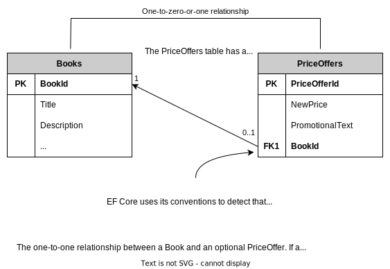

# Notes of Entity Framework Core In Action (2nd Edition)

## 1. Introduction to Entity Framework Core

EF Core is designed as an *object-relational mapper (O/RM)*. O/RMs work by mapping between two worlds: the relational database, with its own API, and the object-oriented software world of classes and software code.


### The Downsides of O/RMs

1. *Object-relational impedance mismatch*. Database servers and object-oriented software use different principles; databases use primary keys to define that a row is unique, whereas .NET class instances are, by default, considered unique by their reference.

2. EF Core "hides" the database so well that you can sometimes forget about the database underneath. This problem can cause you to write code that would work well in C# but doesn’t work for a database.

   ````c#
   public string FullName => $"{FirstName} {LastName}";
   ````

   An expression body property such as the one just shown is the right thing to do in C#, but the same property would throw an exception if you tried to filter or order on that property, because EF Core needs a FullName column in the table so that it can apply an SQL `WHERE` or `ORDER` command at the database level.


### First Ef Core Application


````c#
// EF Core maps .NET classes to database tables.
public class Book
{
    // A class needs a primary key.
    // We are using an EF Core naming convention that tells EF Core that the property BookId is the primary key.
    public int BookId { get; set; }
    
    // these properties are mapped to the table's columns.
    public string Title { get; set; }
    public string Description { get; set; }
    public DateTime PublishedOn { get; set; }
    
    // The AuthorId foreign key is used in the database to link a row in the Books table to a row in the Author table.
    public int AuthorId { get; set; }
    
    // The Author property is an EF Core navigational property. EF Core uses this on a save to see whether the Book has an Author class attached. If so, it sets the foreign key, AuthorId.
    // Upon loading a Book class, the method Include will fill this property with the Author class that's linked to this book class by using the foreign key, AuthorId.
    public Author Author { get; set; }
}

public class Author
{
    // Note that the foreign key in the Book class has the same name.
    public int AuthorId { get; set; }
    public string Name { get; set; }
    public string WebUrl { get; set; }
}
````

````c#
// DbContext class holds the information and configuration for accessing database.
public class AppDbContext : DbContext
{
    private const string ConnectionString = "Server=(localdb)\mssqllocaldb;Database=FirstEfCoreDb;Trusted_Connection=True";
    
    protected override void OnConfiguring(DbContextOptionsBuilder optionsBuilder)
    {
        optionsBuilder.UseSqlServer(connectionString);
    }
    
    // By creating a property called Books of type DbSet<Book>, you tell EF Core that these's a database table named Books, and it has the columns and keys as found in the Book class.
    public DbSet<Book> Books { get; set; }
    
    // Database has a table called Author, but purposely didn't create a property for that table.
    // EF Core finds that table by finding a navigational property of type Author in the Book class.
}
````

Two main parts of the application’s DbContext created for the application. First, the setting of the database options defines what type of database to use and where it can be found. Second, the `DbSet<T>` property (or properties) tell(s) EF Core what classes should be mapped to the database.

EF Core will create a model of the database your classes map to. First, it looks at the classes you have defined via the `DbSet<T>` properties; then it looks down all the references to other classes. Using these classes, EF Core can work out the default model of the database. But then it runs the `OnModelCreating` method in the application’s DbContext, which you can override to add your specific commands to configure the database the way you want it.

The following text provides a more detailed description of the process:

* EF Core looks at the application’s DbContext and finds all the public `DbSet<T>` properties. From this data, it defines the initial name for the one table it finds: Books.
* EF Core looks through all the classes referred to in `DbSet<T>` and looks at its properties to work out the column names, types, and so forth. It also looks for special attributes on the class and/or properties that provide extra modeling information.
* EF Core looks for any classes that the `DbSet<T>` classes refer to. In our case, the `Book` class has a reference to the `Author` class, so EF Core scans that class too. It carries out the same search on the properties of the `Author` class as it did on the `Book` class in step 2. It also takes the class name, `Author`, as the table name.
* For the last input to the modeling process, EF Core runs the virtual method `OnModelCreating` inside the application’s DbContext. In this simple application, you don’t override the `OnModelCreating` method, but if you did, you could provide extra information via a fluent API to do more configuration of the modeling.
* EF Core creates an internal model of the database based on all the information it gathered. This database model is cached so that later accesses will be quicker. Then this model is used for performing all database accesses.


````c#
// The code to read all the books and output them to the console
public static void ListAll()
{
    using(var db = new AppDbContext())
    {
        // Reads all the books. AsNoTracking indicates that this access is read-only.
        // The include causes the author information to be loaded with each book.
        foreach(var book in db.Books.AsNoTracking()
               .Include(book => book.Author))
        {
            var webUrl = book.Author.WebUrl ?? "- no web URL given -";
            Console.WriteLine($"{book.Title} by {book.Author.Name}");
            Console.WriteLine("	" + "Published on " + $"{book.PublishedOn:dd-MMM-yyyy}" + $". {webUrl}");
        }
    }
}
````


````sql
-- SQL command produced to read Books and Author
SELECT [b].[BookId],
[b].[AuthorId],
[b].[Description],
[b].[PublishedOn],
[b].[Title],
[a].[AuthorId],
[a].[Name],
[a].[WebUrl]
FROM [Books] AS [b]
INNER JOIN [Author] AS [a] ON
[b].[AuthorId] = [a].[AuthorId]
````


````c#
// The code to update the author’s WebUrl of the book Quantum Networking
public static void ChangeWubUrl()
{
    Console.WriteLine("New Quantum Networking WebUrl > ");
    var newWebUrl = Console.ReadLine();
    
    using(var db = new AppDbContext())
    {
        var singleBook = db.Books
            .Include(book => book.Author)
            .Single(book => book.Title == "Quantum Networking");
        
        singleBook.Author.WebUrl = newWebUrl;
        db.SaveChanges();
        Console.WriteLine("... SavedChanges called.");
    }
    
    ListAll();
}
````


1. The application uses a LINQ query to find a single book with its author information. EF Core turns the LINQ query into an SQL command to read the rows where the Title is Quantum Networking, returning an instance of both the `Book` and the `Author` classes, and checks that only one row was found.
2. The LINQ query doesn’t include the `.AsNoTracking` method you had in the previous read versions, so the query is considered to be a *tracked query*. Therefore, EF Core creates a tracking snapshot of the data loaded.
3. Then the code changes the `WebUrl` property in the Author class of the book. When `SaveChanges` is called, the Detect Changes stage compares all the classes that were returned from a tracked query with the tracking snapshot. From this, it can detect what has changed—in this case, only the `WebUrl` property of the `Author` class, which has a primary key of 3.
4. As a change is detected, EF Core starts a transaction. Every database update is done as an *atomic unit*: if multiple changes to the database occur, either they all succeed, or they all fail. This fact is important, because a relational database could get into a bad state if only part of an update were applied.
5. The update request is converted by the database provider to an SQL command that does the update. If the SQL command is successful, the transaction is committed, and the `SaveChanges` method returns; otherwise, an exception is raised.


## 2. Querying The Database

* Modeling three main types of database relationships
* Creating and changing a database via migration
* Defining and creating an application DbContext
* Loading related data
* Splitting complex queries into subqueries


### The Book App

* One-to-one relationship - PriceOffer to a Book
* One-to-many relationship - Book with Reviews
* Many-to-many relationship - Books linked to Authors and Books linked to Tags


#### One-to-one Relationship: Priceoffer to a book

A book can have a promotional price applied to it with an optional row in the Price- Offer, which is an example of a one-to-one relationship. (Technically, the relationship is one-to-zero-or-one, but EF Core handles it the same way.)

To calculate the final price of the book, you need to check for a row in the PriceOffer table that’s linked to the Books via a foreign key. If such a row is found, the NewPrice supersedes the price for the original book, and the PromotionalText is shown onscreen, as in this example:

​	*$40 $30 Our summertime price special, for this week only!*





#### One-to-many relationship: Reviews to a book

You want to allow customers to review a book; they can give a book a star rating and optionally leave a comment. Because a book may have no reviews or many (unlimited) reviews, you need to create a table to hold that data. In this example, you’ll call the table Review. The Books table has a one-to-many relationship to the Review table.

In the Summary display, you need to count the number of reviews and work out the average star rating to show a summary. Here’s a typical onscreen display you might produce from this one-to-many relationship:

​	*Votes 4.5 by 2 customers*


#### Many-to-many relationship: Manually configured

Books can be written by one or more authors, and an author may write one or more books. The link between the Books and Authors tables is called a many-to-many relationship, which in this case needs a linking table to achieve this relationship.
In this case, you create your own linking table with an Order value in it because the names of the authors in a book must be displayed in a specific order.

A typical onscreen display from the many-to-many relationship would look like this:

​	*by Dino Esposito, Andrea Saltarello*


#### Many-to-many relationship: Autoconfigured by EF Core

Books can be tagged with different categories - such as Microsoft .NET, Linux, Web, and so on - to help the customer to find a book on the topic they are interested in. A category might be applied to multiple books, and a book might have one or more categories, so a many-to-many linking table is needed. But unlike in the previous `BookAuthor` linking table, the tags don’t have to be ordered, which makes the linking table simpler.

A typical onscreen display from a many-to-many relationship would look like this:

​	*Categories: Microsoft .NET, Web*


#### Other relationship types

* Owned Type class: Useful for adding grouped data, such as an `Address` class, to an entity class. The `Address` class is linked to the main entity, but your code can copy around the `Address` class rather than copying individual `Street`, `City`, `State`, and related properties.
* Table splitting: Maps multiple classes to one table. You could have a summary class with the basic properties in it and a detailed class containing all the data, for example, which would give you a quicker load of the summary data.
* Table per hierarchy (TPH): Useful for groups of data that are similar. If you have a lot of data with only a few differences, such as a list of animals, you can have a base `Animal` class that `Dog`, `Cat`, and `Snake` classes can inherit, with per-type properties such as `LengthOfTail` for `Dog` and `Cat` and a `Venomous` flag for the `Snake`. EF Core maps all the classes to one table, which can be more efficient.
* Table per type (TPT): Useful for groups of data that have dissimilar data. TPT is the opposite of TPH, in which each class has its own table. Following the `Animal` example for TPH, the TPT version would map the `Dog`, `Cat`, and `Snake` classes to three different tables in the database.


#### The classes that EF Core maps to the database

There created five .NET classes to map to the six tables in the database. These classes are called `Book`, `PriceOffer`, `Review`, `Tag`, `Author`, and `BookAuthor` for the many-to-manylinking table, and they are referred to as *entity classes* to show that they’re mapped by EF Core to the database. From the software point of view, there’s nothing special about entity classes. They’re normal .NET classes, sometimes referred to as plain old CLR objects (POCOs). The term entity class identifies the class as one that EF Core has mapped to the database.


````c#
// The Book class, mapped to the Books table in the database
public class Book // The Book class contains the main book information.
{
    public int BookId { get; set; } // We use EF Core’s By Convention configuration to define the primary key of this entity class, so we use <ClassName>Id, and because the property is of type int, EF Core assumes that the database will use the SQL IDENTITY command to create a unique key when a new row is added.
    public string Title { get; set; }
    public string Description { get; set; }
    public DateTime PublishedOn { get; set; }
    public string Publisher { get; set; }
    public decimal Price { get; set; }
    public string ImageUrl { get; set; }
    
    //-----------------------------------------------
    //relationships

    public PriceOffer Promotion { get; set; } // Link to the optional one-toone PriceOffer relationship.
    public ICollection<Review> Reviews { get; set; } // There can be zero to many reviews of the book.
    public ICollection<Tag> Tags { get; set; } // EF's automatic many-to-many relationship to the Tag entity class
    public ICollection<BookAuthor> AuthorsLink { get; set; } // Provides a link to the many-to-many linking table that links to the Authors of this book
}
````


* In the Book App, when we have navigational properties that are collections, we use the type `ICollection<T>`. We do so because the new eager loading sort capability can return a sorted collection, and the default `HashSet` definition says it holds only a collection "whose elements are in no particular order." But there is a performance cost to not using `HashSet` when your navigational properties contain a large collection.


### Creating the application’s DbContext

To access the database, you need to do the following:

1. Define your application’s DbContext, which you do by creating a class and inheriting from EF Core’s `DbContext` class.
2. Create an instance of that class every time you want to access the database.

The key class you need to use EF Core is the application’s `DbContext`. You define this class by inheriting EF Core’s `DbContext` class and adding various properties to allow your software to access the database tables. It also contains methods you can override to access other features in EF Core, such as configuring the database modeling.


````c#
public EfCoreContext : DbContext // Any application DbContext must inherit from the EF Core’s DbContext class.
{
    // These public properties of type DbSet<T> are mapped by EF Core to tables in your database, using the name of the property as the table name. You can query these tables via LINQ methods on a property.
    public DbSet<Book> Books { get; set; }
    public DbSet<Author> Authors { get; set; }
    public DbSet<Tag> Tags { get; set; }
    public DbSet<PriceOffer> PriceOffers { get; set; }
    // The classes, such as Book, Author, Tag and PriceOffer, are entity classes. Their properties are mapped to columns in the appropriate database table.
    
    
    public EfCoreContext(DbContextOptions<EfCoreContext> options) : base(options) // For your ASP.NET Core application, you need a constructor to set up the database options. This allows your application to define what sort of database it is and where it’s located.
    {
    }
    
    protected override void OnModelCreating(DbModelBuilder modelBuilder)
    {
        //... code left out
    }
}

// The application’s DbContext is the key class in accessing the database. This figure shows the main parts of an application’s DbContext, starting with its inheriting EF Core’s DbContext, which brings in lots of code and features. You have to add some properties with the class DbSet<T> that map your classes to a database table with the same name as the property name you use. The other parts are the constructor, which handles setting up the database options, and the OnModelCreating method, which you can override to add your own configuration commands and set up the database the way you want.
````

````c#
// Creating an instance of the application’s DbContext to access the database
const string connection = "Data Source=(localdb)\\mssqllocaldb;Database=EfCoreInActionDb.Chapter02;Integrated Security=True;"; // The connection string, with its format dictated by the sort of database provider and hosting you’re using
var optionsBuilder = new DbContextOptionsBuilder<EfCoreContext>(); // You need an EF Core DbContextOptionsBuilder<> instance to set the options you need.

optionsBuilder.UseSqlServer(connection); // You’re accessing an SQL Server database and using the UseSqlServer method from the Microsoft.EntityFramework- Core.SqlServer library, and this method needs the database connection string.
var options = optionsBuilder.Options;
using (var context = new EfCoreContext(options)) // Creates the all-important EfCoreContext, using the options you’ve set up. You use a using statement because the DbContext is disposable.
{
    var bookCount = context.Books.Count(); // Uses the DbContext to find out the number of books in the database
    //... etc.
}
````


At the end of this listing, you create an instance of `EfCoreContext` inside a using statement because DbContext has an IDisposable interface and therefore should be disposed after you’ve used it.


### Understanding database queries

````c#
context.Books									// Application’s DbContext property access
    .Where(p => p.Title.StartsWith("Quantum")	// A series of LINQ and/or EF Core commands
    .ToList();									// An execute command
// The three parts of an EF Core database query, with example code.
````

Until a final execute command is applied at the end of the sequence of LINQ commands, the LINQ is held as a series of commands in what is called an *expression tree*, which means that it hasn’t been executed on the data yet.

At this point, your LINQ query will be converted to database commands and sent to the database. If you want to build high-performance database queries, you want all your LINQ commands for filtering, sorting, paging, and so on to come before you call an execute command. Therefore, your filter, sort, and other LINQ commands will be run inside the database, which improves the performance of your query.


````c#
context.Books.AsNoTracking()
    .Where(p => p.Title.StartsWith("Quantum")).ToList();
````

This query has the EF Core’s `AsNoTracking` method added to the LINQ query. As well as making the query read-only, the `AsNoTracking` method improves the performance of the query by turning off certain EF Core features.


### Loading related data

You can load data in four ways: eager loading, explicit loading, select loading, and lazy loading. 

You need to be aware that EF Core won’t load any relationships in an entity class unless you ask it to. This default behavior of not loading relationships is correct, because it means that EF Core minimizes the database accesses. If you want to load a relationship, you need to add code to tell EF Core to do that.


#### Eager loading: Loading relationships with the primary entity class

The first approach to loading related data is *eager loading*, which entails telling EF Core to load the relationship in the same query that loads the primary entity class. Eager loading is specified via two fluent methods, `Include` and `ThenInclude`. The next listing shows the loading of the first row of the Books table as an instance of the `Book` entity class and the eager loading of the single relationship, `Reviews`.


````c#
// Eager loading of first book with the corresponding Reviews relationship
var firstBook = context.Books
    .Include(book => book.Reviews) // Gets a collection of Review class instances, which may be an empty collection
    .FirstOrDefault(); // Takes the first book or null if there are no books in the database
````

If you look at the SQL command that this EF Core query creates, shown in the following snippet, you’ll see two SQL commands. The first command loads the first row in the Books table. The second loads the reviews, where the foreign key, `BookId`, has the same value as the first `Books` row primary key:

````sql
SELECT "t"."BookId", "t"."Description", "t"."ImageUrl",
	"t"."Price", "t"."PublishedOn", "t"."Publisher",
	"t"."Title", "r"."ReviewId", "r"."BookId",
	"r"."Comment", "r"."NumStars", "r"."VoterName"
FROM (
    SELECT "b"."BookId", "b"."Description", "b"."ImageUrl",
	    "b"."Price", "b"."PublishedOn", "b"."Publisher", "b"."Title"
    FROM "Books" AS "b"
    LIMIT 1
) AS "t"
LEFT JOIN "Review" AS "r" ON "t"."BookId" = "r"."BookId"
ORDER BY "t"."BookId", "r"."ReviewId"
````


````c#
// Eager loading of the Book class and all the related data
var firstBook = context.Books
    .Include(book => book.AuthorsLink) // The first Include gets a collection of BookAuthor.
    	.ThenInclude(bookAuthor => bookAuthor.Author) // Gets the next link—in this case, the link to the author
    .Include(book => book.Reviews) // Gets a collection of Review class instances, which may be an empty collection
    .Include(book => book.Tags) // Loads and directly accesses the Tags
    .Include(book => book.Promotion) // Loads any optional PriceOffer class, if one is assigned
    .FirstOrDefault(); // Loads any optional PriceOffer class, if one is assigned
````

`Include` followed by `ThenInclude`, is the standard way of accessing relationships that go deeper than a first-level relationship. You can go to any depth with multiple `ThenIncludes`, one after the other.

If you use the direct linking of many-to-many relationships, you don’t need `ThenInclude` to load the second-level relationship because the property directly accesses the other end of the many-to-many relationship via the `Tags` property, which is of type `ICollection<Tag>`. This approach can simplify the use of a many-to-many relationship as long you don’t need some data in the linking table, such as the `Order` property in the `BookAuthor` linking entity class used to order the `Book`’s `Authors` correctly.

If the relationship doesn’t exist (such as the optional `PriceOffer` class pointed to by the Promotion property in the `Book` class), `Include` doesn’t fail; it simply doesn’t load anything, or in the case of collections, it returns an empty collection (a valid collection with zero entries). The same rule applies to `ThenInclude`: if the previous `Include` or `ThenInclude` was empty, subsequent `ThenIncludes` are ignored. If you don’t `Include` a collection, it is null by default.

The advantage of eager loading is that EF Core will load all the data referred to by the `Include` and `ThenInclude` in an efficient manner, using a minimum of database accesses, or *database round-trips*. This type of loading to be useful in relational updates in which I need to update an existing relationship. Also eager loading to be useful in business logic.
The downside is that eager loading loads *all* the data, even when you don’t need part of it. The book list display, for example, doesn’t need the book description, which could be quite large.


You can use the ability to sort or filter the related entities when you use the `Include` or `ThenInclude` methods. This capability is helpful if you want to load only a subset of the related data (such as only `Reviews` with five stars) and/or to order the included entities (such as ordering the `AuthorsLink` collection against the Order property). The only LINQ commands you can use in the `Include` or `ThenInclude` methods are `Where`, `OrderBy`, `OrderByDescending`, `ThenBy`, `ThenByDescending`, `Skip`, and `Take`, but those commands are all you need for sorting and filtering.

````c#
// Sorting and filtering when using Include or ThenInclude
var firstBook = context.Books
    .Include(book => book.AuthorsLink					// Sort example: On the eager loading of the AuthorsLink collection, you sort the
    	.OrderBy(bookAuthor => bookAuthor.Order))		// BookAuthors so that the Authors will be in the correct order to display.
    	.ThenInclude(bookAuthor => bookAuthor.Author)
    .Include(book => book.Reviews						// Filter example. Here, you load only
        .Where(review => review.NumStars == 5))			// the Reviews with a star rating of 5.
    .Include(book => book.Promotion)
    .First();
````


#### Explicit loading: Loading relationships after the primary entity class

The second approach to loading data is *explicit loading*. After you’ve loaded the primary entity class, you can explicitly load any other relationships you want. First, it loads the `Book`; then it uses explicit-loading commands to read all the relationships.

````c#
// Explicit loading of the Book class and related data
var firstBook = context.Books.First(); // Reads in the first book on its own
context.Entry(firstBook)
    .Collection(book => book.AuthorsLink).Load(); // Explicity loads the linking table, BookAuthor
foreach (var authorLink in firstBook.AuthorsLink) // To load all the possible authors, the code has to loop through all the BookAuthor entries...
{
    context.Entry(authorLink) // …and load each linked Author class.
        .Reference(bookAuthor =>
        	bookAuthor.Author).Load();
}

context.Entry(firstBook) // Loads all the reviews
    .Collection(book => book.Tags).Load(); // Loads the Tags
context.Entry(firstBook) // Loads the optional PriceOffer class
    .Reference(book => book.Promotion).Load();
````


Alternatively, explicit loading can be used to apply a query to the relationship instead of loading the relationship. You can use any standard LINQ command after the `Query` method, such as `Where` or `OrderBy`.

````c#
// Explicit loading of the Book class with a refined set of related data
var firstBook = context.Books.First(); // Reads in the first book on its own
var numReviews = context.Entry(firstBook) // Executes a query to count reviews for this book
    .Collection(book => book.Reviews)
    .Query().Count();
var starRatings = context.Entry(firstBook) // Executes a query to get all the star ratings for the book
    .Collection(book => book.Reviews)
    .Query().Select(review => review.NumStars)
    .ToList();
````


The advantage of explicit loading is that you can load a relationship of an entity class later. This technique useful when I’m using a library that loads only the primary entity class, and need one of its relationships. Explicit loading can also be useful when you need that related data in only some circumstances. You might also find explicit loading to be useful in complex business logic because you can leave the job of loading the specific relationships to the parts of the business logic that need it. The downside of explicit loading is more database round trips, which can be inefficient. If you know up front the data you need, eager loading the data is usually more efficient because it takes fewer database round trips to load the relationships.


#### Select loading: Loading specific parts of primary entity class and any relationships

The third approach to loading data is using the LINQ `Select` method to pick out the data you want, which calls *select loading*. The next listing shows the use of the `Select` method to select a few standard properties from the `Book` class and execute specific code inside the query to get the count of customer reviews for this book.


````c#
// Select of the Book class picking specific properties and one calculation
var books = context.Books
    .Select(book => new // Uses the LINQ Select keyword and creates an anonymous type to hold the results
    	{
            book.Title,
            book.Price,
            NumReviews = book.Reviews.Count, // Runs a query that counts the number of reviews
        }
).ToList();
````

The advantage of this approach is that only the data you need is loaded, which can be more efficient if you don’t need all the data. Only one SQL `SELECT` command is required to get all that data, which is also efficient in terms of database round trips. EF Core turns the `p.Reviews.Count` part of the query into an SQL command, so that count is done inside the database, as you can see in the following snippet of the SQL created by EF Core:

````sql
SELECT "b"."Title", "b"."Price", (
    SELECT COUNT(*)
    FROM "Review" AS "r"
    WHERE "b"."BookId" = "r"."BookId") AS "NumReviews"
FROM "Books" AS "b"
````


#### Lazy loading: Loading relationships as required

*Lazy loading* makes writing queries easy, but it has a bad effect on database performance. Lazy loading does require some changes to your DbContext or your entity classes, but after you make those changes, reading is easy; if you access a navigational property that isn’t loaded, EF Core will execute a database query to load that navigational property.

You can set up lazy loading in either of two ways:

* Adding the Microsoft.EntityFrameworkCore.Proxies library when configuring your DbContext
* Injecting a lazy loading method into the entity class via its constructor

The first option is simple but locks you into setting up lazy loading for all the relationships. The second option requires you to write more code but allows you to pick which relationships use lazy loading.

To configure the simple lazy loading approach, you must do two things:

* Add the keyword `virtual` before *every* property that is a relationship.
* Add the method `UseLazyLoadingProxies` when setting up your DbContext.

So the converted Book entity type to the simple lazy loading approach would look like the following code snippet, with the virtual keyword added to the navigational properties:

````c#
public class BookLazy
{
    public int BookLazyId { get; set; }
    //… Other properties left out for clarity

    public virtual PriceOffer Promotion { get; set; }
    public virtual ICollection<Review> Reviews { get; set; }
    public virtual ICollection<BookAuthor> AuthorsLink { get; set; }
}
````

Using the EF Core’s Proxy library has a limitation: you must make every relational property virtual; otherwise, EF Core will throw an exception when you use the DbContext.


The second part is adding the EF Core’s Proxy library to the application that sets up the DbContext and then adding the `UseLazyLoadingProxies` to the configuring of the DbContext.

````c#
var optionsBuilder =
    new DbContextOptionsBuilder<EfCoreContext>();
optionsBuilder
    .UseLazyLoadingProxies()
    .UseSqlServer(connection);
var options = optionsBuilder.Options;

using (var context = new EfCoreContext(options))
````

When you have configured lazy loading in your entity classes and in the way you create the DbContext, reading relationships is simple; you don’t need extra `Include` methods in your query because the data is loaded from the database when your code accesses that relationship property.

````c#
// Lazy loading of BookLazy’s Reviews navigational property
var book = context.BookLazy.Single(); // Gets an instance of the BookLazy entity class that has configured its Reviews property to use lazy loading
var reviews = book.Reviews.ToList(); // When the Reviews property is accessed, EF Core will read in the reviews from the database.
````

Creates two database accesses. The first access loads the `BookLazy` data without any properties, and the second happens when you access `BookLazy`’s `Reviews` property.


Many developers find lazy loading to be useful, but you can want to avoid it because of its performance issues. There is time overhead for every access to the database server, so the best approach is to minimize the number of calls to the database server. But lazy loading (and explicit loading) can create lots of database accesses, making the query slow and causing the database server to work harder.

Even if you have set up a relational property for lazy loading, you can get better performance by adding an `Include` on a virtual relational property. The lazy loading will see that the property has been loaded and not load it again.


### Using client vs. server evaluation: Adapting data at the last stage of a query

EF Core has a feature called *client vs. server evaluation*, which allows you to run code at the last stage of the query (that is, the final `Select` part in your query) that can’t be converted to database commands. EF Core runs these non-server-runnable commands after the data has come back from the database.

The client vs. server evaluation feature gives you the opportunity to adapt/change the data within the last part of the query, which can save you from having to apply an extra step after the query. You use client vs. server evaluation to create a comma-delimited list of the authors of a book. If you didn’t use client vs. server evaluation for that task, you would need to (a) send back a list of all the Author names and (b) add an extra step after the query, using a `foreach` section to apply a `string.Join` to each book’s authors.


If your LINQ queries can’t be converted to database commands, EF Core will throw an `InvalidOperationException`, with a message containing the words `could not be translated`. The trouble is that you get that error only when you try that query - and you don’t want that error to happen in production!


For the list display of the books in the Book App, you need to (a) extract all the authors’ names, in order, from the Authors table and (b) turn them into one string with commas between names. Here’s an example that loads two properties, `BookId` and `Title`, in the normal manner, and a third property, `AuthorsString`, that uses client vs. server evaluation.

````c#
// Select query that includes a non-SQL command, string.Join
var firstBook = context.Books
    .Select(book => new
    {
        book.BookId,
        book.Title,
        AuthorsString = string.Join(", ", // string.Join is executed on the client in software.
        	book.AuthorsLink
            .OrderBy(ba => ba.Order)
            .Select(ba => ba.Author.Name))
    }
).First();
````


Using client vs. server evaluation on a property means that you cannot use that property in any LINQ command that would produce database commands, such as any commands that sort or filter that property. If you do, you will get an `InvalidOperationException`, with a message that contains the words `could not be translated`. If you tried to sort or filter on the `AuthorsString`, you would get the `could not be translated` exception.


### Building complex queries

You’re going to build a query to list all the books in the Book App, with a range of features including sorting, filtering, and paging.
You could build the book display by using eager loading. First, you’d load all the data; then, in the code, you’d combine the authors, calculate the price, calculate the average votes, and so on. The problem with that approach is that (a) you are loading data you don’t need and (b) sorting and filtering have to be done in software. For this chapter’s Book App, which has approximately 50 books, you could eager-load all the books and relationships into memory and then sort or filter them in software, but that approach wouldn’t work for real!

This figure is complicated because the queries needed to get all the data are complicated. With this diagram in mind, let’s look at how to build the book select query. You start with the class you’re going to put the data in. This type of class, which exists only to bring together the exact data you want, is referred to in various ways. In ASP.NET, it is referred to as a ViewModel, but that term also has other connotations and uses; therefore, we refer to this type of class as a *Data Transfer Object (DTO)*. DTOs is "object that is used to encapsulate data, and send it from one subsystem of an application to another".


````c#
// The DTO BookListDto
public class BookListDto
{
    public int BookId { get; set; } // You need the primary key if the customer clicks the entry to buy the book.
    public string Title { get; set; }
    public DateTime PublishedOn { get; set; } // Although the publication date isn’t shown, you’ll want to sort by it, so you have to include it.
    public decimal Price { get; set; } // The normal selling price of the book
    public decimal ActualPrice { get; set; } // Selling price—either the normal price or the promotional.NewPrice if present
    public string PromotionPromotionalText { get; set; } // Promotional text to show whether there’s a new price
    public string AuthorsOrdered { get; set; } // String to hold the comma-delimited list of authors’ names
    public int ReviewsCount { get; set; } // Number of people who reviewed the book
    public double? ReviewsAverageVotes { get; set; } // Average of all the votes, null if no votes
    public string[] TagStrings { get; set; } // The Tag names (that is the categories) for this book
}
````

To work with EF Core’s select loading, the class that’s going to receive the data must have a default constructor (which you can create without providing any properties to the constructor), the class must not be static, and the properties must have public setters.

Next, you’ll build a select query that fills in every property in `BookListDto`. Because you want to use this query with other query parts, such as sort, filter, and paging, you’ll use the `IQueryable<T>` type to create a method called `MapBookToDto` that takes in `IQueryable<Book>` and returns `IQueryable<BookListDto>`.

````c#
// The Select query to fill BookListDto
public static IQueryable<BookListDto> MapBookToDto(this IQueryable<Book> books) // Takes in IQueryable<Book> and returns IQueryable<BookListDto>
{
    return books.Select(book => new BookListDto
    {
        BookId = book.BookId,
        Title = book.Title,
        Price = book.Price,
        PublishedOn = book.PublishedOn,
        ActualPrice = book.Promotion == null // Calculates the selling price, which is the normal price, or the promotion price if that relationship exists
            ? book.Price
            : book.Promotion.NewPrice,
        PromotionPromotionalText = book.Promotion == null // PromotionalText depends on whether a PriceOffer exists for this book
            ? null
            : book.Promotion.PromotionalText,
        AuthorsOrdered = string.Join(", ", // Obtains an array of authors’ names, in the right order. You’re using client vs. server evaluation because you want the author names combined into one string.
        	book.AuthorsLink
            	.OrderBy(ba => ba.Order)
                .Select(ba => ba.Author.Name)),
        ReviewsCount = book.Reviews.Count, // You need to calculate the number of reviews.
        ReviewsAverageVotes = book.Reviews.Select(review => // To get EF Core to turn the LINQ average into the SQL AVG command, you need to cast the NumStars to (double?).
        	(double?) review.NumStars).Average(),
        TagStrings = book.Tags // Array of Tag names (categories) for this book
            .Select(x => x.TagId).ToArray(),
    });
}
````

The `MapBookToDto` method uses the Query Object pattern; the method takes in `IQueryable<T>` and outputs `IQueryable<T>`, which allows you to encapsulate a query, or part of a query, in a method. That way, the query is isolated in one place, which makes it easier to find, debug, and performance-tune. You’ll use the Query Object pattern for the sort, filter, and paging parts of the query too.


Query Objects are useful for building queries such as the book list in this example, but alternative approaches exist, such as the Repository pattern.


The `MapBookToDto` method is also what .NET calls an *extension method*. Extension methods allow you to chain Query Objects together.


A method can become an extension method if (a) it’s declared in a static class, (b) the method is static, and (c) the first parameter has the keyword `this` in front of it.


Query Objects take in a `IQueryable<T1>` input and return `IQueryable<T2>`, so you’re adding LINQ commands to the original `IQueryable<T1>` input. You can add another Query Object to the end, or if you want to execute the query, add an execute command such as ToList to execute the query.


### Adding sorting, filtering, and paging

#### Sorting books by price, publication date, and customer ratings

Sorting in LINQ is done by the methods `OrderBy` and `OrderByDescending`. You create a Query Object called `OrderBooksBy` as an extension method, as shown in the next listing. You’ll see that in addition to the `IQueryable<BookListDto>` parameter, this method takes in an enum parameter that defines the type of sort the user wants.

````c#
// The OrderBooksBy Query Object method
public static IQueryable<BookListDto> OrderBooksBy (this IQueryable<BookListDto> books, OrderByOptions orderByOptions)
{
    switch (orderByOptions)
    {
        case OrderByOptions.SimpleOrder:
            return books.OrderByDescending(x => x.BookId); // Because of paging, you always need to sort. You default-sort on the primary key, which is fast.
        case OrderByOptions.ByVotes:
            return books.OrderByDescending(x => x.ReviewsAverageVotes); // Orders the book by votes. Books without any votes (null return) go at the bottom.
        case OrderByOptions.ByPublicationDate:
            return books.OrderByDescending(x => x.PublishedOn); // Orders by publication date, with the latest books at the top
        case OrderByOptions.ByPriceLowestFirst:					// Orders by actual price,
            return books.OrderBy(x => x.ActualPrice);			// which takes into account
        case OrderByOptions.ByPriceHighestFirst:				// any promotional price—both
            return books.OrderByDescending(x => x.ActualPrice);	// lowest first and highest first
        default:
            throw new ArgumentOutOfRangeException(nameof(orderByOptions), orderByOptions, null);
    }
}
````

Calling the `OrderBooksBy` method returns the original query with the appropriate LINQ sort command added to the end. You pass this query on to the next Query Object, or if you’ve finished, you call a command to execute the code, such as `ToList`.

Even if the user doesn’t select a sort, you’ll still sort because you’ll be using paging, providing only a page at a time rather than all the data, and SQL requires the data to be sorted to handle paging. The most efficient sort is on the primary key, so you sort on that key.


#### Filtering books by publication year, categories, and customer ratings

````c#
// The code to produce a list of the years when books are published
var result = _db.Books
    .Where(x => x.PublishedOn <= DateTime.UtcNow.Date)
    .Select(x => x.PublishedOn.Year)
    .Distinct() // The Distinct method returns a list of each year a book was published.
    .OrderByDescending(x => x.PublishedOn) // Orders the published. years, with newest year at the top
    .Select(x => new DropdownTuple // Use two client/server evaluations to turn the values into strings.
    {
        Value = x.ToString(),
        Text = x.ToString()
    }).ToList();
var comingSoon = _db.Books.
    Any(x => x.PublishedOn > DateTime.Today); // Returns true if a book in the list is not yet published
if (comingSoon) // Adds a "coming soon" filter for all the future books
{
    result.Insert(0, new DropdownTuple
    {
        Value = BookListDtoFilter.AllBooksNotPublishedString,
        Text = BookListDtoFilter.AllBooksNotPublishedString
    });
}

return result;
````

The result of this code is a list of `Value/Text` pairs holding each year that books are published, plus a Coming Soon section for books yet to be published.


````c#
// The FilterBooksBy Query Object method
public static IQueryable<BookListDto> FilterBooksBy(this IQueryable<BookListDto> books, BooksFilterBy filterBy, string filterValue) // The method is given both the type of filter and the user-selected filter value.
{
    if (string.IsNullOrEmpty(filterValue)) // If the filter value isn’t set, returns IQueryable with no change
    {
        return books;
    }
    
    switch (filterBy)
    {
        case BooksFilterBy.NoFilter: // For no filter selected, returns IQueryable with no change
            return books;
        case BooksFilterBy.ByVotes:
            var filterVote = int.Parse(filterValue); // The filter by votes returns only books with an average vote above the filterVote value. If there are no reviews for a book, the ReviewsAverageVotes property will be null, and the test always returns false.
            return books.Where(x => x.ReviewsAverageVotes > filterVote);
        case BooksFilterBy.ByTags: // Selects any books with a Tag category that matches the filterValue
            return books.Where(x => x.TagStrings.Any(y => y == filterValue));
        case BooksFilterBy.ByPublicationYear:
            if (filterValue == AllBooksNotPublishedString) // If Coming Soon was picked, returns only books not yet published
            {
                return books.Where(x => x.PublishedOn > DateTime.UtcNow);
            }
            var filterYear = int.Parse(filterValue); // If we have a specific year, we filter on that. Note that we also remove future books (in case the user chose this year’s date).
            return books.Where(x => x.PublishedOn.Year == filterYear&& x.PublishedOn <= DateTime.UtcNow);
        default:
            throw new ArgumentOutOfRangeException(nameof(filterBy), filterBy, null);
    }
}
````


#### Other filtering options: Searching text for a specific string

We could’ve created loads of other types of filters/searches of books, and searching by title is an obvious one. But you want to make sure that the LINQ commands you use to search a string are executed in the database, because they’ll perform much better than loading all the data and filtering in software. EF Core converts the following C# code in a LINQ query to a database command: `==`, `Equal`, `StartsWith`, `EndsWith`, `Contains`, and `IndexOf`.

| String command | Example                                                      |
| -------------- | ------------------------------------------------------------ |
| StartsWith     | var books = context.Books.Where(p => p.Title.StartsWith("The")).ToList(); |
| EndsWith       | var books = context.Books.Where(p => p.Title.EndsWith("MAT.")).ToList(); |
| Contains       | var books = context.Books.Where(p => p.Title.Contains("cat")) |

The other important thing to know is that the case sensitivity of a string search executed by SQL commands depends on the type of database, and in some databases, the rule is called `collation`. A default SQL Server database default collation uses case-insensitive searches, so searching for `Cat` would find `cat` and `Cat`. Many SQL databases are `case-insensitive` by default, but Sqlite has a mix of `case-sensitive`/`case-insensitive`, and Cosmos DB is by default `case-sensitive`.


Typically, you configure the collation for the database or a specific column, but you can also define the collation in a query by using the `EF.Functions.Collate` method. The following code snippet sets an SQL Server collation, which means that this query will compare the string using the `Latin1_General_CS_AS` (`case-sensitive`) collation for this query:

````c#
context.Books.Where( x =>
	EF.Functions.Collate(x.Title, "Latin1_General_CS_AS") == "HELP" //This does not match "help"
````


Another string command is the SQL command `LIKE`, which you can access through the `EF.Function.Like` method. This command provides a simple pattern-matching approach using _ (underscore) to match any letter and % to match zero-to-many characters. The following code snippet would match "The Cat sat on the mat." and "The dog sat on the step." but not "The rabbit sat on the hutch." because rabbit isn’t three letters long:

````c#
var books = context.Books
    .Where(p => EF.Functions.Like(p.Title, "The ___ sat on the %."))
    .ToList();
````


#### Paging the books in the list

````c#
// A generic Page Query Object method
public static IQueryable<T> Page<T>(this IQueryable<T> query, int pageNumZeroStart, int pageSize)
{
    if (pageSize == 0)
    {
        throw new ArgumentOutOfRangeException(nameof(pageSize), "pageSize cannot be zero.");
    }

    if (pageNumZeroStart != 0)
    {
        query = query.Skip(pageNumZeroStart * pageSize); // Skips the correct number of pages
    }

    return query.Take(pageSize); // Takes the number for this page size
}
````


Paging works only if the data is ordered. Otherwise, SQL Server will throw an exception because relational databases don’t guarantee the order in which data is handed back; there’s no default row order in a relational database.


### Putting it all together: Combining Query Objects

The benefit of building a complex query in separate parts is that this approach makes writing and testing the overall query simpler, because you can test each part on its own.


````c#
// The ListBookService class providing a sorted, filtered, and paged list
public class ListBooksService
{
    private readonly EfCoreContext _context;

    public ListBooksService(EfCoreContext context)
    {
        _context = context;
    }

    public IQueryable<BookListDto> SortFilterPage(SortFilterPageOptions options)
    {
        var booksQuery = _context.Books // Starts by selecting the Books property in the Application’s DbContext
            .AsNoTracking() // Because this query is readonly, you add .AsNoTracking.
            .MapBookToDto() // Uses the Select Query Object, which picks out/calculates the data it needs
            .OrderBooksBy(options.OrderByOptions) // Adds the commands to order the data by using the given options
            .FilterBooksBy(options.FilterBy, options.FilterValue); // Adds the commands to filter the data

        options.SetupRestOfDto(booksQuery); // This stage sets up the number of pages and makes sure that PageNum is in the right range.

        return booksQuery.Page(options.PageNum-1, options.PageSize); // Applies the paging commands
    }
}
````


### Summary

* To access a database in any way via EF Core, you need to define an application DbContext.
* An EF Core query consists of three parts: the application’s DbContext property, a series of LINQ/EF Core commands, and a command to execute the query.
* Using EF Core, you can model three primary database relationships: `one-to-one`, `one-to-many`, and `many-to-many`, and others.
* The classes that EF Core maps to the database are referred to as *entity classes*. We use this term to highlight the fact that the class I’m referring to is mapped by EF Core to the database.
* If you load an entity class, it won’t load any of its relationships by default. Querying the `Book` entity class, for example, won’t load its relationship properties (`Reviews`, `AuthorsLink`, and `Promotion`); it leaves them as `null`.
* You can load related data that’s attached to an entity class in four ways: eager loading, explicit loading, select loading, and lazy loading.
* EF Core’s client vs. server evaluation feature allows the last stage of a query to contain commands, such as `string.Join`, that can’t be converted to SQL commands.
* We use the term *Query Object* to refer to an encapsulated query or a section of a query. These Query Objects are often built as .NET extension methods, which means that they can easily be chained together, similar to the way LINQ is written.
* Selecting, sorting, filtering, and paging are common query uses that can be encapsulated in a Query Object.
* If you write your LINQ queries carefully, you can move the aggregate calculations, such as `Count`, `Sum`, and `Average`, into the relational database, improving performance.


## 3. Changing The Database Content

* Creating a new row in a database table
* Updating existing rows in a database table for two types of applications
* Updating entities with one-to-one, one-to-many, and many-to-many relationships
* Deleting single entities, and entities with relationships, from a database


### EF Core’s entity State

Any entity class instance has a `State`, which can be accessed via the following EF Core command: `context.Entry(someEntityInstance).State`. The State tells EF Core what to do with this instance when `SaveChanges` is called. Here’s a list of the possible states and what happens if `SaveChanges` is called:

* `Added` - The entity needs to be created in the database. `SaveChanges` inserts it.
* `Unchanged` - The entity exists in the database and hasn’t been modified on the client. `SaveChanges` ignores it.
* `Modified` - The entity exists in the database and has been modified on the client. `SaveChanges` updates it.
* `Deleted` - The entity exists in the database but should be deleted. `SaveChanges` deletes it.
* `Detached` - The entity you provided isn’t tracked. `SaveChanges` doesn’t see it.

Normally, you don’t look at or alter the `State` directly. You use the various commands listed in this chapter to add, update, or delete entities. These commands make sure the `State` is set in a *tracked entity*. When `SaveChanges` is called, it looks at all the tracked entities and their `State` to decide what type of database changes it needs to apply to the database.

`Tracked` entities are entity instances that have been read in from the database by using a query that didn’t include the `AsNoTracking` method. Alternatively, after an entity instance has been used as a parameter to EF Core methods (such as `Add`, `Update`, or `Delete`), it becomes tracked.


### Creating new rows in a table

````c#
// An example of creating a single entity
var itemToAdd = new ExampleEntity
{
    MyMessage = "Hello World"
};
context.Add(itemToAdd); // Uses the Add method to add SingleEntity to the application’s DbContext. The DbContext determines the table to add it to, based on its parameter type.
context.SaveChanges(); // Calls the SaveChanges method from the application’s DbContext to update the database
````

Because you add the entity instance `itemToAdd` that wasn’t originally tracked, EF Core starts to track it and sets its `State` to Added. After `SaveChanges` is called, EF Core finds a tracked entity of type `ExampleEntity` with a `State` of `Added`, so it’s added as a new row in the database table associated with the `ExampleEntity` class.

EF Core creates the SQL command to update an SQL Server–based database.

````sql
-- SQL commands created to insert a new row into the SingleEntities table
SET NOCOUNT ON;
-- Inserts (creates) a new row into the ExampleEntities table
INSERT INTO ExampleEntities]
	([MyMessage]) VALUES (@p0);

-- Reads back the primary key in the newly created row
SELECT [ExampleEntityId] 
FROM [ExampleEntities]
WHERE @@ROWCOUNT = 1 AND
	[ExampleEntityId] = scope_identity();
````

The second SQL command produced by EF Core reads back the primary key of the row that was created by the database server. This command ensures that the original `ExampleEntity` instance is updated with the primary key so that the in-memory version of the entity is the same as the version in the database. Reading back the primary key is important, as you might update the entity later, and the update will need the primary key.


````c#
// Adding a Book entity class also adds any linked entity classes
var book = new Book
{
    Title = "Test Book",
    PublishedOn = DateTime.Today,
    Reviews = new List<Review>() // Creates a new collection of reviews
    {
        new Review // Adds one review with its content
        {
            NumStars = 5,
            Comment = "Great test book!",
            VoterName = "Mr U Test"
        }
    }
};

context.Add(book); // Uses the Add method to add the book to the application’s DbContext property, Books
context.SaveChanges(); // Calls the SaveChanges method from the application’s DbContext to update the database. It finds a new Book, which has a collection containing one new Review, and then adds both to the database.
````


**WHAT HAPPENS AFTER THE SAVECHANGES RETURNS SUCCESSFULLY?**
When the `Add` and `SaveChanges` have finished successfully, a few things happen: the entity instances that have been inserted into the database are now tracked by EF Core, and their `State` is set to `Unchanged`. Because we are using a relational database, and because the two entity classes, `Book` and `Review`, have primary keys that are of type `int`, EF Core by default will expect the database to create the primary keys by using the SQL `IDENTITY` keyword. Therefore, the SQL commands created by EF Core read back the primary keys into the appropriate primary keys in the entity class instances to make sure that the entity classes match the database.

EF Core can detect any subsequent changes you make to the primary or foreign keys if you call `SaveChanges` again.


**Why you should call SaveChanges only once at the end of your changes**
You see that the `SaveChanges` method is called at the end of create, and you see the same pattern - the `SaveChanges` method is called at the end in the update and delete examples too. In fact, even for complex database change containing a mixture of creates, updates, and deletes, you should still call the `SaveChanges` method only once at the end. You do that because EF Core will save all your changes (creates, updates and deletes) and apply them to the database together, and if the database rejects any of your changes, all your changes are rejected (by means of a database feature called a transaction).

This pattern is called a `Unit Of Work` and means that your database changes can’t be half-applied to the database. If you created a new `Book` with a `BookAuthor` reference to an `Author` that wasn’t in the database, for example, you wouldn’t want the `Book` instance to be saved. Saving it might break the book display, which expects every `Book` to have at least one `Author`.


**EXAMPLE THAT HAS ONE INSTANCE ALREADY IN THE DATABASE**

````c#
// Adding a Book with an existing Author
var foundAuthor = context.Authors
    .SingleOrDefault(author => author.Name == "Mr. A"); // Reads in the Author with a check that the Author was found
if (foundAuthor == null)
{
    throw new Exception("Author not found");
}

var book = new Book
{
    Title = "Test Book",
    PublishedOn = DateTime.Today
};
book.AuthorsLink = new List<BookAuthor> // Adds an AuthorBook linking entry, but uses the Author that is already in the database
{
    new BookAuthor
    {
        Book = book,
        Author = foundAuthor
    }
};

context.Add(book); // Adds the new Book to the DbContext Books property and calls SaveChanges
context.SaveChanges();
````


The first four lines load an `Author` entity with some checks to make sure that it was found; this `Author` class instance is tracked, so EF Core knows that it is already in the database. You create a new `Book` entity and add a new `BookAuthor` linking entity, but instead of creating a new `Author` entity instance, you use the `Author` entity that you read in from the database. Because EF Core is tracking the `Author` instance and knows that it’s in the database, EF Core won’t try to add it again to the database when `SaveChanges` is called at the end.


### Updating database rows

Updating a database row is achieved in three stages:

1. Read the data (database row), possibly with some relationships.
2. Change one or more properties (database columns).
3. Write the changes back to the database (update the row).


````c#
// Updating Quantum Networking’s publication date
var book = context.Books
    .SingleOrDefault(p => p.Title == "Quantum Networking");
if (book == null)
{
throw new Exception("Book not found");
}

book.PublishedOn = new DateTime(2029, 1, 1);
context.SaveChanges(); // Calls SaveChanges, which includes running a method called DetectChanges. This method spots that the PublishedOn property has been changed.
````

When the `SaveChanges` method is called, it runs a method called `DetectChanges`, which compares the tracking snapshot against the entity class instance that it handed to the application when the query was originally executed. From this example, EF Core decides that only the `PublishedOn` property has been changed, and EF Core builds the SQL to update that property.

````sql
-- SQL generated by EF Core for the query and update
SELECT TOP(2) -- Reads up to two rows from the Books table. You asked for a single item, but this code makes sure that it fails if more than one row fits.
	[p].[BookId],
	[p].[Description],
	[p].[ImageUrl],
	[p].[Price],
	[p].[PublishedOn],
	[p].[Publisher],
	[p].[Title]
FROM [Books] AS [p]
WHERE [p].[Title] = N'Quantum Networking' -- Your LINQ Where method, which picks out the correct row by its title

SET NOCOUNT ON;
UPDATE [Books] -- SQL UPDATE command-in this case, on the Books table
	SET [PublishedOn] = @p0 -- Because EF Core’s DetectChanges method finds that only the PublishedOn property has changed, it can target that column in the table.
WHERE [BookId] = @p1; -- EF Core uses the primary key from the original book to uniquely select the row it wants to update.
SELECT @@ROWCOUNT; -- Sends back the number of rows that were inserted into this transaction. SaveChanges returns this integer, but normally, you can ignore it.
````


#### Handling disconnected updates in a web application

An update is a three-stage process, needing a read, an update, and a `SaveChanges` call to be executed by the same instance of the application’s DbContext. The problem is that for certain applications, such as websites and RESTful APIs, using the same instance of the application’s DbContext isn’t possible because in web applications, each HTTP request typically is a new request, with no data held over from the last HTTP request. In these types of applications, an update consists of two stages:

* The first stage is an initial read, done in one instance of the application’s DbContext.
* The second stage applies the update by using a new instance of the application’s DbContext.

In EF Core, this type of update is called a *disconnected* update because the first stage and the second stage use two different instances of the application’s DbContext. Here are the two main ways of handling disconnected updates:

* *You send only the data you need to update back from the first stage.* If you were updating the published date for a book, you would send back only the `BookId` and the `PublishedOn` properties. In the second stage, you use the primary key to reload the original entity with tracking and update the specific properties you want to change. In this example, the primary key is the `BookId`, and the property to update is the `PublishedOn` property of the `Book` entity. When you call `SaveChanges`, EF Core can work out which properties you’ve changed and update only those columns in the database.
* You send all the data needed to re-create the entity class back from the first stage. In the second stage, you rebuild the entity class, and maybe relationships, by using the data from the first stage and tell EF Core to update the whole entity. When you call `SaveChanges`, EF Core will know, because you told it, that it must update all the columns in the table row(s) affected with the substitute data that the first stage provided.


**DISCONNECTED UPDATE, WITH RELOAD**

For web applications, the approach of returning only a limited amount of data to the web server is a common way of handling EF Core updates. This approach makes the request faster, but a big reason for it is security. You wouldn’t want the `Price` of a `Book` to be returned, for example, as that information would allow hackers to alter the price of the book they want to buy. We prefer, is to use a special class that contains only properties that should be sent/received.


````c#
// ChangePubDateDto sends data to and receives it from the user
public class ChangePubDateDto
{
    public int BookId { get; set; } // Holds the primary key of the row you want to update, which makes finding the right row quick and accurate
    
    public string Title { get; set; } // You send over the title to show the user so that they can be sure they are altering the right book.
    
    [DataType(DataType.Date)] // The property you want to alter. You send out the current publication date and get back the changed publication date.
    public DateTime PublishedOn { get; set; }
}
````

````c#
// The ChangePubDateService class to handle the disconnected update
public class ChangePubDateService : IChangePubDateService
{
    private readonly EfCoreContext _context;
    
    public ChangePubDateService(EfCoreContext context)
    {
        _context = context;
    }

    public ChangePubDateDto GetOriginal(int id)
    {
        return _context.Books
            .Select(p => new ChangePubDateDto
            {
                BookId = p.BookId,
                Title = p.Title,
                PublishedOn = p.PublishedOn
            })
            .Single(k => k.BookId == id);
    }

    public Book UpdateBook(ChangePubDateDto dto)
    {
        var book = _context.Books.SingleOrDefault(
            x => x.BookId == dto.BookId);
        if (book == null)
        {
            throw new ArgumentException("Book not found");
        }

        book.PublishedOn = dto.PublishedOn;
        _context.SaveChanges();
        return book;
    }
}
````

The advantages of this reload-then-update approach is that it’s more secure (in our example, sending/returning the price of the book over HTTP would allow someone to alter it) and faster because of less data. The downside is that you have to write code to copy over the specific properties you want to update.


*The quickest way to read an entity class using its primary key(s)*
Two useful things about the `Find` method:

* The `Find` method checks the current application’s DbContext to see whether the required entity instance has already been loaded, which can save an access to the database. But if the entity isn’t in the application’s DbContext, the load will be slower because of this extra check.
* The `Find` method is simpler and quicker to type because it’s shorter than the `SingleOrDefault` version, such as `context.Find<Book>(key)` versus `context.SingleOrDefault(p => p.Bookid == key)`.

The upside of using the `SingleOrDefault` method is that you can add it to the end of a query with methods such as `Include`, which you can’t do with `Find`. Also `SingleOrDefault` is faster than `Find`.


**DISCONNECTED UPDATE, SENDING ALL THE DATA**

In some cases, all the data may be sent back, so there’s no reason to reload the original data. This can happen for simple entity classes, in some RESTful APIs, or process-to-process communication. A lot depends on how closely the given API format matches the database format and how much you trust the other system.


````c#
// Simulating an update/replace request from an external system
string json;
using (var context = new EfCoreContext(options)) // Simulates an external system returning a modified Author entity class as a JSON string
{
    var author = context.Books
        .Where(p => p.Title == "Quantum Networking")
        .Select(p => p.AuthorsLink.First().Author)
        .Single();
    author.Name = "Future Person 2";
    json = JsonConvert.SerializeObject(author);
}
using (var context = new EfCoreContext(options))
{
    var author = JsonConvert
        .DeserializeObject<Author>(json); // Simulates receiving a JSON string from an external system and decoding it into an Author class
    
    context.Authors.Update(author); // Update command, which replaces all the row data for the given primary key—in this case, AuthorId
    context.SaveChanges(); // Provides a link to the many-tomany linking table that links to the authors of this book
}
````


You call the EF Core Update command with the `Author` entity instance as a parameter, which marks as modified all the properties of the `Author` entity. When the `SaveChanges` command is called, it’ll update all the columns in the row that have the same primary key as the entity class.

The plus side of this approach is that the database update is quicker, because you don’t have the extra read of the original data. You also don’t have to write code to copy over the specific properties you want to update, which you did need to do in the previous approach.

The downsides are that more data can be transferred and that unless the API is carefully designed, it can be difficult to reconcile the data you receive with the data already in the database. Also, you’re trusting the external system to remember all the data correctly, especially the primary keys of your system.


### Handling relationships in updates

````c#
// The Book entity class, showing the relationships to update
public class Book // Book class contains the main book information.
{
    public int BookId { get; set; }
    //… other nonrelational properties removed for clarity
    //-----------------------------------------------
    //relationships

    public PriceOffer Promotion { get; set; } // Links to the optional PriceOffer
    public ICollection<Review> Reviews { get; set; } // Can be zero to many reviews of the book
    public ICollection<Tag> Tags { get; set; } // EF Core's automatic many-to-many relationship to the Tag entity class
    public ICollection<BookAuthor> AuthorsLink { get; set; } // Provides a link to the many-to-many linking table that links to the authors of this book
}
````


#### Principal and dependent relationships

The terms principal and dependent are used in EF to define parts of a relationship:

* *Principal entity* - Contains a primary key that the dependent relationship refer to via a foreign key
* *Dependent entity* - Contains the foreign key that refers to the principal entity’s primary key


**CAN THE DEPENDENT PART OF A RELATIONSHIP EXIST WITHOUT THE PRINCIPAL?**

The other aspect of a dependent relationship is whether it can exist on its own. If the principal relationship is deleted, is there a business case for the dependent relationship to still exist? In many cases, the dependent part of a relationship doesn’t make sense without the principal relationship. A book review has no meaning if the book it links to is deleted from the database, for example.

In a few cases, a dependent relationship should exist even if the principal part is deleted. Suppose that you want to have a log of all the changes that happen to a book in its lifetime. If you delete a book, you wouldn’t want that set of logs to be deleted too.

This task is handled in databases by handling the nullability of the foreign key. If the foreign key in the dependent relationship is non-nullable, the dependent relationship can’t exist without the principal. In the example Book App database, the `PriceOffer`, `Review`, and `BookAuthor` entities are all dependent on the principal, Book entity, so their foreign keys are of type int. If the book is deleted or the link to the book is removed, the dependent entities will be deleted.

But if you define a class for logging - let’s call it `BookLog` - you want this class to exist even if the book is deleted. To make this happen, you’d make its `BookId` foreign key of type `Nullable<int>`. Then, if you delete the book that the `BookLog` entity is linked to, you could configure that the `BookLog`’s `BookId` foreign key would be set to `null`.

What happens to the old relationships we remove depends on the nullability of the foreign key: if the foreign key is non-nullable, the dependent relationships are deleted, and if the foreign key is nullable, it’s set to `null`.


#### Updating one-to-one relationships

In our example Book App database, we have an optional, dependent relationship property called `Promotion` from the `Book` entity class to the `PriceOffer` entity class.

````c#
// PriceOffer entity class, showing the foreign key back to the Book entity
public class PriceOffer // PriceOffer, if present, is designed to override the normal price.
{
    public int PriceOfferId { get; set; }
    public decimal NewPrice { get; set; }
    public string PromotionalText { get; set; }
    
    //-----------------------------------------------
    //Relationships
    
    public int BookId { get; set; } // Foreign key back to the book it should be applied to
}
````


**CONNECTED STATE UPDATE**

The connected state update assumes that you’re using the same context for both the read and the update.


1. Load the `Book` entity with any existing `PriceOffer` relationship.
2. Set the relationship to the new `PriceOffer` entity you want to apply to this book.
3. Call `SaveChanges` to update the database.

````c#
// Adding a new promotional price to an existing book that doesn’t have one
var book = context.Books // Finds a book. In this example, the book doesn’t have an existing promotion, but it would also work if there were an existing promotion.
    .Include(p => p.Promotion) // Although the include isn’t needed because you’re loading something without a Promotion, using the include is good practice, as you should load any relationships if you’re going to change a relationship.
    .First(p => p.Promotion == null);

book.Promotion = new PriceOffer // Adds a new PriceOffer to this book
{
    NewPrice = book.Price / 2,
    PromotionalText = "Half price today!"
};
context.SaveChanges(); // The SaveChanges method calls DetectChanges, which finds that the Promotion property has changed, so it adds that entity to the PriceOffers table.
````

As you can see, the update of the relationship is like the basic update you made to change the book’s published date. In this case, EF Core has to do extra work because of the relationship. EF Core creates a new row in the `PriceOffers` table, which you can see in the SQL snippet that EF Core produces for the code:

````sql
INSERT INTO [PriceOffers]
	([BookId], [NewPrice], [PromotionalText])
	VALUES (@p0, @p1, @p2);
````

Now, what happens if there’s an existing promotion on the book (that is, the `Promotion` property in the `Book` entity class isn’t `null`)? That case is why the `Include(p => p.Promotion)` command in the query that loaded the `Book` entity class is so important. Because of that Include method, EF Core will know that an existing `PriceOffer` is assigned to this book and will delete it before adding the new version.

To be clear, in this case you must use some form of loading of the relationship - *eager*, *explicit*, *select*, or *lazy loading* of the relationship - so that EF Core knows about it before the update. If you don’t, and if there’s an existing relationship, EF Core will throw an exception on a duplicate foreign key `BookId`, which EF Core has placed a unique index on, and another row in the `PriceOffers` table will have the same value.


**DISCONNECTED STATE UPDATE**

In the disconnected state, the information to define which book to update and what to put in the `PriceOffer` entity class would be passed back from stage 1 to stage 2. That situation happened in the update of the book’s publication date, where the `BookId` and the `PublishedOn` values were fed back.

In the case of adding a promotion to a book, you need to pass in the `BookId`, which uniquely defines the book you want, plus the `NewPrice` and the `PromotionalText` values that make up the `PriceOffer` entity class. The next listing shows you the `ChangePriceOfferService` class, which contains the two methods to show the data to the user and update the promotion on the `Book` entity class when the user submits a request.

````c#
// ChangePriceOfferService class with a method to handle each stage
public class ChangePriceOfferService : IChangePriceOfferService
{
    private readonly EfCoreContext _context;

    public Book OrgBook { get; private set; }

    public ChangePriceOfferService(EfCoreContext context)
    {
        _context = context;
    }

    public PriceOffer GetOriginal(int id) // Gets a PriceOffer class to send to the user to update
    {
        OrgBook = _context.Books // Loads the book with any existing Promotion
            .Include(r => r.Promotion)
            .Single(k => k.BookId == id);
        
        return OrgBook?.Promotion // You return either the existing Promotion for editing or create a new one. The important point is to set the BookId, as you need to pass it through to the second stage.
            ?? new PriceOffer
        {
            BookId = id,
            NewPrice = OrgBook.Price
        };
    }

    public Book AddUpdatePriceOffer(PriceOffer promotion) // Handles the second part of the update, performing a selective add/update of the Promotion property of the selected book
    {
        var book = _context.Books // Loads the book with any existing promotion, which is important because otherwise, your new PriceOffer will clash and throw an error
            .Include(r => r.Promotion)
            .Single(k => k.BookId == promotion.BookId);
        
        if (book.Promotion == null) // Checks whether the code should create a new PriceOffer or update the existing PriceOffer
        {
            book.Promotion = promotion; // You need to add a new PriceOffer, so you assign the promotion to the relational link. EF Core will see it and add a new row in the PriceOffer table.
        }
        else
        {
            // You need to do an update, so you copy over only the parts that you want to change. EF Core will see this update and produce code to update only these two columns.
            book.Promotion.NewPrice = promotion.NewPrice;
            book.Promotion.PromotionalText = promotion.PromotionalText;
        }
        _context.SaveChanges(); // SaveChanges uses its DetectChanges method, which sees what changes—either adding a new PriceOffer or updating an existing one.
        return book; // Returns the updated book
    }
}
````

This code either updates an existing `PriceOffer` or adds a new `PriceOffer` if none exists. When `SaveChanges` is called, it can work out, via EF Core’s `DetectChanges` method, what type of update is needed and create the correct SQL to update the database.


**ALTERNATIVE WAY OF UPDATING THE RELATIONSHIP: CREATING A NEW ROW DIRECTLY**

We’ve approached this update as changing a relationship in the `Book` entity class, but you can also approach it as creating/deleting a row in the `PriceOffers` table. This listing finds the first `Book` in the database that doesn’t have a `Promotion` linked to it and then adds a new `PriceOffer` entity to that book.

````c#
// Creating a PriceOffer row to go with an existing book
var book = context.Books
    .First(p => p.Promotion == null); // You find the book that you want to add the new PriceOffer to, which must not be an existing PriceOffer.

context.Add( new PriceOffer
{
    BookId = book.BookId,
    NewPrice = book.Price / 2,
    PromotionalText = "Half price today!"
});
context.SaveChanges(); // SaveChanges adds the PriceOffer to the PriceOffers table.
````

You should note that previously, you didn’t have to set the `BookId` property in the `PriceOffer` entity class, because EF Core did that for you. But when you’re creating a relationship this way, you do need to set the foreign key. Having done so, if you load the `Book` entity class with its `Promotion` relationship after the previous create code, you’ll find that the `Book` has gained a `Promotion` relationship.

The advantage of creating the dependent entity class is that it saves you from needing to reload the principal entity class (in this case, `Book`) in a disconnected state. The downside is that EF Core doesn’t help you with the relationships. In this case, if there were an existing `PriceOffer` on the book and you added another, `SaveChanges` would fail because you’d have two `PriceOffer` rows with the same foreign key.

When EF Core can’t help you with the relationships, you need to use the create/delete approach with care. Sometimes, this approach can make handling a complex relationship easier, so it’s worth keeping in mind, but I prefer updating the principal entity class’s relationship in most one-to-one cases.


#### Updating one-to-many relationships

````c#
// The Review class, showing the foreign key back to the Book entity class
public class Review // Holds customer reviews with their ratings
{
    public int ReviewId { get; set; }
    public string VoterName { get; set; }
    public int NumStars { get; set; }
    public string Comment { get; set; }
    
    //-----------------------------------------
    //Relationships
    
    public int BookId { get; set; } // Foreign key holds the key of the book this review belongs to.
}
````

The one-to-many relationship in the Book App database is represented by `Book`’s `Reviews`; a user of the site can add a review to a book. There can be any number of reviews, from none to a lot. This listing shows the `Review`-dependent entity class, which links to the Books table via the foreign key called `BookId`.


**CONNECTED STATE UPDATE**

````c#
// Adding a review to a book in the connected state
var book = context.Books
    .Include(p => p.Reviews)
    .First(); // Finds the first book and loads it with any reviews it might have

book.Reviews.Add(new Review
{
    VoterName = "Unit Test",
    NumStars = 5,
    Comment = "Great book!"
});
context.SaveChanges(); // SaveChanges calls DetectChanges, which finds that the Reviews property has changed, and from there finds the new Review, which it adds to the Review table.
````

This code follows the same pattern as the one-to-one connected update: load the `Book` entity class and the `Reviews` relationship via the `Include` method. But in this case, you add the `Review` entity to the Book’s Reviews collection. Because you used the `Include` method, the `Reviews` property will be an empty collection if there are no reviews or a collection of the reviews linked to this book. In this example, the database already contains some `Book` entities, and we take the first.


**ALTERING/REPLACING ALL THE ONE-TO-MANY RELATIONSHIPS**

If the books had categories (say, Software Design, Software Languages, and so on), you might allow an admin user to change the categories. One way to implement this change would be to show the current categories in a multiselect list, allow the admin user to change them, and then replace *all* the categories on the book with the new selection.

EF Core makes replacing the whole collection easy. If you assign a new collection to a one-to-many relationship that has been loaded with tracking (such as by using the `Include` method), EF Core will replace the existing collection with the new collection. If the items in the collection can be linked to only the principal class (the dependent class has a non-nullable foreign key), by default, EF Core will delete the items that were in the collection that have been removed.

Next is an example of replacing the whole collection of existing book reviews with a new collection. The effect is to remove the original reviews and replace them with the one new review.

````c#
// Replacing a whole collection of reviews with another collection
var book = context.Books
    .Include(p => p.Reviews) // This include is important; it creates a collection with any existing reviews in it or an empty collection if there are no existing reviews.
    .Single(p => p.BookId == twoReviewBookId); // This book you’re loading has two reviews.

book.Reviews = new List<Review> // You replace the whole collection.
{
    new Review
    {
        VoterName = "Unit Test",
        NumStars = 5,
    }
};
context.SaveChanges(); // SaveChanges, via DetectChanges, knows that the old collection should be deleted and that the new collection should be written to the database.
````

Because you’re using test data in the example, you know that the book with the primary key `twoReviewBookId` has two reviews and that the book is the only one with reviews; hence, there are only two reviews in the whole database. After the `SaveChanges` method is called, the book has only one review, and the two old reviews have been deleted, so now the database has only one review in it.

Removing a single row is as simple as removing the entity from the list. EF Core will see the change and delete the row that’s linked to that entity. Similarly, if you add a new `Review` to the `Book`’s `Reviews` collection property, EF Core will see that change to that collection and add the new `Review` to the database.

The loading of the existing collection is important for these changes: if you don’t load them, EF Core can’t remove, update, or replace them. The old versions will still be in the database after the update because EF Core didn’t know about them at the time of the update. You haven’t replaced the existing two `Reviews` with your single `Review`. In fact, you now have three `Reviews` - the two that were originally in the database and your new one - which is not what you intended to do.


**DISCONNECTED-STATE UPDATE**

In the disconnected state, you create an empty `Review` entity class but fill in its foreign key, `BookId`, with the book the user wants to provide a review for. Then the user votes on the book, and you add that review to the book that they referred to.

````c#
// Adding a new review to a book in the example Book App
public class AddReviewService
{
    private readonly EfCoreContext _context;
    
    public string BookTitle { get; private set; }
    
    public AddReviewService(EfCoreContext context)
    {
        _context = context;
    }

    public Review GetBlankReview(int id) // Forms a review to be filled in by the user
    {
        BookTitle = _context.Books
            .Where(p => p.BookId == id)
            .Select(p => p.Title)
            .Single();
        return new Review
        {
            BookId = id
        };
    }

    public Book AddReviewToBook(Review review) // Updates the book with the new review
    {
        var book = _context.Books
            .Include(r => r.Reviews)
            .Single(k => k.BookId == review.BookId);
        book.Reviews.Add(review); // Adds the new review to the Reviews collection
        _context.SaveChanges(); // SaveChanges uses its DetectChanges method, which sees that the Book Review property has changed, and creates a new row in the Review table.
        return book; // Returns the updated book
    }
}
````

This code has a simpler first part than the previous disconnected-state examples because you’re adding a new review, so you don’t have to load the existing data for the user.


**ALTERNATIVE WAY OF UPDATING THE RELATIONSHIP: CREATING A NEW ROW DIRECTLY**

As with the `PriceOffer`, you can add a one-to-many relationship directly to the database. But again, you take on the role of managing the relationship. If you want to replace the entire reviews collection, for example, you’d have to delete all the rows that the reviews linked to the book in question before adding your new collection.

Adding a row directly to the database has some advantages, because loading all the one-to-many relationships might turn out to be a lot of data if you have lots of items and/or they’re big. Therefore, keep this approach in mind if you have performance issues.


#### Updating a many-to-many relationship

In EF Core, we talk about many-to-many relationships, but a relational database doesn’t directly implement many-to-many relationships. Instead, we’re dealing with two one-to-many relationships.


In EF Core, you have two ways to create many-to-many relationships between two entity classes:

* You link to a linking table in each entity—that is, you have an `ICollection<LeftRight>` property in your `Left` entity class. You need to create an entity class to act as the linking table (such as `LeftRight`), but that entity class lets you add extra data in the linking table so that you can sort/filter the many-to-many relationships.
* You link directly between the two entity classes you want to have a many-to-many relationship—that is, you have an `ICollection<Right>` property in your `Left` entity class. This link is much easier to code because EF Core handles the creation of the linking table, but then you can’t access the linking table in a normal Include method to sort/filter.


**UPDATING A MANY-TO-MANY RELATIONSHIP VIA A LINKING ENTITY CLASS**

In the `Book` entity class, you need a many-to-many link to the `Authors` of the book. But in a book, the order of the authors’ names matters. Therefore, you create a linking table with an `Order` (`byte`) property that allows you to display the `Author`'s `Name` properties in the correct order, which means that you

* Create an entity class called `BookAuthor`, which contains both the primary key of the `Book` entity class (`BookId`) and the primary key of the `Author` entity class (`AuthorId`). You also add an `Order` property, which contains a number setting the order in which the `Authors` should be displayed for this book. The `BookAuthor` linking entity class also contains two one-to-one relationships to the `Author` and the `Book`.
* You add a navigational property called `AuthorsLink` of type `ICollection<BookAuthor>` to your `Book` entity class.
* You also add a navigational property called `BooksLink` of type `ICollection<BookAuthor>` to your `Author` entity class.


The `BookAuthor` entity class has two properties: `BookId` and `AuthorId`. These properties are foreign keys to the Books table and the Authors table, respectively. Together, they also form the primary key (known as a *composite key*, because it has more than one part) for the `BookAuthor` row. The composite key has the effect of ensuring that there’s only one link between the `Book` and the `Author`.

````c#
// Adding a new Author to the book Quantum Networking
var book = context.Books
    .Include(p => p.AuthorsLink)
    .Single(p => p.Title == "Quantum Networking");

var existingAuthor = context.Authors
    .Single(p => p.Name == "Martin Fowler");

book.AuthorsLink.Add(new BookAuthor // You add a new BookAuthor linking entity to the Book’s AuthorsLink collection.
{
    Book = book,
    Author = existingAuthor,
    Order = (byte) book.AuthorsLink.Count // You set the Order to the old count of AuthorsLink—in this case, 1 (because the first author has a value of 0).
});
context.SaveChanges(); // The SaveChanges will create a new row in the BookAuthor table.
````

The thing to understand is that the `BookAuthor` entity class is the *many* side of the relationship. This listing, which adds another author to one of the books, should look familiar because it’s similar to the one-to-many update methods I’ve already explained.

One thing to note is that when you load the Book’s `AuthorsLink`, you don’t need to load the corresponding `BooksLink` in the `Author` entity class. The reason is that when you update the `AuthorsLink` collection, EF Core knows that there is a link to the `Book`, and during the update, EF Core will fill in that link automatically. The next time someone loads the `Author` entity class and its `BooksLink` relationship, they’ll see a link to the *Quantum Networking* book in that collection.

Also be aware that deleting an `AuthorsLink` entry won’t delete the `Book` or `Author` entities they link to because that entry is the *one* end of a *one-to-many* relationship, which isn’t dependent on the `Book` or `Author`. In fact, the `Book` and `Author` entity classes are *principal entities*, with the `BookAuthor` classes being dependent on both of the principal entity classes.


**UPDATING A MANY-TO-MANY RELATIONSHIP WITH DIRECT ACCESS TO THE OTHER ENTITY**

EF Core added the ability to access another entity class directly in a many-to-many relationship. This ability makes it much easier to set up and use the many-to-many relationship, but you won’t be able to access the linking table in an `Include` method.

In the Book App, a book can have zero to many categories, such as Linux, Databases, and Microsoft .NET, to help a customer find the right book. These categories are held in a `Tag` entity (the `TagId` holds the category name) with a direct many-to-many relationship to a `Book`. This allows the `Book` to show its categories in the Book App’s book list display and also allows the Book App to provide a feature to filter the book list display by a category.


This direct-access many-to-many feature makes adding/deleting links between the `Book` entity and the `Tag` entities simple.

````c#
// Adding a Tag to a Book via a direct many-to-many relationship
var book = context.Books
    .Include(p => p.Tags)
    .Single(p => p.Title == "Quantum Networking");

var existingTag = context.Tags
    .Single(p => p.TagId == "Editor's Choice");

book.Tags.Add(existingTag); // You add the Tag to the Books Tags collection.
context.SaveChanges(); // When SaveChanges is called, EF Core creates a new row in the hidden BookTags table.
````

You’ll see that it’s much easier to add a new entry to a direct many-to-many relationship. EF Core takes on the work of creating the necessary row in the `BooksTag` table. And if you removed an entry in the Tags collection, you would delete the corresponding row in the `BooksTag` table.


**ALTERNATIVE WAY OF UPDATING THE RELATIONSHIP: CREATING A NEW ROW DIRECTLY**

We’ll discuss another approach: creating the linking table row directly. The benefit of this approach is better performance when you have lots of entries in the collection. Rather than having to read in the collection, you can create a new entry in the linking table. You could create a `BookAuthor` entity class and fill in the `Book` and `Author` one-to-one relationships in that class, for example. Then you Add that new `BookAuthor` entity instance to the database and call `SaveChanges`. For the `AuthorsLink` collection, which is likely to be small, this technique is most likely not worth the extra effort, but for many-to-many relationships that contain lots of linking entries, it can significantly improve performance.


#### Advanced feature: Updating relationships via foreign keys

When you added a review to a book, for example, you loaded the `Book` entity with all its `Reviews`. That’s fine, but in a disconnected state, you have to load the `Book` and all its `Reviews` from the book’s primary key that came back from the browser/RESTful API. In many situations, you can cut out the loading of the entity classes and set the foreign keys instead.

The code assumes that the `ReviewId` of the `Review` the user wants to change and the new `BookId` that they want to attach the review to are returned in a variable called *dto*.

````c#
// Updating the foreign key to change a relationship
var reviewToChange = context
    .Find<Review>(dto.ReviewId);
reviewToChange.BookId = dto.NewBookId; // Changes the foreign key in the review to point to the book it should be linked to
context.SaveChanges(); // Calls SaveChanges, which finds the foreign key in the review changed, so it updates that column in the database
````

The benefit of this technique is that you don’t have to load the `Book` entity class or use an `Include` command to load all the `Reviews` associated with this book. In our example Book App, these entities aren’t too big, but in a real application, the principal and dependent entities could be quite large. (Some Amazon products have thousands of reviews, for example.) In disconnected systems, in which we often send only the primary keys over the disconnect, this approach can be useful for cutting down on database accesses and, hence, improving performance.


### Deleting entities

The final way to change the data in the database is to delete a row from a table.


#### Soft-delete approach: Using a global query filter to hide entities

One school of thought says that you shouldn’t delete anything from a database but use a status to hide it, known as a soft delete. EF Core provides a feature called global query filter that allows a soft delete to be implemented simply.

The thinking behind a soft delete is that in real-world applications, data doesn’t stop being data; it transforms into another state. In the case of our books example, a book may not still be on sale, but the fact that the book existed isn’t in doubt, so why delete it? Instead, you set a flag to say that the entity is to be hidden in all queries and relationship. To see how this process works, you’ll add the soft-delete feature to the list of `Book` entities. To do so, you need to do two things:

* Add a `boolean` property called `SoftDeleted` to the `Book` entity class. If that property is `true`, the `Book` entity instance is soft-deleted; it shouldn’t be found in a normal query.
* *Add a global query filter via EF Core’s fluent configuration commands.* The effect is to apply an extra `Where` filter to any access to the `Books` table.

````c#
public class Book
{
    //… other properties left out for clarity
    public bool SoftDeleted { get; set; }
}
````


````c#
// Adding a global query filter to the DbSet<Book>Books property
public class EfCoreContext : DbContext
{
    //… Other parts removed for clarity
    
    protected override void OnModelCreating(ModelBuilder modelBuilder)
    {
        //… other configration parts removed for clarity

        modelBuilder.Entity<Book>()
            .HasQueryFilter(p => !p.SoftDeleted); // Adds a filter to all accesses to the Book entities. You can bypass this filter by using the IgnoreQueryFilters operator.
    }
}
````


To soft-delete a `Book` entity, you need to set the `SoftDeleted` property to true and call `SaveChanges`. Then any query on the `Book` entities will exclude the Book entities that have the `SoftDeleted` property set to `true`.

If you want to access all the entities that have a model-level filter, you add the `IgnoreQueryFilters` method to the query, such as `context.Books.IgnoreQueryFilters()`. This method bypasses any query filter on that entity.


#### Deleting a dependent-only entity with no relationships

````c#
// Removing (deleting) an entity from the database
var promotion = context.PriceOffers
    .First();

context.Remove(promotion); // Removes that PriceOffer from the application’s DbContext. The DbContext works out what to remove based on its parameter type.
context.SaveChanges(); // SaveChanges calls DetectChanges, which finds a tracked PriceOffer entity marked as deleted and then deletes it from the database.
````

Calling the `Remove` method sets the `State` of the entity provided as the parameter to `Deleted`. Then, when you call `SaveChanges`, EF Core finds the entity marked as `Deleted` and creates the correct database commands to delete the appropriate row from the table the entity referred to (in this case, a row in the PriceOffers table). The SQL command that EF Core produces for SQL Server is shown in the following snippet:

````sql
SET NOCOUNT ON;
DELETE FROM [PriceOffers]
WHERE [PriceOfferId] = @p0;
SELECT @@ROWCOUNT;
````


#### Deleting a principal entity that has relationships

*Referential integrity* is a relational database concept indicating that table relationships must always be consistent. Any foreign-key field must agree with the primary key referenced by the foreign key.

Relational databases need to keep referential integrity, so if you delete a row in a table that other rows are pointing to via a foreign key, something has to happen to stop referential integrity from being lost.

Following are three ways that you can set a database to keep referential integrity when you delete a principal entity with dependent entities:

* You can tell the database server to delete the dependent entities that rely on the principal entity, known as *cascade deletes*.
* You can tell the database server to set the foreign keys of the dependent entities to null, if the column allows that.
* If neither of those rules is set up, the database server will raise an error if you try to delete a principal entity with dependent entities.


#### Deleting a book with its dependent relationships

We’re going to delete a `Book` entity, which is a principal entity with three dependent relationships: `Promotion`, `Reviews`, and `AuthorsLink`. These three dependent entities can’t exist without the Book entity; a non-nullable foreign key links these dependent entities to a specific `Book` row.

By default, EF Core uses cascade deletes for dependent relationships with nonnullable foreign keys. Cascade deletes make deleting principal entities easier from the developer’s point of view, because the other two rules need extra code to handle deleting the dependent entities. But in many business applications, this approach may not be appropriate. This chapter uses the cascade delete approach because it’s EF Core’s default for non-nullable foreign keys.

With that caveat in mind, let’s see cascade delete in action by using the default cascade-delete setting to delete a Book that has relationships. This listing loads the `Promotion` (`PriceOffer` entity class), `Reviews`, `AuthorsLink`, and `Tags` relationships with the `Book` entity class before deleting that `Book`.

````c#
// Deleting a book that has three dependent entity classes
var book = context.Books
    .Include(p => p.Promotion)
    .Include(p => p.Reviews)
    .Include(p => p.AuthorsLink)
    .Include(p => p.Tags)
    .Single(p => p.Title == "Quantum Networking");

context.Books.Remove(book); // Deletes that book
context.SaveChanges(); // SaveChanges calls DetectChanges, which finds a tracked Book entity marked as deleted, deletes its dependent relationships, and then deletes the book.
````

EF Core deletes the `Book`, the `PriceOffer`, the two `Reviews`, the single `BookAuthor` link, and the single (hidden) `BookTag`.

You put in the four `Includes`, EF Core knew about the dependent entities and performed the delete. If you didn’t incorporate the `Includes` in your code, EF Core wouldn’t know about the dependent entities and couldn’t delete the three dependent entities. In that case, the problem of keeping referential integrity would fall to the database server, and its response would depend on how the DELETE ON part of the foreign-key constraint was set up. Databases created by EF Core for these entity classes would, by default, be set to use cascade deletes.

The `Author` and `Tag` linked to the `Book` aren’t deleted because they are not dependent entities of the `Book`; only the `BookAuthor` and `BookTag` linking entities are deleted. This arrangement makes sense because the `Author` and `Tag` might be used on other `Books`.

Sometimes, it’s useful to stop a principal entity from being deleted if a certain dependent entity is linked to it. In our example Book App, for example, if a customer orders a book, you want to keep that order information even if the book is no longer for sale. In this case, you change the EF Core’s on-delete action to `Restrict` and remove the `ON DELETE CASCADE` from the foreign-key constraint in the database so that an error will be raised if an attempt to delete the book is made.


### Summary

* Entity instances have a `State`, whose values can be `Added`, `Unchanged`, `Modified`, `Deleted`, or `Detached`. This `State` defines what happens to the entity when `SaveChanges` is called.
* If you `Add` an entity, its `State` is set to `Added`. When you call `SaveChanges`, that entity is written out to the database as a new row.
* You can update a property, or properties, in an entity class by loading the entity class as a tracked entity, changing the property/properties, and calling `SaveChanges`.
* Real-world applications use two types of update scenarios - connected and disconnected state - that affect the way you perform the update.
* EF Core has an Update method, which marks the whole of the entity class as updated. You can use this method when you want to update the entity class and have all the data already available to you.
* When you’re updating a relationship, you have two options, with different advantages and disadvantages:
  * You can load the existing relationship with the primary entity and update that relationship in the primary entity. EF Core will sort things out from there. This option is easier to use but can create performance issues when you’re dealing with large collections.
  * You can create, update, or delete the dependent entity. This approach is harder to get right but typically is faster because you don’t need to load any existing relationships.
* To delete an entity from the database, you use the `Remove` method, followed by the `SaveChanges` method.


## 4. Using EF Core in business logic

* Understanding business logic and its use of EF Core
* Looking at three types of business logic, from the easy to the complex
* Reviewing each type of business logic, with pros and cons
* Adding a step that validates the data before it’s written to the database
* Using transactions to daisy-chain code sequences


### Five guidelines for building business logic that uses EF Core

* *The business logic has first call on how the database structure is defined.* Because the problem you’re trying to solve is the heart of the problem, the logic should define the way the whole application is designed. Therefore, you try to make the database structure and the entity classes match your business logic data needs as much as you can.
* *The business logic should have no distractions.* Writing the business logic is difficult enough in itself, so you isolate it from all the other application layers other than the entity classes. When you write the business logic, you must think only about the business problem you’re trying to fix. You leave the task of adapting the data for presentation to the service layer in your application.
* *Business logic should think that it’s working on in-memory data.* You need to have some load and save parts, of course, but for the core of your business logic, treat the data (as much as is practical) as though it’s a normal, in-memory class or collection.
* *Isolate the database access code into a separate project.* This rule came out of writing an e-commerce application with complex pricing and delivery rules. You should use another project, a companion to the business logic, to hold all the database access code.
* *The business logic shouldn’t call EF Core’s `SaveChanges` directly.* You should have a class in the service layer (or a custom library) whose job it is to run the business logic. If there are no errors, this class calls `SaveChanges`. The main reason for this rule is to have control of whether to write out the data, but it has other benefits.


#### Guideline 1: Business logic has first call on defining the database structure

This guideline says that the design of the database should follow the business needs - in this case, represented by six business rules. Only three of these rules are relevant to the database design:

* An order must include at least one book (implying that there can be more).
* The price of the book must be copied to the order, because the price could change later.
* The order must remember the person who ordered the books.

These three rules dictates an `Order` entity class that has a collection of `LineItem` entity classes - a one-to many relationship. The `Order` entity class holds the information about the person placing the order, and each `LineItem` entity class holds a reference to the book order, how many, and at what price.


#### Guideline 2: Business logic should have no distractions

You are at the heart of the business logic code, and the code here will do most of the work. This code is going to be the hardest part of the implementation that you write, but you want to help yourself by cutting off any distractions. That way, you can stay focused on the problem.


**CHECKING FOR ERRORS AND FEEDING THEM BACK TO THE USER: VALIDATION**

You have two main approaches to handling the passing of errors back up to higher levels. One is to throw an exception when an error occurs, and the other is to pass back the errors to the caller via a status interface. Each option has its own advantages and disadvantages. This example uses the second approach: passing the errors back in some form of status class to the higher level to check.

`BizActionErrors` abstract class provides a common error-handling interface for all your business logic. The class contains a C# method called `AddError` that the business logic can call to add an error and an *immutable list* (a list that can’t be changed) called `Errors`, which holds all the validation errors found while running the business logic.

You’ll use a class called `ValidationResult` to store each error because it’s the standard way of returning errors with optional, additional information on the exact property the error was related to.

````c#
// Abstract base class providing error handling for your business logic
public abstract class BizActionErrors // Abstract class that provides error handling for business logic
{
    private readonly List<ValidationResult> _errors = new List<ValidationResult>(); // Holds the list of validation errors privately
    
    public IImmutableList<ValidationResult> Errors => _errors.ToImmutableList(); // Provides a public, immutable list of errors

    public bool HasErrors => _errors.Any(); // Creates a bool HasErrors to make checking for errors easier

    protected void AddError(string errorMessage, params string[] propertyNames) // Allows a simple error message, or an error message with properties linked to it, to be added to the errors list
    {
        _errors.Add( new ValidationResult(errorMessage, propertyNames)); // Validation result has an error message and a possibly empty list of properties it’s linked to
    }
}
````

Using this abstract class means that your business logic is easier to write and all your business logic has a consistent way of handling errors. The other advantage is that you can change the way errors are handled internally without having to change any of your business logic code.
Your business logic for handling an order does a lot of validation, which is typical for an order, because it often involves money. Other business logic may not do any validation, but the base class `BizActionErrors` will automatically return a `HasErrors` of false, which means that all business logic can be dealt with in the same way.


#### Guideline 3: Business logic should think that it’s working on in-memory data

Now you’ll start on the main class: `PlaceOrderAction`, which contains the pure business logic. This class relies on the companion class `PlaceOrderDbAccess` to present the data as an in-memory set (in this case, a dictionary) and to write the created order to the database. Although you’re not trying to hide the database from the pure business logic, you do want it to work as though the data is normal .NET classes.

`PlaceOrderAction` class, which inherits the abstract class `BizActionErrors` to handle returning error messages to the user. It also uses two methods that the companion `PlaceOrderDbAccess` class provides:

* `FindBooksByIdsWithPriceOffers` - Takes the list of `BookIds` and returns a dictionary with the `BookId` as the key and the `Book` entity class as the value and any associated `PriceOffers`
* `Add` - Adds the `Order` entity class with its `LineItem` collection to the database

````c#
// PlaceOrderAction class with build-a-new-order business logic
public class PlaceOrderAction :
	BizActionErrors, // The BizActionErrors class provides error handling for the business logic.
	IBizAction<PlaceOrderInDto,Order> // The IBizAction interface makes the business logic conform to a standard interface.
{
    private readonly IPlaceOrderDbAccess _dbAccess;

    public PlaceOrderAction(IPlaceOrderDbAccess dbAccess) // The PlaceOrderAction uses PlaceOrder-DbAccess class to handle database accesses.
    {
        _dbAccess = dbAccess;
    }

    public Order Action(PlaceOrderInDto dto) // This method is called by the BizRunner to execute this business logic.
    {
        // Some basic validation
        if (!dto.AcceptTAndCs)
        {
            AddError("You must accept the T&Cs to place an order.");
            return null;
        }

        if (!dto.LineItems.Any())
        {
            AddError("No items in your basket.");
            return null;
        }
        
        var booksDict = _dbAccess.FindBooksByIdsWithPriceOffers(dto.LineItems.Select(x => x.BookId)); // The PlaceOrderDbAccess class finds all the bought books, with optional PriceOffers.
        var order = new Order // Creates the Order, using FormLineItemsWithError Checking to create the LineItems
        {
            CustomerId = dto.UserId,
            LineItems = FormLineItemsWithErrorChecking(dto.LineItems, booksDict)
        };

        if (!HasErrors) // Adds the order to the database only if there are no errors
        {
            _dbAccess.Add(order);
        }

        return HasErrors ? null : order; // If there are errors, returns null; otherwise, returns the order
    }

    private List<LineItem> FormLineItemsWithErrorChecking(IEnumerable<OrderLineItem> lineItems, IDictionary<int,Book> booksDict) // This private method handles the creation of each LineItem for each book ordered.
    {
        var result = new List<LineItem>();
        var i = 1;

        foreach (var lineItem in lineItems) // Goes through each book type that the person ordered
        {
            if (!booksDict.ContainsKey(lineItem.BookId)) // Treats a missing book as a system error and throws an exception
            {
                throw new InvalidOperationException("An order failed because book, " + $"id = {lineItem.BookId} was missing.");
            }
            
            var book = booksDict[lineItem.BookId];
            var bookPrice = book.Promotion?.NewPrice ?? book.Price; // Calculates the price at the time of the order

            if (bookPrice <= 0) // More validation that checks whether the book can be sold
            {
                AddError($"Sorry, the book '{book.Title}' is not for sale.");
            }
            else
            {
                //Valid, so add to the order
                result.Add(new LineItem // Everything is OK, so create the LineItem entity class with the details.
                           {
                               BookPrice = bookPrice,
                               ChosenBook = book,
                               LineNum = (byte)(i++),
                               NumBooks = lineItem.NumBooks
                           });
            }
        }
        
        return result; // Returns all the LineItems for this order
    }
}
````

You’ll notice that you add another validation check to ensure that the book the user selected is still in the database. This check wasn’t in the business rules, but it could occur, especially if malicious inputs were provided. In this case, you make a distinction between errors that the user can correct, which are returned by the `Errors` property, and system errors (in this case, a missing book), for which you throw an exception that the system should log.

You may have seen at the top of the class that you apply an interface in the form of `IBizAction<PlaceOrderInDto,Order>`. This interface ensures that this business logic class conforms to a standard interface that you use across all your business logic.


#### Guideline 4: Isolate the database access code into a separate project

Put all the database access code that the business logic needs in a separate, companion class. This technique ensures that all the database accesses are in one place, making testing, refactoring, and performance tuning much easier.

You make sure that your pure business logic, class `PlaceOrderAction`, and business database access class `PlaceOrderDbAccess` are in separate projects. That approach allows you to exclude any EF Core libraries from the pure business logic project, ensuring that all database access is done via the companion class, `PlaceOrderDb-Access`.

`PlaceOrderDbAccess` class, which implements two methods to provide the database accesses that the pure business logic needs:

* The `FindBooksByIdsWithPriceOffers` method, which finds and loads each `Book` entity class, with any optional `PriceOffer`.
* The `Add` method, which adds the finished `Order` entity class to the application’s DbContext property, `Orders`, so that it can be saved to the database after EF Core’s `SaveChanges` method is called.

````c#
// PlaceOrderDbAccess, which handles all the database accesses
public class PlaceOrderDbAccess : IPlaceOrderDbAccess
{
    private readonly EfCoreContext _context;

    public PlaceOrderDbAccess(EfCoreContext context) // All the BizDbAccess need the application’s DbContext to access the database.
    {
        _context = context;
    }

    public IDictionary<int, Book> FindBooksByIdsWithPriceOffers // This method finds all the books that the user wants to buy.
        (IEnumerable<int> bookIds) // The BizLogic hands a collection of BookIds, which the checkout has provided.
    {
        return _context.Books
            .Where(x => bookIds.Contains(x.BookId)) // Finds a book for each Id, using the LINQ Contains method to find all the keys
            .Include(r => r.Promotion) // Includes any optional promotion, which the BizLogic needs for working out the price
            .ToDictionary(key => key.BookId); // Returns the result as a dictionary to make it easier for the BizLogic to look them up
    }

    public void Add(Order newOrder) // This method adds the new order to the DbContext’s Orders DbSet collection.
    {
        _context.Add(newOrder);
    }
}
````

The `PlaceOrderDbAccess` class implements an interface called `IPlaceOrderDbAccess`, which is how the `PlaceOrderAction` class accesses this class.


#### Guideline 5: Business logic shouldn’t call EF Core’s SaveChanges

The final rule says that the business logic doesn’t call EF Core’s `SaveChanges`, which would update the database directly. There are a few reasons for this rule:

* You consider the service layer to be the main orchestrator of database accesses: it’s in command of what gets written to the database.
* The service layer calls `SaveChanges` only if the business logic returns no errors.

Each `BizRunner` works by defining a generic interface that the business logic must implement. Your class in the `BizLogic` project runs an action that expects a single input parameter of type `PlaceOrderInDto` and returns an object of type `Order`. Therefore, the `PlaceOrderAction` class implements the interface as shown in the following listing, but with its input and output types (`IBizAction<PlaceOrderInDto,Order>`).

````c#
// The interface that allows the BizRunner to execute business logic
public interface IBizAction<in TIn, out TOut> // The BizAction uses the TIn and a TOut to define the input and output of the Action method.
{
    // Returns the error information from the business logic
    IImmutableList<ValidationResult> Errors { get; }
    bool HasErrors { get; }
    TOut Action(TIn dto); // The action that the BizRunner will call
}
````

When you have the business logic class implement this interface, the `BizRunner` knows how to run that code. This `BizRunner` variant is designed to work with business logic that has an input, provides an output, and writes to the database.

````c#
// The BizRunner that runs the business logic and returns a result or errors
public class RunnerWriteDb<TIn, TOut>
{
    private readonly IBizAction<TIn, TOut> _actionClass;
    private readonly EfCoreContext _context;

    // Error information from the business logic is passed back to the user of the BizRunner.
    public IImmutableList<ValidationResult> Errors => _actionClass.Errors;
    public bool HasErrors => _actionClass.HasErrors;

    // Handles business logic that conforms to the IBizAction<TIn, TOut> interface
    public RunnerWriteDb(
        IBizAction<TIn, TOut> actionClass,
        EfCoreContext context)
    {
        _context = context;
        _actionClass = actionClass;
    }

    public TOut RunAction(TIn dataIn) // Calls RunAction in your service layer or in your presentation layer if the data comes back in the right form
    {
        var result = _actionClass.Action(dataIn); // Runs the business logic you gave it
        if (!HasErrors) // If there are no errors, calls SaveChanges to execute any add, update, or delete methods
        {
            _context.SaveChanges();
        }
        return result; // Returns the result that the business logic returned
    }
}
````

The `BizRunner` pattern hides the business logic and presents a common interface/API that other classes can use. The caller of the `BizRunner` doesn’t need to worry about EF Core, because all the calls to EF Core are in the `BizDbAccess` code or in the BizRunner. That fact in itself is reason enough to use the `BizRunner` pattern, but as you’ll see later, this pattern allows you to create other forms of `BizRunner` that add extra features.


#### Putting it all together: Calling the order-processing business logic

If the business logic is successful, the code clears the basket cookie and returns the `Order` entity class key so that a confirmation page can be shown to the user. If the order fails, it doesn’t clear the basket cookie, and the checkout page is shown again, with the error messages, so that the user can correct any problems and retry.

````c#
// The PlaceOrderService class that calls the business logic
public class PlaceOrderService
{
    private readonly BasketCookie _basketCookie; // This class handles the basket cookie, which contains the user-selected books.

    private readonly RunnerWriteDb<PlaceOrderInDto, Order> _runner; // Defines the input, PlaceOrderInDto, and output, Order, of this business logic
    public IImmutableList<ValidationResult> Errors => _runner.Errors; // Holds any errors sent back from the business logic

    public PlaceOrderService(
        IRequestCookieCollection cookiesIn,
        IResponseCookies cookiesOut,
        EfCoreContext context) // The constructor takes in the cookie in/out data, plus the application’s DbContext.
    {
        _basketCookie = new BasketCookie(cookiesIn, cookiesOut); // Creates a BasketCookie using the cookie in/out data from ASP.NET Core
        _runner = new RunnerWriteDb<PlaceOrderInDto, Order>(new PlaceOrderAction(new PlaceOrderDbAccess(context)), context); // Creates the BizRunner, with the business logic, that is to be run
    }
    
    public int PlaceOrder(bool acceptTAndCs) // This method is the one to call when the user clicks the Purchase button.
    {
        var checkoutService = new CheckoutCookieService(_basketCookie.GetValue()); // Checkout- CookieService is a class that encodes/decodes the basket data.

        var order = _runner.RunAction(new PlaceOrderInDto(acceptTAndCs, checkoutService.UserId, checkoutService.LineItems)); // Runs the business logic with the data it needs from the basket cookie

        if (_runner.HasErrors) // If the business logic has errors, it returns immediately. The basket cookie is not cleared.
        {
            return 0;
        }
        
        // The order was placed successfully, so it clears the basket cookie.
        checkoutService.ClearAllLineItems();
        _basketCookie.AddOrUpdateCookie(checkoutService.EncodeForCookie());

        return order.OrderId; // Returns the OrderId, which allows ASP.NET to confirm the order details to the user
    }
}
````

In addition to running the business logic, this class acts as an Adapter pattern; it transforms the data from the basket cookie into a form that the business logic accepts, and on a successful completion, it extracts the `Order` entity class's primary key, `OrderId`, to send back to the ASP.NET Core presentation layer.

This Adapter-pattern role is typical of the code that calls the business logic because a mismatch often occurs between the presentation layer format and the business logic format. This mismatch can be small, as in this example, but you’re likely to need to do some form of adaptation in all but the simplest calls to your business logic. That situation is why my more-sophisticated EfCore.GenericBizRunner library has a built-in Adapter pattern feature.


From the click of the Purchase button, the ASP.NET Core action, `Place-Order`, in the `CheckoutController` is executed. This action creates a class called `PlaceOrderService` in the service layer, which holds most of the Adapter pattern logic. The caller provides that class with read/write access to the cookies, as the checkout data is held in an HTTP cookie on the user’s device.

`PlaceOrder` method extracts the checkout data from the HTTP cookie and creates a DTO in the form that the business logic needs. Then it calls the generic `BizRunner` to run the business logic that it needs to execute. When the `BizRunner` has returned from the business logic, two routes are possible:

* *The order was successfully placed (no errors).* In this case, the `PlaceOrder` method cleared the basket cookie and returned the `OrderId` of the placed order, so the ASP.NET Core code could show a confirmation page with a summary of the order.
* *The order was unsuccessful (errors present).* In this case, the `PlaceOrder` method returned immediately to the ASP.NET Core code, which detected errors, redisplayed the checkout page, and added the error messages so that the user could rectify the errors and try again.


#### The pros and cons of the complex business logic pattern

**ADVANTAGES OF THIS PATTERN**

This pattern follows the DDD approach, which is well respected and widely used. It keeps the business logic "pure" in that it doesn’t know about the database, which has been hidden via the `BizDbAccess` methods that provide a per-business logic repository. Also, the `BizDbAccess` class allows you to test your business logic without using a database, as your unit tests can provide a replacement class (known as a stub or mock) that can provide test data as required.


**DISADVANTAGES OF THIS PATTERN**

The key disadvantage is you have to write more code to separate the business logic from the database accesses, which takes more time and effort. If the business logic is simple, or if most of the code works on the database, the effort of creating a separate class to handle database accesses isn’t worthwhile.


### Simple business logic example: ChangePriceOfferService

For simple business logic, you are going to build business logic to handle the addition or removal of a price promotion for a book. This example has business rules, but as you will see, those rules are bound up with a lot of database accesses. The rules are

* If the `Book` has a `PriceOffer`, the code should delete the current `PriceOffer` (remove the price promotion).
* If the Book doesn’t have a `PriceOffer`, we add a new price promotion.
* If the code is adding a price promotion, the `PromotionalText` must not be null or empty.


The `ChangePriceOfferService` class contains two methods: a `GetOriginal` method, which is a simple CRUD command to load the `PriceOffer`, and an `AddRemovePriceOffer` method that handles the creation or removal of the `PriceOffer` class for a `Book`. The second method contains business logic.

````c#
// AddRemovePriceOffer method in ChangePriceOfferService
public ValidationResult AddRemovePriceOffer(PriceOffer promotion) // This method deletes a PriceOffer if present; otherwise, it adds a new PriceOffer.
{
    var book = _context.Books
        .Include(r => r.Promotion)
        .Single(k => k.BookId == promotion.BookId);

    if (book.Promotion != null) // If the book has an existing Promotion, removes that promotion
    {
        _context.Remove(book.promotion);
        _context.SaveChanges();
        return null; // Returns null, which means that the method finished successfully
    }

    if (string.IsNullOrEmpty(promotion.PromotionalText)) // Validation the check. The PromotionalText must contain some text.
    {
        return new ValidationResult(
            "This field cannot be empty",
            new []{ nameof(PriceOffer.PromotionalText)}); // Returns an error message, with the property name that was incorrect
    }

    book.Promotion = promotion; // Assigns the new PriceOffer to the selected book
    _context.SaveChanges(); // The SaveChanges method updates the database.
    return null; // The addition of a new price promotion was successful, so the method returns null.
}
````


#### The pros and cons of this business logic pattern

**ADVANTAGES OF THIS PATTERN**

This pattern has little or no set structure, so you can write the code in the simplest way to archive the required business goal. Normally, the code will be shorter than the complex business pattern, which has extra classes to isolate the business logic from the database.

The business logic is also self-contained, with all the code in one place. Unlike the complex business logic example, this business logic handles everything. It doesn’t need a `BizRunner` to execute it, for example, because the code calls `SaveChanges` itself, making it easier to alter, move, and test because it doesn’t rely on anything else.

Also, by putting the business logic classes in the service layer, we can group these simple business logic services in the same folder as the CRUD services related to this business feature. As a result, we can find all the basic code for a feature quickly, because the complex business code is in another project.


**DISADVANTAGES OF THIS PATTERN**

You don’t have the DDD-inspired approach of the complex business logic pattern to guide you, so the onus is on you to design the business logic in a sound way. Your experience will aid you in picking the best pattern to use and writing the correct code. Simplicity is the key here. If the code is easy to follow, you got it right; otherwise, the code is too complex and needs to follow the complex business logic pattern.


### Validation business logic example: Adding review to a book, with checks

* The `NumStars` property must be between 0 and 5.
* The `Comment` property should have some text in it.

````c#
// The improved CRUD code with business validation checks added
public IStatusGeneric AddReviewWithChecks(Review review) // This method adds a review to a book, with validation checks on the data.
{
    var status = new StatusGenericHandler(); // Creates a status class to hold any errors (The IStatusGeneric interface and StatusGenericHandler class come from a NuGet package called GenericServices.StatusGeneric.
    if (review.NumStars < 0 || review.NumStars > 5) // Adds an error to the status if the star rating is in the correct range
    {
        status.AddError("This must be between 0 and 5.", nameof(Review.NumStars));
    }

    if (string.IsNullOrWhiteSpace(review.Comment)) // This second check ensures that the user provided some sort of comment.
    {
        status.AddError("Please provide a comment with your review.", nameof(Review.Comment));
    }

    if (!status.IsValid) // If there are any errors, the method returns immediately with those errors.
    {
        return status;
    }

    var book = _context.Books
        .Include(r => r.Reviews)
        .Single(k => k.BookId == review.BookId);
    book.Reviews.Add(review);
    _context.SaveChanges();
    return status; // Returns the status, which will be valid if no errors were found
}
````

This method is a CRUD method with business validation added, which is typical of this type of business logic. In this case, you used `if-then` code to check the property, but you could use `DataAnnotations` instead. This type of validation is typically done in the frontend, but duplicating the validation of sensitive data in the backend code can make the application more robust.


#### The pros and cons of this business logic pattern

**ADVANTAGES OF THIS PATTERN**

These validation business logic classes to be the same as CRUD services with some extra checks in them.


**DISADVANTAGES OF THIS PATTERN**

The only disadvantage is that you need to do something with the status that the pattern returns, such as redisplaying the input form with an error message. But that’s the downside of providing extra validation rather than the validation business logic design.


### Adding extra features to your business logic handling

This pattern for handling business logic makes it easier to add extra features to your business logic handling. In this section, you’ll add two features:

* Entity class validation to `SaveChanges`
* Transactions that daisy-chain a series of business logic code

These features use EF Core commands that aren’t limited to business logic. Both features could be used in other areas, so you might want to keep them in mind when you’re working on your application.


#### Validating the data that you write to the database

The business logic contains lots of validation code, and it’s often useful to move this code into the entity classes as a validation check, especially if the error is related to a specific property in the entity class. This example is another case of breaking a complex set of rules into several parts.


The `LineItem` entity class has two types of validation added. The first type is a `[Range(min,max)]` attribute, known as Data Annotations, which is added to the `LineNum` property. The second validation method to apply is the `IValidatableObject` interface. This interface requires you to add a method called `IValidatableObject.Validate`, in which you can write your own validation rules and return errors if those rules are violated.

````c#
// Validation rules applied to the LineNum entity class
public class LineItem : IValidatableObject // The IValidatableObject interface adds a IValidatableObject.Validate method.
{
    public int LineItemId { get; set; }
    
    [Range(1,5, ErrorMessage = "This order is over the limit of 5 books.")] // Adds an error message if the LineNum property is not in range
    public byte LineNum { get; set; }

    public short NumBooks { get; set; }

    public decimal BookPrice { get; set; }

    // relationships

    public int OrderId { get; set; }
    public int BookId { get; set; }

    public Book ChosenBook { get; set; }

    IEnumerable<ValidationResult> IValidatableObject.Validate(ValidationContext validationContext) // The IValidatableObject interface requires this method to be created.
    {
        var currContext = validationContext.GetService(typeof(DbContext)); // Allows access to the current DbContext if necessary to get more information
        
        if (ChosenBook.Price < 0) // Moves the Price check out of the business logic into this validation
        {
            yield return new ValidationResult($"Sorry, the book '{ChosenBook.Title}' is not for sale.");
        }

        if (NumBooks > 100) // Extra validation rule: an order for more than 100 books needs to phone in an order.
        {
            yield return new ValidationResult("If you want to order a 100 or more books please phone us on 01234-5678-90", new[] { nameof(NumBooks) }); // Returns the name of the property with the error to provide a better error message
        }
    }
}
````

After adding the validation rule code to your `LineItem` entity class, you need to add a validation stage to EF Core’s `SaveChanges` method, called `SaveChangesWithValidation`. Although the obvious place to put this stage is inside the application’s `DbContext`, you’ll create an extension method instead. This method will allow `SaveChangesWithValidation` to be used on any `DbContext`, which means that you can copy this class and use it in your application.

````c#
// SaveChangesWithValidation added to the application’s DbContext
public static ImmutableList<ValidationResult> // SaveChangesWithValidation returns a list of ValidationResults.
    SaveChangesWithValidation(this DbContext context) // SaveChangesWithValidation is an extension method that takes the DbContext as its input.
{
    var result = context.ExecuteValidation(); // The ExecuteValidation is used in SaveChangesWithChecking/Save ChangesWithCheckingAsync.

    if (result.Any()) // If there are errors, return them immediately and don’t call SaveChanges.
    {
        return result;
    }

    context.SaveChanges(); // There aren’t any errors, so I am going to call SaveChanges.

    return result; // Returns the empty set of errors to signify that there are no errors
}
````

````c#
// SaveChangesWithValidation calls ExecuteValidation method
private static ImmutableList<ValidationResult> ExecuteValidation(this DbContext context)
{
    var result = new List<ValidationResult>();
    foreach (var entry in context.ChangeTracker.Entries() // Uses EF Core’s ChangeTracker to get access to all the entity classes it is tracking
             .Where(e => (e.State == EntityState.Added) || (e.State == EntityState.Modified))) // Filters the entities that will be added or updated in the database
    {
        var entity = entry.Entity;
        var valProvider = new ValidationDbContextServiceProvider(context); // Implements the IServiceProvider interface and passes the DbContext to the Validate method
        var valContext = new ValidationContext(entity, valProvider, null);
        var entityErrors = new List<ValidationResult>();
        if (!Validator.TryValidateObject(entity, valContext, entityErrors, true)) // The Validator.TryValidateObject is the method that validates each class.
        {
            result.AddRange(entityErrors); // Any errors are added to the list.
        }
    }
    return result.ToImmutableList(); // Returns the list of all the errors found (empty if there are no errors)
}
````

The main code is in the `ExecuteValidation` method, because you need to use it in sync and async versions of `SaveChangesWithValidation`. The call to `context.ChangeTracker.Entries` calls the DbContext’s `DetectChanges` to ensure that all the changes you’ve made are found before the validation is run. Then the code looks at all the entities that have been added or modified (updated) and validates them all.

The `ValidationDbContextServiceProvider` class is, which implements the `IServiceProvider` interface. This class is used when you create `ValidationContext`, so it is available in any entity classes that have the `IValidatableObject` interface, allowing the `Validate` method to access the current application’s DbContext if necessary. Having access to the current DbContext allows you to create better error messages by obtaining extra information from the database.

You design the `SaveChangesWithValidation` method to return the errors rather than throw an exception. You do this to fit in with the business logic, which returns errors as a list, not an exception. You can create a new `BizRunner` variant, `RunnerWriteDbWithValidation`, that uses `SaveChangesWithValidation` instead of the normal `SaveChanges` and returns errors from the business logic or any validation errors found when writing to the database.

````c#
// BizRunner variant RunnerWriteDbWithValidation

````
