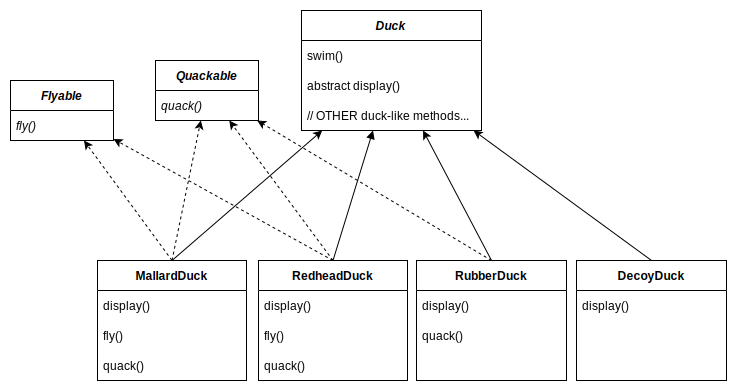

# Notes of Head First Design Patterns (2nd Edition)

## 1. Welcome To Design Patterns

> Someone has already solved your problems.

### Strategy Pattern (SimUDuck App)

SimUDuck is a successful duck pond simulation game. The game can show a large variety of duck species swimming and making quacking sounds. The designers of the system used standard OO techniques and created one Duck superclass from which all other duck types inherit.

The executives decided that flying ducks is just what the simulator needs. The system designer thinks to add a fly() method in the Duck class and then all ducks will inherit it. But not all subclasses of Duck should fly.

He could always just override the fly() method in rubber duck, like he has with the quack() method. But then what happens when he adds wooden decoy ducks to the program? They aren't supposed to fly or quack.

He realized that inheritance probably wasn’t the answer, because he just got a memo that says that the executives now want to update the product every six months. Joe knows the spec will keep changing and he’ll be forced to look at and possibly override fly() and quack() for every new Duck subclass that’s ever added to the program, forever. So, he needs a cleaner way to have only some of the duck types fly or quack.

We know that not all of the subclasses should have flying or quacking behavior, so inheritance isn’t the right answer. But while having the subclasses implement Flyable and/or Quackable solves part of the problem, it completely destroys code reuse for those behaviors, so it just creates a different maintenance nightmare. Whenever you need to modify a behavior, you’re often forced to track down and change it in all the different subclasses where that behavior is defined, probably introducing new bugs along the way.

