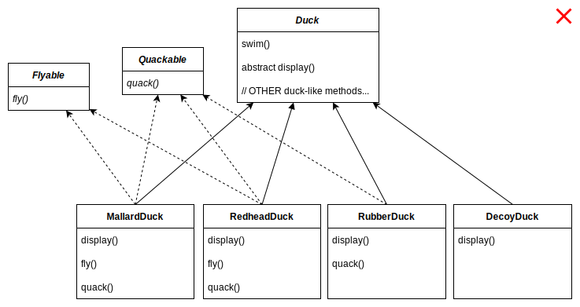
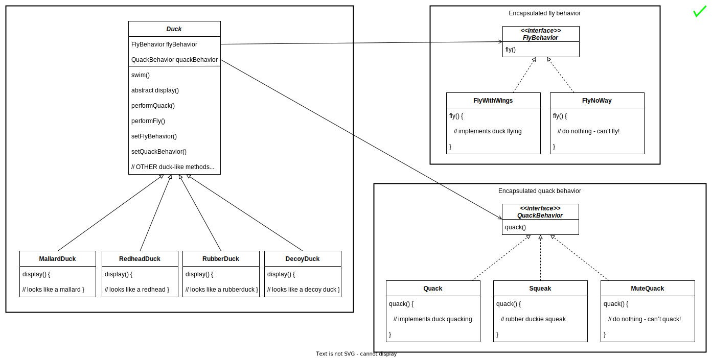
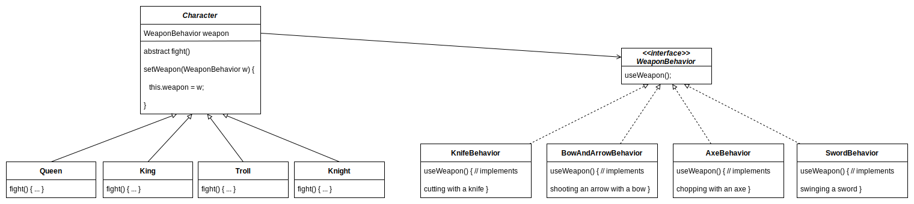

# Notes of Head First Design Patterns (2nd Edition)

## 1. Welcome To Design Patterns

> Someone has already solved your problems.

### Strategy Pattern (SimUDuck App)

SimUDuck is a duck pond game. The game can show a large variety of duck species swimming and making quacking sounds. The game has built with standard OO techniques and created one Duck superclass from which all other duck types inherit.


The executives decided that flying ducks is just what the simulator needs. The designer thinks to add a fly() method in the Duck class and then all ducks will inherit it. But not all subclasses of Duck should fly.

The designer could always just override the fly() method in rubber duck, like he has with the quack() method. But then what happens when he adds wooden decoy ducks to the program? They aren't supposed to fly or quack.

The designer realized that inheritance probably wasn’t the answer, because the executives now want to update the product every six months. The spec will be possibly override fly() and quack() for every new Duck subclass that’s ever added to the program, forever.





We know that not all of the subclasses should have flying or quacking behavior, so inheritance isn’t the right answer. But while having the subclasses implement Flyable and/or Quackable solves part of the problem, it completely destroys code reuse for those behaviors, so it just creates a different maintenance nightmare. Whenever you need to modify a behavior, you are often forced to track down and change it in all the different subclasses where that behavior is defined, probably introducing new bugs along the way.

> Identify the aspects of your application that vary and separate them from what stays the same.

fly() and quack() are the parts of the Duck class that vary across ducks. To separate these behaviors from the Duck class, we’ll pull both methods out of the Duck class and create a new set of classes to represent each behavior.

One of the secrets to creating maintainable OO systems is thinking about how they might change in the future.


#### Designing Behaviors

> Program to an interface, not an implementation.

The Duck behaviors will live in a separate class, a class that implements a particular behavior interface. That way, the Duck classes won’t need to know any of the implementation details for their own behaviors.

Here’s the key: A Duck will now delegate its flying and quacking behaviors, instead of using quacking and flying methods defined in the Duck class (or subclass).





````c#
public abstract class Duck {
    IFlyBehavior flyBehavior;
    IQuackBehavior quackBehavior;
    
    public Duck() {}
    
    public abstract void display();
    
    public void performFly() {
        flyBehavior.fly();
    }
    
    public void performQuack() {
        quackBehavior.quack();
    }
    
    public void swim() {
        System.out.println("All ducks float, even decoys!");
    }
    
    public void setFlyBehavior(FlyBehavior fb) {
        flyBehavior = fb;
    }
    
    public void setQuackBehavior(QuackBehavior qb) {
        quackBehavior = qb;
    }
}

///////////////////////////////////////
public interface IFlyBehavior {
    public void fly();
}

public class FlyWithWings : IFlyBehavior {
    public void fly() {
        System.out.println("I'm flying!!");
    }
}

public class FlyNoWay : IFlyBehavior {
    public void fly() {
        System.out.println("I can't fly");
    }
}

public class FlyRocketPowered : IFlyBehavior {
    public void fly() {
        System.out.println("I'm flying with a rocket!");
    }
}

///////////////////////////////////////
public interface IQuackBehavior {
    public void quack();
}

public class Quack : IQuackBehavior {
    public void quack() {
        System.out.println("Quack");
    }
}

public class MuteQuack : IQuackBehavior {
    public void quack() {
        System.out.println("<< Silence >>");
    }
}

public class Squeak : IQuackBehavior {
    public void quack() {
        System.out.println("Squeak");
    }
}

///////////////////////////////////////
public class MallardDuck : Duck {
    public MallardDuck() {
        quackBehavior = new Quack();
        flyBehavior = new FlyWithWings();
    }
    
    public void display() {
        System.out.println("I'm a real Mallard duck");
    }
}

public class ModelDuck : Duck {
    public ModelDuck() {
        flyBehavior = new FlyNoWay();
        quackBehavior = new Quack();
    }
    public void display() {
        System.out.println("I'm a model duck");
    }
}

///////////////////////////////////////
public class MiniDuckSimulator {
    public static void main(String[] args) {
        Duck mallard = new MallardDuck();
        mallard.performQuack();
        mallard.performFly();
        Duck model = new ModelDuck();
        model.performFly();
        model.setFlyBehavior(new FlyRocketPowered());
        model.performFly();
    }
}
````


When you put two classes together like this you’re using composition. Instead of inheriting their behavior, the ducks get their behavior by being composed with the right behavior object.

> Favor composition over inheritance.


* Knowing the OO basics does not make you a good OO designer.
* Good OO designs are reusable, extensible, and maintainable.
* Patterns show you how to build systems with good OO design qualities.
* Patterns are proven object-oriented experience.
* Patterns don’t give you code, they give you general solutions to design problems. You apply them to your specific application.
* Patterns aren’t invented, they are discovered.
* Most patterns and principles address issues of change in software.
* Most patterns allow some part of a system to vary independently of all other parts.
* We often try to take what varies in a system and encapsulate it.
* Patterns provide a shared language that can maximize the value of your communication with other developers.


OO Basic

* Abstraction

  * Data abstraction is the process of hiding certain details and showing only essential information to the user. Abstraction can be achieved with either abstract classes or interfaces.

    ````c#
    // Abstract class
    abstract class Animal
    {
      // Abstract method (does not have a body)
      public abstract void animalSound();
      // Regular method
      public void sleep()
      {
        Console.WriteLine("Zzz");
      }
    }
    
    // Derived class (inherit from Animal)
    class Cat : Animal
    {
      public override void animalSound()
      {
        // The body of animalSound() is provided here
        Console.WriteLine("The cat says: meow meow");
      }
    }

* Encapsulation

  * Encapsulation is the concept of wrapping data into a single unit. It collects data members and member functions into a single unit called class. The purpose of encapsulation is to prevent alteration of data from outside. This data can only be accessed by getter functions of the class.

    A fully encapsulated class has getter and setter functions that are used to read and write data. This class does not allow data access directly.

    ````c#
    namespace AccessSpecifiers
    {
        class Student
        {
            public string Id { get; set; }
            public string Name { get; set; }
            public string Email { get; set; }  
        }
    }

* Polymorphism

  * Polymorphism means "many forms", and it occurs when we have many classes that are related to each other by inheritance.

    ````c#
    class Animal  // Base class (parent)
    {
      public virtual void animalSound()
      {
        Console.WriteLine("The animal makes a sound");
      }
    }
    
    class Cat : Animal  // Derived class (child)
    {
      public override void animalSound()
      {
        Console.WriteLine("The cat says: meow meow");
      }
    }
    
    class Dog : Animal  // Derived class (child)
    {
      public override void animalSound()
      {
        Console.WriteLine("The dog says: bow wow");
      }
    }

* Inheritance

  * Inherit fields and methods from one class to another. The "inheritance concept" into two categories:

    * Derived Class (child) - the class that inherits from another class
    * Base Class (parent) - the class being inherited from

    ````c#
    class Vehicle  // base class (parent)
    {
      public string brand = "Ford";  // Vehicle field
      public void honk()             // Vehicle method
      {
        Console.WriteLine("Tuut, tuut!");
      }
    }
    
    class Car : Vehicle  // derived class (child)
    {
      public string modelName = "Mustang";  // Car field
    }

OO Principle

* Encapsulate what varies.
* Favor composition over inheritance.
* Program to interfaces, not implementations.

OO Patterns

* Strategy - defines a family of algorithms, encapsulates each one, and makes them interchangeable. Strategy lets the algorithm vary independently from clients that use it.


#### Exercises

There are classes for game characters along with classes for weapon behaviors the characters can use in the game. Each character can make use of one weapon at a time, but can change weapons at any time during the game.





### Observer Pattern (Weather Monitoring App)
