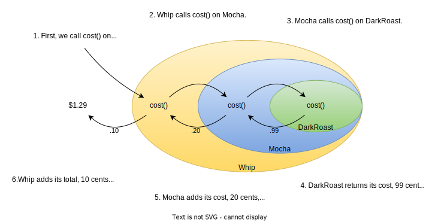
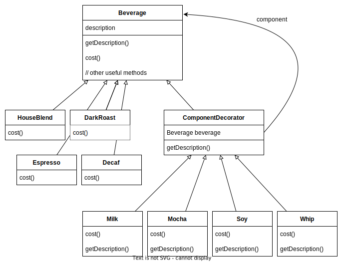
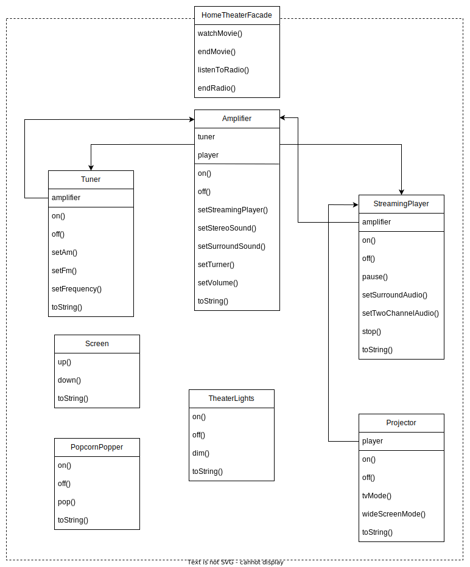
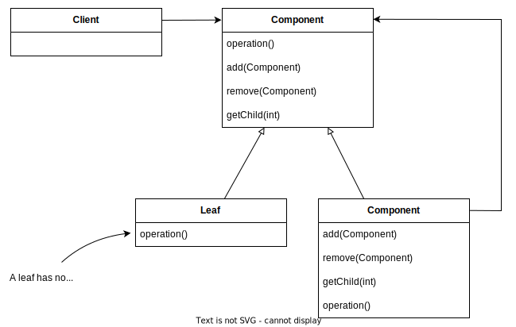

# Notes of Head First Design Patterns (2nd Edition)

> Someone has already solved your problems.

## Strategy Pattern (SimUDuck App)

SimUDuck is a duck pond game. The game can show a large variety of duck species swimming and making quacking sounds. The game has built with standard OO techniques and created one Duck superclass from which all other duck types inherit.


The executives decided that flying ducks is just what the simulator needs. The designer thinks to add a fly() method in the Duck class and then all ducks will inherit it. But not all subclasses of Duck should fly.

The designer could always just override the fly() method in rubber duck, like he has with the quack() method. But then what happens when he adds wooden decoy ducks to the program? They aren't supposed to fly or quack.

The designer realized that inheritance probably wasn’t the answer, because the executives now want to update the product every six months. The spec will be possibly override fly() and quack() for every new Duck subclass that’s ever added to the program, forever.


We know that not all of the subclasses should have flying or quacking behavior, so inheritance isn’t the right answer. But while having the subclasses implement Flyable and/or Quackable solves part of the problem, it completely destroys code reuse for those behaviors, so it just creates a different maintenance nightmare. Whenever you need to modify a behavior, you are often forced to track down and change it in all the different subclasses where that behavior is defined, probably introducing new bugs along the way.

> Identify the aspects of your application that vary and separate them from what stays the same.

fly() and quack() are the parts of the Duck class that vary across ducks. To separate these behaviors from the Duck class, we’ll pull both methods out of the Duck class and create a new set of classes to represent each behavior.

One of the secrets to creating maintainable OO systems is thinking about how they might change in the future.


### Designing Behaviors

> Program to an interface, not an implementation.

The Duck behaviors will live in a separate class, a class that implements a particular behavior interface. That way, the Duck classes won’t need to know any of the implementation details for their own behaviors.

Here’s the key: A Duck will now delegate its flying and quacking behaviors, instead of using quacking and flying methods defined in the Duck class (or subclass).


````c#
public abstract class Duck
{
    IFlyBehavior flyBehavior;
    IQuackBehavior quackBehavior;
    
    public Duck() {}
    
    public abstract void Display();
    
    public void PerformFly()
    {
        flyBehavior.Fly();
    }
    
    public void PerformQuack()
    {
        quackBehavior.Quack();
    }
    
    public void Swim()
    {
        Console.WriteLine("All ducks float, even decoys!");
    }
    
    public void SetFlyBehavior(IFlyBehavior fb)
    {
        flyBehavior = fb;
    }
    
    public void SetQuackBehavior(IQuackBehavior qb)
    {
        quackBehavior = qb;
    }
}
````

````c#
public interface IFlyBehavior
{
    void Fly();
}

public class FlyWithWings : IFlyBehavior
{
    public void Fly()
    {
        Console.WriteLine("I'm flying!!");
    }
}

public class FlyNoWay : IFlyBehavior
{
    public void Fly()
    {
        Console.WriteLine("I can't fly");
    }
}

public class FlyRocketPowered : IFlyBehavior
{
    public void Fly()
    {
        Console.WriteLine("I'm flying with a rocket!");
    }
}
````

````c#
public interface IQuackBehavior
{
    void Quack();
}

public class Quack : IQuackBehavior
{
    public void Quack()
    {
        Console.WriteLine("Quack");
    }
}

public class MuteQuack : IQuackBehavior
{
    public void Quack()
    {
        Console.WriteLine("<< Silence >>");
    }
}

public class Squeak : IQuackBehavior
{
    public void Quack()
    {
        Console.WriteLine("Squeak");
    }
}
````

````c#
public class MallardDuck : Duck
{
    public MallardDuck()
    {
        quackBehavior = new Quack();
        flyBehavior = new FlyWithWings();
    }
    
    public void Display()
    {
        Console.WriteLine("I'm a real Mallard duck");
    }
}

public class ModelDuck : Duck
{
    public ModelDuck()
    {
        flyBehavior = new FlyNoWay();
        quackBehavior = new Quack();
    }
    
    public void Display()
    {
        Console.WriteLine("I'm a model duck");
    }
}
````

````c#
public class MiniDuckSimulator
{
    static void Main(string[] args)
    {
        Duck mallard = new MallardDuck();
        mallard.PerformQuack();
        mallard.PerformFly();

        Duck model = new ModelDuck();
        model.PerformFly();
        model.SetFlyBehavior(new FlyRocketPowered());
        model.PerformFly();
    }
}
````


When you put two classes together like this you’re using composition. Instead of inheriting their behavior, the ducks get their behavior by being composed with the right behavior object.

> Favor composition over inheritance.


* Knowing the OO basics does not make you a good OO designer.
* Good OO designs are reusable, extensible, and maintainable.
* Patterns show you how to build systems with good OO design qualities.
* Patterns are proven object-oriented experience.
* Patterns don’t give you code, they give you general solutions to design problems. You apply them to your specific application.
* Patterns aren’t invented, they are discovered.
* Most patterns and principles address issues of change in software.
* Most patterns allow some part of a system to vary independently of all other parts.
* We often try to take what varies in a system and encapsulate it.
* Patterns provide a shared language that can maximize the value of your communication with other developers.


OO Basic

* Abstraction

  Data abstraction is the process of hiding certain details and showing only essential information to the user. Abstraction can be achieved with either abstract classes or interfaces.

  ````c#
  // Abstract class
  abstract class Animal
  {
      // Abstract method (does not have a body)
      public abstract void AnimalSound();
      // Regular method
      public void Sleep()
      {
          Console.WriteLine("Zzz");
      }
  }
  
  // Derived class (inherit from Animal)
  class Cat : Animal
  {
      public override void AnimalSound()
      {
          // The body of animalSound() is provided here
          Console.WriteLine("The cat says: meow meow");
      }
  }
  ````

* Encapsulation

  Encapsulation is the concept of wrapping data into a single unit. It collects data members and member functions into a single unit called class. The purpose of encapsulation is to prevent alteration of data from outside. This data can only be accessed by getter functions of the class.

  A fully encapsulated class has getter and setter functions that are used to read and write data. This class does not allow data access directly.

  ````c#
  namespace AccessSpecifiers
  {
      class Student
      {
          public string Id { get; set; }
          public string Name { get; set; }
          public string Email { get; set; }  
      }
  }
  ````

* Polymorphism

  Polymorphism means "many forms", and it occurs when we have many classes that are related to each other by inheritance.

  ````c#
  class Animal  // Base class (parent)
  {
      public virtual void AnimalSound()
      {
          Console.WriteLine("The animal makes a sound");
      }
  }
  
  class Cat : Animal  // Derived class (child)
  {
      public override void AnimalSound()
      {
          Console.WriteLine("The cat says: meow meow");
      }
  }
  
  class Dog : Animal  // Derived class (child)
  {
      public override void AnimalSound()
      {
          Console.WriteLine("The dog says: bow wow");
      }
  }
  ````

* Inheritance

  Inherit fields and methods from one class to another. The "inheritance concept" into two categories:

  * Derived Class (child) - the class that inherits from another class
  * Base Class (parent) - the class being inherited from

  ````c#
  class Vehicle  // base class (parent)
  {
      public string brand = "Ford";  // Vehicle field
      public void Honk()             // Vehicle method
      {
          Console.WriteLine("Tuut, tuut!");
      }
  }
  
  class Car : Vehicle  // derived class (child)
  {
      public string modelName = "Mustang";  // Car field
  }
  ````

OO Principle

* Encapsulate what varies.
* Favor composition over inheritance.
* Program to interfaces, not implementations.

OO Patterns

* Strategy - defines a family of algorithms, encapsulates each one, and makes them interchangeable. Strategy lets the algorithm vary independently from clients that use it.


### Exercises

There are classes for game characters along with classes for weapon behaviors the characters can use in the game. Each character can make use of one weapon at a time, but can change weapons at any time during the game.


## Observer Pattern (Weather Monitoring App)

The system has three components: the weather station (the physical device that acquires the actual weather data), the WeatherData object (that tracks the data coming from the Weather Station and updates the displays), and the display that shows users the current weather conditions.


Misguided implementation of the Weather Station:

````c#
public class WeatherData
{
    // instance variable declarations
    public void MeasurementsChanged()
    {
        float temp = GetTemperature();
        float humidity = GetHumidity();
        float pressure = GetPressure();
        
        currentConditionsDisplay.Update(temp, humidity, pressure);
        statisticsDisplay.Update(temp, humidity, pressure);
        forecastDisplay.Update(temp, humidity, pressure);
    }
    
    // other WeatherData methods here
}
````


### Observer Pattern

1. A newspaper publisher begins publishing newspapers.
2. You subscribe to a particular publisher, and every time there’s a new edition it gets delivered to you.
3. You unsubscribe when you don’t want newspapers anymore, and they stop being delivered.
4. People, hotels, airlines, and other businesses constantly subscribe and unsubscribe to the newspaper.

The Observer Pattern defines a one-to-many dependency between objects so that when one object changes state, all of its dependents are notified and updated automatically.


#### Loose Coupling

> Strive for loosely coupled designs between objects that interact.

Loosely coupled designs allow us to build flexible systems because they minimize the interdependency between objects.


### Designing the Weather Station


````c#
public interface ISubject
{
    void RegisterObserver(Observer o);
    void RemoveObserver(Observer o);
    void NotifyObservers();
}

public interface IObserver
{
    void Update(float temperature, float humidity, float pressure);
}

public interface IDisplayElement
{
    void Display();
}
````

````c#
public class WeatherData : ISubject
{
    private List<Observer> observers;
    private float temperature;
    private float humidity;
    private float pressure;
    
    public WeatherData()
    {
        observers = new List<Observer>();
    }
    
    public void RegisterObserver(Observer o)
    {
        observers.Add(o);
    }
    
    public void RemoveObserver(Observer o)
    {
        observer.Remove(o);
    }
    
    public void NotifyObservers()
    {
        foreach(Observer observer in observers)
        {
            observer.Update(temp, humidity, pressure);
        }
    }
    
    public void MeasurementsChanged()
    {
        NotifyObservers();
    }
    
    public void SetMeasurements(float temperature, float humidity, float pressure)
    {
        this.temperature = temperature;
        this.humidity = humidity;
        this.pressure = pressure;
        MeasurementsChanged();
    }
    
    // other WeatherData methods here
}
````

````c#
public class CurrentConditionsDisplay : IObserver, IDisplayElement
{
    private float temperature;
    private float humadity;
    private WeatherData weatherData;
    
    public CurrentConditionsDisplay(WeatherData weatherData)
    {
        this.weatherData = weatherData;
        weatherData.RegisterObserver(this);
    }
    
    public void Update(float temperature, float humidity, float pressure)
    {
        this.temperature = temperature;
        this.humidity = humidity;
        Display();
    }
    
    public void Display()
    {
        Console.WriteLine("Current conditions: " + temperature + "C degrees and " + humidity + "% humidity");
    }
}
````

````c#
public class WeatherStation
{
    static void Main(string[] args)
    {
        WeatherData weatherData = new WeatherData();
        
        CurrentConditionsDisplay currentDisplay = new CurrentConditionsDisplay(weatherData);
        StatisticsDisplay statisticsDisplay = new StatisticsDisplay(weatherData);
        ForecastDisplay forecastDisplay = new ForecastDisplay(weatherData);
        
        weatherData.setMeasurements(80, 65, 30.4f);
        weatherData.setMeasurements(82, 70, 29.2f);
        weatherData.setMeasurements(78, 90, 29.2f);
    }
}
````


* The Observer Pattern defines a one-to-many relationship between objects.
* Subjects update Observers using a common interface.
* Observers of any concrete type can participate in the pattern as long as they implement the Observer interface.
* Observers are loosely coupled in that the Subject knows nothing about them, other than that they implement the Observer interface.
* You can push or pull data from the Subject when using the pattern (pull is considered more "correct").
* The Observer Pattern is related to the Publish/Subscribe Pattern, which is for more complex situations with multiple Subjects and/or multiple message types.


OO Principles

* Strive for loosely coupled designs between objects that interact.

OO Patterns

* Observer - defines a one-to-many dependency between objects so that when one object changes state, all its dependents are notified and updated automatically.


## Decorator Pattern (Coffee Shop)

The coffee shop has grown so quickly, they are scrambling to update their ordering systems to match their beverage offerings.

When they first went into business they designed their classes like this...

In addition to coffee, you can also ask for several condiments like steamed milk, soy, and mocha, and have it all topped off with whipped
milk. The coffee shop charges for each condiment.


First improvement is below. What requirements or other factors might change that will impact this design?

- Price changes for condiments will force us to alter existing code.
- New condiments will force us to add new methods and alter the cost method in the superclass.
- We may have new beverages. For some of these beverages (iced tea?), the condiments may not be appropriate, yet the Tea subclass will still inherit methods like hasWhip().
- What if a customer wants a double mocha?


### Open-Closed Principle

> Classes should be open for extension, but closed for modification.

* Come on in; we’re *open*. Feel free to extend our classes with any new behavior you like. If your needs or requirements change, just go ahead and make your own extensions.
* Sorry, we’re *closed*. We spent a lot of time getting this code correct and bug free, so we can’t let you alter the existing code. It must remain closed to modification. If you don’t like it, you can speak to the manager.

Allow classes to be easily extended to incorporate new behavior without modifying existing code.


### Decorator Pattern

We have seen that representing beverage and condiments with inheritance has not worked out very well. We get class explosions and rigid designs, or we add functionality to the base class that isn’t appropriate for some of the subclasses.

We will start with a beverage and decorate it with the condiments at runtime. For example, if the customer wants a Dark Roast with Mocha and Whip, then we will:

1. Start with a DarkRoast object.
2. Decorate it with a Mocha object.
3. Decorate it with a Whip object.
4. Call the cost() method and rely on delegation to add up the condiment costs.

Think of decorator objects as *wrappers*.





* Decorators have the same supertype as the objects they decorate.
* You can use one or more decorators to wrap an object.
* Given that the decorator has the same supertype as the object it decorates, we can pass around a decorated object in place of the original (wrapped) object.
* The decorator adds its own behavior before and/or after delegating to the object it decorates to do the rest of the job.
* Objects can be decorated at any time, so we can decorate objects dynamically at runtime with as many decorators as we like.

Decorator Pattern attaches additional responsibilities to an object dynamically. Decorators provide a flexible alternative to subclassing for extending functionality.


### Designing Beverages





````c#
public abstract class Beverage
{
    private protected string description = "Unknown Beverage";
    
    public virtual string GetDescription()
    {
        return description;
    }
    
    public abstract decimal Cost();
}

public abstract class CondimentDecorator : Beverage
{
    private protected Beverage beverage;
    
    public abstract override string GetDescription();
}
````

````C#
public class Espresso : Beverage
{
    public Espresso()
    {
        description = "Espresso";
    }
    
    public override decimal Cost()
    {
        return 1.99M;
    }
}

public class HouseBlend : Beverage
{
    public HouseBlend()
    {
        description = "House Blend Coffee";
    }
    
    public override decimal Cost()
    {
        return .89M;
    }
}
````

````c#
public class Mocha : CondimentDecorator
{
    public Mocha(Beverage beverage)
    {
        this.beverage = beverage;
    }
    
    public override string GetDescription()
    {
        return beverage.GetDescription() + ", Mocha";
    }
    
    public override decimal Cost()
    {
        return beverage.Cost() + .20M;
    }
}

public class Whip : CondimentDecorator
{
    public Mocha(Beverage beverage)
    {
        this.beverage = beverage;
    }
    
    public override string GetDescription()
    {
        return beverage.GetDescription() + ", Whip";
    }
    
    public override decimal Cost()
    {
        return beverage.Cost() + .10M;
    }
}
````

````c#
public class CoffeeShop
{
    static void Main(string[] args)
    {
        Beverage beverage = new Espresso();
        beverage = new Mocha(beverage);
        beverage = new Mocha(beverage);
        beverage = new Whip(beverage);
        
        Console.Write($"{beverage.GetDescription()} ${beverage.Cost()}"); // Espresso, Mocha, Mocha, Whip $2,49
    }
}
````


* Inheritance is one form of extension, but not necessarily the best way to achieve flexibility in our designs.
* In our designs we should allow behavior to be extended without
  the need to modify existing code.
* Composition and delegation can often be used to add new
  behaviors at runtime.
* The Decorator Pattern provides an alternative to subclassing for
  extending behavior.
* The Decorator Pattern involves a set of decorator classes that are used to wrap concrete components.
* Decorator classes mirror the type of the components they decorate.
* Decorators change the behavior of their components by adding new functionality before and/or after (or even in place of) method calls to the component.
* You can wrap a component with any number of decorators.
* Decorators are typically transparent to the client of the component, unless the client is relying on the component’s concrete type.
* Decorators can result in many small objects in our design, and overuse can be complex.


OO Principles

* Classes should be open for extension but closed for modification.

OO Patterns

* Decorator - Attach additional responsibilities to an object dynamically. Decorators provide a flexible alternative to subclassing for extending functionality.


## Factory Pattern (Pizza Store)

By coding to an interface, you know you can insulate yourself from many of the changes that might happen to a system down the road. If your code is written to an interface, then it will work with any new classes implementing that interface through polymorphism. However, when you have code that makes use of lots of concrete classes, you’re looking for trouble because that code may have to be changed as new concrete classes are added. So your code will not be “closed for modification.” To extend your code with new concrete types, you’ll have to reopen it.

So what can you do? Our first principle deals with change and guides us to identify the aspects that vary and separate them from what stays the same.


````c#
private Pizza OrderPizza(string type)
{
    Pizza pizza;
    
    // As the pizza selection changes over time, you’ll have to modify this code over and over.
    if (type == "cheese")
    {
        pizza = new CheesePizza();
    }
    else if (type == "italian")
    {
        pizza = new ItalianPizza();
    }
    else if (type == "clam")
    {
        pizza = new ClamPizza();
    }
    else if (type == "veggie")
    {
        pizza = new VeggiePizza();
    }
    
    // This is what we expect to stay the same.
    // For the most part, preparing, cooking, and packaging a pizza has remained the same for years and years.
    // So, we don’t expect this code to change, just the pizzas it operates on.
    pizza.Prepare();
    pizza.Bake();
    pizza.Cut();
    pizza.Box();

    return pizza;
}
````

````c#
public class SimpleStaticPizzaFactory
{
    // Defining a simple factory as a static method is a common technique and is often called a static factory.
    // Why use a static method? Because you don’t need to instantiate an object to make use of the create method.
    // But it also has the disadvantage that you can’t subclass and change the behavior of the create method.
    public static Pizza CreatePizza(string type)
    {
        Pizza pizza = null;
        
        if (type == "cheese")
        {
            pizza = new CheesePizza();
        }
        else if (type == "italian")
        {
            pizza = new ItalianPizza();
        }
        else if (type == "clam")
        {
            pizza = new ClamPizza();
        }
        else if (type == "veggie")
        {
            pizza = new VeggiePizza();
        }

        return pizza;
    }
}
````

````c#
public class PizzaStore
{
    private readonly SimplePizzaFactory _factory;
    
    public PizzaStore(SimplePizzaFactory factory)
    {
        _factory = factory;
    }
    
    public Pizza OrderPizza(string type)
    {
        Pizza pizza = _factory.CreatePizza(type);
    
        pizza.Prepare();
        pizza.Bake();
        pizza.Cut();
        pizza.Box();
        
        return pizza;
    }
}
````


### Franchising The Pizza Store

Each franchise might want to offer different styles of pizzas (New York, Chicago, California, etc.), depending on where the franchise store is located.

Starting to employ their own home-grown procedures for the rest of the process: they’d bake things a little differently, they’d forget to cut the pizza, and they’d use third-party boxes.
You see that what you’d really like to do is create a framework that ties the store and the pizza creation together, yet still allows things to remain flexible.


````c#
public abstract class Pizza
{
    public string Name;
    public string Dough;
    public string Sauce;
    public List<string> Toppings = new();

    public void Prepare()
    {
        Console.WriteLine("Preparing " + Name);
        Console.WriteLine("Tossing dough...");
        Console.WriteLine("Adding sauce...");
        Console.WriteLine("Adding toppings:");
        foreach(string topping in Toppings)
        {
            Console.WriteLine("	" + topping);
        }
    }

    public virtual void Bake()
    {
        Console.WriteLine("Bake for 25 minutes at 350.");
    }

    public virtual void Cut()
    {
        Console.WriteLine("Cutting the pizza into diagonal slices.");
    }

    public virtual void Box()
    {
        Console.WriteLine("Place pizza in official PizzaStore box.");
    }

    public string GetName()
    {
        return Name;
    }
}

public class NYStyleCheesePizza : Pizza
{
    public NYStyleCheesePizza()
    {
        Name = "NY Style Sauce and Cheese Pizza";
        Dough = "Thin Crust Dough";
        Sauce = "Marinara Sauce";
        
        Toppings.Add("Grated Reggiano Cheese");
    }
}

public class ChicagoStyleCheesePizza : Pizza
{
    public ChicagoStyleCheesePizza()
    {
        Name = "Chicago Style Deep Dish Cheese Pizza";
        Dough = "Extra Thick Crust Dough";
        Sauce = "Plum Tomato Sauce";
        
        Toppings.Add("Shredded Mozzarella Cheese");
    }
    
    public override void Cut()
    {
        Console.WriteLine("Cutting the pizza into square slices.");
    }
}
````

````c#
public abstract class PizzaStore
{
    public Pizza OrderPizza(string type)
    {
        Pizza pizza = CreatePizza(type);
        
        pizza.Prepare();
        pizza.Bake();
        pizza.Cut();
        pizza.Box();
        
        return pizza;
    }
    
    protected abstract Pizza CreatePizza(string type);
}

public class NYPizzaStore : PizzaStore
{
    protected override Pizza CreatePizza(string type)
    {
        if (type == "cheese")
        {
            return new NYStyleCheesePizza();
        }
        else if (type == "veggie")
        {
            return new NYStyleVeggiePizza();
        }
        else if (type == "clam")
        {
            return new NYStyleClamPizza();
        }
        else
        {
            return null;
        }
    }
}
````

````c#
public class PizzaTest
{
    static void Main(string[] args)
    {
        PizzaStore nyStore = new NYPizzaStore();
        PizzaStore chicagoStore = new ChicagoStore();
        
        Pizza pizza = nyStore.OrderPizza("cheese");
        Console.WriteLine("Ethan ordered a " + pizza.GetName());
        
        Pizza pizza = chicagoStore.OrderPizza("cheese");
        Console.WriteLine("Joel ordered a " + pizza.GetName());
    }
}
````


#### Factory Method Pattern

The Factory Method Pattern defines an interface for creating an object, but lets subclasses decide which class to instantiate. Factory Method lets a class defer instantiation to subclasses.


The Factory Method Pattern gives us a way to encapsulate the instantiations of concrete types. Looking at the class diagram, you can see that the abstract Creator class gives you an interface with a method for creating objects, also known as the "factory method". Any other methods implemented in the abstract Creator are written to operate on products produced by the factory method. Only subclasses actually implement the factory method and create products.
You will often hear developers say, "the Factory Method pattern lets subclasses decide which class to instantiate". Because the Creator class is written without knowledge of the actual products that will be created, we say "decide" not because the pattern allows subclasses themselves to decide, because the decision actually comes down to which subclass is used to create the product.


### Dependency Inversion Principle

> Depend upon abstractions. Do not depend upon concrete classes.

The following guidelines can help you avoid OO designs that violate the Dependency Inversion Principle:

* No variable should hold a reference to a concrete class.
  * If you use new, you’ll be holding a reference to a concrete class. Use a factory to get around that!
* No class should derive from a concrete class.
  * If you derive from a concrete class, you’re depending on a concrete class. Derive from an abstraction, like an interface or an abstract class.
* No method should override an implemented method of any of its base classes.
  * If you override an implemented method, then your base class wasn’t really an abstraction to start with. Those methods implemented in the base class are meant to be shared by all your subclasses.

This is guideline you should strive for, rather than a rule you should follow all the time.

If you internalize these guidelines and have them in the back of your mind when you design, you’ll know when you are violating the principle and you’ll have a good reason for doing so. For instance, if you have a class that isn’t likely to change, and you know it, then it’s not the end of the world if you instantiate a concrete class in your code.


#### Back At The Pizza Store...


Now we’re going to build a factory to create our ingredients; the factory will be responsible for creating each ingredient in the ingredient family. In other words, the factory will need to create dough, sauce, cheese, and so on...


````c#
// For each ingredient we define a create method in our interface.
public interface IPizzaIngredientFactory
{
    Dough CreateDough();
    Sauce CreateSauce();
    Cheese CreateCheese();
    Veggies[] CreateVeggies();
    Pepperoni CreatePepperoni();
    Clams CreateClam();
    // Lots of new classes here, one per ingredient.
}

public class NYPizzaIngredientFactory : IPizzaIngredientFactory
{
    public Dough CreateDough()
    {
        return new ThinCrustDough();
    }
    
    public Sauce CreateSauce()
    {
        return new MarinaraSauce();
    }
    
    public Cheese CreateCheese()
    {
        return new ReggianoCheese();
    }
    
    public Veggies[] CreateVeggies()
    {
        Veggies veggies[] = new {
            new Garlic(),
            new Onion(),
            new Mushroom(),
            new RedPepper()
        };
        return veggies;
    }
    
    public Pepperoni CreatePepperoni()
    {
        return new SlicedPepperoni();
    }
    
    public Clams CreateClam()
    {
        return new FreshClams();
    }
}
````

````c#
public abstract class Pizza
{
    public string name;
    public Dough dough;
    public Sauce sauce;
    public Veggies veggies[];
    public Cheese cheese;
    public Pepperoni pepperoni;
    public Clams clam;
    
    abstract void Prepare();
    
    void Bake()
    {
        Console.WriteLine("Bake for 20 minutes at 350");
    }
    
    void Cut()
    {
        Console.WriteLine("Cutting the pizza into diagonal slices");
    }
    
    void Box()
    {
        Console.WriteLine("Place pizza in official Pizza Store box");
    }
    
    void SetName(string name)
    {
        this.name = name;
    }
    
    string GetName()
    {
        return name;
    }
    
    public string ToString()
    {
        // code to print pizza here
    }
}

public class CheesePizza : Pizza
{
    private readonly IPizzaIngredientFactory _ingredientFactory;
    
    public CheesePizza(IPizzaIngredientFactory ingredientFactory)
    {
        _ingredientFactory = ingredientFactory;
    }

    void Prepare()
    {
        Console.WriteLine("Preparing " + name);
        dough = _ingredientFactory.CreateDough();
        sauce = _ingredientFactory.CreateSauce();
        cheese = _ingredientFactory.CreateCheese();
    }
}

public class ClamPizza : Pizza
{
    private readonly IPizzaIngredientFactory _ingredientFactory;
    
    public ClamPizza(IPizzaIngredientFactory ingredientFactory)
    {
        _ingredientFactory = ingredientFactory;
    }

    void Prepare()
    {
        Console.WriteLine("Preparing " + name);
        dough = _ingredientFactory.CreateDough();
        sauce = _ingredientFactory.CreateSauce();
        cheese = _ingredientFactory.CreateCheese();
        clam = _ingredientFactory.CreateClam();
    }
}
````

````c#
public class NYPizzaStore : PizzaStore
{
    protected Pizza CreatePizza(string item)
    {
        Pizza pizza = null;
        IPizzaIngredientFactory ingredientFactory = new NYPizzaIngredientFactory();

        if (item == "cheese")
        {
            pizza = new CheesePizza(ingredientFactory);
            pizza.SetName("New York Style Cheese Pizza");
        }
        else if (item == "veggie")
        {
            pizza = new VeggiePizza(ingredientFactory);
            pizza.SetName("New York Style Veggie Pizza");
        }
        else if (item == "clam")
        {
            pizza = new ClamPizza(ingredientFactory);
            pizza.SetName("New York Style Clam Pizza");
        }
        else if (item == "pepperoni")
        {
            pizza = new PepperoniPizza(ingredientFactory);
            pizza.SetName("New York Style Pepperoni Pizza");
        }

        return pizza;
    }
}
````


We provided a means of creating a family of ingredients for pizzas by introducing a new type of factory called an Abstract Factory.
An Abstract Factory gives us an interface for creating a family of products. By writing code that uses this interface, we decouple our code from the actual factory that creates the products. That allows us to implement a variety of factories that produce products meant for different contexts such as different regions, different operating systems, or different look and feels.
Because our code is decoupled from the actual products, we can substitute different factories to get different behaviors.


### Abstract Factory Pattern

The Abstract Factory Pattern provides an interface for creating families of related or dependent objects without specifying their concrete classes.

We’ve certainly seen that Abstract Factory allows a client to use an abstract interface to create a set of related products without knowing (or caring) about the concrete products that are actually produced. In this way, the client is decoupled from any of the specifics of the concrete products.


The job of an Abstract Factory is to define an interface for creating a set of products. Each method in that interface is responsible for creating a concrete product, and we implement a subclass of the Abstract Factory to supply those implementations. So, factory methods are a natural way to implement your product methods in your abstract factories.

**Factory Method:** I use classes to create. I create objects but I do it through inheritance.

I mean, the whole point of the Factory Method Pattern is that you’re using a subclass to do your creation for you. In that way, clients only need to know the abstract type they are using; the subclass worries about the concrete type. So, in other words, I keep clients decoupled from the concrete types.

Use me to decouple your client code from the concrete classes you need to instantiate, or if you don’t know ahead of time all the concrete classes you are going to need. To use me, just subclass me and implement my factory method!

**Abstract Factory:** I use objects to create. I create objects but I do it through object composition.

I provide an abstract type for creating a family of products. Subclasses of this type define how those products are produced. To use the factory, you instantiate one and pass it into some code that is written against the abstract type. So, like Factory Method, my clients are decoupled from the actual concrete products they use.

Use me whenever you have families of products you need to create and you want to make sure your clients create products that belong together.


* All factories encapsulate object creation.
* Simple Factory, while not a bona fide design pattern, is a simple way to decouple your clients from concrete classes.
* Factory Method relies on inheritance: object creation is delegated to subclasses, which implement the factory method to create objects.
* Abstract Factory relies on object composition: object creation is implemented in methods exposed in the factory interface.
* All factory patterns promote loose coupling by reducing the dependency of your application on concrete classes.
* The intent of Factory Method is to allow a class to defer instantiation to its subclasses.
* The intent of Abstract Factory is to create families of related objects without having to depend on their concrete classes.
* The Dependency Inversion Principle guides us to avoid dependencies on concrete types and to strive for abstractions.
* Factories are a powerful technique for coding to abstractions, not concrete classes.


OO Principles

* Depend on abstractions. Do not depend on concrete classes.

OO Patterns

* Factory Method - Defines an interface for creating an object, but let subclasses decide which class to instantiate. Factory Method lets a class defer instantiation to the subclasses.
* Abstract Factory - Provides an interface for creating families of related or dependent objects without specifying their concrete classes.


## Singleton Pattern (Chocolate Factory)

There are many objects we only need one of: thread pools, caches, dialog boxes, objects that handle preferences and registry settings, objects used for logging, and objects that act as device drivers to devices like printers and graphics cards. If you assign an object to a global variable, then that object might be created when your application begins. If this object is resource intensive and your application never ends up using it? The Singleton Pattern, we can create our objects only when they are needed.

````c#
public class Singleton
{
    private static Signleton uniqueInstance;
    
    private Singleton() {}
    
    public static Singleton GetInstance()
    {
        if(uniqueInstance == null)
        {
            uniqueInstance = new Singleton();
        }

        return uniqueInstance;
    }
    
    // other useful methods
}
````


The job of the boiler is to take in chocolate and milk, bring them to a boil, and then pass them on to the next phase of making chocolate bars. You will notice they’ve tried to be very careful to ensure that bad things don’t happen, like draining 500 gallons of unboiled mixture, or filling the boiler when it’s already full, or boiling an empty boiler!

````c#
// Thread safe singleton object
public class ChocolateBoiler
{
    private bool empty;
    private bool boiled;
    
    // eager creation
    private static readonly ChocolateBoiler uniqueInstance = new();

    private ChocolateBoiler()
    {
        empty = true;
        boiled = false;
    }
    
    public static ChocolateBoiler GetInstance()
    {
        return uniqueInstance;
    }

    public void Fill()
    {
        if (IsEmpty())
        {
            empty = false;
            boiled = false;
            // fill the boiler with a milk/chocolate mixture
        }
    }

    public void Drain()
    {
        if (!IsEmpty() && IsBoiled())
        {
            // drain the boiled milk and chocolate
            empty = true;
        }
    }
    
    public void Boil()
    {
        if (!IsEmpty() && !IsBoiled())
        {
            // bring the contents to a boil
            boiled = true;
        }
    }
    
    public bool IsEmpty()
    {
        return empty;
    }

    public bool IsBoiled()
    {
        return boiled;
    }
}
````

````c#
// Thread safe singleton object
public class ChocolateBoiler
{
    private bool empty;
    private bool boiled;
    
    // lazy creation
    private static volatile ChocolateBoiler uniqueInstance;
    private static object syncRoot = new Object();

    private ChocolateBoiler()
    {
        empty = true;
        boiled = false;
    }
    
    public static ChocolateBoiler GetInstance()
    {
        if (uniqueInstance == null)
        {
            lock (syncRoot)
            {
                if (uniqueInstance == null)
                {
                    uniqueInstance = new ChocolateBoiler();
                }
            }
        }
    }
    
    // other methods
}
````


### Singleton Pattern

The Singleton Pattern ensures a class has only one instance, and provides a global point of access to it.


* The Singleton Pattern ensures you have at most one instance of a class in your application.
* The Singleton Pattern also provides a global access point to that instance.
* Implementation of the Singleton Pattern makes use of a private constructor, a static method combined with a static variable.
* Examine your performance and resource constraints and carefully choose an appropriate Singleton implementation for multithreaded applications (and we should consider all applications multithreaded!).
* Beware of the doublechecked locking implementation.
* Be careful if you are using multiple class loaders; this could defeat the Singleton implementation and result in multiple instances.


OO Patterns

* Singleton - Ensure a class only has one instance and provide a global point of access to it.


## Command Pattern (Home Automation Remote Control)

The remote control features seven programmable slots (each can be assigned to a different household device) along with corresponding on/off buttons for each. The remote also has a global undo button.
It will control home automation devices such as lights, fans, hot tubs, audio equipment, and other similar controllable appliances. You should create an API for programming the remote so that each slot can be assigned to control a device or set of devices. It is important that -control all the current devices, and also any future devices that the vendors may supply.


Restaurant example:


````c#
public interface ICommand
{
    void Execute();
}

public class LightOnCommand : ICommand
{
    private readonly Light _light;
    
    public LightOnCommand(Light light)
    {
        _light = light;
    }
    
    public void Execute()
    {
        _light.On();
    }
}

public class GarageDoorOpenCommand : ICommand
{
    private readonly GarageDoor _garageDoor;
    
    public LightOnCommand(GarageDoor garageDoor)
    {
        _garageDoor = garageDoor;
    }
    
    public void Execute()
    {
        _garageDoor.Up();
    }
}

public class SimpleRemoteControl
{
    private ICommand slot;
    
    public SimpleRemoteControl() { }
    
    public void SetCommand(ICommand command)
    {
        slot = command;
    }
    
    public void ButtonWasPressed()
    {
        slot.Execute();
    }
}
````

````c#
public class RemoteControlTest
{
    static void Main(string[] args)
    {
        SimpleRemoteControl remote = new();
        
        Light light = new();
        LightOnCommand lightOn = new();
        
        remote.SetCommand(lightOn);
        remote.ButtonWasPressed();
        
        GarageDoor garageDoor = new();
        GarageDoorOpenCommand garageOpen = new();

        remote.SetCommand(garageOpen);
        remote.ButtonWasPressed();
    }
}
````


### Command Pattern

The Command Pattern encapsulates a request as an object, thereby letting you parameterize other objects with different requests, queue or log requests, and support undoable operations.


We know that a command object encapsulates a request by binding together a set of actions on a specific receiver. To achieve this, it packages the actions and the receiver into an object that exposes just one method, execute(). When called, execute() causes the actions to be invoked on the receiver. From the outside, no other objects really know what actions get performed on what receiver; they just know that if they call the execute() method, their request will be serviced. We’ve also seen a couple examples of parameterizing an object with a command.

We haven’t encountered yet is using commands to implement queues and logs and support undo operations. The Meta Command Pattern allows you to create macros of commands so that you can execute multiple commands at once.


### Assigning Commands to Slots

#### Macro Command

````c#
public interface ICommand {
    void Execute();
    void Undo();
}

public class RemoteControl
{
    private readonly ICommand[] _onCommands;
    private readonly ICommand[] _offCommands;
    private ICommand _undoCommand;
    
    public RemoteControl()
    {
        _onCommands = new ICommand[7];
        _offCommands = new ICommand[7];

        // Null Object
        ICommand noCommand = new NoCommand();
        for (int i = 0; i < 7; i++)
        {
            _onCommands[i] = noCommand;
            _offCommands[i] = noCommand;
        }

        _undoCommand = noCommand;
    }
    
    public void SetCommand(int slot, ICommand onCommand, ICommand offCommand)
    {
        _onCommands[slot] = onCommand;
        _offCommands[slot] = offCommand;
    }
    
    public void OnButtonWasPushed(int slot)
    {
        _onCommands[slot].Execute();
        _undoCommand = _onCommands[slot];
    }
    
    public void OffButtonWasPushed(int slot)
    {
        _offCommands[slot].Execute();
        _undoCommand = _offCommands[slot];
    }
    
    public void UndoButtonWasPushed()
    {
        _undoCommand.Undo();
    }
    
    public override string ToString()
    {
        StringBuilder stringBuilder = new();
        stringBuilder.Append("\n------ Remote Control ------\n");

        for(int i = 0; i < _onCommands.Length ; i++)
        {
            stringBuilder.Append($"[slot {i}] {_onCommands[i].GetType().Name}    {_offCommands[i].GetType().Name}\n");
        }
        
        stringBuilder.Append($"[undo] {_undoCommand.GetType().Name}\n");
        
        return stringBuilder.ToString();
    }
}
````

````c#
public class LightOnCommand : ICommand
{
    private readonly Light _light;
    
    public LightOffCommand(Light light)
    {
        _light = light;
    }
    
    public void Execute()
    {
        _light.On();
    }
    
    public void Undo()
    {
        _light.Off();
    }
}

public class LightOffCommand : ICommand
{
    private readonly Light _light;
    
    public LightOffCommand(Light light)
    {
        _light = light;
    }
    
    public void Execute()
    {
        _light.Off();
    }
    
    public void Undo()
    {
        _light.On();
    }
}

public class StereoOnWithCdCommand : ICommand
{
    private readonly Stereo _stereo;
    
    public LightOffCommand(Stereo stereo)
    {
        _stereo = stereo;
    }
    
    public void Execute()
    {
        _stereo.On();
        _stereo.SetCd();
        _stereo.SetVolume(11);
    }
    
    public void Undo()
    {
        _stereo.Off();
    }
}

public class MacroCommand : ICommand
{
    private readonly ICommand[] _commands;
    
    public MacroCommand(ICommand[] commands)
    {
        _commands = commands;
    }
    
    public void Execute()
    {
        for (int i = 0; i < _commands.Length; i++)
        {
            _commands[i].Execute();
        }
    }
    
    public void Undo()
    {
        for (int i = _commands.Length - 1; i >= 0; i--)
        {
            _commands[i].Undo();
        }
    }
}
````

````c#
public class CeilingFan
{
    public static final int HIGH = 3;
    public static final int MEDIUM = 2;
    public static final int LOW = 1;
    public static final int OFF = 0;

    private readonly string _location;
    private int _speed;
    
    public CeilingFan(string location)
    {
        _location = location;
        _speed = OFF;
    }
    
    public void High()
    {
        _speed = HIGH;
        // code to set fan to high
    }
    
    public void Medium()
    {
        _speed = MEDIUM;
        // code to set fan to medium
    }
    
    public void Low()
    {
        _speed = LOW;
        // code to set fan to low
    }
    
    public void Off()
    {
        _speed = OFF;
        // code to turn fan off
    }
    
    public int GetSpeed() => _speed;
}

public class CeilingFanHighCommand : ICommand
{
    private readonly CeilingFan _ceilingFan;
    private int _prevSpeed;
    
    public CeilingFanHighCommand(CeilingFan ceilingFan)
    {
        _ceilingFan = ceilingFan;
    }
    
    public void Execute()
    {
        _prevSpeed = ceilingFan.GetSpeed();
        _ceilingFan.High();
    }
    
    public void Undo()
    {
        switch(_prevSpeed)
        {
            case CeilingFan.HIGH:
                _ceilingFan.High();
                break;
            case CeilingFan.MEDIUM:
                _ceilingFan.Medium();
                break;
            case CeilingFan.LOW:
                _ceilingFan.Low();
                break;
            case CeilingFan.OFF:
                _ceilingFan.Off();
                break;
        }
    }
}

public class CeilingFanMediumCommand : ICommand
{
    private readonly CeilingFan _ceilingFan;
    private int _prevSpeed;
    
    public CeilingFanMediumCommand(CeilingFan ceilingFan)
    {
        _ceilingFan = ceilingFan;
    }
    
    public void Execute()
    {
        _prevSpeed = ceilingFan.GetSpeed();
        _ceilingFan.Medium();
    }
    
    public void Undo()
    {
        switch(_prevSpeed)
        {
            case CeilingFan.HIGH:
                _ceilingFan.High();
                break;
            case CeilingFan.MEDIUM:
                _ceilingFan.Medium();
                break;
            case CeilingFan.LOW:
                _ceilingFan.Low();
                break;
            case CeilingFan.OFF:
                _ceilingFan.Off();
                break;
        }
    }
}
````

````c#
public class RemoteLoader
{
    static void Main(string[] args)
    {
        RemoteControl remoteControl = new();

        Light livingRoomLight = new("Living Room");
        LightOnCommand livingRoomLightOn = new(livingRoomLight);
        LightOffCommand livingRoomLightOff = new(livingRoomLight);

        Light kitchenLight = new("Kitchen");
        LightOnCommand kitchenLightOn = new(kitchenLight);
        LightOffCommand kitchenLightOff = new(kitchenLight);

        CeilingFan ceilingFan = new("Living Room");
        CeilingFanOnCommand ceilingFanOn = new(ceilingFan);
        CeilingFanOffCommand ceilingFanOff = new(ceilingFan);

        GarageDoor garageDoor = new("Garage");
        GarageDoorUpCommand garageDoorUp = new(garageDoor);
        GarageDoorDownCommand garageDoorDown = new(garageDoor);

        Stereo stereo = new("Living Room");
        StereoOnWithCDCommand stereoOnWithCD = new(stereo);
        StereoOffCommand stereoOff = new(stereo);

        // Macro command
        Light light = new("Living Room");
        TV tv = new("Living Room");
        Stereo stereo = new("Living Room");
        Hottub hottub = new();
        LightOnCommand lightOn = new(light);
        StereoOnCommand stereoOn = new(stereo);
        TVOnCommand tvOn = new(tv);
        HottubOnCommand hottubOn = new(hottub);
        LightOffCommand lightOff = new(light);
        StereoOffCommand stereoOff = new(stereo);
        TVOffCommand tvOff = new(tv);
        HottubOffCommand hottubOff = new(hottub);
        ICommand[] partyOn = { lightOn, stereoOn, tvOn, hottubOn };
        ICommand[] partyOff = { lightOff, stereoOff, tvOff, hottubOff };
        MacroCommand partyOnMacro = new(partyOn);
        MacroCommand partyOffMacro = new(partyOff);

        remoteControl.SetCommand(0, livingRoomLightOn, livingRoomLightOff);
        remoteControl.SetCommand(1, kitchenLightOn, kitchenLightOff);
        remoteControl.SetCommand(2, ceilingFanOn, ceilingFanOff);
        remoteControl.SetCommand(3, stereoOnWithCD, stereoOff);
        remoteControl.SetCommand(4, partyOnMacro, partyOffMacro);

        Console.WriteLine(remoteControl);
        //------ Remote Control -------
        //[slot 0] LightOnCommand LightOffCommand
        //[slot 1] LightOnCommand LightOffCommand
        //[slot 2] CeilingFanOnCommand CeilingFanOffCommand
        //[slot 3] StereoOnWithCDCommand StereoOffCommand
        //[slot 4] MacroCommand MacroCommand
        //[slot 5] NoCommand NoCommand
        //[slot 6] NoCommand NoCommand
        //[undo] NoCommand

        remoteControl.OnButtonWasPushed(0);
        remoteControl.OffButtonWasPushed(0);
        remoteControl.OnButtonWasPushed(1);
        remoteControl.OffButtonWasPushed(1);
        remoteControl.OnButtonWasPushed(2);
        remoteControl.OffButtonWasPushed(2);
        remoteControl.OnButtonWasPushed(3);
        remoteControl.OffButtonWasPushed(3);
        remoteControl.UndoButtonWasPushed();
    }
}
````


#### Null Object

In the remote control, we didn’t want to check to see if a command was loaded every time we referenced a slot. For instance, in the OnButtonWasPushed() method, we would need code like this:

````c#
public void OnButtonWasPushed(int slot)
{
    if (_onCommands[slot] != null)
    {
        _onCommands[slot].Execute();
    }
}
````


Implement a command that does nothing!

````c#
public class NoCommand : ICommand
{
    public void Execute() { }
}
````

So, in the output of our test run, you’re seeing only slots that have been assigned to a command other than the default NoCommand object, which we assigned when we created the RemoteControl constructor.


#### Queuing Requests

Commands give us a way to package a piece of computation (a receiver and a set of actions) and pass it around as a first-class object. Now, the computation itself may be invoked long after some client application creates the command object. In fact, it may even be invoked by a different thread. We can take this scenario and apply it to many useful applications, such as schedulers, thread pools, and job queues, to name a few.

Imagine a job queue: you add commands to the queue on one end, and on the other end sits a group of threads. Threads run the following script: they remove a command from the queue, call its execute() method, wait for the call to finish, and then discard the command object and retrieve a new one.


The job queue classes are totally decoupled from the objects that are doing the computation. One minute a thread may be computing a financial computation, and the next it may be retrieving something from the network. The job queue objects don’t care; they just retrieve commands and call execute(). Likewise, as long as you put objects into the queue that implement the Command Pattern, your execute() method will be invoked when a thread is available.


#### Logging Requests

The semantics of some applications require that we log all actions and be able to recover after a crash by reinvoking those actions. The Command Pattern can support these semantics with the addition of two methods: store() and load().

As we execute commands, we store a history of them on disk. When a crash occurs, we reload the command objects and invoke their execute() methods in batch and in order.

This kind of logging wouldn’t make sense for a remote control; however, there are many applications that invoke actions on large data structures that can’t be quickly saved each time a change is made. By using logging, we can save all the operations since the last checkpoint, and if there is a system failure, apply those operations to our checkpoint. For example, a spreadsheet application: we might want to implement our failure recovery by logging the actions on the spreadsheet rather than writing a copy of the spreadsheet to disk every time a change occurs. In more advanced applications, these techniques can be extended to apply to sets of operations in a transactional manner so that all of the operations complete, or none of them do.


* The Command Pattern decouples an object making a request from the one that knows how to perform it.
* A Command object is at the center of this decoupling and encapsulates a receiver with an action (or set of actions).
* An invoker makes a request of a Command object by calling its execute() method, which invokes those actions on the receiver.
* Invokers can be parameterized with Commands, even dynamically at runtime.
* Commands may support undo by implementing an undo() method that restores the object to its previous state before the execute() method was last called.
* MacroCommands are a simple extension of the Command Pattern that allow multiple commands to be invoked. Likewise, MacroCommands can easily support undo().
* In practice, it’s not uncommon for “smart” Command objects to implement the request themselves rather than delegating to a receiver.
* Commands may also be used to implement logging and transactional systems.


OO Patterns

* Command - Encapsulates a request as an object, thereby letting you parameterize clients with different requests, queue or log requests, and support undoable operations.


## Adapter and Facade Patterns

### Adapter Pattern


The Adapter Pattern converts the interface of a class into another interface the clients expect. Adapter lets classes work together that couldn’t otherwise because of incompatible interfaces. This acts to decouple the client from the implemented interface, and if we expect the interface to change over time, the adapter encapsulates that change so that the client doesn’t have to be modified each time it needs to operate against a different interface.


### Facade Pattern (Theater)

Facade pattern hides all the complexity of one or more classes behind a clean.

You have assembled a system complete with a streaming player, a projection video system, an automated screen, surround sound, and even a popcorn popper. You have spent weeks running wire, mounting the projector, making all the connections, and fine tuning. Now it’s time to put it all in motion and enjoy a movie.


But there is just one thing to watch the movie, you need to perform a few tasks:

1. Turn on the popcorn popper
2. Start the popper popping
3. Dim the lights
4. Put the screen down
5. Turn the projector on
6. Set the projector input to streaming player
7. Put the projector on widescreen mode
8. Turn the sound amplifier on
9. Set the amplifier to streaming player input
10. Set the amplifier to surround sound
11. Set the amplifier volume to medium (5)
12. Turn the streaming player on
13. Start playing the movie

````c#
popper.On();
popper.Pop();

lights.Dim(10);

screen.Down();

projector.On();
projector.SetInput(player);
projector.WideScreenMode();

amp.On();
amp.SetStreamingPlayer(player);
amp.SetSurroundSound();
amp.SetVolume(5);

player.On();
player.Play(movie);
````

But there’s more...

* When the movie is over, how do you turn everything off? Wouldn’t you have to do all of this over again, in reverse?
* Wouldn’t it be as complex to listen to the radio?
* If you decide to upgrade your system, you’re probably going to have to learn a slightly different procedure.

The complexity of using your home theater is becoming apparent!


With the Facade Pattern you can take a complex subsystem and make it easier to use by implementing a Facade class that provides one, more reasonable interface. If you need the power of the complex subsystem, it’s still there for you to use, but if all you need is a straightforward interface, the Facade is there for you.


Facades don’t “encapsulate” the subsystem classes; they merely provide a simplified interface to their functionality. The subsystem classes still remain available for direct use by clients that need to use more specific interfaces. This is a nice property of the Facade Pattern: it provides a simplified interface while still exposing the full functionality of the system to those who may need it.





````c#
public class HomeTheaterFacade
{
    // Here’s the composition; these are all the components of the subsystem we are going to use.
    private readonly Amplifier _amp;
    private readonly Tuner _tuner;
    private readonly StreamingPlayer _player;
    private readonly Projector _projector;
    private readonly TheaterLights _lights;
    private readonly Screen _screen;
    private readonly PopcornPopper _popper;
    
    public HomeTheaterFacade(
        // The facade is passed a reference to each component of the subsystem in its constructor. The facade then assigns each to the corresponding instance variable.
        Amplifier amp,
        Tuner tuner,
        StreamingPlayer player,
        Projector projector,
        Screen screen,
        TheaterLights lights,
        PopcornPopper popper
    )
    {
        _amp = amp;
        _tuner = tuner;
        _player = player;
        _projector = projector;
        _screen = screen;
        _lights = lights;
        _popper = popper;
    }
    
    public void WatchMovie(String movie)
    {
        Console.WriteLine("Get ready to watch a movie...");
        popper.On();
        popper.Pop();
        lights.Dim(10);
        screen.Down();
        projector.On();
        projector.WideScreenMode();
        amp.On();
        amp.SetStreamingPlayer(player);
        amp.SetSurroundSound();
        amp.SetVolume(5);
        player.On();
        player.Play(movie);
    }

    public void EndMovie()
    {
        Console.WriteLine("Shutting movie theater down...");
        popper.Off();
        lights.On();
        screen.Up();
        projector.Off();
        amp.Off();
        player.Stop();
        player.Off();
    }
    
    // other methods here
}
````

````c#
public class HomeTheaterTestDrive
{
    static void Main(string[] args)
    {
        // instantiate components here
        HomeTheaterFacade homeTheater = 
            new HomeTheaterFacade(amp, tuner, player, projector, screen, lights, popper);

        homeTheater.WatchMovie("Raiders of the Lost Ark");
        
        homeTheater.EndMovie();
    }
}
````


To use the Facade Pattern, we create a class that simplifies and unifies a set of more complex classes that belong to some subsystem. Unlike a lot of patterns, Facade is fairly straightforward; there are no mind-bending abstractions to get your head around. But that doesn’t make it any less powerful: the Facade Pattern allows us to avoid tight coupling between clients and subsystems and also helps us adhere to a new object-oriented principle.

The Facade Pattern provides a unified interface to a set of interfaces in a subsystem. Facade defines a higherlevel interface that makes the subsystem easier to use.


#### Principle of Least Knowledge

> Talk only to your immediate friends.

This principle prevents us from creating designs that have a large number of classes coupled together so that changes in one part of the system cascade to other parts. When you build a lot of dependencies between many classes, you are building a fragile system that will be costly to maintain and complex for others to understand.

How do you keep from doing this? The principle provides some guidelines: take any object, and from any method in that object, invoke only methods that belong to:

* The object itself
* Objects passed in as a parameter to the method
* Any object the method creates or instantiates
* Any components of the object

````c#
// Without the Principle
public float GetTemp()
{
    Thermometer thermometer = station.GetThermometer();
    return thermometer.GetTemperature();
}

// With the Principle
public float GetTemp()
{
    return station.GetTemperature(); // This reduces the number of classes we’re dependent on.
}
````


While the principle reduces the dependencies between objects and studies have shown this reduces software maintenance, it is also the case that applying this principle results in more “wrapper” classes being written to handle method calls to other components. This can result in increased complexity and development time as well as decreased runtime performance.


| Pattern   | Intent                                               |
| --------- | ---------------------------------------------------- |
| Decorator | Doesn’t alter the interface, but adds responsibility |
| Adapter   | Converts one interface to another                    |
| Facade    | Makes an interface simpler                           |


* When you need to use an existing class and its interface is not the one you need, use an adapter.
* When you need to simplify and unify a large interface or  complex set of interfaces, use a facade.
* An adapter changes an interface into one a client expects.
* A facade decouples a client from a complex subsystem.
* Implementing an adapter may require little work or a great deal of work depending on the size and complexity of the target interface.
* Implementing a facade requires that we compose the facade with its subsystem and use delegation to perform the work of the facade.
* There are two forms of the Adapter Pattern: object and class adapters. Class adapters require multiple inheritance.
* You can implement more than one facade for a subsystem.
* An adapter wraps an object to change its interface, a decorator wraps an object to add new behaviors and responsibilities, and a facade “wraps” a set of objects to simplify.


OO Principles

* Talk only to your friends.


## Template Method Pattern (Some More Caffeine)

Coffee Recipe

1. Boil some water
2. Brew coffee in boiling water
3. Pour coffee in cup
4. Add sugar and milk

Tea Recipe

1. Boil some water
2. Steep tea in boiling water
3. Pour tea in cup
4. Add lemon

The recipe for coffee looks a lot like the recipe for tea. 


````c#
public class Coffee
{
    public void PrepareRecipe()
    {
        BoilWater();
        BrewCoffeeGrinds();
        PourInCup();
        AddSugarAndMilk();
    }
    
    public void BoilWater(){
        Console.WriteLine("Boiling water");
    }
    
    public void BrewCoffeeGrinds()
    {
        Console.WriteLine("Dripping Coffee through filter");
    }
    
    public void PourInCup()
    {
        Console.WriteLine("Pouring into cup");
    }
    
    public void AddSugarAndMilk()
    {
        Console.WriteLine("Adding Sugar and Milk");
    }
}

public class Tea
{
    public void PrepareRecipe()
    {
        BoilWater();
        SteepTeaBag();
        PourInCup();
        AddLemon();
    }
    
    public void BoilWater(){
        Console.WriteLine("Boiling water");
    }
    
    public void SteepTeaBag()
    {
        Console.WriteLine("Steeping the tea");
    }
    
    public void PourInCup()
    {
        Console.WriteLine("Pouring into cup");
    }
    
    public void AddLemon()
    {
        Console.WriteLine("Adding Lemon");
    }
}
````


When we’ve got code duplication, that’s a good sign we need to clean up the design. It seems like here we should abstract the commonality into a base class since coffee and tea are so similar.


Notice that both recipes follow the same algorithm:

1. Boil some water.
2. Use the hot water to extract the coffee or tea.
3. Pour the resulting beverage into a cup.
4. Add the appropriate condiments to the beverage.

1 - 3 These two are already abstracted into the base class.

2 - 4 These aren’t abstracted but are the same; they just apply to different beverages.


Abstracting prepareRecipe()

Steeping and brewing aren’t so different; they’re pretty analogous. So let’s make a new method name, say, brew(), and we’ll use the same name whether we’re brewing coffee or steeping tea.
Likewise, adding sugar and milk is pretty much the same as adding a lemon: both are adding condiments to the beverage. Let’s also make up a new method name, addCondiments(), to handle this. So, our new prepareRecipe() method will look like this:

````c#
public void PrepareRecipe()
{
    BoilWater();
    Brew();
    PourInCup();
    AddCondiments();
}
````


````c#
public abstract class CaffeineBeverage
{
    public void PrepareRecipe()
    {
        BoilWater();
        Brew();
        PourInCup();
        AddCondiments();
    }

    public abstract void Brew();
    
    public abstract void AddCondiments();
    
    public virtual void BoilWater()
    {
        Console.WriteLine("Boiling water")
    }
    
    public virtual void PourInCup()
    {
        Console.WriteLine("Pouring into cup");
    }
}

public class Tea : CaffeineBeverage
{
    public c void Brew()
    {
        Console.WriteLine("Steeping the tea");
    }

    public virtual void AddCondiments()
    {
        Console.WriteLine("Adding Lemon");
    }
}

public class Coffee : CaffeineBeverage
{
    public virtual void Brew()
    {
        Console.WriteLine("Dripping Coffee through filter");
    }

    public virtual void AddCondiments()
    {
        Console.WriteLine("Adding Sugar and Milk");
    }
}
````


The Template Method defines the steps of an algorithm and allows subclasses to provide the implementation for one or more steps.


### Template Method Pattern

The Template Method Pattern defines the skeleton of an algorithm in a method, deferring some steps to subclasses. Template Method lets subclasses redefine certain steps of an algorithm without changing the algorithm’s structure.

It’s a method that defines an algorithm as a set of steps. One or more of these steps is defined to be abstract and implemented by a subclass. This ensures the algorithm’s structure stays unchanged, while subclasses provide some part of the implementation.


````c#
public abstract class AbstractClass
{
    public void TemplateMethod()
    {
        PrimitiveOperation1();
        PrimitiveOperation2();
        ConcreteOperation();
    }

    public abstract void PrimitiveOperation1();
    
    public abstract void PrimitiveOperation2();
    
    public virtual void ConcreteOperation()
    {
        // implementation here
    }
    
    // We can also have concrete methods that do nothing by default; we call these “hooks.” Subclasses are free to override these but don’t have to.
    public virtual Hook() { }
}
````


Use abstract methods when your subclass MUST provide an implementation of the method or step in the algorithm. Use hooks when that part of the algorithm is optional. With hooks, a subclass may choose to implement that hook, but it doesn’t have to. Another use is to give the subclass a chance to react to some step in the template method that is about to happen or just happened. For instance, a hook method like justReorderedList() allows the subclass to perform some activity (such as redisplaying an onscreen representation) after an internal list is reordered. A hook can also provide a subclass with the ability to make a decision for the abstract class.


#### Hollywood Principle

> Don’t call us, we’ll call you.

The Hollywood Principle gives us a way to prevent "dependency rot." Dependency rot happens when you have high-level components depending on low-level components depending on high-level components depending on sideways components depending on low-level components, and so on.

With the Hollywood Principle, we allow low-level components to hook themselves into a system, but the high-level components determine when they are needed, and how. In other words, the high-level components give the low-level components the “don’t call us, we’ll call you” treatment.


| Pattern         | Intent                                                       |
| --------------- | ------------------------------------------------------------ |
| Factory Method  | Subclasses decide which concrete classes to create.          |
| Strategy        | Encapsulate interchangable behaviors and use delegation to decide which behavior to use. |
| Template Method | Subclasses decide how to implement steps in an algorithm.    |


* A template method defines the steps of an algorithm, deferring to subclasses for the implementation of those steps.
* The Template Method Pattern gives us an important technique for code reuse.
* The template method’s abstract class may define concrete methods, abstract methods, and hooks.
* Abstract methods are implemented by subclasses.
* Hooks are methods that do nothing or default behavior in the abstract class, but may be overridden in the subclass.
* To prevent subclasses from changing the algorithm in the template method, don't declare the template method as virtual.
* The Hollywood Principle guides us to put decision making in high-level modules that can decide how and when to call low-level modules.
* The Strategy and Template Method Patterns both encapsulate algorithms, the first by composition and the other by inheritance.
* Factory Method is a specialization of Template Method.


OO Principle

* Don’t call us, we’ll call you.

OO Patterns

* Template Method - Define the skeleton of an algorithm in an operation, deferring some steps to subclasses. Template Method lets subclasses redefine certain steps of an algorithm without changing the algorithm’s structure.


## Iterator and Composite Patterns (Diner and Pancake House Merge)

The Pancake House menu as the breakfast menu and the Diner’s menu as the lunch menu.

They've agreed on an implementation for the menu items but they can’t agree on how to implement our menus. The Pancake House used an List to hold its menu items, and the Diner used an Array. Neither one of them is willing to change their implementations. They just have too much code written that depends on them.


````c#
public class MenuItem
{
    private readonly string _name;
    private readonly string _description;
    private readonly bool _vegetarian;
    private readonly double _price;
    
    public MenuItem(
        string name,
        string description,
        bool vegetarian,
        double price
    )
    {
        _name = name;
        _description = description;
        _vegetarian = vegetarian;
        _price = price;
    }

    public string GetName()
    {
        return _name;
    }

    public string GetDescription()
    {
        return _description;
    }

    public double GetPrice()
    {
        return _price;
    }

    public bool IsVegetarian()
    {
        return _vegetarian;
    }
}
````

````c#
public class PancakeHouseMenu
{
    private readonly List<MenuItem> _menuItems;

    public PancakeHouseMenu()
    {
        _menuItems = new List<MenuItem>();

        AddItem("K&B's Pancake Breakfast", "Pancakes with scrambled eggs and toast", true, 2.99);
        AddItem("Regular Pancake Breakfast", "Pancakes with fried eggs, sausage", false, 2.99);
        AddItem("Blueberry Pancakes", "Pancakes made with fresh blueberries", true, 3.49);
        AddItem("Waffles", "Waffles with your choice of blueberries or strawberries", true, 3.59);
    }

    public void AddItem(string name, string description, bool vegetarian, double price)
    {
        MenuItem menuItem = new MenuItem(name, description, vegetarian, price);
        _menuItems.add(menuItem);
    }

    public List<MenuItem> GetMenuItems()
    {
        return _menuItems;
    }

    // other menu methods here
}

public class DinerMenu
{
    private const int MAX_ITEMS = 6;
    private int numberOfItems = 0;

    private readonly MenuItem[] _menuItems;
    
    public DinerMenu()
    {
        _menuItems = new MenuItem[MAX_ITEMS];

        AddItem("Vegetarian BLT", "(Fakin') Bacon with lettuce & tomato on whole wheat", true, 2.99);
        AddItem("BLT", "Bacon with lettuce & tomato on whole wheat", false, 2.99);
        AddItem("Soup of the day", "Soup of the day, with a side of potato salad", false, 3.29);
        AddItem("Hotdog", "A hot dog, with sauerkraut, relish, onions, topped with cheese", false, 3.05);
        // a couple of other Diner Menu items added here
    }

    public void AddItem(string name, string description, bool vegetarian, double price)
    {
        MenuItem menuItem = new MenuItem(name, description, vegetarian, price);
        if (numberOfItems >= MAX_ITEMS)
        {
            Console.WriteLine("Sorry, menu is full! Can't add item to menu");
        }
        else
        {
            _menuItems[numberOfItems++] = menuItem;
        }
    }

    public MenuItem[] GetMenuItems()
    {
        return _menuItems;
    }

    // other menu methods here
}
````


Imagine you have been hired by the new company formed by the merger of the Diner and the Pancake House to create a waitress. The spec for the waitress specifies that she can print a custom menu for customers on demand, and even tell you if a menu item is vegetarian without having to ask the cook.


TheWaitress Specification

printMenu()

- prints every item on the breakfast and lunch menus

printBreakfastMenu()

- prints just breakfast items

printLunchMenu()

- prints just lunch items

printVegetarianMenu()

- prints all vegetarian menu items

isItemVegetarian(name)

- given the name of an item, returns true if the items is vegetarian, otherwise, returns false


````c#
PancakeHouseMenu pancakeHouseMenu = new PancakeHouseMenu();
List<MenuItem> breakfastItems = pancakeHouseMenu.GetMenuItems();

DinerMenu dinerMenu = new DinerMenu();
MenuItem[] lunchItems = dinerMenu.GetMenuItems();

for (int i = 0; i < breakfastItems.Count; i++)
{
    MenuItem menuItem = breakfastItems.Get(i);
    ConsoleWrite(menuItem.GetName() + " ");
    Console.WriteLine(menuItem.GetPrice() + " ");
    Console.WriteLine(menuItem.GetDescription());
}

for (int i = 0; i < lunchItems.Length; i++)
{
    MenuItem menuItem = lunchItems[i];
    Console.Write(menuItem.GetName() + " ");
    Console.WriteLine(menuItem.GetPrice() + " ");
    Console.WriteLine(menuItem.GetDescription());
}

// If another restaurant with a different implementation is acquired, then we’ll have three loops.
````

````c#
// Now what if we create an object, let’s call it an Iterator, that encapsulates the way we iterate through a collection of objects? Let’s try this on the List:
Iterator iterator = breakfastMenu.CreateIterator();
while (iterator.HasNext())
{
    MenuItem menuItem = iterator.Next();
}

// This code is exactly the same as the breakfastMenu code.
Iterator iterator = lunchMenu.CreateIterator();
while (iterator.HasNext())
{
    MenuItem menuItem = iterator.Next();
}
````


The Iterator Pattern is that it relies on an interface called Iterator.


Now, once we have this interface, we can implement Iterators for any kind of collection of objects: arrays, lists, hash maps.


````c#
public interface IIterator
{
    bool HasNext();
    MenuItem Next();
}

public class DinerMenuIterator : IIterator
{
    private readonly MenuItem[] _items;
    private int position = 0;

    public DinerMenuIterator(MenuItem[] items)
    {
        _items = items;
    }

    public MenuItem Next()
    {
        MenuItem menuItem = _items[position++];
        return menuItem;
    }

    public bool HasNext()
    {
        return position < _items.Length && _items[position] != null;
    }
}

public class PancakeHouseMenuIterator : IIterator
{
    private readonly List<MenuItem> _items;
    private int position = 0;

    public PancakeHouseMenuIterator(List<MenuItem> items)
    {
        _items = items;
    }

    public MenuItem Next()
    {
        MenuItem menuItem = _items[position++];
        return menuItem;
    }

    public bool HasNext()
    {
        return position < _items.Count;
    }
}
````

````c#
public interface IMenu
{
    IIterator CreateIterator();
}

public class DinerMenu : IMenu
{
    private const int MAX_ITEMS = 6;
    private int numberOfItems = 0;

    private readonly MenuItem[] _menuItems;

    // constructor here

    // addItem here

    public MenuItem[] GetMenuItems()
    {
        return _menuItems;
    }

    public IIterator CreateIterator()
    {
        return new DinerMenuIterator(_menuItems);
    }

    // other menu methods here
}

public class PancakeHouseMenu : IMenu
{
    private int numberOfItems = 0;

    private readonly List<MenuItem> _menuItems;

    // constructor here

    // addItem here

    public List<MenuItem> GetMenuItems()
    {
        return _menuItems;
    }

    public IIterator CreateIterator()
    {
        return new PancakeHouseMenuIterator(_menuItems);
    }

    // other menu methods here
}
````

````c#
public class Waitress
{
    private readonly List<IMenu> _menus;
    
    public Waitress(List<IMenu> menus)
    {
        _menus = menus;
    }

    public void PrintMenu()
    {
        foreach(IMenu menu in _menus)
        {
            PrintMenu(menu.CreateIterator());
        }
    }

    private void PrintMenu(IIterator iterator)
    {
        while (iterator.HasNext())
        {
            MenuItem menuItem = iterator.Next();
            Console.Write(menuItem.GetName() + ", ");
            Console.Write(menuItem.GetPrice() + " -- ");
            Console.WriteLine(menuItem.GetDescription());
        }
    }

    // other methods here
}
````

````c#
public class MenuTestDrive
{
    static void Main(string args[])
    {
        List<IMenu> menus = new {
            new PancakeHouseMenu(),
            new DinerMenu()
        };

        Waitress waitress = new Waitress(menus);
        waitress.PrintMenu();
    }
}

//MENU
//----
//BREAKFAST
//K&B’s Pancake Breakfast, 2.99 -- Pancakes with scrambled eggs and toast
//Regular Pancake Breakfast, 2.99 -- Pancakes with fried eggs, sausage
//Blueberry Pancakes, 3.49 -- Pancakes made with fresh blueberries
//Waffles, 3.59 -- Waffles with your choice of blueberries or strawberries
//
//LUNCH
//Vegetarian BLT, 2.99 -- (Fakin’) Bacon with lettuce & tomato on whole wheat
//BLT, 2.99 -- Bacon with lettuce & tomato on whole wheat
//Soup of the day, 3.29 -- Soup of the day, with a side of potato salad
//Hot Dog, 3.05 -- A hot dog, with sauerkraut, relish, onions, topped with cheese
//Steamed Veggies and Brown Rice, 3.99 -- Steamed vegetables over brown rice
//Pasta, 3.89 -- Spaghetti with marinara sauce, and a slice of sourdough bread
````


### Iterator Pattern

The Iterator Pattern provides a way to access the elements of an aggregate object sequentially without exposing its underlying representation. It relies on an interface called Iterator.

The Iterator Pattern allows traversal of the elements of an aggregate without exposing the underlying implementation. It also places the task of traversal on the iterator object, not on the aggregate, which simplifies the aggregate interface and implementation, and places the responsibility where it should be.


#### Single Responsibility Principle

> A class should have only one reason to change.

We know we want to avoid change in our classes because modifying code provides all sorts of opportunities for problems to creep in. Having two ways to change increases the probability the class will change in the future, and when it does, it’s going to affect two aspects of your design.
The principle guides us to assign each responsibility to one class, and only one class. Separating responsibility in design is one of the most difficult things to do. The only way to succeed is to be diligent in examining your designs and to watch out for signals that a class is changing in more than one way as your system grows.


### Composite Pattern

They want to add a dessert submenu.
Now we have to support not only multiple menus, but menus within menus.
It would be nice if we could just make the dessert menu an element of the DinerMenu collection, but that won’t work as it is now implemented.


The Composite Pattern allows you to compose objects into tree structures to represent part-whole hierarchies. Composite lets clients treat individual objects and compositions of objects uniformly.


This pattern gives us a way to create a tree structure that can handle a nested group of menus and menu items in the same structure. By putting menus and items in the same structure we create a part-whole hierarchy—that is, a tree of objects that is made of parts (menus and menu items) but that can be treated as a whole, like one big über menu.
Once we have our über menu, we can use this pattern to treat "individual objects and compositions uniformly." It means if we have a tree structure of menus, submenus, and perhaps subsubmenus along with menu items, then any menu is a “composition” because it can contain both other menus and menu items. The individual objects are just the menu items—they don’t hold other objects. Using a design that follows the Composite Pattern is going to allow us to write some simple code that can apply the same operation over the entire menu structure.


The Composite Pattern allows us to build structures of objects in the form of trees that contain both compositions of objects and individual objects as nodes.
Using a composite structure, we can apply the same operations over both composites and individual objects. In other words, in most cases we can ignore the differences between compositions of objects and individual objects.





#### Designing Menus with Composite


````c#
public abstract class MenuComponent
{
    public virtual void Add(MenuComponent menuComponent)
    {
        throw new UnsupportedOperationException()
    }

    public virtual void Remove(MenuComponent menuComponent)
    {
        throw new UnsupportedOperationException();
    }

    public virtual MenuComponent GetChild(int i)
    {
        throw new UnsupportedOperationException();
    }

    public virtual string GetName()
    {
        throw new UnsupportedOperationException();
    }

    public virtual string GetDescription()
    {
        throw new UnsupportedOperationException();
    }

    public virtual decimal GetPrice()
    {
        throw new UnsupportedOperationException();
    }
    
    public virtual bool IsVegetarian()
    {
        throw new UnsupportedOperationException();
    }

    public virtual void Print()
    {
        throw new UnsupportedOperationException();
    }
}

public class MenuItem : MenuComponent
{
    private readonly string _name;
    private readonly string _description;
    private readonly bool _vegetarian;
    private readonly decimal _price;

    public MenuItem(string name, string description, bool vegetarian, decimal price)
    {
        _name = name;
        _description = description;
        _vegetarian = vegetarian;
        _price = price;
    }

    public override string GetName()
    {
        return _name;
    }
    
    public override string GetDescription()
    {
        return _description;
    }

    public override decimal GetPrice()
    {
        return _price;
    }

    public override bool IsVegetarian()
    {
        return _vegetarian;
    }

    public override void Print()
    {
        Console.Write(" " + GetName());
        if (IsVegetarian())
        {
            Console.Write("(v)");
        }
        
        Console.WriteLine(", " + GetPrice());
        Console.WriteLine(" -- " + GetDescription());
    }
}

public class Menu : MenuComponent
{
    List<MenuComponent> _menuComponents = new List<MenuComponent>();
    private readonly string _name;
    private readonly string _description;

    public Menu(string name, string description)
    {
        _name = name;
        _description = description;
    }

    public override void Add(MenuComponent menuComponent)
    {
        _menuComponents.Add(menuComponent);
    }

    public override void Remove(MenuComponent menuComponent)
    {
        _menuComponents.Remove(menuComponent);
    }

    public override MenuComponent GetChild(int i)
    {
        return _menuComponents[i];
    }

    public override string GetName()
    {
        return _name;
    }

    public override string GetDescription()
    {
        return _description;
    }

    public override void Print()
    {
        Console.Write("\n" + GetName());
        Console.WriteLine(", " + GetDescription());
        Console.WriteLine("---------------------");
        
        foreach (MenuComponent menuComponent in _menuComponents)
        {
            menuComponent.Print();
        }
    }
}
````

````c#
public class Waitress
{
    private readonly MenuComponent _allMenus;
    
    public Waitress(MenuComponent allMenus)
    {
        _allMenus = allMenus;
    }

    public void PrintMenu()
    {
        _allMenus.Print();
    }
}
````

````c#
public class MenuTestDrive
{
    static void main(string args[])
    {
        MenuComponent pancakeHouseMenu = new Menu("PANCAKE HOUSE MENU", "Breakfast");
        MenuComponent dinerMenu = new Menu("DINER MENU", "Lunch");
        MenuComponent cafeMenu = new Menu("CAFE MENU", "Dinner");
        MenuComponent dessertMenu = new Menu("DESSERT MENU", "Dessert of course!");

        MenuComponent allMenus = new Menu("ALL MENUS", "All menus combined");
        allMenus.Add(pancakeHouseMenu);
        allMenus.Add(dinerMenu);
        allMenus.Add(cafeMenu);
        // add menu items here
        dinerMenu.Add(new MenuItem("Pasta", "Spaghetti with Marinara Sauce, and a slice of sourdough bread", true, 3.89));
        dinerMenu.Add(dessertMenu);
        dessertMenu.Add(new MenuItem("Apple Pie", "Apple pie with a flakey crust, topped with vanilla ice cream", true, 1.59));
        // add more menu items here

        Waitress waitress = new Waitress(allMenus);
        waitress.PrintMenu();
    }
}

//ALL MENUS, All menus combined
//---------------------
//PANCAKE HOUSE MENU, Breakfast
//---------------------
//K&B’s Pancake Breakfast(v), 2.99
//-- Pancakes with scrambled eggs and toast
//Regular Pancake Breakfast, 2.99
//-- Pancakes with fried eggs, sausage
//Blueberry Pancakes(v), 3.49
//-- Pancakes made with fresh blueberries, and blueberry syrup
//Waffles(v), 3.59
//-- Waffles with your choice of blueberries or strawberries
//DINER MENU, Lunch
//---------------------
//Vegetarian BLT(v), 2.99
//-- (Fakin’) Bacon with lettuce & tomato on whole wheat
//BLT, 2.99
//-- Bacon with lettuce & tomato on whole wheat
//Soup of the day, 3.29
//-- A bowl of the soup of the day, with a side of potato salad
//Hot Dog, 3.05
//-- A hot dog, with sauerkraut, relish, onions, topped with cheese
//Steamed Veggies and Brown Rice(v), 3.99
//-- Steamed vegetables over brown rice
//Pasta(v), 3.89
//-- Spaghetti with marinara sauce, and a slice of sourdough bread
//DESSERT MENU, Dessert of course!
//---------------------
//Apple Pie(v), 1.59
//-- Apple pie with a flakey crust, topped with vanilla ice cream
//Cheesecake(v), 1.99
//-- Creamy New York cheesecake, with a chocolate graham crust
//Sorbet(v), 1.89
//-- A scoop of raspberry and a scoop of lime
//CAFE MENU, Dinner
//---------------------
//Veggie Burger and Air Fries(v), 3.99
//-- Veggie burger on a whole wheat bun, lettuce, tomato, and fries
//Soup of the day, 3.69
//-- A cup of the soup of the day, with a side salad
//Burrito(v), 4.29
//-- A large burrito, with whole pinto beans, salsa, guacamole
````


| Pattern   | Description                                                  |
| --------- | ------------------------------------------------------------ |
| Strategy  | Encapsulates interchangeable behaviors and uses delegation to decide which one to use. |
| Adapter   | Changes the interface of one or more classes.                |
| Iterator  | Provides a way to traverse a collection of objects without exposing the collection’s implementation. |
| Facade    | Simplifies the interface of a group of classes.              |
| Composite | Clients treat collections of objects and individual objects uniformly. |
| Observer  | Allows a group of objects to be notified when some state changes. |


* An Iterator allows access to an aggregate’s elements without exposing its internal structure.
* An Iterator takes the job of iterating over an aggregate and encapsulates it in another object.
* When using an Iterator, we relieve the aggregate of the responsibility of supporting operations for traversing its data.
* An Iterator provides a common interface for traversing the items of an aggregate, allowing you to use polymorphism when writing code that makes use of the items of the aggregate.
* The Iterable interface provides a means of getting an iterator.
* We should strive to assign only one responsibility to each class.
* The Composite Pattern allows clients to treat composites and individual objects uniformly.
* A Component is any object in a Composite structure. Components may be other composites or leaves.
* There are many design tradeoffs in implementing Composite. You need to balance transparency and safety with your needs.


OO Principle

* A class should have only one reason to change.

OO Patterns

* Iterator - Provide a way to access the elements of an aggregate object sequentially without exposing its underlying representation.
* Composite - Compose objects into tree structures to represent part-whole hierarchies. Composite lets clients treat individual objects and compositions of objects uniformly.


## State Pattern (Gumball Machine)

Gumball machines have gone high tech. That’s right, the major manufacturers have found that by putting CPUs into their candy machines, they can increase sales, monitor inventory over the network, and measure customer satisfaction more accurately.


How are we going to get from that state diagram to actual code?

1. First, gather up your states:

   


2. Next, create an instance variable to hold the current state, and define values for each of the states:

   ````c#
   const static int SOLD_OUT = 0;
   const static int NO_QUARTER = 1;
   const static int HAS_QUARTER = 2;
   const static int SOLD = 3;
   
   int state = SOLD_OUT;

3. Now we gather up all the actions that can happen in the system:

   * insert quarter
   * eject quarter
   * turn crank
   * dispense

4. Now we create a class that acts as the state machine. For each action, we create a method that uses conditional statements to determine what behavior is appropriate in each state. For instance, for the "insert quarter" action, we might write a method like this:

   ````c#
   public void InsertQuarter()
   {
       if (state == HAS_QUARTER)
       {
           Console.WriteLine("You can't insert another quarter");
       }
       else if (state == NO_QUARTER)
       {
           state = HAS_QUARTER;
           Console.WriteLine("You inserted a quarter");
       }
       else if (state == SOLD_OUT)
       {
           Console.WriteLine("You can't insert a quarter, the machine is sold out");
       }
       else if (state == SOLD)
       {
           Console.WriteLine("Please wait, we're already giving you a gumball");
       }
   }
   ````


````c#
public class GumballMachine
{
    private const static int SOLD_OUT = 0;
    private const static int NO_QUARTER = 1;
    private const static int HAS_QUARTER = 2;
    private const static int SOLD = 3;

    private int _state = SOLD_OUT;
    private int _count = 0;

    public GumballMachine(int count)
    {
        _count = count;
        if (count > 0)
        {
            _state = NO_QUARTER;
        }
    }

    public void InsertQuarter()
    {
        if (_state == HAS_QUARTER)
        {
            Console.WriteLine("You can't insert another quarter");
        }
        else if (_state == NO_QUARTER)
        {
            _state = HAS_QUARTER;
            Console.WriteLine("You inserted a quarter");
        }
        else if (_state == SOLD_OUT)
        {
            Console.WriteLine("You can't insert a quarter, the machine is sold out");
        }
        else if (_state == SOLD)
        {
            Console.WriteLine("Please wait, we're already giving you a gumball");
        }
    }

    public void EjectQuarter()
    {
        if (_state == HAS_QUARTER)
        {
            Console.WriteLine("Quarter returned");
            _state = NO_QUARTER;
        }
        else if (_state == NO_QUARTER)
        {
            Console.WriteLine("You haven't inserted a quarter");
        }
        else if (_state == SOLD)
        {
            Console.WriteLine("Sorry, you already turned the crank");
        }
        else if (_state == SOLD_OUT)
        {
            Console.WriteLine("You can't eject, you haven't inserted a quarter yet");
        }
    }

    public void TurnCrank()
    {
        if (_state == SOLD)
        {
            Console.WriteLine("Turning twice doesn't get you another gumball!");
        }
        else if (_state == NO_QUARTER)
        {
            Console.WriteLine("You turned but there's no quarter");
        }
        else if (_state == SOLD_OUT)
        {
            Console.WriteLine("You turned, but there are no gumballs");
        }
        else if (_state == HAS_QUARTER)
        {
            Console.WriteLine("You turned...");
            _state = SOLD;
            Dispense();
        }
    }

    public void Dispense()
    {
        if (_state == SOLD)
        {
            Console.WriteLine("A gumball comes rolling out the slot");
            _count--;
            if (_count == 0)
            {
                Console.WriteLine("Oops, out of gumballs!");
                _state = SOLD_OUT;
            }
            else
            {
                _state = NO_QUARTER;
            }
        }
        else if (_state == NO_QUARTER)
        {
            Console.WriteLine("You need to pay first");
        }
        else if (_state == SOLD_OUT)
        {
            Console.WriteLine("No gumball dispensed");
        }
        else if (_state == HAS_QUARTER)
        {
            Console.WriteLine("You need to turn the crank");
        }
    }

    // other methods here like toString() and refill()
}
````

````c#
public class GumballMachineTestDrive
{
    static void main(string[] args)
    {
        GumballMachine gumballMachine = new GumballMachine(5);

        Console.WriteLine(gumballMachine);

        gumballMachine.InsertQuarter();
        gumballMachine.TurnCrank();

        Console.WriteLine(gumballMachine);

        gumballMachine.InsertQuarter();
        gumballMachine.EjectQuarter();
        gumballMachine.TurnCrank();

        Console.WriteLine(gumballMachine);
        
        gumballMachine.InsertQuarter();
        gumballMachine.TurnCrank();
        gumballMachine.InsertQuarter();
        gumballMachine.TurnCrank();
        gumballMachine.EjectQuarter();

        Console.WriteLine(gumballMachine);
        
        gumballMachine.InsertQuarter();
        gumballMachine.InsertQuarter();
        gumballMachine.TurnCrank();
        gumballMachine.InsertQuarter();
        gumballMachine.TurnCrank();
        gumballMachine.InsertQuarter();
        gumballMachine.TurnCrank();

        Console.WriteLine(gumballMachine);
    }
}

//Mighty Gumball, Inc.
//Java-enabled Standing Gumball Model #2004
//Inventory: 5 gumballs
//Machine is waiting for quarter

//You inserted a quarter
//You turned...
//A gumball comes rolling out the slot

//Mighty Gumball, Inc.
//Java-enabled Standing Gumball Model #2004
//Inventory: 4 gumballs
//Machine is waiting for quarter

//You inserted a quarter
//Quarter returned
//You turned but there's no quarter

//Mighty Gumball, Inc.
//Java-enabled Standing Gumball Model #2004
//Inventory: 4 gumballs
//Machine is waiting for quarter

//You inserted a quarter
//You turned...
//A gumball comes rolling out the slot
//You inserted a quarter
//You turned...
//A gumball comes rolling out the slot
//You haven't inserted a quarter

//Mighty Gumball, Inc.
//Java-enabled Standing Gumball Model #2004
//Inventory: 2 gumballs
//Machine is waiting for quarter

//You inserted a quarter
//You can't insert another quarter
//You turned...
//A gumball comes rolling out the slot
//You inserted a quarter
//You turned...
//A gumball comes rolling out the slot
//Oops, out of gumballs!
//You can't insert a quarter, the machine is sold out
//You turned, but there are no gumballs

//Mighty Gumball, Inc.
//Java-enabled Standing Gumball Model #2004
//Inventory: 0 gumballs
//Machine is sold out
````


Instead of maintaining our existing code, we’re going to rework it to encapsulate state objects in their own classes and then delegate to the current state when an action occurs.
We’re following our design principles here, so we should end up with a design that is easier to maintain down the road. Here’s how we’re going to do it:

* First, we’re going to define a State interface that contains a method for every action in the Gumball Machine.
* Then we’re going to implement a State class for every state of the machine. These classes will be responsible for the behavior of the machine when it is in the corresponding state.
* Finally, we’re going to get rid of all of our conditional code and instead delegate the work to the State class.


````c#
public interface IState
{
    void InsertQuarter();
    void EjectQuarter();
    void TurnCrank();
    void Dispense();
    void Refill();
}

public class NoQuarterState : IState
{
    private readonly GumballMachine _gumballMachine;
    
    public NoQuarterState(GumballMachine gumballMachine)
    {
        _gumballMachine = gumballMachine;
    }
    
    public void InsertQuarter()
    {
        Console.WriteLine("You inserted a quarter");
        _gumballMachine.SetState(_gumballMachine.GetHasQuarterState());
    }

    public void EjectQuarter()
    {
        Console.WriteLine("You haven't inserted a quarter");
    }

    public void TurnCrank()
    {
        Console.WriteLine("You turned, but there's no quarter");
    }

    public void Dispense()
    {
        Console.WriteLine("You need to pay first");
    }

    public void Refill()
    {
    }
}

public class HasQuarterState : IState
{
    private readonly Random _randomWinner = new Random();
    private readonly GumballMachine _gumballMachine;
    
    public HasQuarterState(GumballMachine gumballMachine)
    {
        _gumballMachine = gumballMachine;
    }

    public void InsertQuarter()
    {
        Console.WriteLine("You can't insert another quarter");
    }

    public void EjectQuarter()
    {
        Console.WriteLine("Quarter returned");
        _gumballMachine.SetState(_gumballMachine.GetNoQuarterState());
    }

    public void TurnCrank()
    {
        Console.WriteLine("You turned...");
        int winner = _randomWinner.Next(10);
        if ((winner == 0) && (_gumballMachine.GetCount() > 1))
        {
            _gumballMachine.SetState(_gumballMachine.GetWinnerState());
        }
        else
        {
            _gumballMachine.SetState(_gumballMachine.GetSoldState());
        }
    }

    public void Dispense()
    {
        Console.WriteLine("No gumball dispensed");
    }

    public void Refill()
    {
    }
}

public class SoldState : IState
{
    //constructor and instance variables here
    
    public void InsertQuarter()
    {
        Console.WriteLine("Please wait, we're already giving you a gumball");
    }

    public void EjectQuarter()
    {
        Console.WriteLine("Sorry, you already turned the crank");
    }

    public void TurnCrank()
    {
        Console.WriteLine("Turning twice doesn't get you another gumball!");
    }

    public void Dispense()
    {
        _gumballMachine.ReleaseBall();
        if (_gumballMachine.GetCount() > 0)
        {
            _gumballMachine.SetState(_gumballMachine.GetNoQuarterState());
        }
        else
        {
            Console.WriteLine("Oops, out of gumballs!");
            _gumballMachine.SetState(_gumballMachine.GetSoldOutState());
        }
    }

    public void Refill()
    {
    }
}

public class SoldOutState : IState
{
    private readonly GumballMachine _gumballMachine;
    
    public SoldOutState(GumballMachine gumballMachine)
    {
        _gumballMachine = gumballMachine;
    }

    public void InsertQuarter()
    {
        Console.WriteLine("You can't insert a quarter, the machine is sold out");
    }

    public void EjectQuarter()
    {
        Console.WriteLine("You can't eject, you haven't inserted a quarter yet");
    }

    public void TurnCrank()
    {
        Console.WriteLine("You turned, but there are no gumballs");
    }

    public void Dispense()
    {
        Console.WriteLine("No gumball dispensed");
    }
    
    public void Refill()
    {
        _gumballMachine.SetState(_gumballMachine.GetNoQuarterState());
    }
}

public class WinnerState : IState
{
    // Instance variables and constructor
    // InsertQuarter error message
    // EjectQuarter error message
    // TurnCrank error message

    public void Dispense()
    {
        _gumballMachine.ReleaseBall();
        if (_gumballMachine.GetCount() == 0)
        {
            _gumballMachine.SetState(_gumballMachine.GetSoldOutState());
        }
        else
        {
            _gumballMachine.ReleaseBall();
            Console.WriteLine("YOU'RE A WINNER! You got two gumballs for your quarter");
            if (_gumballMachine.GetCount() > 0)
            {
                _gumballMachine.SetState(gumballMachine.GetNoQuarterState());
            }
            else
            {
                Console.WriteLine("Oops, out of gumballs!");
                _gumballMachine.SetState(_gumballMachine.GetSoldOutState());
            }
        }
    }

    public void Refill()
    {
    }
}
````

````c#
public class GumballMachine
{
    private readonly IState _soldOutState;
    private readonly IState _noQuarterState;
    private readonly IState _hasQuarterState;
    private readonly IState _soldState;
    private readonly IState _winnerState;
    
    private IState _state;
    private int _count = 0;

    public GumballMachine(int numberGumballs)
    {
        _soldOutState = new SoldOutState(this);
        _noQuarterState = new NoQuarterState(this);
        _hasQuarterState = new HasQuarterState(this);
        _soldState = new SoldState(this);
        _winnerState = new WinnerState(this);

        _count = numberGumballs;
        if (numberGumballs > 0)
        {
            _state = noQuarterState;
        }
        else
        {
            _state = soldOutState;
        }
    }

    public void InsertQuarter()
    {
        _state.InsertQuarter();
    }

    public void EjectQuarter()
    {
        _state.EjectQuarter();
    }

    public void TurnCrank()
    {
        _state.TurnCrank();
        _state.Dispense();
    }

    private void SetState(State state)
    {
        _state = state;
    }

    private void ReleaseBall()
    {
        Console.WriteLine("A gumball comes rolling out the slot...");
        if (_count > 0)
        {
            _count--;
        }
    }
    
    private void Refill(int count)
    {
        _count += count;
        Console.WriteLine("The gumball machine was just refilled; its new count is: " + _count);
        _state.Refill();
    }

    // More methods here including getters for each State...
}
````

````c#
public class GumballMachineTestDrive
{
    static void main(string[] args)
    {
        GumballMachine gumballMachine = new GumballMachine(5);

        Console.WriteLine(gumballMachine);
        
        gumballMachine.InsertQuarter();
        gumballMachine.TurnCrank();
        
        Console.WriteLine(gumballMachine);
        
        gumballMachine.InsertQuarter();
        gumballMachine.TurnCrank();
        gumballMachine.InsertQuarter();
        gumballMachine.TurnCrank();
        
        Console.WriteLine(gumballMachine);
    }
}

//Mighty Gumball, Inc.
//Java-enabled Standing Gumball Model #2004
//Inventory: 5 gumballs
//Machine is waiting for quarter

//You inserted a quarter
//You turned...
//A gumball comes rolling out the slot...
//A gumball comes rolling out the slot...
//YOU'RE A WINNER! You got two gumballs for your quarter

//Mighty Gumball, Inc.
//Java-enabled Standing Gumball Model #2004
//Inventory: 3 gumballs
//Machine is waiting for quarter

//You inserted a quarter
//You turned...
//A gumball comes rolling out the slot...
//You inserted a quarter
//You turned...
//A gumball comes rolling out the slot...
//A gumball comes rolling out the slot...
//YOU'RE A WINNER! You got two gumballs for your quarter
//Oops, out of gumballs!

//Mighty Gumball, Inc.
//Java-enabled Standing Gumball Model #2004
//Inventory: 0 gumballs
//Machine is sold out
````


By structurally changing the implemention, you have:

* Localized the behavior of each state into its own class.
* Removed all the troublesome if statements that would have been difficult to maintain.
* Closed each state for modification, and yet left the Gumball Machine open to extension by adding new state classes.
* Created a code base and class structure that maps much more closely to the Mighty Gumball diagram and is easier to read and understand.


### State Pattern

The State Pattern allows an object to alter its behavior when its internal state changes. The object will appear to change its class.


| Pattern         | Description                                                  |
| --------------- | ------------------------------------------------------------ |
| State           | Encapsulate state-based behavior and delegate behavior to the current state. |
| Strategy        | Encapsulate interchangeable behaviors and use delegation to decide which behavior to use. |
| Template Method | Subclasses decide how to implement steps in an algorithm.    |


* The State Pattern allows an object to have many different behaviors that are based on its internal state.
* Unlike a procedural state machine, the State Pattern represents each state as a full-blown class.
* The Context gets its behavior by delegating to the current state object it is composed with.
* By encapsulating each state into a class, we localize any changes that will need to be made.
* The State and Strategy Patterns have the same class diagram, but they differ in intent.
* The Strategy Pattern typically configures Context classes with a behavior or algorithm.
* The State Pattern allows a Context to change its behavior as the state of the Context changes.
* State transitions can be controlled by the State classes or by the Context classes.
* Using the State Pattern will typically result in a greater number of classes in your design.
* State classes may be shared among Context instances.


OO Patterns

* State - Allow an object to alter its behavior when its internal state changes. The object will appear to change its class.


## Proxy Pattern (Album Covers)

The Proxy Pattern provides a surrogate or placeholder for another object to control access to it.

Here are a few ways proxies control access:

* As we know, a remote proxy controls access to a remote object.
* A virtual proxy controls access to a resource that is expensive to create.
* A protection proxy controls access to a resource based on access rights.


First we have a Subject, which provides an interface for the RealSubject and the Proxy. Because it implements the same interface as the RealSubject, the Proxy can be substituted for the RealSubject anywhere it occurs.

The RealSubject is the object that does the real work. It’s the object that the Proxy represents and controls access to.
The Proxy holds a reference to the RealSubject. In some cases, the Proxy may be responsible for creating and destroying the RealSubject. Clients interact with the RealSubject through the Proxy. Because the Proxy and RealSubject implement the same interface (Subject), the Proxy can be substituted anywhere the Subject can be used. The Proxy also controls access to the RealSubject; this control may be needed if the Subject is running on a remote machine, if the Subject is expensive to create in some way, or if access to the subject needs to be protected in some way.
Now that you understand the general pattern, let’s look at some other ways of using proxy beyond the Remote Proxy...


### Virtual Proxy

The Virtual Proxy acts as a representative for an object that may be expensive to create. The Virtual Proxy often defers the creation of the object until it is needed; the Virtual Proxy also acts as a surrogate for the object before and while it is being created. After that, the proxy delegates requests directly to the RealSubject.


