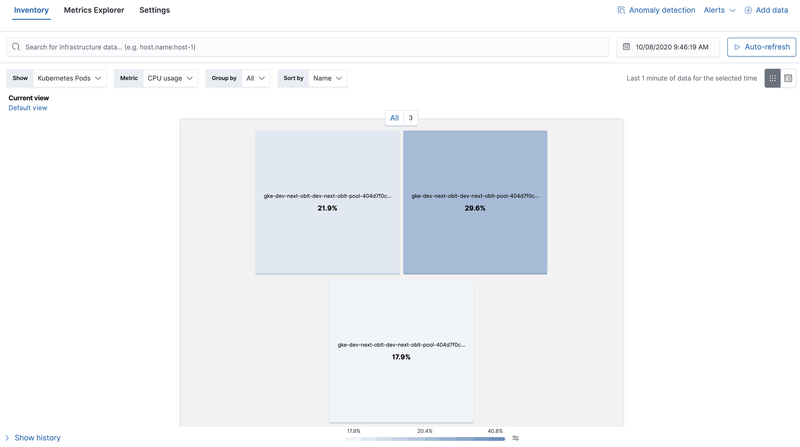
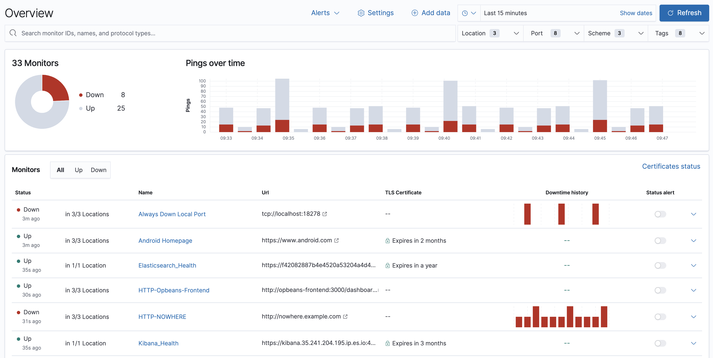

## Elasticsearch Observability

Observability, sistemlerde meydana gelebilecek anomalileri, istenmeyen durumları yakalamak ve nedenini saptamak için gereken bilgilere sahip olabilmeyi sağlamak.

Bu bilgileri elde etmedeki temel sorunlar; yeterli bilgiyi toplayamamak ve çok fazla bilgi toplamak ama yararlı hale getirememek.

Observability'nin 3 temeli:

* Metric
* Log
* Application Trace

ELK Stack (Elasticsearch, Logstash, Kibana)

Metricbeat -> For numerical time series database (daha öncesinde time series database)

APM (Application Performance Monitoring) -> Application tracing ve distributed tracing capabilities to the stack eklenmiş.

* Kibana: Elasticsearch'teki verileri çizelgeler ve grafiklerle görselleştirir

* Elasticsearch: Arama ve analiz motoru
* Beats: Sadece bir dosyayı takip etmek için lightweight, tek amaçlı bir veri aktarıcıları
* Logstash: Aynı anda birden fazla kaynaktan veri alan, dönüştüren ve ardından Elasticsearch gibi bir "stach"e gönderen, sunucu taraflı veri işleme pipeline'ı

Kibana:

* ?Virtualize
* Dashboard
* ?Timelion
* ?Canvas
* Machine Learning
* Infrastructure
* Logs
* APM
* ?Graph
* ?Dev Tools
* ?Monitoring

https://www.elastic.co/beats/

* Filebeat
* Packetbeat
* Metricbeat
* Auditbeat
* Heartbeat

### Fleet Server

Agent policy'lerini güncellemek, durum bilgilerini toplamak ve Elastic Agent'ların genelinde eylemleri koordine etmek için kontrolcü görevi görür. Bu sayede ölçeklenebilir bir mimari sağlar. Fleet server'lar dağıtık olarak konumlandırılabilir.

### Observability

Log'ları, sistem metric'lerini, uptime verilerini ve uygulama trace'lerini tek bir yığın olarak eklemeye ve izlemeye olanak tanır.

Elde edilenler:

* Veri kaynaklarını eklemek ve yapılandırmak için merkezi bir yer.
* Her veri kaynağıyla ilgili analizleri gösteren çeşitli grafikler.
* Log'lar, Metric'ler, Uptime'lar ve APM uygulamalarında verileri incelemek ve analiz etmek.
* Hızlı bir şekilde çözülmesi gerekebilecek sorunlar hakkında bilgilendirici uyarı chart'ları.
* Kibana ile veri kaynaklarını eklemeye ve yapılandırmaya yardımcı olacak özellikler sağlar.

#### Logs

Elasticsearch'e alınan tüm log'ları aramaya, filtrelemeye ve takip etmeye olanak tanır. Farklı sunucularda oturum açmak, dizinleri değiştirmek ve tek tek dosyaları takip etmek yerine tüm log'ları bir araya getirir.

Log anormalliklerini otomatik olarak algılamak ve günlük log'lardaki kalıpları hızlı bir şekilde belirlemek için log mesajlarını kategorilere ayırmaya yarayan makine öğrenimi de kullanılabilir.

#### Metrics

Altyapı metric'lerini görselleştirerek sorunlu artışları teşhis etmeye, yüksek kaynak kullanımını belirlemeye, bölmeleri otomatik olarak keşfetmeye, izlemeye ve metrikleri Elasticsearch'teki log'lar ve APM verileriyle birleştirmeye olanak tanır.

#### Uptime

Uygulama ve hizmetlerin kullanılabilirliğini ve yanıt sürelerini gerçek zamanlı olarak izlemeye ve sorunları, kullanıcıları etkilemeden önce tespit etmeyi sağlar. Network endpoint'lerin durumunu HTTP/S, TCP ve ICMP aracılığıyla izleyebilir, endpoint durumunu zaman içinde keşfedebilir, belirli monitörlerde detaya inebilir ve herhangi bir zamanda ortamı üst düzey anlık görüntüsünü görüntüleyebilir.

#### APM

Yazılım hizmetlerini ve uygulamaları gerçek zamanlı olarak izlemeye, işlenmeyen hataları ve istisnaları toplamaya ve ana bilgisayar düzeyinde temel ölçümleri otomatik olarak almaya olanak tanır.

##### Application Performance Monitoring (APM)

Microservice/monolith mimarilerde sorunun asıl nedenini trace'ler, log'lar ve metric'ler ile tespit eder.

###### Log Monitoring

Farklı kaynaklardan gelen log'ları dönüştürüp görüntülenmesini sağlar.

###### Infrastructure Monitoring

AWS, Microsoft Azure, Google Cloud, Azure, GCP, Kafka ve NGINX gibi platformlar dahil olmak üzere 200'den fazla entegrasyon desteğiyle altyapıyı izler. 

###### Real User Monitoring

Uygulamanın end-user sistemlerinde nasıl performans gösterdiğini anlamak için verileri URL'e, işletim sistemine, tarayıcıya ve konuma göre analiz eder.

###### Synthetic Monitoring

Web site performansına ve kullanılabilirliğine ilişkin sorunları önceden yakalar.

###### Universal Profiling

Sistem performansını analiz etmeye yarar.

