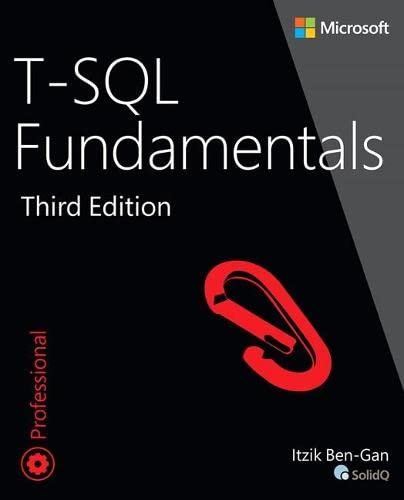
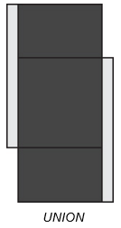
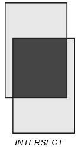
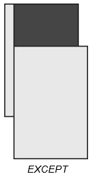
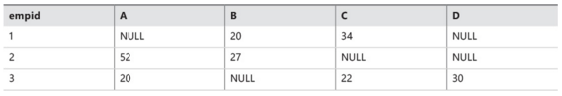

# Notes of T-SQL Fundamentals


## 1. Background to T-SQL Querying and Programming

### SQL

SQL has several categories of statements:

- **Data Definition Language (DDL):** object definitions `CREATE`, `ALTER`, and `DROP`,
- **Data Manipulation Language (DML):** query and modify data `SELECT`, `INSERT`, `UPDATE`, `DELETE`, `TRUNCATE`, and `MERGE`,
- **Data Control Language (DCL):** permissions `GRANT` and `REVOKE`

### Normalization

Normalization is a formal mathematical process to guarantee that each entity will be represented by a single relation. In a normalized database, you avoid anomalies during data modification and keep redundancy to a minimum without sacrificing completeness.

...

### Creating Tables

```sql
USE TSQLV4; -- The USE statement sets the current database context to that of TSQLV4.
DROP TABLE IF EXISTS dbo.Employees;

CREATE TABLE dbo.Employees(
    empid     INT         NOT NULL,
    firstname VARCHAR(30) NOT NULL,
    lastname  VARCHAR(30) NOT NULL,
    hiredate  DATE        NOT NULL,
    mgrid     INT         NULL,
    ssn       VARCHAR(20) NOT NULL,
    salary    MONEY       NOT NULL
);
```

````sql
-- For earlier versions of SQL Server 2016
IF OBJECT_ID(N'dbo.Employees', N'U') IS NOT NULL DROP TABLE dbo.Employees;

-- The OBJECT_ID function accepts an object name and type as inputs.
-- The type U represents a user table.
````

### Primary Key Constraint

````sql
ALTER TABLE dbo.Employees
	ADD CONSTRAINT PK_Employees
	PRIMARY KEY(empid);
````

### Unique Constraint

````sql
ALTER TABLE dbo.Employees
	ADD CONSTRAINT UNQ_Employees_ssn
	UNIQUE(ssn);
````

SQL Server’s implementation rejects duplicate `NULL`s. To emulate the standard unique constraint in SQL Server you can use a unique filtered index that filters only non-`NULL` values. 

````sql
CREATE UNIQUE INDEX idx_ssn_notnull ON dbo.Employees(ssn) WHERE ssn IS NOT NULL;
````

### Foreign Key Constraints

This constraint is defined on one or more attributes in what’s called the referencing table and points to candidate-key (primary-key or unique-constraint) attributes in what’s called the referenced table.

````sql
DROP TABLE IF EXISTS dbo.Orders;
CREATE TABLE dbo.Orders
(
    orderid   INT         NOT NULL,
    empid     INT         NOT NULL,
    custid    VARCHAR(10) NOT NULL,
    orderts   DATETIME2   NOT NULL,
    qty       INT         NOT NULL,
    CONSTRAINT PK_Orders    PRIMARY KEY(orderid)
);
````

You can define the options `ON DELETE` and `ON UPDATE` with actions such as `CASCADE`, `SET DEFAULT`, and `SET NULL` as part of the foreign-key definition.

For `CASCADE` example, `ON DELETE CASCADE` means that when you delete a row from the referenced table, the RDBMS will delete the related rows from the referencing table.

`SET DEFAULT` and `SET NULL` mean that the compensating action will set the foreign-key attributes of the related rows to the column’s *default value* or *NULL*, respectively.

### Check Constraints

You can use a check constraint to define a predicate that a row must meet to be entered into the table or to be modified.

````sql
ALTER TABLE dbo.Employees
	ADD CONSTRAINT CHK_Employees_salary
	CHECK(salary > 0.00);
````

An option called `WITH NOCHECK` that tells the RDBMS you want it to bypass constraint checking for existing data. This is a bad practice because you cannot be sure your data is consistent. You can also disable or enable existing check and foreign-key constraints.

### Default Constraints

The default value when an explicit value is not specified for the attribute when you insert a row.

````sql
ALTER TABLE dbo.Orders  
	ADD CONSTRAINT DFT_Orders_orderts  
	DEFAULT(SYSDATETIME()) FOR orderts;
````

The default expression invokes the `SYSDATETIME` function, which returns the current date and time value. After this default expression is defined, whenever you insert a row in the Orders table and do not explicitly specify a value in the orderts attribute, SQL Server will set the attribute value to `SYSDATETIME`.

## 2. Single-Table Queries

 The clauses are logically processed in the following order:

1. FROM
2. WHERE
3. GROUP BY
4. HAVING
5. SELECT
   - Expressions
   - DISTINCT
6. ORDER BY
   - TOP/OFFSET-FETCH

````sql
SELECT empid, YEAR(orderdate) AS orderyear, COUNT(*)AS numorders
FROM Sales.Orders
WHERE custid = 71
GROUP BY empid, YEAR(orderdate)
HAVING COUNT(*) > 1
ORDER BY empid, orderyear;
````

 Its clauses are processed in the following order:

````sql
FROM Sales.Orders
WHERE custid = 71
GROUP BY empid, YEAR(orderdate)
HAVING COUNT(*) > 1
SELECT empid, YEAR  (orderdate) AS orderyear,
COUNT(*) AS numorders
ORDER BY empid, orderyear
````

### The `FROM` Clause

````sql
FROM Sales.Orders
````

When you don’t specify the schema name explicitly, SQL Server must resolve it implicitly based on its implicit name-resolution rules. This creates some minor cost and can result in SQL Server choosing a different object than the one you intended. By being explicit, your code is safer in the sense you ensure that you get the object you intended to get. 

### The `WHERE` Clause

The `WHERE` clause has significance when it comes to query performance. Based on what you have in the filter expression, SQL Server evaluates the use of indexes to access the required data.

Always keep in mind that T-SQL uses three-valued predicate logic, where logical expressions can evaluate to `TRUE`, `FALSE`, or `UNKNOWN`.  Only rows for which the logical expression evaluates to `TRUE` are returned by the `WHERE` phase to the subsequent logical query processing phase.

### The `GROUP` Clause

You can use the `GROUP BY` phase to arrange the rows returned by the previous logical query processing phase in groups.

All aggregate functions ignore `NULL`s, with one exception. For example, consider a group of five rows with the values 30, 10, NULL, 10, 10 in a column called qty. The expression `COUNT(qty)` returns 4 because there are four known values.

### The `HAVING` Clause

Whereas the `WHERE` clause is a row filter, the `HAVING` clause is a group filter.

Only groups for which the `HAVING` predicate evaluates to `TRUE` are returned by the `HAVING` phase to the next logical query processing phase. Groups for which the predicate evaluates to `FALSE` `UNKNOWN` are discarded.

### The `SELECT` Clause

If by mistake you miss a comma between two column names in the `SELECT` list, code won’t fail. Instead, SQL Server will assume the second name is an alias for the first column name.

````sql
SELECT orderid orderdate
FROM Sales.Orders

-- orderdate
-- -----------
-- 10248
-- 10249
-- 10250
-- 10251
-- 10252
-- ...
````

Remember that the `SELECT` clause is processed after the `FROM`, `WHERE`, `GROUP BY`, and `HAVING` clauses. This means that aliases assigned to expressions in the `SELECT` clause do not exist as far as clauses that are processed before the `SELECT` clause are concerned:

````sql
SELECT orderid, YEAR(orderdate) AS orderyear
FROM Sales.Orders
WHERE orderyear > 2015;

-- Msg 207, Level 16, State 1, Line 3 Invalid column name 'orderyear'.
````

One way around this problem is to repeat the expression `YEAR(orderdate)` in both the `WHERE` and `SELECT` clauses:

````sql
SELECT orderid, YEAR(orderdate) AS orderyear
FROM Sales.Orders
WHERE YEAR(orderdate) > 2015;
````

Curiously, you are not allowed to refer to column aliases created in the `SELECT` clause in other expressions within the same `SELECT` clause:

````sql
SELECT orderid,
	YEAR(orderdate) AS orderyear,
	orderyear + 1 AS nextyear
FROM Sales.Orders
-- invalid
````

````sql
SELECT orderid,
	YEAR(orderdate) AS orderyear,
	YEAR(orderdate) + 1 AS nextyear
FROM Sales.Orders
-- valid
````

Also, listing column names explicitly is the recommended practice.

### The `ORDER BY` Clause

````sql
...
ORDER BY 1, 2 -- This is considered bad programming practice.
````

### The `TOP` Filter

````sql
SELECT TOP (5) orderid, orderdate, custid, empid
FROM Sales.Orders
ORDER BY orderdate DESC
````

Remember that the `ORDER BY` clause is evaluated after the `SELECT` clause, which includes the `DISTINCT` option. The same is true with the `TOP` filter, which relies on the `ORDER BY` specification to give it its filtering-related meaning. This means that if `DISTINCT` is specified in the `SELECT` clause, the `TOP` filter is evaluated after duplicate rows have been removed.

You can use the `TOP` option with the `PERCENT` keyword, in which case SQL Server calculates the number of rows to return based on a percentage of the number of qualifying rows, rounded up. For example, the following query requests the top 1 percent of the most recent orders:

````sql
SELECT TOP (1) PERCENT orderid, orderdate, custid, empid
FROM Sales.Orders
ORDER BY orderdate DESC

-- orderid     orderdate  custid      empid
-- ----------- ---------- ----------- -----------
-- 11074       2016-05-06 73          7
-- 11075       2016-05-06 68          8
-- 11076       2016-05-06 9           4
-- 11077       2016-05-06 65          1
-- 11070       2016-05-05 44          2
-- 11071       2016-05-05 46          1
-- 11072       2016-05-05 20          4
-- 11073       2016-05-05 58          2
-- 11067       2016-05-04 17          1
-- (9 row(s) affected)
````

The query returns nine rows because the Orders table has 830 rows, and 1 percent of 830, rounded up, is 9.

````sql
SELECT TOP (5) WITH TIES orderid, orderdate, custid, empid
FROM Sales.Orders
ORDER BY orderdate DESC

-- orderid     orderdate  custid      empid
-- ----------- ---------- ----------- -----------
-- 11077       2016-05-06 65          1
-- 11076       2016-05-06 9           4
-- 11075       2016-05-06 68          8
-- 11074       2016-05-06 73          7
-- 11073       2016-05-05 58          2
-- 11072       2016-05-05 20          4
-- 11071       2016-05-05 46          1
-- 11070       2016-05-05 44          2
-- (8 row(s) affected)
````

Using the `WITH TIES` option, the selection of rows is deterministic, but the presentation order among rows with the same order date isn’t.

### The `OFFSET-FETCH` Filter

The `OFFSET-FETCH` filter is considered an extension to the `ORDER BY` clause. With the `OFFSET` clause you indicate how many rows to skip, and with the `FETCH` clause you indicate how many rows to filter after the skipped rows.

````sql
SELECT orderid, orderdate, custid, empid
FROM Sales.Orders
ORDER BY orderdate, orderid
OFFSET 50 ROWS FETCH NEXT 25 ROWS ONLY
````

### A Quick Look At Window Functions

````sql
SELECT orderid, custid, val,
	ROW_NUMBER() OVER(PARTITION BY custid
                      ORDER BY val) AS rownum
FROM Sales.OrderValues
ORDER BY custid, val

-- orderid     custid      val      rownum
-- ----------- ----------- -------- -----------------------------
-- 10702       1           330.00   1
-- 10952       1           471.20   2
-- 10643       1           814.50   3
-- 10835       1           845.80   4
-- 10692       1           878.00   5
-- 11011       1           933.50   6
-- 10308       2           88.80    1
-- 10759       2           320.00   2
-- 10625       2           479.75   3
-- 10926       2           514.40   4
-- 10682       3           375.50   1
-- ...
-- (830 row(s) affected)
````

The `ROW_NUMBER` function assigns unique, sequential, incrementing integers to the rows in the result within the respective partition, based on the indicated ordering. The `OVER` clause in this example function partitions the window by the _custid_ attribute; hence, the row numbers are unique to each customer. The `OVER` clause also defines ordering in the window by the _val_ attribute, so the sequential row numbers are incremented within the partition based on the values in this attribute.

`ROW_NUMBER` function must produce unique values within each partition. This means that even when the ordering value doesn’t increase, the row number still must increase. Therefore, if the `ROW_NUMBER` function’s `ORDER BY` list is non-unique, as in the preceding example, the query is nondeterministic. That is, more than one correct result is possible. If you want to make a row number calculation deterministic, you must add elements to the `ORDER BY` list to make it unique.

### Predicates and Operators

Examples of predicates: `IN`, `BETWEEN`, `LIKE`

````sql
SELECT orderid, empid, orderdate FROM Sales.Orders WHERE orderid IN(10248, 10249, 10250);
SELECT orderid, empid, orderdate FROM Sales.Orders WHERE orderid BETWEEN 10300 AND 10310;
SELECT empid, firstname, lastname FROM HR.Employees WHERE lastname LIKE N'D%';
````

Notice the use of the letter _N_ to prefix the string _‘D%’_; it stands for _National_ and is used to denote that a character string is of a Unicode data type (_NCHAR_ or _NVARCHAR_), as opposed to a regular character data type (_CHAR_ or _VARCHAR_). Because the data type of the _lastname_ attribute is _NVARCHAR(40)_, the letter _N_ is used to prefix the string.

Comparison operators:  `=`, `>`, `<`, `>=`, `<=`, `<>`, `!=`, `!>`, `!<`, of which the last three are not standard.

Logical operators: _AND_, _OR_, and _NOT_

Arithmetic operators: `+`, `-`, `*`, `/`, and `%`

Two integer columns, as in _col1/col2_, you need to cast the operands to the appropriate type if you want the calculation to be a numeric one: _CAST(col1 AS NUMERIC(12, 2))/CAST(col2 AS NUMERIC(12, 2))_. The data type _NUMERIC(12, 2)_ has a precision of 12 and a scale of 2, meaning that it has 12 digits in total, 2 of which are after the decimal point.

If the two operands are of different types, the one with the lower precedence is promoted to the one that is higher. For example, in the expression 5/2.0, the first operand is _INT_ and the second is _NUMERIC_. Because _NUMERIC_ is considered higher than _INT_, the _INT_ operand 5 is implicitly converted to the _NUMERIC_ 5.0 before the arithmetic operation, and you get the result 2.5.

The following list describes the precedence among operators, from highest to lowest:

1. ( ) (Parentheses)
2. \* (Multiplication), / (Division), % (Modulo)
3. \+ (Positive), – (Negative), + (Addition), + (Concatenation), – (Subtraction)
4. =, >, <, >=, <=, <>, !=, !>, !< (Comparison operators)
5. NOT
6. AND
7. BETWEEN, IN, LIKE, OR
8. = (Assignment)

### `CASE` Expressions

A `CASE` expression is a scalar expression that returns a value based on conditional logic. `CASE` is an expression and not a statement; that is, it doesn’t take action such as controlling the flow of your code. Instead, it returns a value. Because `CASE` is a scalar expression, it is allowed wherever scalar expressions are allowed, such as in the `SELECT`, `WHERE`, `HAVING`, and `ORDER BY` clauses and in `CHECK` constraints.

There are two forms of `CASE` expressions: simple and searched. You use the simple form to compare one value or scalar expression with a list of possible values and return a value for the first match. If no value in the list is equal to the tested value, the `CASE` expression returns the value that appears in the `ELSE` clause (if one exists). If the `CASE` expression doesn’t have an `ELSE` clause, it defaults to `ELSE` `NULL`.

````sql
SELECT orderid, custid, val,
		CASE
		WHEN val < 1000.00                   THEN 'Less than1000'
		WHEN val BETWEEN 1000.00 AND 3000.00 THEN 'Between 1000and 3000'
		WHEN val > 3000.00                   THEN 'More than3000'
		ELSE 'Unknown'
	END AS valuecategory
FROM Sales.OrderValues;
````

T-SQL supports some functions you can consider as abbreviations of the `CASE` expression: `ISNULL`, `COALESCE`, `IIF`, `NULLIF` and `CHOOSE`. Only `COALESCE` is standard.

The function `IIF(<logical_expression>, <expr1>, <expr2>)` returns _expr1_ if _logical_expression_ is `TRUE`, and it returns _expr2_ otherwise:

````sql
IIF(col1 <> 0, col2/col1, NULL)
````

The function `NULLIF(expression, expression)` returns a null value if the two specified expressions are equal.

````sql
NULLIF(empty_value, '')
````

The function `CHOOSE(<index>, <expr1>, <expr2>, ..., <exprn>)` returns the expression from the list in the specified index.

````sql
CHOOSE(3, col1, col2, col3)
````

````sql
SELECT orderdate, CHOOSE(MONTH(orderdate),'Winter', 'Winter', 'Spring', 'Spring', 'Spring', 'Summer',
              'Summer', 'Summer', 'Autumn', 'Autumn', 'Autumn', 'Winter') AS Quarter_Modified
FROM Sales.Orders
ORDER BY orderdate;

-- orderdate               Quarter_Modified
-- ----------------------- ----------------
-- 2002-05-02 19:03:56.933 Spring
-- 2005-06-01 00:00:00.000 Summer
-- 2005-06-01 00:00:00.000 Summer
-- 2005-06-01 00:00:00.000 Summer
-- 2006-06-01 00:00:00.000 Summer
-- 2006-06-01 00:00:00.000 Summer
-- 2006-06-01 00:00:00.000 Summer
-- 2006-11-20 09:56:38.273 Autumn
-- 2009-05-16 16:34:28.980 Spring
-- 2009-05-16 16:34:28.980 Spring
-- (10 rows affected)
````

### `NULL`s

SQL supports the `NULL` marker to represent missing values and uses three-valued predicate logic, meaning that predicates can evaluate to `TRUE`, `FALSE`, or `UNKNOWN`.

A logical expression involving only non-`NULL` values evaluates to either `TRUE` or `FALSE`. When the logical expression involves a missing value, it evaluates to `UNKNOWN`. For example, consider the predicate _salary > 0_. When salary is equal to 1,000, the expression evaluates to `TRUE`. When salary is equal to –1,000, the expression evaluates to `FALSE`. When salary is `NULL`, the expression evaluates to `UNKNOWN`.

#### All-at-once operations

````sql
SELECT col1, col2
FROM dbo.T1
WHERE col1 <> 0 AND col2/col1 > 2
````

You might very well assume SQL Server evaluates the expressions from left to right, and that if the expression _col1 <> 0_ evaluates to `FALSE`, SQL Server will short-circuit—that is, that it won’t bother to evaluate the expression _10/col1 > 2_ because at this point it is known that the whole expression is `FALSE`. So you might think that this query should never produce a divide-by-zero error. SQL Server does support short circuits, but because of the all-at-once operations concept, it is free to process the expressions in the `WHERE` clause in any order. SQL Server usually makes decisions like this based on cost estimations. You can see that if SQL Server decides to process the expression _10/col1 > 2_ first, this query might fail because of a divide-by-zero error.

### Working with Character Data

#### Data types

- Regular: `CHAR` and `VARCHAR` (1 byte per character)
- Unicode: `NCHAR` and `NVARCHAR` (2 bytes per character)

Any data type without the `VAR` element (`CHAR`, `NCHAR`) in its name has a fixed length. A data type with the `VAR` element (`VARCHAR`, `NVARCHAR`) in its name has a variable length.

#### Collation

`COLLATE`: Language support, sort order, case sensitivity, accent sensitivity, and more.

````sql
SELECT name, description
FROM sys.fn_helpcollations() -- To get the set of supported collations and their descriptions
````

- _Latin1_General_
- _Dictionary sorting_ (A and a < B and b)
- _CI_: Case insensitive (a = A)
- _AS_: Accent sensitive (à <> ä)

````sql
SELECT empid, firstname, lastname FROM HR.Employees WHERE lastname = N'davis'
-- empid       firstname  lastname
-- ----------- ---------- ---------
-- 1           Sara       Davis

SELECT empid, firstname, lastname FROM HR.Employees
WHERE lastname COLLATE Latin1_General_CS_AS = N'davis'
-- Not returned any value
````

#### Operators and functions

For string concatenation, T-SQL provides the plus-sign (+) operator and the `CONCAT` function.

Operations on character strings: `SUBSTRING`, `LEFT`, `RIGHT`, `LEN`, `DATALENGTH`, `CHARINDEX`, `PATINDEX`, `REPLACE`, `REPLICATE`, `STUFF`, `UPPER`, `LOWER`, `RTRIM`, `LTRIM`, `FORMAT`, `COMPRESS`, `DECOMPRESS`, and `STRING_SPLIT`.

##### String concatenation (plus-sign [+] operator and `CONCAT` function)

````sql
SELECT custid, country, region, city,
	country + N',' + region + N',' + city AS location
FROM Sales.Customers

-- custid      country         region  city            location
-- ----------- --------------- ------- --------------- -------------------
-- 1           France          NULL    Marseille       NULL
-- 2           Canada          BC      Tsawwassen      Canada,BC,Tsawwassen
-- 3           UK              NULL    London          NULL
-- 4           Switzerland     NULL    Bern            NULL
-- 5           Brazil          SP      Sao Paulo       Brazil,SP,Sao Paulo
-- 6           UK              NULL    London          NULL
-- 7           Germany         NULL    Aachen          NULL
````

`CONCAT` that accepts a list of inputs for concatenation and automatically substitutes `NULL`s with empty strings. For example, the expression `CONCAT(‘a’, NULL, ‘b’)` returns the string ‘ab’.

````sql
SELECT custid, country, region, city,
	CONCAT(country, N',' + region, N',' + city) AS location
FROM Sales.Customers
````

##### The `SUBSTRING` function

`SUBSTRING(string, start, length)`: If the value of the third argument exceeds the end of the input string, the function returns everything until the end without raising an error.

````sql
SELECT SUBSTRING('abcde', 1, 3) -- abc
````

##### The `LEFT` and `RIGHT` functions

`LEFT(string, n)`, `RIGHT(string, n)` : _n_, is the number of characters to extract from the left or right end of the string. 

````sql
SELECT LEFT('abcde', 3) -- abc
SELECT RIGHT('abcde', 3) -- cde
````

##### The `LEN` and `DATALENGTH` functions

````sql
SELECT LEN(N'abcde') -- 5
SELECT DATALENGTH(N'abcde') -- 10 -> returns bytes
````

##### The `CHARINDEX` function

`CHARINDEX(substring, string[, start_pos])`: If the substring is not found, the function returns 0.

````sql
SELECT CHARINDEX(' ','Itzik Ben-Gan') -- 6
````

##### The `PATINDEX` function

`PATINDEX(pattern, string)`

````sql
SELECT PATINDEX('%[0-9]%', 'abcd123efgh') -- 5
````

##### The `REPLACE` function

`REPLACE(string, substring1, substring2)`

````sql
SELECT REPLACE('1-a 2-b', '-', ':') -- 1:a 2:b
````

##### The `REPLICATE` function

`REPLICATE(string, n)`

````sql
SELECT REPLICATE('abc', 3) -- abcabcabc

SELECT supplierid,
	RIGHT(REPLICATE('0', 9) + CAST(supplierid AS VARCHAR(10)), 10) AS strsupplierid
FROM Production.Suppliers
-- supplierid  strsupplierid
-- ----------- -------------
-- 29          0000000029
-- 28          0000000028
-- 4           0000000004
-- 21          0000000021
-- 2           0000000002
````

`FORMAT` that you can use to achieve such formatting needs much more easily, though at a higher cost.

##### The `STUFF` function

`STUFF(string, pos, delete_length, insert_string)`

````sql
SELECT STUFF('xyz', 2, 1, 'abc') -- xabcz
````

##### The `UPPER` and `LOWER` functions

`UPPER(string), LOWER(string)`

````sql
SELECT UPPER('Itzik Ben-Gan') -- ITZIK BEN-GAN
SELECT LOWER('Itzik Ben-Gan') -- itzik ben-gan
````

##### The `RTRIM` and `LTRIM` functions

`RTRIM(string), LTRIM(string)`

````sql
SELECT RTRIM(LTRIM('   abc   ')) -- abc
````

##### The `FORMAT` function

`FORMAT(input , format_string, culture)`

````sql
SELECT FORMAT(1759, '000000000') -- 0000001759
SELECT FORMAT(123456789, '##-##-#####') -- 12-34-56789
SELECT FORMAT(456789, '##-##-#####') -- -4-56789
````

##### The `COMPRESS` and `DECOMPRESS` functions

`COMPRESS(string), DECOMPRESS(string)`: GZIP algorithm to compress and decompress the input, respectively.

The `COMPRESS` function accepts a character or binary string as input and returns a compressed `VARBINARY(MAX)` typed value. The `DECOMPRESS` function accepts a binary string as input and returns a decompressed `VARBINARY(MAX)` typed value.

````sql
SELECT DECOMPRESS(COMPRESS(N'This is my cv. Imagine it was much longer.'));
````

##### The `STRING_SPLIT` function

`SELECT value FROM STRING_SPLIT(string, separator)`

````sql
SELECT CAST(value AS INT) AS myvalue
FROM STRING_SPLIT('10248,10249,10250', ',') AS S

-- myvalue
-- -----------
-- 10248
-- 10249
-- 10250
````

##### The `LIKE` predicate

###### The % (percent) wildcard

````sql
SELECT empid, lastname FROM HR.Employees WHERE lastname LIKE N'D%'

-- empid       lastname
-- ----------- --------------------
-- 1           Davis
-- 9           Doyle
````

###### The _ (underscore) wildcard

````sql
SELECT empid, lastname FROM HR.Employees WHERE lastname LIKE N'_e%'

-- empid       lastname
-- ----------- --------------------
-- 3           Lew
-- 4           Peled
````

###### The [\<list of characters>] wildcard

````sql
SELECT empid, lastname FROM HR.Employees WHERE lastname LIKE N'[ABC]%'

-- empid       lastname
-- ----------- --------------------
-- 8           Cameron
````

###### The [\<character>-\<character>] wildcard

````sql
SELECT empid, lastname FROM HR.Employees WHERE lastname LIKE N'[A-E]%'

-- empid       lastname
-- ----------- --------------------
-- 8           Cameron
-- 1           Davis
-- 9           Doyle
````

###### The \[^\<character list or range>] wildcard

````sql
SELECT empid, lastname
FROM HR.Employees
WHERE lastname LIKE N'[^A-E]%'

-- empid       lastname
-- ----------- --------------------
-- 2           Funk
-- 7           King
-- 3           Lew
-- 5           Mortensen
-- 4           Peled
-- 6           Suurs
````

###### The ESCAPE character

If you want to search for a character that is also used as a wildcard (such as %, _, [, or ]), you can use an escape character.

------

#### Working with date and time data

##### Date and time data types

Two legacy types called `DATETIME` and `SMALLDATETIME`, and four later additions called `DATE`, `TIME`, `DATETIME2`, and `DATETIMEOFFSET`.

| Data type      | Storage (bytes) | Date range                        | Accuracy           | Entry Format and Example                                     |
| -------------- | --------------- | --------------------------------- | ------------------ | ------------------------------------------------------------ |
| DATETIME       | 8               | January 1, 1753 December 31, 9999 | 3 1/3 milliseconds | 'YYYYMMDD hh:mm:ss.nnn' '20200215 10:36:44.839'              |
| SMALLDATETIME  | 4               | January 1, 1990 June 6, 2079      | 1 minute           | 'YYYYMMDD hh:mm' '20200215 10:36'                            |
| DATE           | 3               | January 1, 0001 December 31, 9999 | 1 day              | 'YYYY-MM-DD' '2020-02-15'                                    |
| TIME           | 3 to 5          | N/A                               | 100 nanoseconds    | 'hh:mm:ss.nnnnnnn' '10:36:44.8391567'                        |
| DATETIME2      | 6 to 8          | January 1, 0001 December 31, 9999 | 100 nanoseconds    | 'YYYY-MM-DD hh:mm:ss:nnnnnnn' '2020-02-15 10:36:44.8391567'  |
| DATETIMEOFFSET | 8 to 10         | January 1, 0001 December 31, 9999 | 100 nanoseconds    | 'YYYY-MM-DD hh:mm:ss:nnnnnnn [+\|-]hh:mm' '2020-02-15 10:36:44:8391567 +02:00' |

The storage requirements for `TIME`, `DATETIME2`, and `DATETIMEOFFSET` depend on the precision you choose. You specify a fractional-second precision as an integer in the range 0 to 7.

##### Literals

When you need to specify a literal (constant) of a date and time data type.

````sql
SET LANGUAGE British;
SELECT CAST('02/12/2016' AS DATE) -- 2016-12-02
SELECT CAST('20160212' AS DATE) -- 2016-02-12

SET LANGUAGE us_english;
SELECT CAST('02/12/2016' AS DATE) -- 2016-02-12
SELECT CAST('20160212' AS DATE) -- 2016-02-12
````

| Data type      | Accuracy                                                     | Entry Format and Example                                     |
| -------------- | ------------------------------------------------------------ | ------------------------------------------------------------ |
| DATETIME       | 'YYYYMMDD hh:mm:ss.nnn' 'YYYY-MM-DDThh:mm:ss.nnn' 'YYYYMMDD' | '20200215 10:36:44.839' '2020-02-15T10:36:44.839' '20200215' |
| SMALLDATETIME  | 'YYYYMMDD hh:mm' 'YYYY-MM-DDThh:mm' 'YYYYMMDD'               | '20200215 10:36' '2020-02-15T10:36' '20200215'               |
| DATE           | 'YYYYMMDD' 'YYYY-MM-DD'                                      | '20200215' '2020-02-15'                                      |
| DATETIME2      | 'YYYYMMDD hh:mm:ss.nnnnnnn' 'YYYY-MM-DD hh:mm:ss.nnnnnnn' 'YYYY-MM-DDThh:mm:ss.nnnnnnn' 'YYYYMMDD' 'YYYY-MM-DD' | '20200215 10:36:44.8391567' '2020-02-15 10:36:44.8391567' '2020-02-15T10:36:44.8391567' '20200215' '2020-02-15' |
| DATETIMEOFFSET | 'YYYYMMDD hh:mm:ss.nnnnnnn [+\|-]hh:mm' 'YYYY-MM-DD hh:mm:ss.nnnnnnn [+\|-]hh:mm' 'YYYYMMDD' 'YYYY-MM-DD' | '20200215 10:36:44.8391567 +02:00' '2020-02-15 10:36:44.8391567 +02:00' '20200215' '2020-02-15' |
| TIME           | 'hh:mm:ss.nnnnnnn'                                           | '10:36:44.8391567'                                           |

````sql
SELECT CONVERT(DATE, '02/12/2016', 101) -- February 12, 2016
SELECT CONVERT(DATE, '02/12/2016', 103) -- December 02, 2016
SELECT PARSE('02/12/2016' AS DATE USING 'en-US')
SELECT PARSE('02/12/2016' AS DATE USING 'en-GB')
````

The `PARSE` function is significantly more expensive than the `CONVERT` function.

##### Date and time functions

`GETDATE`, `CURRENT_TIMESTAMP`, `GETUTCDATE`, `SYSDATETIME`, `SYSUTCDATETIME`, `SYSDATETIMEOFFSET`, `CAST`, `CONVERT`, `SWITCHOFFSET`, `AT TIME ZONE`, `TODATETIMEOFFSET`, `DATEADD`, `DATEDIFF` and `DATEDIFF_BIG`, `DATEPART`, `YEAR`, `MONTH`, `DAY`, `DATENAME`, various `FROMPARTS` functions, and `EOMONTH`.

##### Current date and time

`GETDATE`, `CURRENT_TIMESTAMP`, `GETUTCDATE`, `SYSDATETIME`, `SYSUTCDATETIME`, and `SYSDATETIMEOFFSET`.

| Function          | Return type    | Description                                          |
| ----------------- | -------------- | ---------------------------------------------------- |
| GETDATE           | DATETIME       | Current date and time                                |
| CURRENT_TIMESTAMP | DATETIME       | Same as GETDATE but ANSI SQL-compliant               |
| GETUTCDATE        | DATETIME       | Current date and time in UTC                         |
| SYSDATETIME       | DATETIME2      | Current date and time                                |
| SYSUTCDATETIME    | DATETIME2      | Current date and time in UTC                         |
| SYSDATETIMEOFFSET | DATETIMEOFFSET | Current date and time, including the offset from UTC |

````sql
SELECT
	GETDATE()           AS [GETDATE],
	CURRENT_TIMESTAMP   AS [CURRENT_TIMESTAMP],
	GETUTCDATE()        AS [GETUTCDATE],
	SYSDATETIME()       AS [SYSDATETIME],
	SYSUTCDATETIME()    AS [SYSUTCDATETIME],
	SYSDATETIMEOFFSET() AS [SYSDATETIMEOFFSET];

SELECT
	CAST(SYSDATETIME() AS DATE) AS [current_date],
	CAST(SYSDATETIME() AS TIME) AS [current_time];
````

##### The `CAST`, `CONVERT,` and `PARSE` functions and their `TRY_` counterparts

- `CAST (value AS datatype)`
- `TRY_CAST (value AS datatype)`
- `CONVERT (datatype, value [, style_number])`
- `TRY_CONVERT (datatype, value [, style_number])`
- `PARSE (value AS datatype [USING culture])`
- `TRY_PARSE (value AS datatype [USING culture])`

##### The `SWITCHOFFSET` function

`SWITCHOFFSET(datetimeoffset_value, UTC_offset)`

````sql
SELECT SWITCHOFFSET(SYSDATETIMEOFFSET(), '-05:00');
-- Adjusts the current system datetimeoffset value to offset –05:00.
````

##### The `TODATETIMEOFFSET` function

`TODATETIMEOFFSET(local_date_and_time_value, UTC_offset)`

##### The `AT TIME ZONE` function

`dt_val AT TIME ZONE time_zone`: The `AT TIME ZONE` function accepts an input date and time value and converts it to a `datetimeoffset` value that corresponds to the specified target time zone.

The input _dt_val_ can be of the following data types: `DATETIME`, `SMALLDATETIME`, `DATETIME2`, and `DATETIMEOFFSET`. The input _time_zone_ can be any of the supported Windows time-zone names as they appear in the name column in the `sys.time_zone_info` view.

````sql
SELECT name, current_utc_offset, is_currently_dst
FROM sys.time_zone_info;

SELECT
	CAST('20160212 12:00:00.0000000' AS DATETIME2)
		AT TIME ZONE 'Pacific Standard Time' AS val1,
	CAST('20160812 12:00:00.0000000' AS DATETIME2)
		AT TIME ZONE 'Pacific Standard Time' AS val2;

-- val1                               val2
-- ---------------------------------- ----------------------------------
-- 2016-02-12 12:00:00.0000000 -08:00 2016-08-12 12:00:00.0000000 -07:00
````

##### The `DATEADD` function

`DATEADD(part, n, dt_val)`:  Add a specified number of units of a specified date part to an input date and time value.

_part_: `year`, `quarter`, `month`, `dayofyear`, `day`, `week`, `weekday`, `hour`, `minute`, `second`, `millisecond`, `microsecond`, `nanosecond`

````sql
SELECT DATEADD(year, 1, '20160212') -- 2017-02-12 00:00:00.000
````

##### The `DATEDIFF` and `DATEDIFF_BIG` functions

`DATEDIFF(part, dt_val1, dt_val2), DATEDIFF_BIG(part, dt_val1, dt_val2)`

````sql
SELECT DATEDIFF(day, '20150212', '20160212'); -- 366
SELECT DATEDIFF_BIG(millisecond, '00010101', '20160212');
````

##### The `DATEPART` function

`DATEPART(part, dt_val)`

_part_: `year`, `quarter`, `month`, `dayofyear`, `day`, `week`, `weekday`, `hour`, `minute`, `second`, `millisecond`, `microsecond`, `nanosecond`, `TZoffset`, `ISO_WEEK`

````sql
SELECT DATEPART(month, '20160212') -- 2
````

##### The `YEAR`, `MONTH`, and `DAY` functions

`YEAR(dt_val), MONTH(dt_val), DAY(dt_val)`

````sql
SELECT
	DAY('20160212') AS theday,
	MONTH('20160212') AS themonth,
	YEAR('20160212') AS theyear
	
-- theday      themonth    theyear
-- ----------- ----------- -----------
-- 12          2           2016
````

##### The `DATENAME` function

`DATENAME(dt_val, part)`

````sql
SELECT DATENAME(month, '20160212'); -- February
SELECT DATENAME(year, '20160212'); -- 2016
````

##### The `ISDATE` function

`ISDATE(string)`

````sql
SELECT ISDATE('20160212'); -- 1
SELECT ISDATE('20160230'); -- 0
````

##### The `FROMPARTS` function

The _FROMPARTS_ functions accept integer inputs representing parts of a date and time value and construct a value of the requested type from those parts.

- `DATEFROMPARTS (year, month, day)`,
-  `DATETIME2FROMPARTS (year, month, day, hour, minute, seconds, fractions, precision)`,
-  `DATETIMEFROMPARTS (year, month, day, hour, minute, seconds, milliseconds)`,
-  `DATETIMEOFFSETFROMPARTS (year, month, day, hour, minute, seconds, fractions, hour_offset, minute_offset, precision)`,
-  `SMALLDATETIMEFROMPARTS (year, month, day, hour, minute)`,
-  `TIMEFROMPARTS (hour, minute, seconds, fractions, precision)`

````sql
SELECT
	DATEFROMPARTS(2016, 02, 12),
	DATETIME2FROMPARTS(2016, 02, 12, 13, 30, 5, 1, 7),
	DATETIMEFROMPARTS(2016, 02, 12, 13, 30, 5, 997),
	DATETIMEOFFSETFROMPARTS(2016, 02, 12, 13, 30, 5, 1, -8, 0,  7),
	SMALLDATETIMEFROMPARTS(2016, 02, 12, 13, 30),
	TIMEFROMPARTS(13, 30, 5, 1, 7);
````

##### The `EOMONTH` function

`EOMONTH(input [, months_to_add])`: Accepts an input date and time value and returns the respective end-of-month date as a `DATE` typed value.

````sql
SELECT EOMONTH(SYSDATETIME()); --  returns the end of the current month

SELECT orderid, orderdate, custid, empid
FROM Sales.Orders
WHERE orderdate = EOMONTH(orderdate); -- returns orders placed on the last day of the month
````

### Querying Metadata

SQL Server provides tools for getting information about the metadata of objects, such as information about tables in a database and columns in a table. Those tools include catalog views, information schema views, and system stored procedures and functions.

#### Catalog views

Catalog views provide detailed information about objects in the database, including information that is specific to SQL Server.

````sql
SELECT SCHEMA_NAME(schema_id) AS table_schema_name, name AS table_name
FROM sys.tables;

-- table_schema_name  table_name
-- ------------------ --------------
-- HR                 Employees
-- Production         Suppliers
-- Production         Categories
-- Production         Products
-- Sales              Customers
-- Sales              Shippers
-- Sales              Orders
-- Sales              OrderDetails
-- Stats              Tests
-- Stats              Scores
-- dbo                Nums
````

The _SCHEMA_NAME_ function is used to convert the schema ID integer to its name.

To get information about columns in a table, you can query the _sys.columns_ table.

Returns information about columns in the _Sales.Orders_ table, including column names, data types (with the system type ID translated to a name by using the _TYPE_NAME_ function), maximum length, collation name, and nullability:

````sql
SELECT
	name AS column_name,
	TYPE_NAME(system_type_id) AS column_type,
	max_length,
	collation_name,
	is_nullable
FROM sys.columns
WHERE object_id = OBJECT_ID(N'Sales.Orders');

-- column_name     column_type  max_length collation_name        is_nullable
-- --------------- ------------ ---------- --------------------- ----------
-- orderid         int          4          NULL                  0
-- custid          int          4          NULL                  1
-- empid           int          4          NULL                  0
-- orderdate       date         3          NULL                  0
-- requireddate    date         3          NULL                  0
-- shippeddate     date         3          NULL                  1
-- shipperid       int          4          NULL                  0
-- freight         money        8          NULL                  0
-- shipname        nvarchar     80         Latin1_General_CI_AS  0
-- shipaddress     nvarchar     120        Latin1_General_CI_AS  0
-- shipcity        nvarchar     30         Latin1_General_CI_AS  0
-- shipregion      nvarchar     30         Latin1_General_CI_AS  1
-- shippostalcode  nvarchar     20         Latin1_General_CI_AS  1
-- shipcountry     nvarchar     30         Latin1_General_CI_AS  0
````

#### Information schema views

An information schema view is a set of views that resides in a schema called `INFORMATION_SCHEMA` and provides metadata information in a standard manner.

````sql
SELECT TABLE_SCHEMA, TABLE_NAME
FROM INFORMATION_SCHEMA.TABLES
WHERE TABLE_TYPE = N'BASE TABLE';

SELECT COLUMN_NAME, DATA_TYPE, CHARACTER_MAXIMUM_LENGTH, COLLATION_NAME, IS_NULLABLE
FROM INFORMATION_SCHEMA.COLUMNS
WHERE TABLE_SCHEMA = N'Sales' AND TABLE_NAME = N'Orders';
````

#### System stored procedures and functions

The `sp_tables` stored procedure returns a list of objects (such as tables and views) that can be queried in the current database:

````sql
EXEC sys.sp_tables
````

The `sp_help` procedure accepts an object name as input and returns multiple result sets with general information about the object, and also information about columns, indexes, constraints, and more:

````sql
EXEC sys.sp_help
	@objname = N'Sales.Orders'
````

The `sp_columns` procedure returns information about columns in an object:

````sql
EXEC sys.sp_columns
	@table_name = N'Orders',
	@table_owner = N'Sales'
````

The `sp_helpconstraint` procedure returns information about constraints in an object:

````sql
EXEC sys.sp_helpconstraint
	@objname = N'Sales.Orders'
````

The `SERVERPROPERTY` function returns the requested property of the current instance:

````sql
SELECT SERVERPROPERTY('ProductLevel')
````

The `DATABASEPROPERTYEX` function returns the requested property of the specified database name:

````sql
SELECT DATABASEPROPERTYEX(N'TSQLV4', 'Collation')
````

The `OBJECTPROPERTY` function returns the requested property of the specified object name:

````sql
SELECT OBJECTPROPERTY(OBJECT_ID(N'Sales.Orders'), 'TableHasPrimaryKey')
````

The `COLUMNPROPERTY` function returns the requested property of a specified column:

````sql
SELECT COLUMNPROPERTY(OBJECT_ID(N'Sales.Orders'), N'shipcountry', 'AllowsNull')
````

### Exercises

1. Write a query against the _Sales.Orders_ table that returns orders placed in June 2015:

   - Tables involved: _TSQLV4_ database and the _Sales.Orders_ table
   - Desired output (abbreviated):

   ````sql
   -- orderid     orderdate  custid      empid
   -- ----------- ---------- ----------- -----------
   -- 10555       2015-06-02 71          6
   -- 10556       2015-06-03 73          2
   -- 10557       2015-06-03 44          9
   -- 10558       2015-06-04 4           1
   -- 10559       2015-06-05 7           6
   -- 10560       2015-06-06 25          8
   -- 10561       2015-06-06 24          2
   -- 10562       2015-06-09 66          1
   -- 10563       2015-06-10 67          2
   -- 10564       2015-06-10 65          4
   -- ...
   -- (30 row(s) affected)
   ````

   ````sql
   SELECT orderid, orderdate, custid, empid
   FROM Sales.Orders
   WHERE YEAR(orderdate) = 2015 AND MONTH(orderdate) = 6
   ````

2. Write a query against the _Sales.Orders_ table that returns orders placed on the last day of the month:

   - Tables involved: _TSQLV4_ database and the _Sales.Orders_ table
   - Desired output (abbreviated):

   ````sql
   -- orderid     orderdate  custid      empid
   -- ----------- ---------- ----------- -----------
   -- 10269       2014-07-31 89          5
   -- 10317       2014-09-30 48          6
   -- 10343       2014-10-31 44          4
   -- 10399       2014-12-31 83          8
   -- 10432       2015-01-31 75          3
   -- 10460       2015-02-28 24          8
   -- 10461       2015-02-28 46          1
   -- 10490       2015-03-31 35          7
   -- 10491       2015-03-31 28          8
   -- 10522       2015-04-30 44          4
   -- ...
   -- (26 row(s) affected)
   ````

   ````sql
   SELECT orderid, orderdate, custid, empid
   FROM Sales.Orders
   WHERE orderdate = EOMONTH(orderdate)
   ````

3. Write a query against the _HR.Employees_ table that returns employees with a last name containing the letter e twice or more:

   - Tables involved: _TSQLV4_ database and the _HR.Employees_ table
   - Desired output:

   ````sql
   -- empid       firstname  lastname
   -- ----------- ---------- --------------------
   -- 4           Yael       Peled
   -- 5           Sven       Mortensen
   -- (2 row(s) affected)
   ````

   ````sql
   SELECT empid, firstname, lastname
   FROM HR.Employees
   WHERE lastname LIKE '%e%e%'
   ````

4. Write a query against the _Sales.OrderDetails_ table that returns orders with a total value (quantity * unitprice) greater than 10,000, sorted by total value:

   - Tables involved: _TSQLV4_ database and the _Sales.OrderDetails_ table
   - Desired output:

   ````sql
   -- orderid     totalvalue
   -- ----------- ---------------------
   -- 10865       17250.00
   -- 11030       16321.90
   -- 10981       15810.00
   -- 10372       12281.20
   -- 10424       11493.20
   -- 10817       11490.70
   -- 10889       11380.00
   -- 10417       11283.20
   -- 10897       10835.24
   -- 10353       10741.60
   -- 10515       10588.50
   -- 10479       10495.60
   -- 10540       10191.70
   -- 10691       10164.80
   -- (14 row(s) affected)
   ````

   ````sql
   SELECT orderid, SUM(quantity * unitprice) AS totalvalue
   FROM Sales.OrderDetails
   GROUP BY orderid
   HAVING SUM(quantity * unitprice) > 10000
   ````

5. To check the validity of the data, write a query against the _HR.Employees_ table that returns employees with a last name that starts with a lowercase English letter in the range a through z. Remember that the collation of the sample database is case insensitive (`Latin1_General_CI_AS`):

   - Tables involved: _TSQLV4_ database and the _HR.Employees_ table
   - Desired output is an empty set:

   ````sql
   -- empid       lastname
   -- ----------- --------------------
   -- (0 row(s) affected))
   ````

   ````sql
   SELECT empid, lastname
   FROM HR.Employees
   WHERE lastname COLLATE Latin1_General_CI_AS LIKE N'[a-z]%'
   ````

6. Write a query against the _Sales.Orders_ table that returns the three shipped-to countries with the highest average freight in 2015:

   - Tables involved: _TSQLV4_ database and the _Sales.Orders_ table
   - Desired output:

   ````sql
   -- shipcountry     avgfreight
   -- --------------- ---------------------
   -- Austria         178.3642
   -- Switzerland     117.1775
   -- Sweden          105.16
   -- (3 row(s) affected)
   ````

   ````sql
   SELECT TOP (3) shipcountry, AVG(freight) AS avgfreight
   FROM Sales.Orders
   WHERE orderdate >= '20150101' AND orderdate < '20160101'
   GROUP BY shipcountry
   ORDER BY avgfreight DESC;
   
   SELECT shipcountry, AVG(freight) AS avgfreight
   FROM Sales.Orders
   WHERE orderdate >= '20150101' AND orderdate < '20160101'
   GROUP BY shipcountry
   ORDER BY avgfreight DESC
   OFFSET 0 ROWS FETCH NEXT 3 ROWS ONLY;
   ````

7. Write a query against the _Sales.Orders_ table that calculates row numbers for orders based on order date ordering (using the order ID as the tiebreaker) for each customer separately:

   - Tables involved: _TSQLV4_ database and the _Sales.Orders_ table
   - Desired output (abbreviated):

   ````sql
   -- custid      orderdate  orderid     rownum
   -- ----------- ---------- ----------- --------------------
   -- 1           2015-08-25 10643       1
   -- 1           2015-10-03 10692       2
   -- 1           2015-10-13 10702       3
   -- 1           2016-01-15 10835       4
   -- 1           2016-03-16 10952       5
   -- 1           2016-04-09 11011       6
   -- 2           2014-09-18 10308       1
   -- 2           2015-08-08 10625       2
   -- 2           2015-11-28 10759       3
   -- 2           2016-03-04 10926       4
   -- ...
   -- (830 row(s) affected)
   ````

   ````sql
   SELECT custid, orderdate, orderid,  ROW_NUMBER() OVER(PARTITION BY custid ORDER BY orderdate, orderid) AS rownum
   FROM Sales.Orders
   ORDER BY custid, rownum;
   ````

8. Using the _HR.Employees_ table, write a `SELECT` statement that returns for each employee the gender based on the title of courtesy. For ‘Ms.’ and ‘Mrs.’ return ‘Female’; for ‘Mr.’ return ‘Male’; and in all other cases (for example, ‘Dr.‘) return ‘Unknown’:

   - Tables involved: _TSQLV4_ database and the _HR.Employees_ table
   - Desired output:

   ````sql
   -- empid       firstname  lastname             titleofcourtesy           gender
   -- ----------- ---------- -------------------- ------------------------- -------
   -- 1           Sara       Davis                Ms.                       Female
   -- 2           Don        Funk                 Dr.                       Unknown
   -- 3           Judy       Lew                  Ms.                       Female
   -- 4           Yael       Peled                Mrs.                      Female
   -- 5           Sven       Mortensen            Mr.                       Male
   -- 6           Paul       Suurs                Mr.                       Male
   -- 7           Russell    King                 Mr.                       Male
   -- 8           Maria      Cameron              Ms.                       Female
   -- 9           Patricia   Doyle                Ms.                       Female
   -- (9 row(s) affected)
   ````

   ````sql
   SELECT empid, firstname, lastname, titleofcourtesy,
   	CASE
   		WHEN titleofcourtesy IN('Ms.', 'Mrs.') THEN 'Female'
   		WHEN titleofcourtesy = 'Mr.'           THEN 'Male'
   		ELSE                                        'Unknown'
   	END AS gender
   FROM HR.Employees
   ````

9. Write a query against the _Sales.Customers_ table that returns for each customer the customer ID and region. Sort the rows in the output by region, having `NULL`s sort last (after non-`NULL` values). Note that the default sort behavior for `NULL`s in T-SQL is to sort first (before non-`NULL` values):

   - Tables involved: _TSQLV4_ database and the _Sales.Customers_ table
   - Desired output (abbreviated):

   ````sql
   -- custid      region
   -- ----------- ---------------
   -- 55          AK
   -- 10          BC
   -- 42          BC
   -- 45          CA
   -- 37          Co. Cork
   -- 33          DF
   -- 71          ID
   -- 38          Isle of Wight
   -- 46          Lara
   -- 78          MT
   -- ...
   -- 1           NULL
   -- 2           NULL
   -- 3           NULL
   -- 4           NULL
   -- 5           NULL
   -- 6           NULL
   -- 7           NULL
   -- 8           NULL
   -- 9           NULL
   -- 11          NULL
   -- ...
   -- (91 row(s) affected)
   ````

   ````sql
   SELECT custid, region
   FROM Sales.Customers
   ORDER BY
   	CASE WHEN region IS NULL THEN 1 ELSE 0 END, region
   ````

## 3. Joins

Table operators: `JOIN`, `APPLY`, `PIVOT`, `UNPIVOT`

`JOIN` operator types:

- `CROSS JOIN`: Cartesian product
- `INNER JOIN`: Cartesian product, filter
- `OUTER JOIN`: Cartesian product, filter, add outer rows

### `CROSS JOIN`s

The `CROSS JOIN` is the simplest type of join. Each row from one input is matched with all rows from the other. So if you have `m` rows in one table and `n` rows in the other, you get `m×n` rows in the result.

````sql
-- ISO/ANSI SQL-92 syntax
SELECT C.custid, E.empid
FROM Sales.Customers AS C
	CROSS JOIN HR.Employees AS E
````

````sql
-- ISO/ANSI SQL-89 syntax
SELECT C.custid, E.empid
FROM Sales.Customers AS C, HR.Employees AS E
````

### `INNER JOIN`s

The `INNER` keyword is optional, because an `INNER` join is the default.

````sql
-- ISO/ANSI SQL-92 syntax
SELECT E.empid, E.firstname, E.lastname, O.orderidFROM HR.Employees AS E
INNER JOIN Sales.Orders AS O
	ON E.empid = O.empid
````

````sql
-- ISO/ANSI SQL-89 syntax
SELECT E.empid, E.firstname, E.lastname, O.orderid
FROM HR.Employees AS E, Sales.Orders AS O
WHERE E.empid = O.empid
````

#### Composite joins

 You usually need such a join when a primary key–foreign key relationship is based on more than one attribute.

````sql
SELECT OD.orderid, OD.productid, OD.qty,ODA.dt, ODA.loginname, ODA.oldval, ODA.newval
FROM Sales.OrderDetails AS OD
	INNER JOIN Sales.OrderDetailsAudit AS ODA
		ON OD.orderid = ODA.orderid
		AND OD.productid = ODA.productid
WHERE ODA.columnname = N'qty'
````

#### Non-Equi joins

When a join condition involves only an equality operator, the join is said to be an equi join. When a join condition involves any operator besides equality, the join is said to be a non-equi join.

````sql
SELECT  E1.empid, E1.firstname, E1.lastname, E2.empid, E2.firstname, E2.lastname
FROM HR.Employees AS E1
	INNER JOIN HR.Employees AS E2
		ON E1.empid < E2.empid
````

#### Multi-join queries

````sql
SELECT  C.custid, C.companyname, O.orderid, OD.productid, OD.qty
FROM Sales.Customers AS C
	INNER JOIN Sales.Orders AS O
		ON C.custid = O.custid
	INNER JOIN Sales.OrderDetails AS OD
		ON O.orderid = OD.orderid
````

### `OUTER JOIN`s

#### Fundamentals of `OUTER JOIN`s

The `OUTER` keyword is optional.

- `LEFT OUTER JOIN`
- `RIGHT OUTER JOIN`
- `FULL OUTER JOIN`

##### Using `OUTER JOIN`s in a multi join query

````sql
SELECT C.custid, O.orderid, OD.productid, OD.qty
FROM Sales.Customers AS C 
	LEFT OUTER JOIN      
		(Sales.Orders AS O   
			INNER JOIN Sales.OrderDetails AS OD
         		ON O.orderid = OD.orderid)  
		ON C.custid = O.custid
````

### Exercises

1. Write a query that generates five copies of each employee row:

   - Tables involved: _HR.Employees_ and _dbo.Nums_
   - Desired output:

   ````sql
   -- empid       firstname  lastname             n
   -- ----------- ---------- -------------------- -----------
   -- 1           Sara       Davis                1
   -- 2           Don        Funk                 1
   -- 3           Judy       Lew                  1
   -- 4           Yael       Peled                1
   -- 5           Sven       Mortensen            1
   -- 6           Paul       Suurs                1
   -- 7           Russell    King                 1
   -- ...
   -- 1           Sara       Davis                2
   -- 2           Don        Funk                 2
   -- 3           Judy       Lew                  2
   -- 4           Yael       Peled                2
   -- ...
   -- 8           Maria      Cameron              5
   -- 9           Patricia   Doyle                5
   -- (45 row(s) affected)
   ````

   ````sql
   SELECT E.empid, E.firstname, E.lastname, N.n
   FROM HR.Employees AS E
   	CROSS JOIN dbo.Nums AS N
   WHERE N.n <= 5
   ORDER BY N.n, E.empid
   ````

   1-2. Write a query that returns a row for each employee and day in the range June 12, 2016 through June 16, 2016:

   - Tables involved: _HR.Employees_ and _dbo.Nums_
   - Desired output:

   ````sql
   -- empid       dt
   -- ----------- -----------
   -- 1           2016-06-12
   -- 1           2016-06-13
   -- 1           2016-06-14
   -- 1           2016-06-15
   -- 1           2016-06-16
   -- 2           2016-06-12
   -- 2           2016-06-13
   -- 2           2016-06-14
   -- 2           2016-06-15
   -- 2           2016-06-16
   -- 3           2016-06-12
   -- 3           2016-06-13
   -- 3           2016-06-14
   -- ...
   -- 9           2016-06-14
   -- 9           2016-06-15
   -- 9           2016-06-16
   -- (45 row(s) affected)
   ````

   ````sql
   SELECT E.empid, DATEADD(day, D.n - 1, CAST('20160612' AS DATE)) AS dt
   FROM HR.Employees AS E
   	CROSS JOIN dbo.Nums AS D
   WHERE D.n <= DATEDIFF(day, '20160612', '20160616') + 1
   ORDER BY empid, dt
   ````

2. Explain what’s wrong in the following query, and provide a correct alternative:

   ````sql
   SELECT Customers.custid, Customers.companyname, Orders.orderid, Orders.orderdate
   FROM Sales.Customers AS C
   	INNER JOIN Sales.Orders AS O
       	ON Customers.custid = Orders.custid
   ````

   ````sql
   --  In all subsequent phases of logical query processing, the original table names are not accessible, rather only the shorter aliases are.
   SELECT C.custid, C.companyname, O.orderid, O.orderdate
   FROM Sales.Customers AS C
   	INNER JOIN Sales.Orders AS O
       	ON C.custid = O.custid
   ````

3. Return USA customers, and for each customer return the total number of orders and total quantities:

   - Tables involved: _Sales.Customers_, _Sales.Orders_, and _Sales.Order_
   - Details Desired output:

   ````sql
   -- custid      numorders   totalqty
   -- ----------- ----------- -----------
   -- 32          11          345
   -- 36          5           122
   -- 43          2           20
   -- 45          4           181
   -- 48          8           134
   -- 55          10          603
   -- 65          18          1383
   -- 71          31          4958
   -- 75          9           327
   -- 77          4           46
   -- 78          3           59
   -- 82          3           89
   -- 89          14          1063
   -- (13 row(s) affected)
   ````

   ````sql
   SELECT C.custid, COUNT(DISTINCT O.orderid) AS numorders, SUM(OD.qty) AS totalqty
   FROM Sales.Customers AS C
   	INNER JOIN Sales.Orders AS O
       	ON O.custid = C.custid
   	INNER JOIN Sales.OrderDetails AS OD
   		ON OD.orderid = O.orderid
   WHERE C.country = N'USA'
   GROUP BY C.custid
   ````

4. Return customers and their orders, including customers who placed no orders:

   - Tables involved: _Sales.Customers_ and _Sales.Orders_
   - Desired output (abbreviated):

   ````sql
   -- custid      companyname     orderid     orderdate
   -- ----------- --------------- ----------- -----------
   -- 85          Customer ENQZT  10248       2014-07-04
   -- 79          Customer FAPSM  10249       2014-07-05
   -- 34          Customer IBVRG  10250       2014-07-08
   -- 84          Customer NRCSK  10251       2014-07-08
   -- ...
   -- 73          Customer JMIKW  11074       2016-05-06
   -- 68          Customer CCKOT  11075       2016-05-06
   -- 9           Customer RTXGC  11076       2016-05-06
   -- 65          Customer NYUHS  11077       2016-05-06
   -- 22          Customer DTDMN  NULL        NULL
   -- 57          Customer WVAXS  NULL        NULL
   -- (832 row(s) affected)
   ````

   ````sql
   SELECT C.custid, C.companyname, O.orderid, O.orderdate
   FROM Sales.Customers AS C
   	LEFT OUTER JOIN Sales.Orders AS O
       	ON O.custid = C.custid
   ````

5. Return customers who placed no orders: 

   - Tables involved: _Sales.Customers_ and _Sales.Orders_
   - Desired output:

   ````sql
   -- custid      companyname
   -- ----------- ---------------
   -- 22          Customer DTDMN
   -- 57          Customer WVAXS
   -- (2 row(s) affected)
   ````

   ````sql
   SELECT C.custid, C.companyname
   FROM Sales.Customers AS C
   	LEFT OUTER JOIN Sales.Orders AS O
   		ON O.custid = C.custid
   WHERE O.orderid IS NULL
   ````

6. Return customers with orders placed on February 12, 2016, along with their orders:

   - Tables involved: _Sales.Customers_ and _Sales.Orders_
   - Desired output:

   ````sql
   -- custid      companyname     orderid     orderdate
   -- ----------- --------------- ----------- ----------
   -- 48          Customer DVFMB  10883       2016-02-12
   -- 45          Customer QXPPT  10884       2016-02-12
   -- 76          Customer SFOGW  10885       2016-02-12
   -- (3 row(s) affected)
   ````

   ````sql
   SELECT C.custid, C.companyname, O.orderid, O.orderdate
   FROM Sales.Customers AS C
   	INNER JOIN Sales.Orders AS O
   		ON O.custid = C.custid
   WHERE O.orderdate = '20160212'
   ````

7. Write a query that returns all customers in the output, but matches them with their respective orders only if they were placed on February 12, 2016:

   - Tables involved: _Sales.Customers_ and _Sales.Orders_
   - Desired output (abbreviated):

   ````sql
   -- custid      companyname     orderid     orderdate
   -- ----------- --------------- ----------- ----------
   -- 72          Customer AHPOP  NULL        NULL
   -- 58          Customer AHXHT  NULL        NULL
   -- 25          Customer AZJED  NULL        NULL
   -- 18          Customer BSVAR  NULL        NULL
   -- 91          Customer CCFIZ  NULL        NULL
   -- 68          Customer CCKOT  NULL        NULL
   -- 49          Customer CQRAA  NULL        NULL
   -- 24          Customer CYZTN  NULL        NULL
   -- 22          Customer DTDMN  NULL        NULL
   -- 48          Customer DVFMB  10883       2016-02-12
   -- ...
   -- 69          Customer SIUIH  NULL        NULL
   -- 86          Customer SNXOJ  NULL        NULL
   -- 88          Customer SRQVM  NULL        NULL
   -- 54          Customer TDKEG  NULL        NULL
   -- 20          Customer THHDP  NULL        NULL
   -- ...
   -- (91 row(s) affected)
   ````

   ````sql
   SELECT C.custid, C.companyname, O.orderid, O.orderdate
   FROM Sales.Customers AS C
   	LEFT OUTER JOIN Sales.Orders AS O
   		ON O.custid = C.custid AND O.orderdate = '20160212'
   ````

8. Return all customers, and for each return a Yes/No value depending on whether the customer placed orders on February 12, 2016:

   - Tables involved: _Sales.Customers_ and _Sales.Orders_
   - Desired output (abbreviated):

   ````sql
   -- custid      companyname     HasOrderOn20160212
   -- ----------- --------------- ------------------
   -- ...
   -- 40          Customer EFFTC  No
   -- 41          Customer XIIWM  No
   -- 42          Customer IAIJK  No
   -- 43          Customer UISOJ  No
   -- 44          Customer OXFRU  No
   -- 45          Customer QXPPT  Yes
   -- 46          Customer XPNIK  No
   -- 47          Customer PSQUZ  No
   -- 48          Customer DVFMB  Yes
   -- 49          Customer CQRAA  No
   -- 50          Customer JYPSC  No
   -- 51          Customer PVDZC  No
   -- 52          Customer PZNLA  No
   -- 53          Customer GCJSG  No
   -- ...
   -- (91 row(s) affected)
   ````

   ````sql
   SELECT DISTINCT C.custid, C.companyname,
   	CASE WHEN O.orderid IS NOT NULL THEN 'Yes' ELSE 'No' END AS HasOrderOn20160212
   FROM Sales.Customers AS C
   	LEFT OUTER JOIN Sales.Orders AS O
   		ON O.custid = C.custid AND O.orderdate = '20160212'
   ````

## 4. Subqueries

- Self-contained subqueries
- Correlated subqueries

A subquery can return single-value (scalar subqueries), multivalue (multivalued subqueries), or table-valued (table subqueries)

### Self-Contained Subqueries

Self-contained subqueries are subqueries that are independent of the tables in the outer query. The subquery code is evaluated only once before the outer query is evaluated, and then the outer query uses the result of the subquery.

#### Self-contained scalar subquery

A scalar subquery is a subquery that returns a single value.

````sql
SELECT orderid, orderdate, empid, custid
FROM Sales.Orders
WHERE orderid = (SELECT MAX(O.orderid)
                 FROM Sales.Orders AS O)
-- orderid      orderdate   empid        custid
-- ------------ ----------- ------------ -----------
-- 11077        2016-05-06  1            65
````

#### Self-contained multivalued subquery

A multivalued subquery is a subquery that returns multiple values as a single column. Some predicates, such as the `IN`, `SOME`, `ANY`, and `ALL` predicate, operate on a multivalued subquery.

````sql
SELECT n
FROM dbo.Nums
WHERE n BETWEEN (SELECT MIN(O.orderid) FROM dbo.Orders AS O)
	AND (SELECT MAX(O.orderid) FROM dbo.Orders AS O)
    AND n NOT IN (SELECT O.orderid FROM dbo.Orders ASO)
````

### Correlated Subqueries

The subquery is dependent on the outer query and cannot be invoked independently.

````sql
SELECT orderid, custid, val,
	CAST(100. * val / (SELECT SUM(O2.val)
                       FROM Sales.OrderValues AS O2
                       WHERE O2.custid = O1.custid)
         AS NUMERIC(5,2)) AS pct
FROM Sales.OrderValues AS O1
ORDER BY custid, orderid
-- orderid     custid      val        pct
-- ----------- ----------- ---------- ------
-- 10643       1           814.50     19.06
-- 10692       1           878.00     20.55
-- 10702       1           330.00     7.72
-- 10835       1           845.80     19.79
-- 10952       1           471.20     11.03
-- 11011       1           933.50     21.85
-- 10308       2           88.80      6.33
-- 10625       2           479.75     34.20
-- 10759       2           320.00     22.81
-- 10926       2           514.40     36.67
-- ...
-- (830 row(s) affected)
````

### The `EXISTS` Predicate

T-SQL supports a predicate called `EXISTS` that accepts a subquery as input and returns `TRUE` if the subquery returns any rows and `FALSE` otherwise.

Even though in most cases the use of star (*) is considered a bad practice, with `EXISTS`.

````sql
EXISTS(SELECT * FROM ...) -- bad
EXISTS(SELECT 1 FROM ...) -- better
````

````sql
SELECT custid, companyname
FROM Sales.Customers AS C
WHERE country = N'Spain'
	AND EXISTS
    	(SELECT 1 FROM Sales.Orders AS O
         WHERE O.custid = C.custid)
-- custid      companyname
-- ----------- ----------------
-- 8           Customer QUHWH
-- 29          Customer MDLWA
-- 30          Customer KSLQF
-- 69          Customer SIUIH
````

### Using Running Aggregates

Running aggregates are aggregates that accumulate values based on some order.

You query one instance of the view to return for each year the current year and quantity:

````sql
SELECT orderyear, qty,
	(SELECT SUM(O2.qty)
     FROM Sales.OrderTotalsByYear AS O2
     WHERE O2.orderyear <= O1.orderyear) AS runqty
FROM Sales.OrderTotalsByYear AS O1
ORDER BY orderyear
-- orderyear   qty         runqty
-- ----------- ----------- -----------
-- 2014        9581        9581
-- 2015        25489       35070
-- 2016        16247       51317
````

T-SQL supports window aggregate functions, which you can use to compute running totals much more easily and efficiently.

### `NULL` Trouble

Remember that T-SQL uses three-valued logic because of its support for `NULL`s.

````sql
SELECT custid, companyname
FROM Sales.Customers
WHERE custid NOT IN(SELECT O.custid
                    FROM Sales.Orders AS O
                    WHERE O.custid IS NOT NULL)
````

### Substitution Errors In Subquery Column Names

````sql
SELECT shipper_id, companyname
FROM Sales.MyShippers
WHERE shipper_id IN (SELECT shipper_id
                     FROM Sales.Orders
                     WHERE custid = 43)
-- shipper_id  companyname
-- ----------- ---------------
-- 1           Shipper GVSUA
-- 2           Shipper ETYNR
-- 3           Shipper ZHISN

SELECT shipper_id, companyname
FROM Sales.MyShippers
WHERE shipper_id IN (SELECT O.shipperid
                     FROM Sales.Orders AS O
                     WHERE O.custid = 43)
-- shipper_id  companyname
-- ----------- ---------------
-- 2           Shipper ETYNR
-- 3           Shipper ZHISN
````

### Exercises

1. Write a query that returns all orders placed on the last day of activity that can be found in the _Orders_ table:

   - Table involved: _Sales.Orders_
   - Desired output:

   ````sql
   -- orderid     orderdate   custid      empid
   -- ----------- ----------- ----------- -----------
   -- 11077       2016-05-06  65          1
   -- 11076       2016-05-06  9           4
   -- 11075       2016-05-06  68          8
   -- 11074       2016-05-06  73          7
   ````

   ````sql
   SELECT orderid, orderdate, custid, empid
   FROM Sales.Orders WHERE orderdate = 
   	(SELECT MAX(O.orderdate) FROM Sales.Orders AS O)
   ````

2. Write a query that returns all orders placed by the customer(s) who placed the highest number of orders. Note that more than one customer might have the same number of orders:

   - Table involved: _Sales.Orders_
   - Desired output:

   ````sql
   -- custid      orderid     orderdate  empid
   -- ----------- ----------- ---------- -----------
   -- 71          10324       2014-10-08 9
   -- 71          10393       2014-12-25 1
   -- 71          10398       2014-12-30 2
   -- 71          10440       2015-02-10 4
   -- 71          10452       2015-02-20 8
   -- 71          10510       2015-04-18 6
   -- 71          10555       2015-06-02 6
   -- 71          10603       2015-07-18 8
   -- 71          10607       2015-07-22 5
   -- 71          10612       2015-07-28 1
   -- 71          10627       2015-08-11 8
   -- 71          10657       2015-09-04 2
   -- 71          10678       2015-09-23 7
   -- 71          10700       2015-10-10 3
   -- 71          10711       2015-10-21 5
   -- 71          10713       2015-10-22 1
   -- 71          10714       2015-10-22 5
   -- 71          10722       2015-10-29 8
   -- 71          10748       2015-11-20 3
   -- 71          10757       2015-11-27 6
   -- 71          10815       2016-01-05 2
   -- 71          10847       2016-01-22 4
   -- 71          10882       2016-02-11 4
   -- 71          10894       2016-02-18 1
   -- 71          10941       2016-03-11 7
   -- 71          10983       2016-03-27 2
   -- 71          10984       2016-03-30 1
   -- 71          11002       2016-04-06 4
   -- 71          11030       2016-04-17 7
   -- 71          11031       2016-04-17 6
   -- 71          11064       2016-05-01 1
   -- (31 row(s) affected)
   ````

   ````sql
   SELECT custid, orderid, orderdate, empid
   FROM Sales.Orders
   WHERE custid IN
   	(SELECT TOP (1) WITH TIES O.custid
        FROM Sales.Orders AS O
        GROUP BY O.custid
        ORDER BY COUNT(*) DESC)
   ````

3. Write a query that returns employees who did not place orders on or after May 1, 2016:

   - Tables involved: _HR.Employees_ and _Sales.Orders_
   - Desired output:

   ````sql
   -- empid       FirstName  lastname
   -- ----------- ---------- --------------------
   -- 3           Judy       Lew
   -- 5           Sven       Mortensen
   -- 6           Paul       Suurs
   -- 9           Patricia   Doyle
   ````

   ````sql
   SELECT empid, FirstName, lastname
   FROM HR.Employees WHERE empid NOT IN
   	(SELECT O.empid
        FROM Sales.Orders AS O
        WHERE O.orderdate >= '20160501')
   ````

4. Write a query that returns countries where there are customers but not employees:

   - Tables involved: _Sales.Customers_ and _HR.Employees_
   - Desired output:

   ````sql
   -- country
   -- ---------------
   -- Argentina
   -- Austria
   -- Belgium
   -- Brazil
   -- Canada
   -- Denmark
   -- Finland
   -- France
   -- Germany
   -- Ireland
   -- Italy
   -- Mexico
   -- Norway
   -- Poland
   -- Portugal
   -- Spain
   -- Sweden
   -- Switzerland
   -- Venezuela
   -- (19 row(s) affected)
   ````

   ````sql
   SELECT DISTINCT country
   FROM Sales.Customers
   WHERE country NOT IN
   	(SELECT E.country FROM HR.Employees AS E)
   ````

5. Write a query that returns for each customer all orders placed on the customer’s last day of activity:

   - Table involved: _Sales.Orders_
   - Desired output:

   ````sql
   -- custid      orderid     orderdate   empid
   -- ----------- ----------- ----------- -----------
   -- 1           11011       2016-04-09  3
   -- 2           10926       2016-03-04  4
   -- 3           10856       2016-01-28  3
   -- 4           11016       2016-04-10  9
   -- 5           10924       2016-03-04  3
   -- ...
   -- 87          11025       2016-04-15  6
   -- 88          10935       2016-03-09  4
   -- 89          11066       2016-05-01  7
   -- 90          11005       2016-04-07  2
   -- 91          11044       2016-04-23  4
   -- (90 row(s) affected)
   ````

   ````sql
   SELECT custid, orderid, orderdate, empid
   FROM Sales.Orders AS O1
   WHERE orderdate =
   	(SELECT MAX(O2.orderdate)
        FROM Sales.Orders AS O2
        WHERE O2.custid = O1.custid)
   ORDER BY custid
   ````

6. Write a query that returns customers who placed orders in 2015 but not in 2016:

   - Tables involved: _Sales.Customers_ and _Sales.Orders_
   - Desired output:

   ````sql
   -- custid      companyname
   -- ----------- ----------------
   -- 21          Customer KIDPX
   -- 23          Customer WVFAF
   -- 33          Customer FVXPQ
   -- 36          Customer LVJSO
   -- 43          Customer UISOJ
   -- 51          Customer PVDZC
   -- 85          Customer ENQZT
   -- (7 row(s) affected)
   ````

   ````sql
   SELECT custid, companyname
   FROM Sales.Customers AS C
   WHERE EXISTS
   		(SELECT 1
        	FROM Sales.Orders AS O
        	WHERE O.custid = C.custid
        		AND YEAR(O.orderdate) = 2015)
   	AND NOT EXISTS
       	(SELECT 1
            FROM Sales.Orders AS O
            WHERE O.custid = C.custid
   	         AND YEAR(O.orderdate) = 2016)
   ````
   
7. Write a query that returns customers who ordered product 12:

   -  Tables involved: _Sales.Customers_, _Sales.Orders_, and _Sales.Order_
   - Details Desired output:

   ````sql
   -- custid      companyname
   -- ----------- ----------------
   -- 48          Customer DVFMB
   -- 39          Customer GLLAG
   -- 71          Customer LCOUJ
   -- 65          Customer NYUHS
   -- 44          Customer OXFRU
   -- 51          Customer PVDZC
   -- 86          Customer SNXOJ
   -- 20          Customer THHDP
   -- 90          Customer XBBVR
   -- 46          Customer XPNIK
   -- 31          Customer YJCBX
   -- 87          Customer ZHYOS
   -- (12 row(s) affected)
   ````

   ````sql
   SELECT custid, companyname
   FROM Sales.Customers AS C
   WHERE EXISTS
   	(SELECT 1
        FROM Sales.Orders AS O
        WHERE O.custid = C.custid
        	AND EXISTS
        		(SELECT 1
                FROM Sales.OrderDetails AS OD
                WHERE OD.orderid = O.orderid
                	AND OD.ProductID = 12))
   ````

8. Write a query that calculates a running-total quantity for each customer and month:

   - Table involved: _Sales.CustOrders_
   - Desired output:

   ````sql
   -- custid      ordermonth  qty         runqty
   -- ----------- ----------- ----------- -----------
   -- 1           2015-08-01  38          38
   -- 1           2015-10-01  41          79
   -- 1           2016-01-01  17          96
   -- 1           2016-03-01  18          114
   -- 1           2016-04-01  60          174
   -- 2           2014-09-01  6           6
   -- 2           2015-08-01  18          24
   -- 2           2015-11-01  10          34
   -- 2           2016-03-01  29          63
   -- 3           2014-11-01  24          24
   -- 3           2015-04-01  30          54
   -- 3           2015-05-01  80          134
   -- 3           2015-06-01  83          217
   -- 3           2015-09-01  102         319
   -- 3           2016-01-01  40          359
   -- ...
   -- (636 row(s) affected)
   ````

   ````sql
   SELECT custid, ordermonth, qty,
   	(SELECT SUM(O2.qty)
        FROM Sales.CustOrders AS O2
        WHERE O2.custid = O1.custid
        	AND O2.ordermonth <= O1.ordermonth) AS runqty
   FROM Sales.CustOrders AS O1
   ORDER BY custid, ordermonth
   ````

9. Explain the difference between IN and EXISTS:

   Whereas the `IN` predicate uses three-valued logic, the `EXISTS` predicate uses two-valued logic. When no `NULL`s are involved in the data, `IN` and `EXISTS` give you the same meaning in both their positive and negative forms (with `NOT`). When `NULL`s are involved, `IN` and `EXISTS` give you the same meaning in their positive form but not in their negative form. In the positive form, when looking for a value that appears in the set of known values in the subquery, both return `TRUE`, and when looking for a value that doesn’t appear in the set of known values, both return `FALSE`. In the negative forms (with `NOT`), when looking for a value that appears in the set of known values, both return `FALSE`; however,when looking for a value that doesn’t appear in the set of known values, `NOT IN` returns UNKNOWN (outer row is discarded), whereas `NOT EXISTS` returns `TRUE` (outer row returned).

10. Write a query that returns for each order the number of days that passed since the same customer’s previous order. To determine recency among orders, use _orderdate_ as the primary sort element and _orderid_ as the tiebreaker:

    - Table involved: _Sales.Orders_
    - Desired output:

    ````sql
    -- custid      orderdate  orderid     diff
    -- ----------- ---------- ----------- -----------
    -- 1           2015-08-25 10643       NULL
    -- 1           2015-10-03 10692       39
    -- 1           2015-10-13 10702       10
    -- 1           2016-01-15 10835       94
    -- 1           2016-03-16 10952       61
    -- 1           2016-04-09 11011       24
    -- 2           2014-09-18 10308       NULL
    -- 2           2015-08-08 10625       324
    -- 2           2015-11-28 10759       112
    -- 2           2016-03-04 10926       97
    -- ...
    -- (830 row(s) affected)
    ````

    ````sql
    SELECT custid, orderdate, orderid, 
    	DATEDIFF(day,
        	(SELECT TOP (1) O2.orderdate
             FROM Sales.Orders AS O2
             WHERE O2.custid = O1.custid
             	AND (O2.orderdate = O1.orderdate
                	AND O2.orderid < O1.orderid
                    OR O2.orderdate < O1.orderdate)
             ORDER BY O2.orderdate DESC, O2.orderid DESC), orderdate) AS diff
    FROM Sales.Orders AS O1
    ORDER BY custid, orderdate, orderid
    ````

## 5. Table Expressions

- Derived tables
- Common table expressions (CTEs)
- Views
- Inline table-valued functions (inline TVFs)

### Derived Tables

Derived tables (also known as table subqueries) are defined in the `FROM` clause of an outer query. Their scope of existence is the outer query. As soon as the outer query is finished, the derived table is gone.

````sql
SELECT *
FROM (SELECT custid, companyname
      FROM Sales.Customers
      WHERE country = N'USA') AS USACusts
````

- Order is not guaranteed
- All columns must have names
- All column names must be unique

#### Assigning column aliases

In any clause of the outer query, you can refer to column aliases that were assigned in the `SELECT` clause of the inner query. This behavior helps you get around the fact that you can’t refer to column aliases assigned in the `SELECT` clause in query clauses that are logically processed prior to the `SELECT` clause (for example, WHERE or GROUP BY).

````sql
SELECT YEAR(orderdate) AS orderyear, COUNT(DISTINCT custid) AS numcusts
FROM Sales.Orders
GROUP BY orderyear
-- Msg 207, Level 16, State 1, Line 5
-- Invalid column name 'orderyear'.
````

````sql
SELECT orderyear, COUNT(DISTINCT custid) AS numcusts
FROM (SELECT YEAR(orderdate) AS orderyear, custid
      FROM Sales.Orders) AS D
GROUP BY orderyear
-- orderyear   numcusts
-- ----------- -----------
-- 2014        67
-- 2015        86
-- 2016        81
````

#### Using arguments

In the query that defines a derived table, you can refer to arguments. The arguments can be local variables and input parameters to a routine, such as a stored procedure or function.

````sql
DECLARE @empid AS INT = 3;

SELECT orderyear, COUNT(DISTINCT custid) AS numcusts
FROM (SELECT YEAR(orderdate) AS orderyear, custid
      FROM Sales.Orders
      WHERE empid = @empid) AS D
GROUP BY orderyear
-- orderyear   numcusts
-- ----------- -----------
-- 2014        16
-- 2015        46
-- 2016        30
````

#### Nesting

If you need to define a derived table based on a query that itself is based on a derived table, you can nest those. Nesting tends to complicate the code and reduces its readability.

````sql
SELECT orderyear, numcusts
FROM (SELECT orderyear, COUNT(DISTINCT custid) AS numcusts
      FROM (SELECT YEAR(orderdate) AS orderyear, custid
            FROM Sales.Orders) AS D1      
      GROUP BY orderyear) AS D2
WHERE numcusts > 70
-- orderyear   numcusts
-- ----------- -----------
-- 2015        86
-- 2016        81
````

Alternative:

````sql
SELECT YEAR(orderdate) AS orderyear, COUNT(DISTINCT custid) AS numcusts
FROM Sales.Orders
GROUP BY YEAR(orderdate)
HAVING COUNT(DISTINCT custid) > 70
````

#### Multiple references

Related to cases where you need to join multiple instances of the same one. A join treats its two inputs as a set and, as you know, a set has no order to its elements. This means that if you define a derived table and alias it as one input of the join, you can’t refer to the same alias in the other input of the join.

````sql
SELECT Cur.orderyear,
	Cur.numcusts AS curnumcusts, Prv.numcusts AS prvnumcusts,  
	Cur.numcusts - Prv.numcusts AS growth
FROM (SELECT YEAR(orderdate) AS orderyear,
      COUNT(DISTINCT custid) AS numcusts
      FROM Sales.Orders
      GROUP BY YEAR(orderdate)) AS Cur
	LEFT OUTER JOIN
    	(SELECT YEAR(orderdate) AS orderyear, COUNT(DISTINCT custid) AS numcusts
         FROM Sales.Orders
         GROUP BY YEAR(orderdate)) AS Prv
         	ON Cur.orderyear = Prv.orderyear + 1
-- orderyear   curnumcusts prvnumcusts growth
-- ----------- ----------- ----------- -----------
-- 2014        67          NULL        NULL
-- 2015        86          67          19
-- 2016        81          86          –5
````

### Common Table Expressions (CTEs)

CTEs are defined by using a `WITH` statement and have the following general form:

````sql
WITH <CTE_Name>[(<target_column_list>)]
AS
(
    <inner_query_defining_CTE>
)
<outer_query_against_CTE>
````

The inner query defining the CTE must follow all requirements mentioned earlier to be valid to define a table expression.

````sql
WITH USACusts AS
(
    SELECT custid, companyname
    FROM Sales.Customers
    WHERE country = N'USA'
)
SELECT * FROM USACusts
````

#### Assigning column aliases in CTEs

CTEs also support two forms of column aliasing: inline and external. For the inline form, specify \<expression> AS \<column_alias>; for the external form, specify the target column list in parentheses immediately after the CTE name.

Inline form:

````sql
WITH C AS
(
    SELECT YEAR(orderdate) AS orderyear, custid
    FROM Sales.Orders
)
SELECT orderyear, COUNT(DISTINCT custid) AS numcusts
FROM C
GROUP BY orderyear
````

External form:

````sql
WITH C(orderyear, custid) AS
(
    SELECT YEAR(orderdate), custid
    FROM Sales.Orders
)
SELECT orderyear, COUNT(DISTINCT custid) AS numcusts
FROM C
GROUP BY orderyear
````

#### Using arguments in CTEs

As with derived tables, you also can use arguments in the inner query used to define a CTE.

````sql
DECLARE @empid AS INT = 3;

WITH C AS
(
    SELECT YEAR(orderdate) AS orderyear, custid
    FROM Sales.Orders
    WHERE empid = @empid
)
SELECT orderyear, COUNT(DISTINCT custid) AS numcusts
FROM C
GROUP BY orderyear
````

#### Defining multiple CTEs

````sql
WITH C1 AS
(
    SELECT YEAR(orderdate) AS orderyear, custid
    FROM Sales.Orders
),
C2 AS
(
    SELECT orderyear, COUNT(DISTINCT custid) AS numcusts
    FROM C1
    GROUP BY orderyear
)
SELECT orderyear, numcusts
FROM C2
WHERE numcusts > 70
````

#### Multiple references in CTEs

````sql
WITH YearlyCount AS
(
    SELECT YEAR(orderdate) AS orderyear, COUNT(DISTINCT custid) AS numcusts
    FROM Sales.Orders
    GROUP BY YEAR(orderdate)
)
SELECT Cur.orderyear, Cur.numcusts AS curnumcusts, Prv.numcusts AS prvnumcusts,
	Cur.numcusts - Prv.numcusts AS growth
FROM YearlyCount AS Cur
	LEFT OUTER JOIN YearlyCount AS Prv
    	ON Cur.orderyear = Prv.orderyear + 1
````

#### Recursive CTEs

CTEs are unique among table expressions in the sense that they support recursion. Recursive CTEs, like nonrecursive ones, are defined by the SQL standard. A recursive CTE is defined by at least two queries (more are possible)—at least one query known as the anchor member and at least one query known as the recursive member.

````sql
WITH <CTE_Name>[(<target_column_list>)]
AS
(
    <anchor_member>
    UNION ALL
    <recursive_member>
)
<outer_query_against_CTE>
````

The anchor member is a query that returns a valid relational result table—like a query that is used to define a nonrecursive table expression. The anchor member query is invoked only once.

````sql
WITH EmpsCTE AS
(
    SELECT empid, mgrid, firstname, lastname
    FROM HR.Employees
    WHERE empid = 2
    UNION ALL
    SELECT C.empid, C.mgrid, C.firstname, C.lastname
    FROM EmpsCTE AS P
    	INNER JOIN HR.Employees AS C
    		ON C.mgrid = P.empid
)
SELECT empid, mgrid, firstname, lastname
FROM EmpsCTE
````

### Views

````sql
DROP VIEW IF EXISTS Sales.USACusts;
GO
CREATE VIEW Sales.USACusts
AS
SELECT custid, companyname, contactname, contacttitle,address, city, region, postalcode, country, phone, fax
FROM Sales.Customers
WHERE country = N'USA';
GO

SELECT custid, companyname
FROM Sales.USACusts
````

#### The `ENCRYPTION` option

The `ENCRYPTION` option indicates that SQL Server will internally store the text with the definition of the object in an obfuscated format. The obfuscated text is not directly visible to users through any of the catalog objects—only to privileged users through special means.

````sql
ALTER VIEW Sales.USACusts WITH ENCRYPTION
AS
SELECT custid, companyname, contactname, contacttitle,address, city, region, postalcode, country, phone, fax
FROM Sales.Customers
WHERE country = N'USA';
GO

SELECT OBJECT_DEFINITION(OBJECT_ID('Sales.USACusts'));
-- NULL (not return code, because view has been encryption)

EXEC sp_helptext 'Sales.USACusts';
-- The text for object 'Sales.USACusts' is encrypted.
````

#### The `SCHEMABINDING` option

It indicates that referenced objects cannot be dropped and that referenced columns cannot be dropped or altered.

````sql
ALTER VIEW Sales.USACusts WITH SCHEMABINDING
AS
SELECT custid, companyname, contactname, contacttitle, address, city, region, postalcode, country, phone, fax
FROM Sales.Customers
WHERE country = N'USA';
GO

ALTER TABLE Sales.Customers DROP COLUMN address;
-- Msg 5074, Level 16, State 1, Line 346
-- The object 'USACusts' is dependent on column'address'.
-- Msg 4922, Level 16, State 9, Line 346
-- ALTER TABLE DROP COLUMN address failed because one ormore objects access this column.
````

#### The `CHECK OPTION` option

The purpose of `CHECK OPTION` is to prevent modifications through the view that conflict with the view’s filter.

````sql
ALTER VIEW Sales.USACusts WITH SCHEMABINDING
AS
SELECT custid, companyname, contactname, contacttitle, address, city, region, postalcode, country, phone, fax
FROM Sales.Customers
WHERE country = N'USA'
WITH CHECK OPTION;
GO

INSERT INTO Sales.USACusts(companyname, contactname, contacttitle, address, city, region, postalcode, country, phone, fax) VALUES(N'Customer FGHIJ', N'Contact FGHIJ', N'TitleFGHIJ', N'Address FGHIJ', N'London', NULL, N'12345', N'UK', N'012-3456789', N'012-3456789')
-- Msg 550, Level 16, State 1, Line 387
-- The attempted insert or update failed because the target view either specifies WITH CHECK OPTION or spans a view that specifies WITH CHECK OPTION and one or more rows resulting from the operation did not qualify under the CHECK OPTION constraint. The statement has been terminated.
````

### Inline Table-Valued Functions (Inline TVFs)

Inline TVFs are reusable table expressions that support input parameters. TVFs as parameterized views, even though they are not formally referred to this way.

````sql
DROP FUNCTION IF EXISTS dbo.GetCustOrders;
GO
CREATE FUNCTION dbo.GetCustOrders
	(@cid AS INT) RETURNS TABLE
AS
RETURN
	SELECT orderid, custid, empid, orderdate, requireddate, shippeddate, shipperid, freight, shipname, shipaddress, shipcity, shipregion, 			shippostalcode, shipcountry
    FROM Sales.Orders
    WHERE custid = @cid;
GO

SELECT orderid, custid
FROM dbo.GetCustOrders(1) AS O
-- orderid     custid
-- ----------- -----------
-- 10643       1
-- 10692       1
-- 10702       1
-- 10835       1
-- 10952       1
-- 11011       1
````

````sql
SELECT O.orderid, O.custid, OD.productid, OD.qty
FROM dbo.GetCustOrders(1) AS O
	INNER JOIN Sales.OrderDetails AS OD
		ON O.orderid = OD.orderid
-- orderid     custid      productid   qty
-- ----------- ----------- ----------- ------
-- 10643       1           28          15
-- 10643       1           39          21
-- 10643       1           46           2
-- 10692       1           63          20
-- 10702       1            3           6
-- 10702       1           76          15
-- 10835       1           59          15
-- 10835       1           77           2
-- 10952       1            6          16
-- 10952       1           28           2
-- 11011       1           58          40
-- 11011       1           71          20
````

#### The `APPLY` operator

- APPLY
- CROSS APPLY
- OUTER APPLY

````sql
SELECT C.custid, A.orderid, A.orderdate
FROM Sales.Customers AS C
	CROSS APPLY (SELECT TOP (3) orderid, empid, orderdate, requireddate
                 FROM Sales.Orders AS O
                 WHERE O.custid = C.custid
                 ORDER BY orderdate DESC, orderid DESC) AS A
-- custid      orderid     orderdate
-- ----------- ----------- -----------
-- 1           11011       2016-04-09
-- 1           10952       2016-03-16
-- 1           10835       2016-01-15
-- 2           10926       2016-03-04
-- 2           10759       2015-11-28
-- 2           10625       2015-08-08
-- 3           10856       2016-01-28
-- 3           10682       2015-09-25
-- 3           10677       2015-09-22
-- ...
-- (263 row(s) affected)
````

````sql
SELECT C.custid, A.orderid, A.orderdate
FROM Sales.Customers AS C
	OUTER APPLY (SELECT TOP (3) orderid, empid, orderdate, requireddate
                 FROM Sales.Orders AS O
                 WHERE O.custid = C.custid
                 ORDER BY orderdate DESC, orderid DESC) AS A
-- custid      orderid     orderdate
-- ----------- ----------- -----------
-- 1           11011       2016-04-09
-- 1           10952       2016-03-16
-- 1           10835       2016-01-15
-- 2           10926       2016-03-04
-- 2           10759       2015-11-28
-- 2           10625       2015-08-08
-- 3           10856       2016-01-28
-- 3           10682       2015-09-25
-- 3           10677       2015-09-22
-- ...
-- 22          NULL        NULL
-- ...
-- 57          NULL        NULL
-- ...
-- (265 row(s) affected)
````

### Exercises

1. The following query attempts to filter orders that were not placed on the last day of the year. It’s supposed to return the order ID, order date, customer ID, employee ID, and respective end-of-year date for each order:

   ````sql
   SELECT orderid, orderdate, custid, empid,
   	DATEFROMPARTS(YEAR(orderdate), 12, 31) AS endofyear
   FROM Sales.Orders
   WHERE orderdate <> endofyear
   ````

   When you try to run this query, you get the following error:

   ````sql
   -- Msg 207, Level 16, State 1, Line 233
   -- Invalid column name 'endofyear'.
   ````

   Explain what the problem is, and suggest a valid solution.

   ````sql
   WITH C AS
   (
       SELECT *, DATEFROMPARTS(YEAR(orderdate), 12, 31) AS endofyear
       FROM Sales.Orders
   )
   SELECT orderid, orderdate, custid, empid, endofyear
   FROM C
   WHERE orderdate <> endofyear
   ````

2. Write a query that returns the maximum value in the _orderdate_ column for each employee:

   - Table involved: _TSQLV4_ database, _Sales.Orders_ table
   - Desired output:

   ````sql
   -- empid       maxorderdate
   -- ----------- -------------
   -- 3           2016-04-30
   -- 6           2016-04-23
   -- 9           2016-04-29
   -- 7           2016-05-06
   -- 1           2016-05-06
   -- 4           2016-05-06
   -- 2           2016-05-05
   -- 5           2016-04-22
   -- 8           2016-05-06
   -- (9 row(s) affected)
   ````

   ````sql
   SELECT empid, MAX(orderdate) AS maxorderdate
   FROM Sales.Orders
   GROUP BY empid
   ````

3. Encapsulate the query from Exercise 2 in a derived table. Write a join query between the derived table and the _Orders_ table to return the orders with the maximum order date for each employee: 

   - Table involved: _Sales.Orders_
   - Desired output:

   ````sql
   -- empid       orderdate   orderid     custid
   -- ----------- ----------- ----------- -----------
   -- 9           2016-04-29  11058       6
   -- 8           2016-05-06  11075       68
   -- 7           2016-05-06  11074       73
   -- 6           2016-04-23  11045       10
   -- 5           2016-04-22  11043       74
   -- 4           2016-05-06  11076       9
   -- 3           2016-04-30  11063       37
   -- 2           2016-05-05  11073       58
   -- 2           2016-05-05  11070       44
   -- 1           2016-05-06  11077       65
   -- (10 row(s) affected)
   ````

   ````sql
   SELECT O.empid, O.orderdate, O.orderid, O.custid
   FROM Sales.Orders AS O
   INNER JOIN (SELECT empid, MAX(orderdate) AS maxorderdate
               FROM Sales.Orders
               GROUP BY empid) AS D
   	ON O.empid = D.empid AND O.orderdate = D.maxorderdate
   ````

4. Write a query that calculates a row number for each order based on _orderdate_, _orderid_ ordering: 

   - Table involved: _Sales.Orders_
   - Desired output (abbreviated):

   ````sql
   -- orderid     orderdate   custid      empid       rownum
   -- ----------- ----------- ----------- ----------- -------
   -- 10248       2014-07-04  85          5           1
   -- 10249       2014-07-05  79          6           2
   -- 10250       2014-07-08  34          4           3
   -- 10251       2014-07-08  84          3           4
   -- 10252       2014-07-09  76          4           5
   -- 10253       2014-07-10  34          3           6
   -- 10254       2014-07-11  14          5           7
   -- 10255       2014-07-12  68          9           8
   -- 10256       2014-07-15  88          3           9
   -- 10257       2014-07-16  35          4           10
   -- ...
   -- (830 row(s) affected)
   ````

   ````sql
   SELECT orderid, orderdate, custid, empid,
   	ROW_NUMBER() OVER(ORDER BY orderdate, orderid) AS rownum
   FROM Sales.Orders
   ````

5. Write a query that returns rows with row numbers 11 through 20 based on the row-number definition in Exercise 4. Use a CTE to encapsulate the code from Exercise 4:

   - Table involved: _Sales.Orders_
   - Desired output:

   ````sql
   -- orderid     orderdate   custid      empid       rownum
   -- ----------- ----------- ----------- ----------- -------
   -- 10258       2014-07-17  20          1           11
   -- 10259       2014-07-18  13          4           12
   -- 10260       2014-07-19  56          4           13
   -- 10261       2014-07-19  61          4           14
   -- 10262       2014-07-22  65          8           15
   -- 10263       2014-07-23  20          9           16
   -- 10264       2014-07-24  24          6           17
   -- 10265       2014-07-25  7           2           18
   -- 10266       2014-07-26  87          3           19
   -- 10267       2014-07-29  25          4           20
   -- (10 row(s) affected)
   ````

   ````sql
   WITH OrdersRN AS(
       SELECT orderid, orderdate, custid, empid,
       	ROW_NUMBER() OVER(ORDER BY orderdate, orderid) AS rownum
       FROM Sales.Orders
   )
   SELECT * FROM OrdersRN WHERE rownum BETWEEN 11 AND 20
   ````

6. Write a solution using a recursive CTE that returns the management chain leading to Patricia Doyle (employee ID 9):

   - Table involved: _HR.Employees_
   - Desired output:

   ````sql
   -- empid       mgrid       firstname  lastname
   -- ----------- ----------- ---------- --------------------
   -- 9           5           Patricia   Doyle
   -- 5           2           Sven       Mortensen
   -- 2           1           Don        Funk
   -- 1           NULL        Sara       Davis
   -- (4 row(s) affected)
   ````

   ````sql
   WITH EmpsCTE AS(
       SELECT empid, mgrid, firstname, lastname
       FROM HR.Employees
       WHERE empid = 9
       UNION ALL
       SELECT P.empid, P.mgrid, P.firstname, P.lastname
       FROM EmpsCTE AS C
       	INNER JOIN HR.Employees AS P
       		ON C.mgrid = P.empid
   )
   SELECT empid, mgrid, firstname, lastname
   FROM EmpsCTE
   ````

7. Create a view that returns the total quantity for each employee and year:

   - Tables involved: _Sales.Orders_ and _Sales.OrderDetails_
   - When running the following code:

   ````sql
   SELECT * FROM Sales.VEmpOrders ORDER BY empid, orderyear
   ````

   - Desired output:

   ````sql
   -- empid       orderyear   qty
   -- ----------- ----------- -----------
   -- 1           2014        1620
   -- 1           2015        3877
   -- 1           2016        2315
   -- 2           2014        1085
   -- 2           2015        2604
   -- 2           2016        2366
   -- 3           2014        940
   -- 3           2015        4436
   -- 3           2016        2476
   -- 4           2014        2212
   -- 4           2015        5273
   -- 4           2016        2313
   -- 5           2014        778
   -- 5           2015        1471
   -- 5           2016        787
   -- 6           2014        963
   -- 6           2015        1738
   -- 6           2016        826
   -- 7           2014        485
   -- 7           2015        2292
   -- 7           2016        1877
   -- 8           2014        923
   -- 8           2015        2843
   -- 8           2016        2147
   -- 9           2014        575
   -- 9           2015        955
   -- 9           2016        1140
   -- (27 row(s) affected)
   ````

   ````sql
   DROP VIEW IF EXISTS Sales.VEmpOrders;
   GO
   CREATE VIEW Sales.VEmpOrders
   AS
   WITH orders AS (
   	SELECT o.empid, YEAR(o.orderdate) AS orderdate, od.qty
   	FROM Sales.Orders o, Sales.OrderDetails od
   	WHERE o.orderid = od.orderid
   )
   SELECT orders.empid, orders.orderdate, SUM(orders.qty) AS qty
   FROM orders
   GROUP BY orders.empid, orders.orderdate
   ORDER BY orders.empid, orders.orderdate
   ````
   
8. Write a query against _Sales.VEmpOrders_ that returns the running total quantity for each employee and year:

   - Table involved: _Sales.VEmpOrders_ view
   - Desired output:

   ````sql
   -- empid       orderyear   qty         runqty
   -- ----------- ----------- ----------- -----------
   -- 1           2014        1620        1620
   -- 1           2015        3877        5497
   -- 1           2016        2315        7812
   -- 2           2014        1085        1085
   -- 2           2015        2604        3689
   -- 2           2016        2366        6055
   -- 3           2014        940         940
   -- 3           2015        4436        5376
   -- 3           2016        2476        7852
   -- 4           2014        2212        2212
   -- 4           2015        5273        7485
   -- 4           2016        2313        9798
   -- 5           2014        778         778
   -- 5           2015        1471        2249
   -- 5           2016        787         3036
   -- 6           2014        963         963
   -- 6           2015        1738        2701
   -- 6           2016        826         3527
   -- 7           2014        485         485
   -- 7           2015        2292        2777
   -- 7           2016        1877        4654
   -- 8           2014        923         923
   -- 8           2015        2843        3766
   -- 8           2016        2147        5913
   -- 9           2014        575         575
   -- 9           2015        955         1530
   -- 9           2016        1140        2670
   -- (27 row(s) affected)
   ````

   ````sql
   SELECT empid, orderyear, qty,
   	(SELECT SUM(qty)
        FROM Sales.VEmpOrders AS V2
        WHERE V2.empid = V1.empid
        	AND V2.orderyear <= V1.orderyear) AS runqty
   FROM Sales.VEmpOrders AS V1
   ORDER BY empid, orderyear
   ````

9. Create an inline TVF that accepts as inputs a supplier ID (_@supid AS INT_) and a requested number of products (_@n AS INT_). The function should return _@n_ products with the highest unit prices that are supplied by the specified supplier ID:

   - Table involved: _Production.Products_
   - When issuing the following query:

   ````sql
   SELECT * FROM Production.TopProducts(5, 2)
   ````

   - Desired output:

   ````sql
   -- productid   productname        unitprice
   -- ----------- ------------------ ---------------
   -- 12          Product OSFNS      38.00
   -- 11          Product QMVUN      21.00
   -- (2 row(s) affected)
   ````

   ````sql
   SELECT productid, productname, unitprice
   FROM Production.Products
   WHERE supplierid = @supid
   ORDER BY unitprice DESC
   OFFSET 0 ROWS FETCH NEXT @n ROWS ONLY
   ````

10. Using the `CROSS APPLY` operator and the function you created in Exercise 9, return the two most expensive products for each supplier:

    - Table involved: _Production.Suppliers_
    - Desired output (shown here in abbreviated form):

    ````sql
    -- supplierid  companyname       productid   productname     unitprice
    -- ----------- ----------------- ----------- --------------- ----------
    -- 8           Supplier BWGYE    20          ProductQHFFP   81.00
    -- 8           Supplier BWGYE    68          ProductTBTBL   12.50
    -- 20          Supplier CIYNM    43          ProductZZZHR   46.00
    -- 20          Supplier CIYNM    44          ProductVJIEO   19.45
    -- 23          Supplier ELCRN    49          ProductFPYPN   20.00
    -- 23          Supplier ELCRN    76          ProductJYGFE   18.00
    -- 5           Supplier EQPNC    12          ProductOSFNS   38.00
    -- 5           Supplier EQPNC    11          ProductQMVUN   21.00
    -- ...
    -- (55 row(s) affected)
    ````

    - When you’re done, run the following code for cleanup:

    ````sql
    DROP VIEW IF EXISTS Sales.VEmpOrders;
    DROP FUNCTION IF EXISTS Production.TopProducts;
    ````

    ````sql
    SELECT S.supplierid, S.companyname, P.productid, P.productname, P.unitprice
    FROM Production.Suppliers AS S
    	CROSS APPLY Production.TopProducts(S.supplierid, 2) AS P
    ````

## 6. Set Operators

- `UNION`: `DISTINCT` version
- `UNION ALL`: `ALL` doesn’t attempt to remove duplicates and therefore returns a multiset. 
- `INTERSECT`
- `EXCEPT`

### The `UNION` Operator



````sql
SELECT country, region, city 
FROM HR.Employees
UNION
SELECT country, region, city 
FROM Sales.Customers

-- country         region          city
-- --------------- --------------- ---------------
-- Argentina       NULL            Buenos Aires
-- Austria         NULL            Graz
-- Austria         NULL            Salzburg
-- Belgium         NULL            Bruxelles
-- Belgium         NULL            Charleroi
-- ...
-- USA             WY              Lander
-- Venezuela       DF              Caracas
-- Venezuela       Lara            Barquisimeto
-- Venezuela       Nueva Esparta   I. de Margarita
-- Venezuela       Táchira         San Cristóbal
-- (71 row(s) affected)
````

#### The `UNION ALL` operator

````sql
SELECT country, region, city 
FROM HR.Employees
UNION ALL
SELECT country, region, city 
FROM Sales.Customers

-- country         region          city
-- --------------- --------------- ---------------
-- USA             WA              Seattle
-- USA             WA              Tacoma
-- USA             WA              Kirkland
-- USA             WA              Redmond
-- UK              NULL            London
-- UK              NULL            London
-- UK              NULL            London
-- ...
-- Finland         NULL            Oulu
-- Brazil          SP              Resende
-- USA             WA              Seattle
-- Finland         NULL            Helsinki
-- Poland          NULL            Warszawa
-- (100 row(s) affected)
````

### The `INTERSECT` Operator

The `INTERSECT` operator returns only the rows that are common to the results of the two input queries.



````sql
SELECT country, region, city 
FROM HR.Employees
INTERSECT
SELECT country, region, city 
FROM Sales.Customers
-- country         region          city
-- --------------- --------------- ---------------
-- UK              NULL            London
-- USA             WA              Kirkland
-- USA             WA              Seattle
````

#### The `INTERSECT` (`ALL`) operator

Not supports by T-SQL.

````sql
WITH INTERSECT_ALL AS
(
    SELECT ROW_NUMBER()
    		OVER(PARTITION BY country, region, city
                 ORDER     BY (SELECT 0)) AS rownum,
    	country, region, city
    FROM HR.Employees  
    INTERSECT
    SELECT ROW_NUMBER()
    		OVER(PARTITION BY country, region, city
                 ORDER     BY (SELECT 0)),
    	country, region, city
    FROM Sales.Customers
)
SELECT country, region, city
FROM INTERSECT_ALL
-- country         region          city
-- --------------- --------------- ---------------
-- UK              NULL            London
-- USA             WA              Kirkland
-- USA             WA              Seattle
-- UK              NULL            London
-- UK              NULL            London
-- UK              NULL            London
````

### The `EXPECT` Operator

The `EXCEPT` operator returns only distinct rows that appear in the first set but not the second.



````sql
SELECT country, region, city 
FROM HR.Employees
EXCEPT
SELECT country, region, city 
FROM Sales.Customers
-- country         region          city
-- --------------- --------------- ---------------
-- USA             WA              Redmond
-- USA             WA              Tacoma
````

#### The `EXCEPT` (`ALL`) operator

Not supports by T-SQL.

````sql
WITH EXCEPT_ALL AS
(
    SELECT ROW_NUMBER()
    	OVER(PARTITION BY country, region, city
        	 ORDER     BY (SELECT 0)) AS rownum,
    	country, region, city    
    FROM HR.Employees  
    EXCEPT  
    SELECT ROW_NUMBER()
    	OVER(PARTITION BY country, region, city
             ORDER     BY (SELECT 0)),
    country, region, city
    FROM Sales.Customers
)
SELECT country, region, city
FROM EXCEPT_ALL
-- country         region          city
-- --------------- --------------- ---------------
-- USA             WA              Redmond
-- USA             WA              Tacoma
-- USA             WA              Seattle
````

### Precedence

The `INTERSECT` operator precedes `UNION` and `EXCEPT`, and `UNION` and `EXCEPT` are evaluated in order of appearance.

### Exercises

1. Write a query that generates a virtual auxiliary table of 10 numbers in the range 1 through 10 without using a looping construct. You do not need to guarantee any order of the rows in the output of your solution:

   - Tables involved:
   - None Desired output:

   ````sql
   -- n
   -- -----------
   -- 1
   -- ...
   -- 9
   -- 10
   -- (10 row(s) affected)
   ````

   ````sql
   SELECT 1 AS n
   UNION ALL SELECT 2
   UNION ALL SELECT 3
   UNION ALL SELECT 4
   UNION ALL SELECT 5
   UNION ALL SELECT 6
   UNION ALL SELECT 7
   UNION ALL SELECT 8
   UNION ALL SELECT 9
   UNION ALL SELECT 10
   ````

2. Write a query that returns customer and employee pairs that had order activity in January 2016 but not in February 2016:

   - Table involved: _Sales.Orders_ table
   - Desired output:

   ````sql
   -- custid      empid
   -- ----------- -----------
   -- 1           1
   -- 3           3
   -- 5           8
   -- 5           9
   -- 6           9
   -- 7           6
   -- 9           1
   -- 12          2
   -- 16          7
   -- ...
   -- 89          4
   -- (50 row(s) affected)
   ````

   ````sql
   SELECT custid, empid
   FROM Sales.Orders
   WHERE orderdate >= '20160101' AND orderdate < '20160201'
   EXCEPT
   SELECT custid, empid
   FROM Sales.Orders
   WHERE orderdate >= '20160201' AND orderdate < '20160301'
   ````

3. Write a query that returns customer and employee pairs that had order activity in both January 2016 and February 2016:

   - Table involved: _Sales.Orders_
   - Desired output:

   ````sql
   -- custid      empid
   -- ----------- -----------
   -- 20          3
   -- 39          9
   -- 46          5
   -- 67          1
   -- 71          4
   -- (5 row(s) affected)
   ````

   ````sql
   SELECT custid, empid
   FROM Sales.Orders
   WHERE orderdate >= '20160101' AND orderdate < '20160201'
   INTERSECT
   SELECT custid, empid
   FROM Sales.Orders
   WHERE orderdate >= '20160201' AND orderdate < '20160301'
   ````

4. Write a query that returns customer and employee pairs that had order activity in both January 2016 and February 2016 but not in 2015:

   - Table involved: _Sales.Orders_
   - Desired output:

   ````sql
   -- custid      empid
   -- ----------- -----------
   -- 67          1
   -- 46          5
   -- (2 row(s) affected)
   ````

   ````sql
   SELECT custid, empid
   FROM Sales.Orders
   WHERE orderdate >= '20160101' AND orderdate < '20160201'
   INTERSECT
   SELECT custid, empid
   FROM Sales.Orders
   WHERE orderdate >= '20160201' AND orderdate < '20160301'
   EXCEPT
   SELECT custid, empid
   FROM Sales.Orders
   WHERE orderdate >= '20150101' AND orderdate < '20160101'
   ````

5. You are given the following query:

   ````sql
   SELECT country, region, city
   FROM HR.Employees
   UNION ALL
   SELECT country, region, city
   FROM Production.Suppliers
   ````

   You are asked to add logic to the query so that it guarantees that the rows from _Employees_ are returned in the output before the rows from _Suppliers_. Also, within each segment, the rows should be sorted by _country_, _region_, and _city_:

   - Tables involved: _HR.Employees_ and _Production.Suppliers_
   - Desired output:

   ````sql
   -- country         region          city
   -- --------------- --------------- ---------------
   -- UK              NULL            London
   -- UK              NULL            London
   -- UK              NULL            London
   -- UK              NULL            London
   -- USA             WA              Kirkland
   -- USA             WA              Redmond
   -- USA             WA              Seattle
   -- USA             WA              Seattle
   -- ...
   -- Singapore       NULL            Singapore
   -- Spain           Asturias        Oviedo
   -- Sweden          NULL            Göteborg
   -- Sweden          NULL            Stockholm
   -- ...
   -- (38 row(s) affected)
   ````
   
   ````sql
   SELECT country, region, city
   FROM (SELECT 1 AS sortcol, country, region, city
         FROM HR.Employees
         UNION ALL
         SELECT 2, country, region, city
         FROM Production.Suppliers) AS D
   ORDER BY sortcol, country, region, city
   ````

## 7. Beyond The Fundamentals Of Querying

### Window Functions

````sql
SELECT empid, ordermonth, val,
	SUM(val) OVER(PARTITION BY empid
                  ORDER BY ordermonth
                  ROWS BETWEEN UNBOUNDED PRECEDING
                  	AND CURRENT ROW) AS runval
FROM Sales.EmpOrders
-- empid  ordermonth  val      runval
-- ------ ----------- -------- ----------
-- 1      2014-07-01  1614.88  1614.88
-- 1      2014-08-01  5555.90  7170.78
-- 1      2014-09-01  6651.00  13821.78
-- 1      2014-10-01  3933.18  17754.96
-- 1      2014-11-01  9562.65  27317.61
-- ...
-- 2      2014-07-01  1176.00  1176.00
-- 2      2014-08-01  1814.00  2990.00
-- 2      2014-09-01  2950.80  5940.80
-- 2      2014-10-01  5164.00  11104.80
-- 2      2014-11-01  4614.58  15719.38
-- ...
-- (192 row(s) affected)
````

````sql
SELECT orderid, custid, val,
	ROW_NUMBER() OVER(PARTITION BY custid
                      ORDER BY val) AS rownum
FROM Sales.OrderValues
ORDER BY custid, val
-- orderid     custid      val          rownum
-- ----------- ----------- ------------ -------
-- 10702       1           330.00       1
-- 10952       1           471.20       2
-- 10643       1           814.50       3
-- 10835       1           845.80       4
-- 10692       1           878.00       5
-- 11011       1           933.50       6
-- 10308       2           88.80        1
-- 10759       2           320.00       2
-- 10625       2           479.75       3
-- 10926       2           514.40       4
-- 10682       3           375.50       1
-- ...
-- (830 row(s) affected)
````

### Ranking Window Functions

- `ROW_NUMBER`: Assigns incremental sequential integers to the rows in the query result based on the mandatory window ordering.
- `RANK`: Produce the same rank value given the same ordering value. Reflects the count of rows that have a lower ordering value than the current row.
- `DENSE_RANK`: Produce the same rank value given the same ordering value. Reflects the count of distinct ordering values that are lower than the current row.
- `NTILE`: Associate the rows in the result with tiles (equally sized groups of rows) by assigning a tile number to each row.

````sql
SELECT orderid, custid, val,
	ROW_NUMBER() OVER(ORDER BY val) AS rownum,
    RANK()       OVER(ORDER BY val) AS rank,
    DENSE_RANK() OVER(ORDER BY val) AS dense_rank,
    NTILE(100)   OVER(ORDER BY val) AS ntile
FROM Sales.OrderValues
ORDER BY val
-- orderid     custid      val       rownum  rank    dense_rank ntile
-- ----------- ----------- --------- ------- ------- ---------- -----
-- 10782       12          12.50     1       1       1          1
-- 10807       27          18.40     2       2       2          1
-- 10586       66          23.80     3       3       3          1
-- 10767       76          28.00     4       4       4          1
-- 10898       54          30.00     5       5       5          1
-- 10900       88          33.75     6       6       6          1
-- 10883       48          36.00     7       7       7          1
-- 11051       41          36.00     8       7       7          1
-- 10815       71          40.00     9       9       8          1
-- 10674       38          45.00     10      10      9          1
-- ...
-- 10691       63          10164.80  821     821     786        10
-- 10540       63          10191.70  822     822     787        10
-- 10479       65          10495.60  823     823     788        10
-- 10897       37          10835.24  824     824     789        10
-- 10817       39          10952.85  825     825     790        10
-- 10417       73          11188.40  826     826     791        10
-- 10889       65          11380.00  827     827     792        10
-- 11030       71          12615.05  828     828     793        10
-- 10981       34          15810.00  829     829     794        10
-- 10865       63          16387.50  830     830     795        10
-- (830 row(s) affected)
````

### Offset Window Functions

- `LAG` and `LEAD`: Obtain an element from a row that is at a certain offset from the current row within the partition,based on the indicated ordering. The `LAG` function looks before the current row, and the `LEAD` function looks ahead.
- `FIRST_VALUE` and `LAST_VALUE`: Return an element from the first and last rows in the window frame, respectively.

````sql
SELECT custid, orderid, val,
	LAG(val)  OVER(PARTITION BY custid
                   ORDER BY orderdate, orderid) AS prevval,
    LEAD(val) OVER(PARTITION BY custid
                   ORDER BY orderdate, orderid) AS nextval
FROM Sales.OrderValues
ORDER BY custid, orderdate, orderid
-- custid  orderid  val      prevval  nextval
-- ------- -------- -------- -------- --------
-- 1       10643    814.50   NULL     878.00
-- 1       10692    878.00   814.50   330.00
-- 1       10702    330.00   878.00   845.80
-- 1       10835    845.80   330.00   471.20
-- 1       10952    471.20   845.80   933.50
-- 1       11011    933.50   471.20   NULL
-- 2       10308    88.80    NULL     479.75
-- 2       10625    479.75   88.80    320.00
-- 2       10759    320.00   479.75   514.40
-- 2       10926    514.40   320.00   NULL
-- 3       10365    403.20   NULL     749.06
-- 3       10507    749.06   403.20   1940.85
-- 3       10535    1940.85  749.06   2082.00
-- 3       10573    2082.00  1940.85  813.37
-- 3       10677    813.37   2082.00  375.50
-- 3       10682    375.50   813.37   660.00
-- 3       10856    660.00   375.50   NULL
-- ...
-- (830 row(s) affected)
````

````sql
SELECT custid, orderid, val,
	FIRST_VALUE(val) OVER(PARTITION BY custid
                          ORDER BY orderdate, orderid
                          ROWS BETWEEN UNBOUNDED PRECEDING
                          	AND CURRENT ROW) AS firstval,
	LAST_VALUE(val)  OVER(PARTITION BY custid
                          ORDER BY orderdate, orderid
                          ROWS BETWEEN CURRENT ROW
                          	AND UNBOUNDED FOLLOWING) AS lastval
FROM Sales.OrderValues
ORDER BY custid, orderdate, orderid
-- custid  orderid  val      firstval  lastval
-- ------- -------- -------- --------- --------
-- 1       10643    814.50   814.50    933.50
-- 1       10692    878.00   814.50    933.50
-- 1       10702    330.00   814.50    933.50
-- 1       10835    845.80   814.50    933.50
-- 1       10952    471.20   814.50    933.50
-- 1       11011    933.50   814.50    933.50
-- 2       10308    88.80    88.80     514.40
-- 2       10625    479.75   88.80     514.40
-- 2       10759    320.00   88.80     514.40
-- 2       10926    514.40   88.80     514.40
-- 3       10365    403.20   403.20    660.00
-- 3       10507    749.06   403.20    660.00
-- 3       10535    1940.85  403.20    660.00
-- 3       10573    2082.00  403.20    660.00
-- 3       10677    813.37   403.20    660.00
-- 3       10682    375.50   403.20    660.00
-- 3       10856    660.00   403.20    660.00
-- ...
-- (830 row(s) affected)
````

### Aggregate Window Functions

````sql
SELECT orderid, custid, val,
	SUM(val) OVER() AS totalvalue,
    SUM(val) OVER(PARTITION BY custid) AS custtotalvalue
FROM Sales.OrderValues
-- orderid     custid      val          totalvalue       custtotalvalue
-- ----------- ----------- ------------ ---------------- ---------------
-- 10643       1           814.50       1265793.22       4273.00
-- 10692       1           878.00       1265793.22       4273.00
-- 10702       1           330.00       1265793.22       4273.00
-- 10835       1           845.80       1265793.22       4273.00
-- 10952       1           471.20       1265793.22       4273.00
-- 11011       1           933.50       1265793.22       4273.00
-- 10926       2           514.40       1265793.22       1402.95
-- 10759       2           320.00       1265793.22       1402.95
-- 10625       2           479.75       1265793.22       1402.95
-- 10308       2           88.80        1265793.22       1402.95
-- 10365       3           403.20       1265793.22       7023.98
-- ...
-- (830 row(s) affected)
````

You define ordering based on _ordermonth_, giving meaning to the window frame: `ROWS BETWEEN UNBOUNDED PRECEDING AND CURRENT ROW`. This frame means all activity from the beginning of the partition until the current month.

````sql
SELECT empid, ordermonth, val,
	SUM(val) OVER(PARTITION BY empid
                  ORDER BY ordermonth
                  ROWS BETWEEN UNBOUNDED PRECEDING
                  	AND CURRENT ROW) AS runval
FROM Sales.EmpOrders
-- empid  ordermonth  val      runval
-- ------ ----------- -------- ----------
-- 1      2014-07-01  1614.88  1614.88
-- 1      2014-08-01  5555.90  7170.78
-- 1      2014-09-01  6651.00  13821.78
-- 1      2014-10-01  3933.18  17754.96
-- 1      2014-11-01  9562.65  27317.61
-- ...
-- 2      2014-07-01  1176.00  1176.00
-- 2      2014-08-01  1814.00  2990.00
-- 2      2014-09-01  2950.80  5940.80
-- 2      2014-10-01  5164.00  11104.80
-- 2      2014-11-01  4614.58  15719.38
-- ...
-- (192 row(s) affected)
````

You can indicate an offset back from the current row as well as an offset forward. For example, to capture all rows from two rows before the current row until one row ahead, you use `ROWS BETWEEN 2 PRECEDING AND 1 FOLLOWING`. Also, if you don't want an upper bound, you can use `UNBOUNDED FOLLOWING`.

#### Pivoting data

Pivoting data involves rotating data from a state of rows to a state of columns, possibly aggregating values along the way.

````sql
SELECT empid, custid, SUM(qty) AS sumqty
FROM dbo.Orders
GROUP BY empid, custid
-- empid       custid    sumqty
-- ----------- --------- -----------
-- 2           A         52
-- 3           A         20
-- 1           B         20
-- 2           B         27
-- 1           C         34
-- 3           C         22
-- 3           D         30
````



##### Pivoting with a grouped query

````sql
SELECT empid,
	SUM(CASE WHEN custid = 'A' THEN qty END) AS A,
    SUM(CASE WHEN custid = 'B' THEN qty END) AS B,
    SUM(CASE WHEN custid = 'C' THEN qty END) AS C,
    SUM(CASE WHEN custid = 'D' THEN qty END) AS D
FROM dbo.Orders
GROUP BY empid
````

##### Pivoting with the `PIVOT` operator

````sql
SELECT ...
FROM <input_table>
	PIVOT(<agg_function>(<aggregation_element>)
          	FOR <spreading_element> IN (<list_of_target_columns>)) AS
<result_table_alias>
WHERE ...
````

````sql
SELECT empid, A, B, C, D
FROM (SELECT empid, custid, qty
      FROM dbo.Orders) AS D  
	PIVOT(SUM(qty) FOR custid IN(A, B, C, D)) AS P
````

##### Unpivoting with the `APPLY` operator

Unpivoting involves three logical processing phases: producing copies, extracting values, and eliminating irrelevant rows.

````sql
SELECT *
FROM dbo.EmpCustOrders
	CROSS JOIN (VALUES('A'),('B'),('C'),('D')) AS C(custid)
-- empid       A           B           C           D           custid
-- ----------- ----------- ----------- ----------- ----------- ------
-- 1           NULL        20          34          NULL        A
-- 1           NULL        20          34          NULL        B
-- 1           NULL        20          34          NULL        C
-- 1           NULL        20          34          NULL        D
-- 2           52          27          NULL        NULL        A
-- 2           52          27          NULL        NULL        B
-- 2           52          27          NULL        NULL        C
-- 2           52          27          NULL        NULL        D
-- 3           20          NULL        22          30          A
-- 3           20          NULL        22          30          B
-- 3           20          NULL        22          30          C
-- 3           20          NULL        22          30          D
````

##### Unpivoting with the `UNPIVOT` operator

````sql
SELECT ...
FROM <input_table>
	UNPIVOT(<values_column> FOR <names_column> IN(<source_columns>)) AS
<result_table_alias>
WHERE ...
````

````sql
SELECT empid, custid, qty
FROM dbo.EmpCustOrders
	UNPIVOT(qty FOR custid IN(A, B, C, D)) AS U
````

#### Grouping sets with `GROUP BY`

#### The `GROUPING SETS` subclause

````sql
SELECT empid, custid, SUM(qty) AS sumqty
FROM dbo.Orders
GROUP BY
	GROUPING SETS
    (
        (empid, custid),
        (empid),
        (custid),
        ()
    )
````

The last grouping set is the empty grouping set representing the grand total. This query is a logical equivalent of the previous solution that unified the result sets of four aggregate queries. Only this one is much shorter, plus it gets optimized better.

#### The `CUBE` subclause

`CUBE(a, b, c)` is equivalent to `GROUPING SETS( (a, b, c), (a, b), (a, c), (b, c), (a), (b), (c), () )`. In set theory, the set of all subsets of elements that can be produced from a particular set is called the power set.

````sql
SELECT empid, custid, SUM(qty) AS sumqty
FROM dbo.Orders
GROUP BY CUBE(empid, custid)
````

#### The `ROLLUP` subclause

`ROLLUP` assumes a hierarchy among the input members and produces only grouping sets that form leading combinations of the input members.

````sql
GROUPING SETS(
    (YEAR(orderdate), MONTH(orderdate), DAY(orderdate)),
    (YEAR(orderdate), MONTH(orderdate)),
    (YEAR(orderdate)),
    ()
)

ROLLUP(YEAR(orderdate), MONTH(orderdate), DAY(orderdate))
````

````sql
SELECT YEAR(orderdate) AS orderyear, MONTH(orderdate) AS ordermonth,
	DAY(orderdate) AS orderday, SUM(qty) AS sumqty
FROM dbo.Orders
GROUP BY ROLLUP(YEAR(orderdate), MONTH(orderdate), DAY(orderdate))
-- orderyear   ordermonth     orderday    sumqty
-- ----------- -------------- ----------- -----------
-- 2014        4              18          22
-- 2014        4              NULL        22
-- 2014        8              2           10
-- 2014        8              NULL        10
-- 2014        12             24          32
-- 2014        12             NULL        32
-- 2014        NULL           NULL        64
-- 2015        1              9           40
-- 2015        1              18          14
-- 2015        1              NULL        54
-- 2015        2              12          12
-- 2015        2              NULL        12
-- 2015        NULL           NULL        66
-- 2016        2              12          10
-- 2016        2              16          20
-- 2016        2              NULL        30
-- 2016        4              18          15
-- 2016        4              NULL        15
-- 2016        9              7           30
-- 2016        9              NULL        30
-- 2016        NULL           NULL        75
-- NULL        NULL           NULL        205
````

#### The `GROUPING` and `GROUPING_ID` functions

````sql
SELECT GROUPING(empid) AS grpemp, GROUPING(custid) AS grpcust, empid,
	custid, SUM(qty) AS sumqty
FROM dbo.Orders
GROUP BY CUBE(empid, custid)
-- grpemp    grpcust    empid       custid    sumqty
-- --------- ---------- ----------- --------- -----------
-- 0         0          2           A         52
-- 0         0          3           A         20
-- 1         0          NULL        A         72
-- 0         0          1           B         20
-- 0         0          2           B         27
-- 1         0          NULL        B         47
-- 0         0          1           C         34
-- 0         0          3           C         22
-- 1         0          NULL        C         56
-- 0         0          3           D         30
-- 1         0          NULL        D         30
-- 1         1          NULL        NULL      205
-- 0         1          1           NULL      54
-- 0         1          2           NULL      79
-- 0         1          3           NULL      72
-- (15 row(s) affected)
````

````sql
SELECT GROUPING_ID(empid, custid) AS groupingset, empid, custid, SUM(qty) AS sumqty
FROM dbo.Orders
GROUP BY CUBE(empid, custid)
-- groupingset    empid       custid    sumqty
-- -------------- ----------- --------- -----------
-- 0              2           A         52
-- 0              3           A         20
-- 2              NULL        A         72
-- 0              1           B         20
-- 0              2           B         27
-- 2              NULL        B         47
-- 0              1           C         34
-- 0              3           C         22
-- 2              NULL        C         56
-- 0              3           D         30
-- 2              NULL        D         30
-- 3              NULL        NULL      205
-- 1              1           NULL      54
-- 1              2           NULL      79
-- 1              3           NULL      72
````

### Exercises

1. Write a query against the _dbo.Orders_ table that computes both a rank and a dense rank for each customer order, partitioned by _custid_ and ordered by _qty_:

   - Table involved: _TSQLV4_ database, _dbo.Orders_ table
   - Desired output:

   ````sql
   -- custid orderid     qty         rnk                  drnk
   -- ------ ----------- ----------- -------------------- --------------------
   -- A      30001       10          1                    1
   -- A      40005       10          1                    1
   -- A      10001       12          3                    2
   -- A      40001       40          4                    3
   -- B      20001       12          1                    1
   -- B      30003       15          2                    2
   -- B      10005       20          3                    3
   -- C      10006       14          1                    1
   -- C      20002       20          2                    2
   -- C      30004       22          3                    3
   -- D      30007       30          1                    1
   ````

   ````sql
   SELECT custid, orderid, qty,
   	RANK() OVER(PARTITION BY custid ORDER BY qty) AS rnk,
       DENSE_RANK() OVER(PARTITION BY custid ORDER BY qty) AS drnk
   FROM dbo.Orders
   ````

2. Write a query against the _dbo.Orders_ table that computes for each customer order both the difference between the current order quantity and the customer’s previous order quantity and the difference between the current order quantity and the customer’s next order quantity:

   - Table involved: _TSQLV4_ database, _dbo.Orders_ table
   - Desired output:

   ````sql
   -- custid orderid     qty         diffprev    diffnext
   -- ------ ----------- ----------- ----------- -----------
   -- A      30001       10          NULL        -2
   -- A      10001       12          2           -28
   -- A      40001       40          28          30
   -- A      40005       10          -30         NULL
   -- B      10005       20          NULL        8
   -- B      20001       12          -8          -3
   -- B      30003       15          3           NULL
   -- C      30004       22          NULL        8
   -- C      10006       14          -8          -6
   -- C      20002       20          6           NULL
   -- D      30007       30          NULL        NULL
   ````

   ````sql
   SELECT custid, orderid, qty,
   	qty - LAG(qty) OVER(PARTITION BY custid
                           ORDER BY orderdate, orderid) AS diffprev,
       qty - LEAD(qty) OVER(PARTITION BY custid
                            ORDER BY orderdate, orderid) AS diffnext
   FROM dbo.Orders
   ````

3. Write a query against the _dbo.Orders_ table that returns a row for each employee, a column for each order year, and the count of orders for each employee and order year:

   - Table involved: _TSQLV4_ database, _dbo.Orders_ table
   - Desired output:

   ````sql
   -- empid       cnt2014     cnt2015     cnt2016
   -- ----------- ----------- ----------- -----------
   -- 1           1           1           1
   -- 2           1           2           1
   -- 3           2           0           2
   ````

   ````sql
   SELECT empid, [2014] AS cnt2014, [2015] AS cnt2015, [2016] AS cnt2016
   FROM (SELECT empid, YEAR(orderdate) AS orderyear
         FROM dbo.Orders) AS D
   	PIVOT(COUNT(orderyear)
             FOR orderyear IN([2014], [2015], [2016])) AS P
   ````

4. ````sql
   USE TSQLV4;
   DROP TABLE IF EXISTS dbo.EmpYearOrders;
   CREATE TABLE dbo.EmpYearOrders(
       empid INT NOT NULL CONSTRAINT PK_EmpYearOrders PRIMARY KEY,
       cnt2014 INT NULL,
       cnt2015 INT NULL,
       cnt2016 INT NULL
   );
   INSERT INTO dbo.EmpYearOrders(empid, cnt2014, cnt2015, cnt2016)
   	SELECT empid, [2014] AS cnt2014, [2015] AS cnt2015, [2016] AScnt2016
       FROM (SELECT empid, YEAR(orderdate) AS orderyear
             FROM dbo.Orders) AS D
   		PIVOT(COUNT(orderyear)
                 FOR orderyear IN([2014], [2015], [2016])) AS P;
   SELECT * FROM dbo.EmpYearOrders;
   -- empid       cnt2014     cnt2015     cnt2016
   -- ----------- ----------- ----------- -----------
   -- 1           1           1           1
   -- 2           1           2           1
   -- 3           2           0           2
   ````

   Write a query against the _EmpYearOrders_ table that unpivots the data, returning a row for each employee and order year with the number of orders. Exclude rows in which the number of orders is 0 (in this example, employee 3 in the year 2015).

   - Desired output:

   ````sql
   -- empid       orderyear   numorders
   -- ----------- ----------- -----------
   -- 1           2014        1
   -- 1           2015        1
   -- 1           2016        1
   -- 2           2014        1
   -- 2           2015        2
   -- 2           2016        1
   -- 3           2014        2
   -- 3           2016        2
   ````

   ````sql
   SELECT empid, CAST(RIGHT(orderyear, 4) AS INT) AS orderyear, numorders
   FROM dbo.EmpYearOrders
   	UNPIVOT(numorders FOR orderyear IN(cnt2014, cnt2015, cnt2016)) AS U
   WHERE numorders <> 0
   ````

5. Write a query against the _dbo.Orders_ table that returns the total quantities for each of the following: (employee, customer, and order year), (employee and order year), and (customer and order year). Include a result column in the output that uniquely identifies the grouping set with which the current row is associated:

   - Table involved: _TSQLV4_ database, _dbo.Orders_ table
   - Desired output:

   ````sql
   -- groupingset    empid       custid    orderyear   sumqty
   -- -------------- ----------- --------- ----------- -----------
   -- 0              2           A         2014        12
   -- 0              3           A         2014        10
   -- 4              NULL        A         2014        22
   -- 0              2           A         2015        40
   -- 4              NULL        A         2015        40
   -- 0              3           A         2016        10
   -- 4              NULL        A         2016        10
   -- 0              1           B         2014        20
   -- 4              NULL        B         2014        20
   -- 0              2           B         2015        12
   -- 4              NULL        B         2015        12
   -- 0              2           B         2016        15
   -- 4              NULL        B         2016        15
   -- 0              3           C         2014        22
   -- 4              NULL        C         2014        22
   -- 0              1           C         2015        14
   -- 4              NULL        C         2015        14
   -- 0              1           C         2016        20
   -- 4              NULL        C         2016        20
   -- 0              3           D         2016        30
   -- 4              NULL        D         2016        30
   -- 2              1           NULL      2014        20
   -- 2              2           NULL      2014        12
   -- 2              3           NULL      2014        32
   -- 2              1           NULL      2015        14
   -- 2              2           NULL      2015        52
   -- 2              1           NULL      2016        20
   -- 2              2           NULL      2016        15
   -- 2              3           NULL      2016        40
   -- (29 row(s) affected)
   ````

   ````sql
   SELECT GROUPING_ID(empid, custid, YEAR(Orderdate)) AS groupingset,
   	empid, custid, YEAR(Orderdate) AS orderyear, SUM(qty) AS sumqty
   FROM dbo.Orders
   GROUP BY
   	GROUPING SETS
       (
           (empid, custid, YEAR(orderdate)),
           (empid, YEAR(orderdate)),
           (custid, YEAR(orderdate))
       )
   ````

## 8. Data Modification

Data Manipulation Language (DML): `SELECT`, `INSERT`, `UPDATE`, `DELETE`, `TRUNCATE`, and `MERGE`

### Inserting Data

`INSERT VALUES`, `INSERT SELECT`, `INSERT EXEC`, `SELECT INTO`, and `BULK INSERT`

#### The `INSERT VALUES` statement

````sql
INSERT INTO dbo.Orders
	(orderid, orderdate, empid, custid)
VALUES
	(10003, '20160213', 4, 'B'),
    (10004, '20160214', 1, 'A'),
    (10005, '20160213', 1, 'C'),
    (10006, '20160215', 3, 'C')
````

#### The `INSERT SELECT` statement

The standard `INSERT SELECT` statement inserts a set of rows returned by a `SELECT` query into a target table.

````sql
INSERT INTO dbo.Orders(orderid, orderdate, empid, custid)
	SELECT orderid, orderdate, empid, custid
    FROM Sales.Orders
    WHERE shipcountry = N'UK'
````

The `INSERT SELECT` statement is performed as a transaction, so if any row fails to enter the target table, none of the rows enters the table.

#### The `INSERT EXEC` statement

You use the `INSERT EXEC` statement to insert a result set returned from a stored procedure or a dynamic SQL batch into a target table. 

````sql
CREATE PROC Sales.GetOrders
	@country AS NVARCHAR(40)
AS
SELECT orderid, orderdate, empid, custid
FROM Sales.Orders
WHERE shipcountry = @country
GO

EXEC Sales.GetOrders @country = N'France'
-- orderid     orderdate   empid       custid
-- ----------- ----------- ----------- -----------
-- 10248       2014-07-04  5           85
-- 10251       2014-07-08  3           84
-- ...
-- (77 row(s) affected)

INSERT INTO dbo.Orders(orderid, orderdate, empid, custid)
	EXEC Sales.GetOrders @country = N'France'
````

#### The `SELECT INTO` statement

You cannot use this statement to insert data into an existing table.

The following code creates a table called _dbo.Orders_ and populates it with all rows from the _Sales.Orders_ table:

````sql
DROP TABLE IF EXISTS dbo.Orders;
SELECT orderid, orderdate, empid, custid
INTO dbo.Orders
FROM Sales.Orders
````

The target table’s structure and data are based on the source table. The `SELECT INTO` statement copies from the source the base structure (such as column names, types, nullability, and identity property) and the data. It does not copy from the source constraints, indexes, triggers, column properties such as _SPARSE_ and _FILESTREAM_, and permissions.

If you need to use a `SELECT INTO` statement with set operations, you specify the `INTO` clause right in front of the `FROM` clause of the first query.

````sql
DROP TABLE IF EXISTS dbo.Locations
SELECT country, region, city
INTO dbo.Locations
FROM Sales.Customers
EXCEPT
SELECT country, region, city
FROM HR.Employees
````

#### The `BULK INSERT` statement

You use the `BULK INSERT` statement to insert into an existing table data originating from a file. 

The following code bulk inserts the contents of the file _c:\temp\orders.txt_ into the table _dbo.Orders_, specifying that the data file type is char, the field terminator is a comma, and the row terminator is the newline character:

````sql
BULK INSERT dbo.Orders FROM 'c:\temp\orders.txt'
	WITH
    (
        DATAFILETYPE    = 'char',
        FIELDTERMINATOR = ',',
        ROWTERMINATOR   = '\n'
    )
````

### The Identity Property and The Sequence Object

#### Identity

You typically use this property to generate surrogate keys, which are keys that are produced by the system and are not derived from the application data.

````sql
CREATE TABLE dbo.T1
(
    keycol  INT         NOT NULL IDENTITY(1, 1)
    	CONSTRAINT PK_T1 PRIMARY KEY,
    datacol VARCHAR(10) NOT NULL
    	CONSTRAINT CHK_T1_datacol CHECK(datacol LIKE '[ABCDEFGHIJKLMNOPQRSTUVWXYZ]%')
)
INSERT INTO dbo.T1(datacol) VALUES('AAAAA'),('CCCCC'),('BBBBB')

SELECT * FROM dbo.T1
-- keycol      datacol
-- ----------- ----------
-- 1           AAAAA
-- 2           CCCCC
-- 3           BBBBB

SELECT $identity FROM dbo.T1
-- keycol
-- -----------
-- 1
-- 2
-- 3
````

The `@@identity` function returns the last identity value generated <u>by the session</u>, regardless of scope (for example, a procedure issuing an `INSERT` statement, and a trigger fired by that statement are in different scopes). `SCOPE_IDENTITY` returns the last identity value generated by the current scope (for example, the same procedure). Except in the rare cases when you don’t really care about scope, you should use the `SCOPE_IDENTITY` function.

````sql
DECLARE @new_key AS INT
INSERT INTO dbo.T1(datacol) VALUES('AAAAA')
SET @new_key = SCOPE_IDENTITY()
SELECT @new_key AS new_key
-- new_key
-- -----------
-- 4
````

If you want to know the current identity value in a table (the last value produced) regardless of session, you should use the `IDENT_CURRENT` function and provide the table name as input.

````sql
SELECT
	SCOPE_IDENTITY() AS [SCOPE_IDENTITY],
    @@identity AS [@@identity],
    IDENT_CURRENT(N'dbo.T1') AS [IDENT_CURRENT]
-- SCOPE_IDENTITY   @@identity   IDENT_CURRENT
-- ---------------- ------------ -------------
-- NULL             NULL         4
````

````sql
INSERT INTO dbo.T1(datacol) VALUES('12345')
-- Msg 547, Level 16, State 0, Line 159The INSERT statement conflicted with the CHECK constraint"CHK_T1_datacol". The conflictoccurred in database "TSQLV4", table "dbo.T1", column 'datacol'.The statement has been terminated.

INSERT INTO dbo.T1(datacol) VALUES('EEEEE')
SELECT * FROM dbo.T1
-- keycol      datacol
-- ----------- ----------
-- 1           AAAAA
-- 2           CCCCC
-- 3           BBBBB
-- 4           AAAAA
-- 6           EEEEE

SET IDENTITY_INSERT dbo.T1 ON
INSERT INTO dbo.T1(keycol, datacol) VALUES(5, 'FFFFF')
SET IDENTITY_INSERT dbo.T1 OFF

INSERT INTO dbo.T1(datacol) VALUES('GGGGG')
SELECT * FROM dbo.T1
-- keycol      datacol
-- ----------- ----------
-- 1           AAAAA
-- 2           CCCCC
-- 3           BBBBB
-- 4           AAAAA
-- 5           FFFFF
-- 6           EEEEE
-- 7           GGGGG
````

#### Sequence

An alternative key-generating mechanism for identity. The sequence object is more flexible than identity in many ways, making it the preferred choice in many cases. One of the advantages of the sequence object is that, unlike identity, it’s not tied to a particular column in a particular table; rather, it’s an independent object in the database. Whenever you need to generate a new value, you invoke a function against the object and use the returned value wherever you like. For example, if you have such a use case, you can use one sequence object that will help you maintain keys that will not conflict across multiple tables.

To create a sequence object, use the `CREATE SEQUENCE` command. SQL Server will use `BIGINT` by default. If you want a different type, indicate `AS <type>`.

Unlike the identity property, the sequence object supports the specification of a minimum value (`MINVALUE <val>`) and a maximum value (`MAXVALUE <val>`) within the type.

Also, unlike identity, the sequence object supports cycling. Note, though, that the default is `NO CYCLE`. If you want the sequence object to cycle, you need to be explicit about it by using the `CYCLE` option.

Like identity, the sequence object allows you to specify the starting value (`START WITH <val>`) and the increment (`INCREMENT BY <val>`). If you don’t indicate the starting value, the default will be the same as the minimum value (`MINVALUE`). If you don’t indicate the increment value, it will be 1 by default.

````sql
CREATE SEQUENCE dbo.SeqOrderIDs AS INT
	MINVALUE 1
    CYCLE
````

The sequence object also supports a caching option (`CACHE <val> | NO CACHE`) that tells SQL Server how often to write the recoverable value to disk.

````sql
ALTER SEQUENCE dbo.SeqOrderIDs
	NO CYCLE
````

To generate a new sequence value, you need to invoke the standard function `NEXT VALUE FOR <sequence name>`.

````sql
SELECT NEXT VALUE FOR dbo.SeqOrderIDs
-- -----------
-- 1

DECLARE @neworderid AS INT = NEXT VALUE FOR dbo.SeqOrderIDs
INSERT INTO dbo.T1(keycol, datacol) VALUES(@neworderid, 'a')
SELECT * FROM dbo.T1
-- keycol      datacol
-- ----------- ----------
-- 2           a
````

To get information about your sequences, query a view called `sys.sequences`.

````sql
SELECT current_value
FROM sys.sequences
WHERE OBJECT_ID = OBJECT_ID(N'dbo.SeqOrderIDs')
-- current_value
-- --------------
-- 5
````

One of the extensions enables you to control the order of the assigned sequence values in a multirow insert by using an `OVER` clause.

````sql
INSERT INTO dbo.T1(keycol, datacol)
	SELECT
    	NEXT VALUE FOR dbo.SeqOrderIDs OVER(ORDER BY hiredate),
        LEFT(firstname, 1) + LEFT(lastname, 1)
	FROM HR.Employees

SELECT * FROM dbo.T1
-- keycol      datacol
-- ----------- ----------
-- 4           a
-- 5           b
-- 6           JL
-- 7           SD
-- 8           DF
-- 9           YP
-- 10          SM
-- 11          PS
-- 12          RK
-- 13          MC
-- 14          PD
````

Another extension to the standard allows the use of the `NEXT VALUE FOR` function in a default constraint. Now when you insert rows into the table, you don’t have to indicate a value for _keycol_:

````sql
ALTER TABLE dbo.T1
	ADD CONSTRAINT DFT_T1_keycol
    	DEFAULT (NEXT VALUE FOR dbo.SeqOrderIDs)
        FOR keycol
        
INSERT INTO dbo.T1(datacol) VALUES('c')
````

To remove a constraint, use the syntax: `ALTER TABLE <table_name> DROP CONSTRAINT <constraint_name>`.

There’s another extension to the standard you can use to allocate a whole range of sequence values at once by using a stored procedure called `sp_sequence_get_range`. The idea is that if the application needs to assign a range of sequence values, it’s efficient to update the sequence only once, incrementing it by the size of the range. You call the procedure, indicate the size of the range you want, and collect the first value in the range, as well as other information, by using output parameters.

````sql
DECLARE @first AS SQL_VARIANT
EXEC sys.sp_sequence_get_range
	@sequence_name     = N'dbo.SeqOrderIDs',
    @range_size        = 1000000,
    @range_first_value = @first OUTPUT
SELECT @first
````

### Deleting Data

`DELETE`, and `TRUNCATE`

#### The `DELETE` statement

````sql
DELETE FROM dbo.Orders WHERE orderdate < '20150101'
````

The `DELETE` statement tends to be expensive when you delete a large number of rows, mainly because it’s a fully logged operation.

#### The `TRUNCATE` statement

The standard `TRUNCATE` statement deletes all rows from a table. Unlike the `DELETE` statement, `TRUNCATE` has no filter.

````sql
TRUNCATE TABLE dbo.T1
````

`TRUNCATE` is minimally logged. SQL Server records which blocks of data were deallocated by the operation so that it can reclaim those in case the transaction needs to be undone. Both `DELETE` and `TRUNCATE` are transactional. `TRUNCATE` resets the identity value back to the original seed, but `DELETE` doesn’t—even when used without a filter.

The `TRUNCATE` statement is not allowed when the target table is referenced by a foreign-key constraint, even if the referencing table is empty and even if the foreign key is disabled. The only way to allow a `TRUNCATE` statement is to drop all foreign keys referencing the table with the `ALTER TABLE DROP CONSTRAINT` command. You can then re-create the foreign keys after truncating the table with the `ALTER TABLE ADD CONSTRAINT` command.

##### `DELETE` based on a join

````sql
DELETE FROM O
FROM dbo.Orders AS O
	INNER JOIN dbo.Customers AS C
		ON O.custid = C.custid
WHERE C.country = N'USA'
````

### Updating Data

`UPDATE`

#### The `UPDATE` statement

````sql
UPDATE dbo.T1 SET col1 = col1 + 10, col2 *= 10;
UPDATE dbo.T1 SET col1 = col2, col2 = col1; -- swap values
````

````sql
UPDATE dbo.T1 SET (col1, col2, col3) =
	(SELECT col1, col2, col3
     FROM dbo.T2
     WHERE T2.keycol = T1.keycol)
WHERE EXISTS
	(SELECT *   
     FROM dbo.T2   
     WHERE T2.keycol = T1.keycol
     	AND T2.col4 = 'ABC')
````

##### Assignment `UPDATE`

````sql
DECLARE @nextval AS INT;

UPDATE dbo.MySequences
	SET @nextval = val += 1
WHERE id = 'SEQ1';

SELECT @nextval;
````

### Merging Data

A task achieved by a single `MERGE` statement typically translates to a combination of several other DML statements (`INSERT`, `UPDATE`, and `DELETE`) without `MERGE`.

The `MERGE` statement is part of the SQL standard, although the T-SQL version adds a few nonstandard extensions.

````sql
MERGE INTO dbo.Customers AS TGT
USING dbo.CustomersStage AS SRC
	ON TGT.custid = SRC.custid
WHEN MATCHED AND
		(   TGT.companyname <> SRC.companyname
     		OR TGT.phone       <> SRC.phone
     		OR TGT.address     <> SRC.address) THEN
	UPDATE SET
    	TGT.companyname = SRC.companyname,
        TGT.phone = SRC.phone,
        TGT.address = SRC.address
WHEN NOT MATCHED THEN
	INSERT (custid, companyname, phone, address)
    VALUES (SRC.custid, SRC.companyname, SRC.phone, SRC.address)
WHEN NOT MATCHED BY SOURCE THEN
	DELETE
````

This `MERGE` statement defines the _Customers_ table as the target (in the `MERGE` clause) and the _CustomersStage_ table as the source (in the `USING` clause).

### Modifying Data Through Table Expressions

````sql
UPDATE dbo.T1 SET col2 = ROW_NUMBER() OVER(ORDER BY col1);
-- Msg 4108, Level 15, State 1, Line 672
-- Windowed functions can only appear in the SELECT or ORDER BY clauses.

WITH C AS
(
    SELECT col1, col2, ROW_NUMBER() OVER(ORDER BY col1) AS rownum
    FROM dbo.T1
)
UPDATE C SET col2 = rownum;
````

#### Modifications with `TOP` and `OFFSET-FETCH`

````sql
WITH C AS
(
    SELECT *
    FROM dbo.Orders
    ORDER BY orderid DESC
    OFFSET 0 ROWS FETCH NEXT 50 ROWS ONLY
)
UPDATE C SET freight += 10.00
````

````sql
WITH C AS
(
    SELECT *
    FROM dbo.Orders
    ORDER BY orderid
    OFFSET 0 ROWS FETCH NEXT 50 ROWS ONLY
)
DELETE FROM C
````

### The `OUTPUT` Clause

Sometimes you might find it useful to return information from the modified rows for troubleshooting, auditing, and archiving. T-SQL supports this capability via a clause called `OUTPUT` that you add to the modification statement. In this clause, you specify attributes you want to return from the modified rows.

#### `INSERT` with `OUTPUT`

````sql
DECLARE @NewRows TABLE(keycol INT, datacol NVARCHAR(40));

INSERT INTO dbo.T1(datacol)
	OUTPUT inserted.keycol, inserted.datacol
    INTO @NewRows(keycol, datacol)
    	SELECT lastname
        FROM HR.Employees
        WHERE country = N'UK';

SELECT * FROM @NewRows;

-- keycol      datacol
-- ----------- -------------
-- 6           Mortensen
-- 7           Suurs
-- 8           King
-- 9           Doyle
````

#### `DELETE` with `OUTPUT`

````sql
DELETE FROM dbo.Orders  
	OUTPUT
    	deleted.orderid,
        deleted.orderdate,
        deleted.empid,
        deleted.custid
WHERE orderdate < '20160101'

-- orderid     orderdate  empid       custid
-- ----------- ---------- ----------- -----------
-- 10248       2014-07-04 5           85
-- 10249       2014-07-05 6           79
-- 10250       2014-07-08 4           34
-- 10251       2014-07-08 3           84
-- ...
-- 10803       2015-12-30 4           88
-- 10804       2015-12-30 6           72
-- 10805       2015-12-30 2           77
-- 10806       2015-12-31 3           84
-- 10807       2015-12-31 4           27
-- (560 row(s) affected)
````

#### `UPDATE` with `OUTPUT`

````sql
UPDATE dbo.OrderDetails
	SET discount += 0.05
OUTPUT
	inserted.orderid,
    inserted.productid,
    deleted.discount AS olddiscount,
    inserted.discount AS newdiscount
WHERE productid = 51

-- orderid     productid   olddiscount  newdiscount
-- ----------- ----------- ------------ ------------
-- 10249       51          0.000        0.050
-- 10250       51          0.150        0.200
-- ...
-- (39 row(s) affected)
````

#### `MERGE` with `OUTPUT`

````sql
MERGE INTO dbo.Customers AS TGT
USING dbo.CustomersStage AS SRC
	ON TGT.custid = SRC.custid
WHEN MATCHED THEN
	UPDATE SET
    	TGT.companyname = SRC.companyname,
        TGT.phone = SRC.phone,
        TGT.address = SRC.address
WHEN NOT MATCHED THEN
	INSERT (custid, companyname, phone, address)
    VALUES (SRC.custid, SRC.companyname, SRC.phone, SRC.address)
OUTPUT $action AS theaction, inserted.custid,
	deleted.companyname AS oldcompanyname,
    inserted.companyname AS newcompanyname,
    deleted.phone AS oldphone,
    inserted.phone AS newphone,
    deleted.address AS oldaddress,
    inserted.address AS newaddress
````

#### Nested DML

````sql
INSERT INTO dbo.ProductsAudit(productid, colname, oldval, newval)
	SELECT productid, N'unitprice', oldval, newval
    FROM (UPDATE dbo.Products
			SET unitprice *= 1.15
		  OUTPUT
          	inserted.productid,
          	deleted.unitprice AS oldval,
          	inserted.unitprice AS newval
	WHERE supplierid = 1) AS D
WHERE oldval < 20.0 AND newval >= 20.0
````

### Exercises

1. ````sql
   USE TSQLV4;
   DROP TABLE IF EXISTS dbo.Customers;
   CREATE TABLE dbo.Customers(
       custid      INT          NOT NULL PRIMARY KEY,
       companyname NVARCHAR(40) NOT NULL,
       country     NVARCHAR(15) NOT NULL,
       region      NVARCHAR(15) NULL,
       city        NVARCHAR(15) NOT NULL
   )
   ````

   1-1. Insert into the _dbo.Customers_ table a row with the following information:

   - custid: 100
   - companyname: Coho Winery
   - country: USA
   - region: WA
   - city: Redmond

   ````sql
   INSERT INTO dbo.Customers
   VALUES (100, N'Coho Winery', N'USA', N'WA', N'Redmond')
   ````

   1-2. Insert into the _dbo.Customers_ table all customers from _Sales.Customers_ who placed orders.

   ````sql
   INSERT INTO dbo.Customers
   SELECT custid, companyname, country, region, city
   FROM Sales.Customers AS C
   WHERE EXISTS (
   	SELECT 1 FROM Sales.Orders AS O
   	WHERE O.custid = C.custid)
   ````

   1-3. Use a `SELECT INTO` statement to create and populate the _dbo.Orders_ table with orders from the _Sales.Orders_ table that were placed in the years 2014 through 2016.

   ````sql
   SELECT * INTO dbo.Orders
   FROM Sales.Orders
   WHERE YEAR(orderdate) BETWEEN 2014 AND 2016

2. Delete from the _dbo.Orders_ table orders that were placed before August 2014. Use the `OUTPUT` clause to return the orderid and orderdate values of the deleted orders:

   ````sql
   DELETE FROM dbo.Orders
   	OUTPUT
   		deleted.orderid,
   		deleted.orderdate
   WHERE orderdate < '20140801'
   ````

3. Delete from the _dbo.Orders_ table orders placed by customers from Brazil.

   ````sql
   DELETE FROM dbo.Orders
   WHERE EXISTS (
   	SELECT 1 FROM Sales.Customers AS C
   	WHERE Orders.custid = C.custid
   	    AND C.country = N'Brazil')
   ````

4. Run the following query against _dbo.Customers_, and notice that some rows have a `NULL` in the region column:

   ````sql
   SELECT * FROM dbo.Customers;
   
   -- custid      companyname      country         region     city
   -- ----------- ---------------- --------------- ---------- ---------------
   -- 1           Customer NRZBB   Germany         NULL       Berlin
   -- 2           Customer MLTDN   Mexico          NULL       México D.F.
   -- 3           Customer KBUDE   Mexico          NULL       México D.F.
   -- 4           Customer HFBZG   UK              NULL       London
   -- 5           Customer HGVLZ   Sweden          NULL       Luleå
   -- 6           Customer XHXJV   Germany         NULL       Mannheim
   -- 7           Customer QXVLA   France          NULL       Strasbourg
   -- 8           Customer QUHWH   Spain           NULL       Madrid
   -- 9           Customer RTXGC   France          NULL       Marseille
   -- 10          Customer EEALV   Canada          BC         Tsawassen
   -- ...
   -- (90 row(s) affected)
   ````

   Update the _dbo.Customers_ table, and change all `NULL` region values to <None>. Use the `OUTPUT` clause to show the _custid_, _oldregion_, and _newregion_:

   - Desired output:

   ````sql
   -- custid      oldregion       newregion
   -- ----------- --------------- ---------------
   -- 1           NULL            <None>
   -- 2           NULL            <None>
   -- ...
   -- 91          NULL            <None>
   -- (58 row(s) affected)
   ````

   ````sql
   UPDATE dbo.Customers
   	SET region = '<None>'
   OUTPUT
   	deleted.custid,
   	deleted.region as oldregion,
   	inserted.region as newregion
   WHERE region IS NULL
   ````

5. Update all orders in the _dbo.Orders_ table that were placed by United Kingdom customers, and set their _shipcountry_, _shipregion_, and _shipcity_ values to the _country_, _region_, and _city_ values of the corresponding customers.

   ````sql
   UPDATE O
   	SET shipcountry = C.country,
       	shipregion = C.region,
           shipcity = C.city
   FROM dbo.Orders AS O
   INNER JOIN dbo.Customers AS C
   	ON C.custid = O.custid
   WHERE C.country = N'UK'
   ````

6. Run the following code to create the tables _Orders_ and _OrderDetails_ and populate them with data:

   ````sql
   USE TSQLV4;
   
   DROP TABLE IF EXISTS dbo.OrderDetails, dbo.Orders;
   
   CREATE TABLE dbo.Orders
   (
       orderid        INT          NOT NULL,
       custid         INT          NULL,
       empid          INT          NOT NULL,
       orderdate      DATE         NOT NULL,
       requireddate   DATE         NOT NULL,
       shippeddate    DATE         NULL,
       shipperid      INT          NOT NULL,
       freight        MONEY        NOT NULL
       	CONSTRAINT DFT_Orders_freight DEFAULT(0),
       shipname       NVARCHAR(40) NOT NULL,
       shipaddress    NVARCHAR(60) NOT NULL,
       shipcity       NVARCHAR(15) NOT NULL,
       shipregion     NVARCHAR(15) NULL,
       shippostalcode NVARCHAR(10) NULL,
       shipcountry    NVARCHAR(15) NOT NULL,
       	CONSTRAINT PK_Orders PRIMARY KEY(orderid)
   );
   
   CREATE TABLE dbo.OrderDetails
   (
       orderid   INT           NOT NULL,
       productid INT           NOT NULL,
       unitprice MONEY         NOT NULL
       	CONSTRAINT DFT_OrderDetails_unitprice DEFAULT(0),
       qty       SMALLINT      NOT NULL
       	CONSTRAINT DFT_OrderDetails_qty DEFAULT(1),
       discount  NUMERIC(4, 3) NOT NULL
       	CONSTRAINT DFT_OrderDetails_discount DEFAULT(0),  
       CONSTRAINT PK_OrderDetails PRIMARY KEY(orderid, productid),
       CONSTRAINT FK_OrderDetails_Orders FOREIGN KEY(orderid)
       	REFERENCES dbo.Orders(orderid),
       CONSTRAINT CHK_discount  CHECK (discount BETWEEN 0 AND 1),
       CONSTRAINT CHK_qty  CHECK (qty > 0),
       CONSTRAINT CHK_unitprice CHECK (unitprice >= 0)
   );
   GO
   
   INSERT INTO dbo.Orders SELECT * FROM Sales.Orders;
   INSERT INTO dbo.OrderDetails SELECT * FROM Sales.OrderDetails;
   ````

   Write and test the T-SQL code that is required to truncate both tables, and make sure your code runs successfully.

   When you’re done, run the following code for cleanup:

   ````sql
   DROP TABLE IF EXISTS dbo.OrderDetails, dbo.Orders, dbo.Customers;
   ````

   ````sql
   ALTER TABLE dbo.Orders DROP CONSTRAINT FK_OrderDetails_Orders;
   
   TRUNCATE TABLE dbo.OrderDetails;
   TRUNCATE TABLE dbo.Orders;
   
   ALTER TABLE dbo.OrderDetails ADD CONSTRAINT FK_OrderDetails_Orders
   	FOREIGN KEY(orderid) REFERENCES dbo.Orders(orderid);

## 9. Temporal Tables

A system-versioned temporal table has two columns representing the validity period of the row, plus a linked history table with a mirrored schema holding older states of modified rows. When you need to modify data, you interact with the current table, issuing normal data-modification statements. SQL Server automatically updates the period columns and moves older versions of rows to the history table. When you need to query data, if you want the current state, you simply query the current table as usual. If you need access to older states, you still query the current table, but you add a clause indicating that you want to see an older state or period of time. SQL Server queries the current and history tables behind the scenes as needed.

The SQL standard supports three types of temporal tables:

- System-versioned temporal tables rely on the system transaction time to define the validity period of arow.
- Application-time period tables rely on the application’s definition of the validity period of a row. This means you can define a validity period that will become effective in the future.
- Bitemporal combines the two types just mentioned (transaction and valid time).

### Creating Tables

When you create a system-versioned temporal table, you need to make sure the table definition has all the following elements:

- A primary key
- Two columns defined as `DATETIME2` with any precision, which are non-nullable and represent the start and end of the row’s validity period in the UTC time zone
- A start column that should be marked with the option `GENERATED ALWAYS AS ROW START`
- An end column that should be marked with the option `GENERATED ALWAYS AS ROW END`
- A designation of the period columns with the option `PERIOD FOR SYSTEM_TIME (<startcol>, <endcol>)`
- The table option `SYSTEM_VERSIONING`, which should be set to `ON`
-  A linked history table (which SQL Server can create for you) to hold the past states of modified rows

````sql
USE TSQLV4;

-- Create Employees table
CREATE TABLE dbo.Employees
(
    empid      INT                         NOT NULL
    	CONSTRAINT PK_Employees PRIMARY KEY NONCLUSTERED,
    empname    VARCHAR(25)                 NOT NULL,
    department VARCHAR(50)                 NOT NULL,
    salary     NUMERIC(10, 2)              NOT NULL,
    sysstart   DATETIME2(0)
    	GENERATED ALWAYS AS ROW START HIDDEN NOT NULL,
    sysend     DATETIME2(0)
    	GENERATED ALWAYS AS ROW END   HIDDEN NOT NULL,
    PERIOD FOR SYSTEM_TIME (sysstart, sysend),
    INDEX ix_Employees CLUSTERED(empid, sysstart, sysend)
)
WITH ( SYSTEM_VERSIONING = ON ( HISTORY_TABLE = dbo.EmployeesHistory ) )
````

Assuming the history table doesn’t exist when you run this code, SQL Server creates it for you. If you do not specify a name for the table, SQL Server assigns one for you using the form `MSSQL_TemporalHistoryFor_<object_id>`, where object_id is the object ID of the current table. SQL Server creates the history table with a mirrored schema of the current table, but with the following differences:

- No primary key
- A clustered index on (<endcol>, <startcol>), with page compression if possible
- Period columns that are not marked with any special options, like `GENERATED ALWAYS AS ROWSTART/END` or `HIDDEN`
- No designation of the period columns with the option `PERIOD FOR SYSTEM_TIME`
- The history table is not marked with the option `SYSTEM_VERSIONING`

If the history table already exists when you create the current table, SQL Server validates the consistency of both the schema (as just described) and the data (with no overlapping periods). If the history table doesn’t pass the consistency checks, SQL Server will produce an error at DDL time and won’t create the current table. You can optionally indicate you do not want SQL Server to perform the data-consistency check.


You can also turn an existing nontemporal table that already has data into a temporal one.

````sql
ALTER TABLE dbo.Employees ADD
	sysstart DATETIME2(0) GENERATED ALWAYS AS ROW START HIDDEN NOT NULL
    	CONSTRAINT DFT_Employees_sysstart DEFAULT('19000101'),
	sysend DATETIME2(0) GENERATED ALWAYS AS ROW END HIDDEN NOT NULL
    	CONSTRAINT DFT_Employees_sysend DEFAULT('99991231 23:59:59'),
	PERIOD FOR SYSTEM_TIME (sysstart, sysend)
````

You then alter the table to enable system versioning and to link it to a history table using the following code:

````sql
ALTER TABLE dbo.Employees
	SET ( SYSTEM_VERSIONING = ON ( HISTORY_TABLE = dbo.EmployeesHistory ) )
````

## 10. Transactions And Concurrency

### Transactions

`BEGIN TRAN`, `COMMIT TRAN`, and `ROLLBACK TRAN`

```` sql
BEGIN TRAN;
	INSERT INTO dbo.T1(keycol, col1, col2) VALUES(4, 101, 'C');
    INSERT INTO dbo.T2(keycol, col1, col2) VALUES(4, 201, 'X');
COMMIT TRAN;
````

You can change the way SQL Server handles implicit transactions with a session option called `IMPLICIT_TRANSACTIONS`. When this option is turned on, you do not have to specify the `BEGIN TRAN` statement to mark the beginning of a transaction, but you have to mark the transaction’s end with a `COMMIT TRAN` or `ROLLBACK TRAN` statement.

After one transaction commits or rolls back, unless you open another explicit transaction, the next statement executed implicitly begins another transaction.


Transactions have four properties—_atomicity_, _consistency_, _isolation_, and _durability_—abbreviated with the acronym ACID:

- Atomicity: A transaction is an atomic unit of work. Either all changes in the transaction take place or none do. If the system fails before a transaction is completed, upon restart, SQL Server undoes the changes that took place. Also, if errors are encountered during the transaction and the error is considered severe enough, such as the target filegroup being full when you try to insert data, SQL Server automatically rolls back the transaction. Some errors, such as primary-key violations and lock-expiration timeouts, are not considered severe enough to justify an automatic rollback of the transaction. If you want all errors to abort execution and cause any open transaction to roll back, you can enable a session option called `XACT_ABORT`.
- Consistency: The term consistency refers to the state of the data that the relational database management system (RDBMS) gives you access to as concurrent transactions modify and query it. Consistency also refers to the fact that the database must adhere to all integrity rules that have been defined within it by constraints (such as primary keys, unique constraints, and foreign keys). The transaction transitions the database from one consistent state to another.
- Isolation: Isolation ensures that transactions access only consistent data. With disk-based tables, SQL Server supports two different models to handle isolation: one based purely on locking, and another based on a combination of locking and row versioning. The model based on locking is the default in a box product. In this model, readers require shared locks. If the current state of the data is inconsistent, readers are blocked until the state of the data becomes consistent. In model based on row versioning, readers don’t take shared locks and don’t need to wait. If the current state of the data is inconsistent, the reader gets an older consistent state.
- Durability: Data changes are always written to the database’s transaction log on disk before they are written to the data portion of the database on disk. After the commit instruction is recorded in the transaction log on disk, the transaction is considered durable even if the change hasn’t yet made it to the data portion on disk. When the system starts, either normally or after a system failure, SQL Server inspects the transaction log of each database and runs a recovery process with two phases: redo and undo. The redo phase involves rolling forward (replaying) all the changes from any transaction whose commit instruction is written to the log but whose changes haven’t yet made it to the data portion. The undo phase involves rolling back (undoing) the changes from any transaction whose commit instruction was not recorded in the log.

````sql
USE TSQLV4;

-- Start a new transaction
BEGIN TRAN;

-- Declare a variable
DECLARE @neworderid AS INT;

-- Insert a new order into the Sales.Orders table
INSERT INTO Sales.Orders
	(custid, empid, orderdate, requireddate, shippeddate, shipperid, freight, shipname, shipaddress, shipcity, shippostalcode, shipcountry)
VALUES
	(85, 5, '20090212', '20090301', '20090216', 3, 32.38, N'Ship to 85-B', N'6789 rue de l''Abbaye', N'Reims', N'10345', N'France');

-- Save the new order ID in a variable
SET @neworderid = SCOPE_IDENTITY()

-- Return the new order ID
SELECT @neworderid AS neworderid;

-- Insert order lines for the new order into Sales.OrderDetails
INSERT INTO Sales.OrderDetails
	(orderid, productid, unitprice, qty, discount)
VALUES
	(@neworderid, 11, 14.00, 12, 0.000), (@neworderid, 42, 9.80, 10, 0.000), (@neworderid, 72, 34.80, 5, 0.000);

-- Commit the transaction
COMMIT TRAN;
````

### Locks and blocking

When you try to modify data, your transaction requests an exclusive lock on the data resource, regardless of your isolation level. If granted, the exclusive lock is held until the end of the transaction. For single-statement transactions, this means that the lock is held until the statement completes. For multi statement transactions, this means that the lock is held until all statements complete and the transaction is ended by a `COMMIT TRAN` or `ROLLBACK TRAN` command.

In practical terms, this means that if one transaction modifies rows, until the transaction is completed, another transaction cannot modify the same rows. However, whether another transaction can read the same rows or not depends on its isolation level.


As for reading data, the default isolation level is called `READ COMMITTED`. In this isolation, when you try to read data, by default your transaction requests a shared lock on the data resource and releases the lock as soon as the read statement is done with that resource. This lock mode is called “shared” because multiple transactions can hold shared locks on the same data resource simultaneously. Although you cannot change the lock mode and duration required when you’re modifying data, you can control the way locking is handled when you’re reading data by changing your isolation level.


| Requested mode   | Granted Exclusive (X) | Granted Shared (S) | Granted Intent Exclusive (IX) | Granted Intent Shared (IS) |
| ---------------- | --------------------- | ------------------ | ----------------------------- | -------------------------- |
| Exclusive        | No                    | No                 | No                            | No                         |
| Shared           | No                    | Yes                | No                            | Yes                        |
| Intent Exclusive | No                    | No                 | Yes                           | Yes                        |
| Intent Shared    | No                    | Yes                | Yes                           | Yes                        |

To get lock information, including both locks that are currently granted to sessions and locks that sessions are waiting for, query the dynamic management view (DMV) `sys.dm_tran_locks`:

````sql
SELECT
	request_session_id            AS sid,
    resource_type                 AS restype,
    resource_database_id          AS dbid,
    DB_NAME(resource_database_id) AS dbname,
    resource_description          AS res,
    resource_associated_entity_id AS resid,
    request_mode                  AS mode,
    request_status                AS status
FROM sys.dm_tran_locks
````

The `sys.dm_tran_locks` view gives you information about the IDs of the sessions involved in the blocking chain. A blocking chain is a chain of two or more sessions that are involved in the blocking situation. You could have session x blocking session y, session y blocking session z, and so on—hence the use of the term chain. To get information about the connections associated with those session IDs, query a view called `sys.dm_exec_connections` and filter only the session IDs that are involved:

````sql
SELECT
	session_id AS sid,
    connect_time,
    last_read,
    last_write,
    most_recent_sql_handle
FROM sys.dm_exec_connections

-- sid    connect_time              last_read               last_write                most_recent_sql_handle
-- ------ ------------------------- ----------------------- ------------------------- --------------------------------------------------
-- 52     2016-06-25 15:20:03.360   2016-06-25 15:20:15.750 2016-06-25 15:20:15.817   0x01000800DE2DB71FB0936F05000000000000000000000000
-- 53     2016-06-25 15:20:07.300   2016-06-25 15:20:20.950 2016-06-25 15:20:07.327   0x0200000063FC7D052E09844778CDD615CFE7A2D1FB411802
````

The information that this query gives you about the connections includes

- The time they connected.
- The time of their last read and write.
- A binary value holding a handle to the most recent SQL batch run by the connection. You provide this handle as an input parameter to a table function called `sys.dm_exec_sql_text`, and the function returns the batch of code represented by the handle. You can query the table function passing the binary handle explicitly.

````sql
SELECT session_id, text
FROM sys.dm_exec_connections
	CROSS APPLY sys.dm_exec_sql_text(most_recent_sql_handle) AS ST
	
-- session_id  text
-- ----------- -------------------------------------
-- 52          BEGIN TRAN;              
-- 				UPDATE Production.Products
-- 					SET unitprice += 1.00
-- 				WHERE productid = 2;
-- 53          (@1 tinyint)
-- 			   SELECT [productid],[unitprice]
-- 			   FROM [Production].[Products]
-- 			   WHERE [productid]=@1
````

The blocked session—53—shows the query that is waiting because that’s the last thing the session ran. As for the blocker, in this example, you can see the statement that caused the problem, but keep in mind that the blocker might continue working and that the last thing you see in the code isn’t necessarily the statement that caused the trouble.


In SQL Server 2016, you can use the function `sys.dm_exec_input_buffer` instead of `sys.dm_exec_sql_text` to get the code that the sessions of interest submitted last. The function accepts a session ID and request ID (from `sys.dm_exec_requests`, which is described shortly), or a NULL instead of a request ID if the ID is not relevant. Here’s the code to replace the last example using the new function:

````sql
SELECT session_id, event_info
FROM sys.dm_exec_connections
	CROSS APPLY sys.dm_exec_input_buffer(session_id, NULL) AS IB
````

You can also find a lot of useful information about the sessions involved in a blocking situation in the DMV `sys.dm_exec_sessions`.

````sql
SELECT
	session_id AS sid,
    login_time,
    host_name,
    program_name,
    login_name,
    nt_user_name,
    last_request_start_time,
    last_request_end_time
FROM sys.dm_exec_sessions
````

Another DMV you’ll probably find useful for troubleshooting blocking situations is `sys.dm_exec_requests`. This view has a row for each active request, including blocked requests. In fact, you can easily isolate blocked requests because the attribute `blocking_session_id` is greater than zero.

````sql
SELECT
	session_id AS sid,
    blocking_session_id,
    command,
    sql_handle,
    database_id,
    wait_type,
    wait_time,
    wait_resource
FROM sys.dm_exec_requests
WHERE blocking_session_id > 0
````

Alternatively, you can query a DMV called `sys.dm_os_waiting_tasks`, which has only tasks that are currently waiting. It also has an attribute called `blocking_session_id`, and to troubleshoot blocking you’ll filter only the waiting tasks where this attribute is greater than zero. Some information in this view overlaps with that in the `sys.dm_exec_requests` view, but it does provide a few attributes that are unique to it with some more information, like the resource description that is in conflict.

If you need to terminate the blocker you can do so by using the `KILL<session_id>` command. 

If you want to restrict the amount of time your session waits for a lock, you can set a session option called `LOCK_TIMEOUT`. 

````sql
SET LOCK_TIMEOUT 5000;
SELECT productid, unitprice
FROM Production.Products
WHERE productid = 2
````

### Isolation levels

Based on the pure locking model: `READ UNCOMMITTED`, `READ COMMITTED` (default), `REPEATABLE READ`, and `SERIALIZABLE`.

Based on a combination of locking and row versioning: `SNAPSHOT` and `READ COMMITTED SNAPSHOT`.

You can set the isolation level of the whole session by using the following command:

````sql
SET TRANSACTION ISOLATION LEVEL <isolation name>
````

You can use a table hint to set the isolation level of a query:

````sql
SELECT ... FROM <table> WITH (<isolationname>);
````

`NOLOCK` is the equivalent of specifying `READUNCOMMITTED`, and `HOLDLOCK` is the equivalent of specifying `SERIALIZABLE`.

The default isolation level in a SQL Server box product instance is `READ COMMITTED` (based on locking).

| Isolation level         | Allows uncommitted reads? | Allows nonrepeatable reads? | Allows lost updates? | Allows phantom reads? | Detects update conflicts? | Uses row versioning? |
| ----------------------- | ------------------------- | --------------------------- | -------------------- | --------------------- | ------------------------- | -------------------- |
| READ UNCOMMITTED        | Yes                       | Yes                         | Yes                  | Yes                   | No                        | No                   |
| READ COMMITTED          | No                        | Yes                         | Yes                  | Yes                   | No                        | No                   |
| READ COMMITTED SNAPSHOT | No                        | Yes                         | Yes                  | Yes                   | No                        | Yes                  |
| REPEATABLE READ         | No                        | No                          | No                   | Yes                   | No                        | No                   |
| SERIALIZABLE            | No                        | No                          | No                   | No                    | No                        | No                   |
| SNAPSHOT                | No                        | No                          | No                   | No                    | Yes                       | Yes                  |

#### The `READ UNCOMMITTED` isolation level

A writer can change data while a reader that is running under the `READ UNCOMMITTED` isolation level reads data. The reader can read uncommitted changes (also known as dirty reads).

````sql
-- uncommitted command
BEGIN TRAN;
UPDATE Production.Products
	SET unitprice += 1.00 -- 19.00 -> 20.00
WHERE productid = 2;

SELECT productid, unitprice
FROM Production.Products
WHERE productid = 2;

-- productid   unitprice
-- ----------- ---------------------
-- 2           20.00


-- another query in same time (dirty read)
SET TRANSACTION ISOLATION LEVEL READ UNCOMMITTED;

SELECT productid, unitprice
FROM Production.Products
WHERE productid = 2;

-- productid   unitprice
-- ----------- ---------------------
-- 2           20.00
````

#### The `READ COMMITTED` isolation level

This isolation level allows readers to read only committed changes. It prevents uncommitted reads by requiring a reader to obtain a shared lock.

````sql
-- uncommitted command
BEGIN TRAN;
UPDATE Production.Products
	SET unitprice += 1.00 -- 19.00 -> 20.00
WHERE productid = 2;

SELECT productid, unitprice
FROM Production.Products
WHERE productid = 2;

-- productid   unitprice
-- ----------- ---------------------
-- 2           20.00


-- another query in same time (non dirty read)
SET TRANSACTION ISOLATION LEVEL READ COMMITTED;

SELECT productid, unitprice
FROM Production.Products
WHERE productid = 2;
-- query waits until commit tran command
````

#### The `REPEATABLE READ` isolation level

If you want to ensure that no one can change values in between reads that take place in the same transaction, you need to move up in the isolation levels to `REPEATABLE READ`.

#### The `SERIALIZABLE` isolation level

The reader locks not only the existing rows that qualify for the query’s filter, but also future ones. It blocks attempts made by other transactions to add rows that qualify for the reader’s query filter.

````sql
-- uncommitted command
SET TRANSACTION ISOLATION LEVEL SERIALIZABLE;

BEGIN TRAN
SELECT productid, productname, categoryid, unitprice
FROM Production.Products
WHERE categoryid = 1

-- productid     productname      categoryid    unitprice
-- -----------   --------------   -----------   ---------------------
-- 1             Product HHYDP    1             18.00
-- 2             Product RECZE    1             19.00
-- 24            Product QOGNU    1             4.50
-- 34            Product SWNJY    1             14.00
-- 35            Product NEVTJ    1             18.00
-- 38            Product QDOMO    1             263.50
-- 39            Product LSOFL    1             18.00
-- 43            Product ZZZHR    1             46.00
-- 67            Product XLXQF    1             14.00
-- 70            Product TOONT    1             15.00
-- 75            Product BWRLG    1             7.75
-- 76            Product JYGFE    1             18.00
-- (12 row(s) affected)

-- another query in same time (blocked by upper query)
INSERT INTO Production.Products
	(productname, categoryid, unitprice)
VALUES('Product ABCDE', 1, 20.00)
-- query waits until commit tran command
````

#### Isolation levels based on row versioning

SQL Server can store previous versions of committed rows in `tempdb`. 

The `SNAPSHOT` isolation level is logically similar to the `SERIALIZABLE` isolation level in terms of the types of consistency problems that can or cannot happen; the `READ COMMITTEDSNAPSHOT` isolation level is similar to the `READ COMMITTED` isolation level.

#### Deadlocks

A deadlock is a situation in which two or more sessions block each other. An example of a deadlock involving more than two sessions is when session A blocks session B, session B blocks session C, and session C blocks session A. In any of these cases, SQL Server detects the deadlock and intervenes by terminating one of the transactions. If SQL Server did not intervene, the sessions involved would remain deadlocked forever.

You can set a session option called `DEADLOCK_PRIORITY` to one of 21 values in the range –10 through 10.

The longer the transactions are, the longer locks are kept, increasing the probability of deadlocks.

## 11. Programmable Objects

_variables_

_batches_

_flow elements_

_cursors_

_temporary tables_

_routines_ such as user-defined functions, stored procedures, and triggers

_dynamic SQL_

### Variables

You use variables to temporarily store data values for later use in the same batch in which they were declared.

````sql
DECLARE @i AS INT;
SET @i = 10;

DECLARE @i AS INT = 10;
````

````sql
DECLARE @firstname AS NVARCHAR(20), @lastname AS NVARCHAR(40);

SELECT  @firstname = firstname,  @lastname  = lastname
FROM HR.Employees
WHERE empid = 3;

SELECT @firstname AS firstname, @lastname AS lastname;
````

### Batches

A batch is one or more T-SQL statements sent by a client application to SQL Server for execution as a single unit.

SQL Server utilities such as SQL Server Management Studio (SSMS), SQLCMD, and OSQL provide a client tool command called `GO` that signals the end of a batch. Note that the `GO` command is a client tool command and not a T-SQL server command.

````sql
-- Valid batch
PRINT 'First batch';
USE TSQLV4;
GO
-- Invalid batch
PRINT 'Second batch';
SELECT custid FROM Sales.Customers;
SELECT orderid FOM Sales.Orders;
GO
-- Valid batch
PRINT 'Third batch';
SELECT empid FROM HR.Employees;
````

````sql
DECLARE @i AS INT;
SET @i = 10;
-- Succeeds
PRINT @i;
GO
-- Fails
PRINT @i;
-- Msg 137, Level 15, State 2, Line 106
-- Must declare the scalar variable "@i".
````

The following statements cannot be combined with other statements in the same batch: `CREATE DEFAULT`, `CREATE FUNCTION`, `CREATE PROCEDURE`, `CREATE RULE`, `CREATE SCHEMA`, `CREATE TRIGGER`, and `CREATE VIEW`.

### Flow Elements

`IF` ... `ELSE`, `WHILE`

### Cursors

You can use to process rows from a result of a query one at a time and in a requested order. The cursor code is usually many times slower than the set-based code. Cursor solutions tend to be longer, less readable, and harder to maintain than set-based solutions.

Working with a cursor generally involves the following steps:

1. Declare the cursor based on a query.
2. Open the cursor.
3. Fetch attribute values from the first cursor record into variables.
4. As long as you haven’t reached the end of the cursor (while the value of a function called @@FETCH_STATUS is 0), loop through the cursor records; in each iteration of the loop, perform the processing needed for the current row, and then fetch the attribute values from the next row into the variables.
5. Close the cursor.
6. Deallocate the cursor.

````sql
SET NOCOUNT ON;

DECLARE @Result AS TABLE
(
    custid     INT,
    ordermonth DATE,
    qty        INT,
    runqty     INT,
    PRIMARY KEY(custid, ordermonth)
);

DECLARE
	@custid     AS INT,
    @prvcustid  AS INT,
    @ordermonth AS DATE,
    @qty        AS INT,
    @runqty     AS INT;

DECLARE C CURSOR FAST_FORWARD /* read only, forward only */ FOR
	SELECT custid, ordermonth, qty
    FROM Sales.CustOrders
    ORDER BY custid, ordermonth;
    
OPEN C;

FETCH NEXT FROM C INTO @custid, @ordermonth, @qty;

SELECT @prvcustid = @custid, @runqty = 0;

WHILE @@FETCH_STATUS = 0
BEGIN
	IF @custid <> @prvcustid
    	SELECT @prvcustid = @custid, @runqty = 0;

	SET @runqty = @runqty + @qty;
    
    INSERT INTO @Result VALUES(@custid, @ordermonth, @qty, @runqty);
    
    FETCH NEXT FROM C INTO @custid, @ordermonth, @qty;
    
END;
    
CLOSE C;

DEALLOCATE C;

SELECT
	custid,
    CONVERT(VARCHAR(7), ordermonth, 121) AS ordermonth,
    qty,
    runqty
FROM @Result
ORDER BY custid, ordermonth;
````

### Temporary Tables

_local temporary tables_, _global temporary tables_, and _table variables_.

#### Local temporary tables

A local temporary table is visible only to the session that created it, in the creating level and all inner levels in the call stack (inner procedures, triggers, and dynamic batches). A local temporary table is destroyed automatically by SQL Server when the creating level in the call stack goes out of scope.

SQL Server internally adds a suffix to the table name that makes it unique in `tempdb`.

Local temporary tables are useful is when you have a process that needs to store intermediate results temporarily—such as during a loop—and later query the data. Another scenario is when you need to access the result of some expensive processing multiple times.

````sql
DROP TABLE IF EXISTS #MyOrderTotalsByYear;
GO

CREATE TABLE #MyOrderTotalsByYear
(
    orderyear INT NOT NULL PRIMARY KEY,
    qty       INT NOT NULL
);

INSERT INTO #MyOrderTotalsByYear(orderyear, qty)
	SELECT
    	YEAR(O.orderdate) AS orderyear,
        SUM(OD.qty) AS qty
	FROM Sales.Orders AS O
    	INNER JOIN Sales.OrderDetails AS OD
        	ON OD.orderid = O.orderid
	GROUP BY YEAR(orderdate);
	
SELECT Cur.orderyear, Cur.qty AS curyearqty, Prv.qty AS prvyearqty
FROM #MyOrderTotalsByYear AS Cur
	LEFT OUTER JOIN #MyOrderTotalsByYear AS Prv
    	ON Cur.orderyear = Prv.orderyear + 1;

-- orderyear   curyearqty  prvyearqty
-- ----------- ----------- -----------
-- 2014        9581        NULL
-- 2015        25489       9581
-- 2016        16247       25489
````

#### Global temporary tables

When you create a global temporary table, it’s visible to all other sessions. Global temporary tables are destroyed automatically by SQL Server when the creating session disconnects and there are no active references to the table. You create a global temporary table by naming it with two pound signs as a prefix, such as ##T1. Global temporary tables are useful when you want to share temporary data with everyone.

````sql
CREATE TABLE ##Globals
(
    id  sysname     NOT NULL PRIMARY KEY,
    val SQL_VARIANT NOT NULL
)
````

#### Table variables

Like local temporary tables, table variables are visible only to the creating session, but because they are variables they have a more limited scope: only the current batch. Table variables are visible neither to inner batches in the call stack nor to subsequent batches in the session.

If an explicit transaction is rolled back, changes made to temporary tables in that transaction are rolled back as well; however, changes made to table variables by statements that completed in the transaction aren’t rolled back. Only changes made by the active statement that failed or that was terminated before completion are undone.

````sql
DECLARE @MyOrderTotalsByYear TABLE
(
    orderyear INT NOT NULL PRIMARY KEY,
    qty       INT NOT NULL
);

INSERT INTO @MyOrderTotalsByYear(orderyear, qty)
	SELECT
    	YEAR(O.orderdate) AS orderyear,
        SUM(OD.qty) AS qty
	FROM Sales.Orders AS O
    	INNER JOIN Sales.OrderDetails AS OD
        	ON OD.orderid = O.orderid
	GROUP BY YEAR(orderdate);

SELECT Cur.orderyear, Cur.qty AS curyearqty, Prv.qty AS prvyearqty
FROM @MyOrderTotalsByYear AS Cur
	LEFT OUTER JOIN @MyOrderTotalsByYear AS Prv
    	ON Cur.orderyear = Prv.orderyear + 1;

-- orderyear   curyearqty  prvyearqty
-- ----------- ----------- -----------
-- 2014        9581        NULL
-- 2015        25489       9581
-- 2016        16247       25489
````

### Table Types

````sql
DROP TYPE IF EXISTS dbo.OrderTotalsByYear;

CREATE TYPE dbo.OrderTotalsByYear AS TABLE
(
    orderyear INT NOT NULL PRIMARY KEY,
    qty       INT NOT NULL
);
GO

DECLARE @MyOrderTotalsByYear AS dbo.OrderTotalsByYear;

INSERT INTO @MyOrderTotalsByYear(orderyear, qty)
	SELECT
    	YEAR(O.orderdate) AS orderyear,
        SUM(OD.qty) AS qty
	FROM Sales.Orders AS O
    	INNER JOIN Sales.OrderDetails AS OD
        	ON OD.orderid = O.orderid
	GROUP BY YEAR(orderdate);

SELECT orderyear, qty FROM @MyOrderTotalsByYear;

-- orderyear   qty
-- ----------- -----------
-- 2014        9581
-- 2015        25489
-- 2016        16247
````

### Dynamic SQL

SQL Server provides two ways of executing dynamic SQL: using the `EXEC` command, and using the `sp_executesql` stored procedure.

Dynamic SQL is useful for several purposes, including the following ones:

- Automating administrative tasks: For example, querying metadata and constructing and executing a `BACKUP DATABASE` statement for each database in the instance
- Improving performance of certain tasks: For example, constructing parameterized ad-hoc queries that can reuse previously cached execution plans
- Constructing elements of the code based on querying the actual data: For example, constructing a `PIVOT` query dynamically when you don’t know ahead of time which elements should appear in the `IN` clause of the `PIVOT` operator

#### The `EXEC` command

The `EXEC` command accepts a character string in parentheses as input and executes the batch of code within the character string.

````sql
DECLARE @sql AS VARCHAR(100);
SET @sql = 'PRINT ''This message was printed by a dynamic SQL batch.'';';
EXEC(@sql);
````

#### The `sp_executesql` stored procedure

The `sp_executesql` stored procedure is an alternative tool to the `EXEC` command for executing dynamic SQL code. It’s more secure and more flexible in the sense that it has an interface; that is, it supports input and output parameters.

````sql
DECLARE @sql AS NVARCHAR(100);

SET @sql = N'SELECT orderid, custid, empid, orderdate
FROM Sales.Orders
WHERE orderid = @orderid;';

EXEC sp_executesql
	@stmt = @sql,
    @params = N'@orderid AS INT',
    @orderid = 10248;

-- orderid     custid      empid       orderdate
-- ----------- ----------- ----------- -----------
-- 10248       85          5           2014-07-04
````

#### Using `PIVOT` with Dynamic SQL

````sql
-- static query
SELECT *
FROM (SELECT shipperid, YEAR(orderdate) AS orderyear, freight
      FROM Sales.Orders) AS D
	PIVOT(SUM(freight) FOR orderyear IN([2014],[2015],[2016])) AS P;

-- shipperid   2014         2015          2016
-- ----------- ------------ ------------- -------------
-- 3           4233.78      11413.35      4865.38
-- 1           2297.42      8681.38       5206.53
-- 2           3748.67      12374.04      12122.14


-- dynamic query
DECLARE
	@sql       AS NVARCHAR(1000),
    @orderyear AS INT,
    @first     AS INT;

DECLARE C CURSOR FAST_FORWARD FOR
	SELECT DISTINCT(YEAR(orderdate)) AS orderyear  
	FROM Sales.Orders
    ORDER BY orderyear;

SET @first = 1;

SET @sql = N'SELECT *
FROM (SELECT shipperid, YEAR(orderdate) AS orderyear, freight
	  FROM Sales.Orders) AS D
	PIVOT(SUM(freight) FOR orderyear IN(';

OPEN C;

FETCH NEXT FROM C INTO @orderyear;

WHILE @@fetch_status = 0
BEGIN
	IF @first = 0
    	SET @sql += N','
	ELSE
    	SET @first = 0;
	
	SET @sql += QUOTENAME(@orderyear);
    
    FETCH NEXT FROM C INTO @orderyear;
END;

CLOSE C;
    
DEALLOCATE C;

SET @sql += N')) AS P;';

EXEC sp_executesql @stmt = @sql;
````

### Routings

Routines are programmable objects that encapsulate code to calculate a result or to execute activity.

_user-defined functions_, _stored procedures_, and _triggers_.

#### User-defined functions

The purpose of a user-defined function (UDF) is to encapsulate logic that calculates something, possibly based on input parameters, and return a result.

UDFs are not allowed to apply any schema or data changes in the database.

SQL Server supports scalar and table-valued UDFs. Scalar UDFs return a single value; table-valued UDFs return a table. One benefit of using UDFs is that you can incorporate them into queries. Scalar UDFs can appear anywhere in the query where an expression that returns a single value can appear (for example, in the `SELECT` list). Table UDFs can appear in the `FROM` clause of a query.

````sql
DROP FUNCTION IF EXISTS dbo.GetAge;
GO

CREATE FUNCTION dbo.GetAge
(
    @birthdate AS DATE,
    @eventdate AS DATE
)
RETURNS INT
AS
BEGIN
	RETURN
    	DATEDIFF(year, @birthdate, @eventdate)
        - CASE WHEN 100 * MONTH(@eventdate) + DAY(@eventdate)
        < 100 * MONTH(@birthdate) + DAY(@birthdate)
        	THEN 1 ELSE 0
		END;
END;
GO

SELECT
	empid, firstname, lastname, birthdate,
    dbo.GetAge(birthdate, SYSDATETIME()) AS age
FROM HR.Employees;
````

#### Stored procedures

Stored procedures can have input and output parameters, they can return result sets of queries, and they are allowed to have side effects. Not only can you modify data through stored procedures, you can also apply schema changes through them.

Compared to using ad-hoc code, the use of stored procedures gives you many benefits:

-  Stored procedures encapsulate logic.
- Stored procedures give you better control of security.
- You can incorporate all error-handling code within a procedure, silently taking corrective action where relevant.
- Stored procedures give you performance benefits.

````sql
DROP PROC IF EXISTS Sales.GetCustomerOrders;
GO

CREATE PROC Sales.GetCustomerOrders
	@custid   AS INT,
    @fromdate AS DATETIME = '19000101',
    @todate   AS DATETIME = '99991231',
    @numrows  AS INT OUTPUT
AS
SET NOCOUNT ON;

SELECT orderid, custid, empid, orderdate
FROM Sales.Orders
WHERE custid = @custid
	AND orderdate >= @fromdate
    AND orderdate < @todate;

SET @numrows = @@rowcount;
GO

DECLARE @rc AS INT;
EXEC Sales.GetCustomerOrders
	@custid   = 1,
    @fromdate = '20150101',
    @todate   = '20160101',
    @numrows  = @rc OUTPUT;
SELECT @rc AS numrows;
````

#### Triggers

A trigger is a special kind of stored procedure—one that cannot be executed explicitly. Instead, it’s attached to an event. Whenever the event takes place, the trigger fires and the trigger’s code runs. SQL Server supports the association of triggers with two kinds of events: data manipulation events (DML triggers) such as `INSERT`, and data definition events (DDL triggers) such as `CREATE TABLE`.

A trigger is considered part of the transaction that includes the event that caused the trigger to fire. Issuing a `ROLLBACK TRAN` command within the trigger’s code causes a rollback of all changes that took place in the trigger, and also of all changes that took place in the transaction associated with the trigger.

##### DML triggers

_after_ and _instead of_

````sql
CREATE TRIGGER trg_T1_insert_audit ON dbo.T1 AFTER INSERT
AS
SET NOCOUNT ON;

INSERT INTO dbo.T1_Audit(keycol, datacol)
	SELECT keycol, datacol FROM inserted;
````

##### DDL triggers

_database scope_ and _server scope_

````sql
CREATE TRIGGER trg_audit_ddl_events
	ON DATABASE FOR DDL_DATABASE_LEVEL_EVENTS
AS

SET NOCOUNT ON;

DECLARE @eventdata AS XML = eventdata();

INSERT INTO dbo.AuditDDLEvents(
    posttime, eventtype, loginname, schemaname,
    objectname, targetobjectname, eventdata)
    VALUES(
        @eventdata.value('(/EVENT_INSTANCE/PostTime)[1]',         'VARCHAR(23)'),
        @eventdata.value('(/EVENT_INSTANCE/EventType)[1]',        'sysname'),
        @eventdata.value('(/EVENT_INSTANCE/LoginName)[1]',        'sysname'),
        @eventdata.value('(/EVENT_INSTANCE/SchemaName)[1]',       'sysname'),
        @eventdata.value('(/EVENT_INSTANCE/ObjectName)[1]',       'sysname'),
        @eventdata.value('(/EVENT_INSTANCE/TargetObjectName)[1]', 'sysname'),
        @eventdata);
````

### Error Handling

`TRY` ... `CATCH`

If a `TRY` ... `CATCH` block captures and handles an error, as far as the caller is concerned, there was no error.

SQL Server gives you information about the error via a set of functions. The `ERROR_NUMBER()` function returns an integer with the number of the error. The `CATCH` block usually includes flow code that inspects the error number to determine what course of action to take. The `ERROR_MESSAGE()` function returns error-message text. To get the list of error numbers and messages, query the `sys.messages` catalog view. The `ERROR_SEVERITY()` and `ERROR_STAT()` functions return the error severity and state. The `ERROR_LINE()` function returns the line number in the code where the error happened. Finally, the `ERROR_PROCEDURE()` function returns the name of the procedure in which the error happened and returns `NULL` if the error did not happen within a procedure.

````sql
BEGIN TRY

	INSERT INTO dbo.Employees(empid, empname, mgrid)
    	VALUES(1, 'Emp1', NULL);
	-- Also try with empid = 0, 'A', NULL

END TRY
BEGIN CATCH

	IF ERROR_NUMBER() = 2627
    BEGIN
    	PRINT '    Handling PK violation...';
	END;
    ELSE IF ERROR_NUMBER() = 547
    BEGIN
    	PRINT '    Handling CHECK/FK constraint violation...';
	END;
	ELSE IF ERROR_NUMBER() = 515
    BEGIN
    	PRINT '    Handling NULL violation...';
	END;
    ELSE IF ERROR_NUMBER() = 245
    BEGIN
    	PRINT '    Handling conversion error...';
	END;
    ELSE
    BEGIN
    	PRINT 'Re-throwing error...';
		THROW;
	END;

	PRINT '    Error Number  : ' + CAST(ERROR_NUMBER() AS VARCHAR(10));
	PRINT '    Error Message : ' + ERROR_MESSAGE();
	PRINT '    Error Severity: ' + CAST(ERROR_SEVERITY() AS VARCHAR(10));
	PRINT '    Error State   : ' + CAST(ERROR_STATE() AS VARCHAR(10));
	PRINT '    Error Line    : ' + CAST(ERROR_LINE() AS VARCHAR(10));
	PRINT '    Error Proc    : ' + COALESCE(ERROR_PROCEDURE(), 'Not within proc');

END CATCH;

-- (1 row(s) affected)
-- Handling PK violation...
-- Error Number  : 2627
-- Error Message : Violation of PRIMARY KEY constraint 'PK_Employees'. Cannot insert duplicatekey
-- in object 'dbo.Employees'.
-- Error Severity: 14Error State   : 1
-- Error Line    : 3
-- Error Proc    : Not within proc
````
